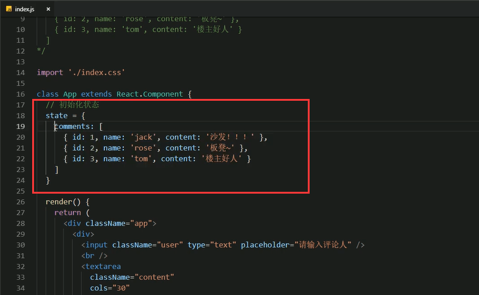
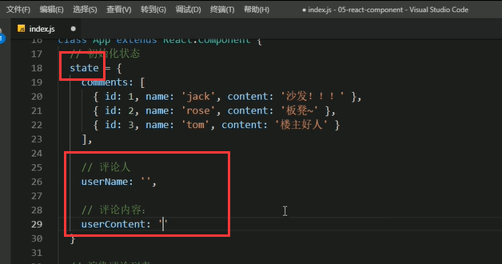
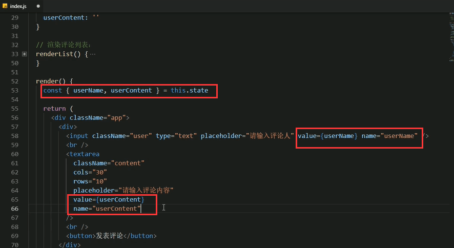
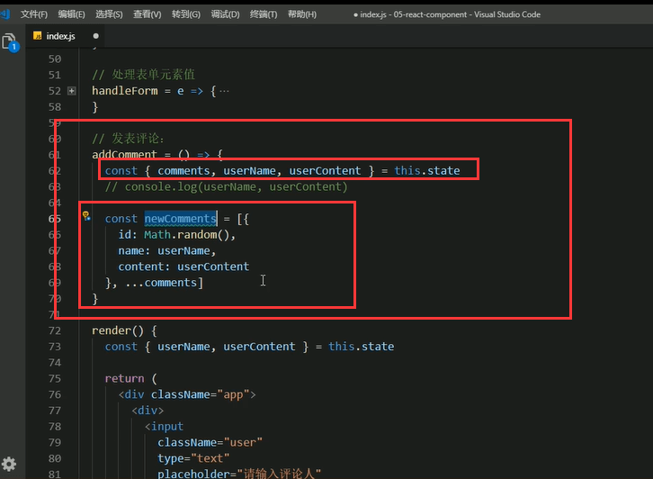
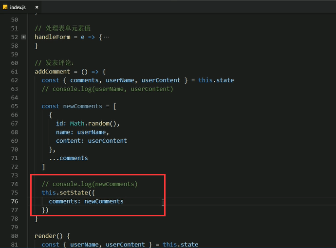
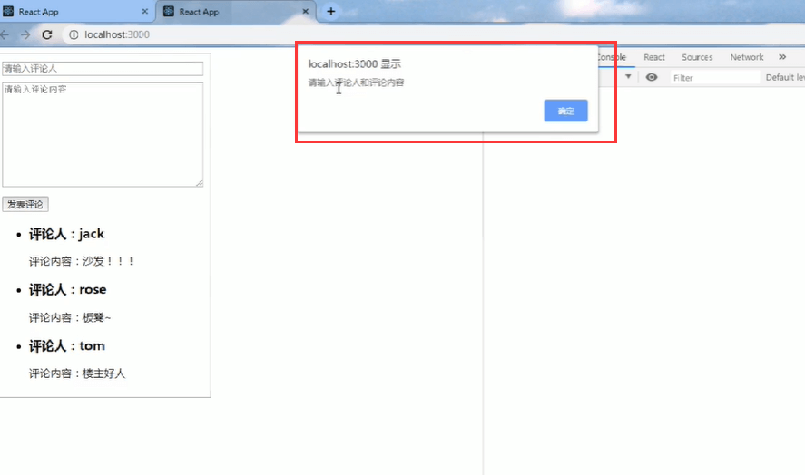

# 14.React组件基础综合案例

#### 1.评论列表案例

**需求分析**

基本JSX结构构件

**初始化状态**

**进行渲染**

#### 2.渲染暂无评论

如果没有数据数据-我们应该渲染个暂无评论，如果有数据那么 暂无评论就应该不渲染，只渲染数据就可以了

 以上代码结构不够清晰，因为有很多逻辑在jsx中，我们需要优化一下代码-优化代码一定是在功能已经实现的基础上进行优化的。

​	我们使用函数的方式进行代码的优化，用函数返回值的方式返回我们需要的东西

可能感觉三元表达不够清晰，那么我们使用if else也是可以的

#### 3.获取评论信息

​	我们使用受控组件的方式来获取评论信息

先初始化信息

设置name和优化一下state

添加事件处理程序：参数e是事件处理对象，我们需要拿到name和value，那么我们使用结构语法 const {name,value} = e.target 其实相当于 name=e.target.name和value=e.target.value,

然后进行值的改变设置 ES6语法 [name] ：value 相当于name对应的value

然后表单里面都添加一个事件onChange

#### 4.发表评论

​	获取表单信息已经可以了，那么现在就需要实现发表评论的功能了

​	1.给按钮绑定单击事件，单击后触发发表评论的功能

​	2.在事件处理程序中，通过state获取评论信息

​	3.将评论信息先添加到state中，并调用setState（）方法更新state

​	**给按钮添加事件**

通过数组的扩展运算符，拿到一个新的数据 [...List ],如果是往前加数据 [ {}, ...List] 这个{}代表要往前面添加的数据，为什么是对象呢，因为数组中的每一个元素都是一个对象

数据有了之后，我们需要渲染到页面的列表中，更新状态

​	将旧的comments更新为新的newComments

#### 5.优化评论功能

​	评论的功能是实现了，但是发表完评论后，其实我们还应该将，输入框的内容清空处理一下。还有就是在我们什么都没有输入的情况点击发表的话会有一个空值的评论。

​		如何设置空值，其实就是将获取到的表单内容属性值，在设置值的时候设置为空就可以了

​	加判断进行对输入的校验，严格一点使用tram就是去除空格之后再判断是否为空

return是防止后续代码的执行

