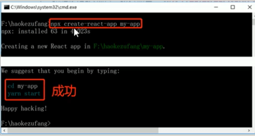
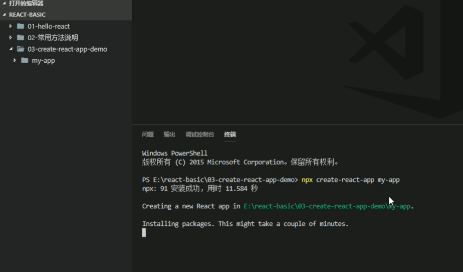
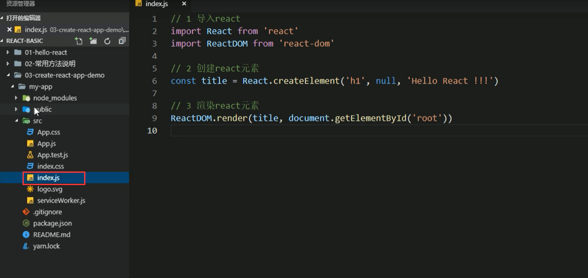
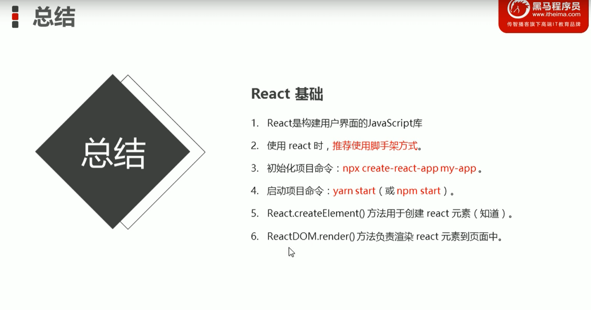

# 3.React脚手架的使用.


### 3.1 React脚手架的意义

```
	1,脚手架是开发现代Web应用的必备。
	2.充分利用Webpack，Babel，ESlint等工具辅助项目开发。
	3.零配置，无需手动配置繁琐的工具即可使用。
	4.关注业务，而不是工具的配置。
```


### 3.2 使用React脚手架初始化项目

```
	1.初始化项目，命令： npx create-react-app my-app(my-app是自己项目的名称)---出现happy hucking就代表初始化成功了。
	
	2.启动项目，在项目的根目录执行命令： npm start（启动的命令一定是在项目的根目录执行的）
	
	3.npx命令介绍：
		3.1：npm v5.2.0引入的一条命令
		3.2目的：提升包内提供的命令行工具的使用体验
		3.3原来：先安装脚手架包，再使用包中提供的命令
		3.4现在：无需安装脚手架包，就可以直接使用这个包提供的命令
	
	4.补充说明：
		4.1：推荐使用npx create-react-app my-app 这种方式构建脚手架项目
		4.2：npm init react-app my-app
		4.3: yarn create  react-app my-app
			-yarn是Facebook发布的包管理器，可以看做是npm的替代品，功能与npm相同
			-yarn具有快速，可靠和安全的特点
			-初始化新项目： yarn init
			-安装包： yarn add 包名称
			-安装项目依赖项：yarn
			-其他命令，请参考yarn文档
			
	
	
	
```


**初始化脚手架项目**






**启动脚手架react项目-npm start**


```
### 3.3 在脚手架中使用React
```

```
	1.导入react和react-dom俩个包。
		导入也和之前的js导入有所区别，现在使用的是ES6中的模块化语法来进行导入的比如：
		import React from 'react'
		import ReactDOM from 'react-dom'
		
	2.调用React.createElement()方法创建react元素。
	
	3.调用ReactDOM.render()方法渲染react元素到页面中。
	
```




**总结**



```
	注意：我们做web开发的使用ReactDom进行的页面渲染，如果是手机端开发或者是VR开发的话渲染的方式是不一样的，就不使用ReactDOM了。
```