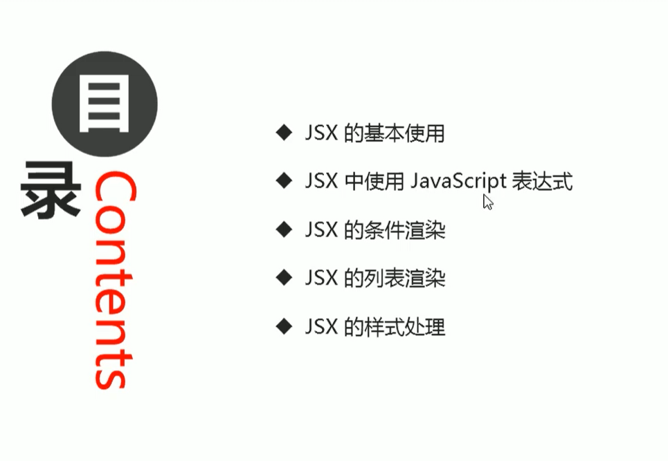
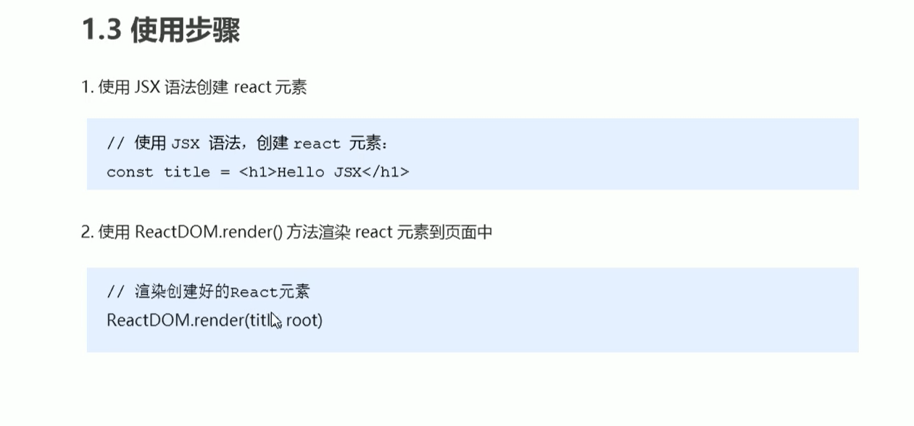
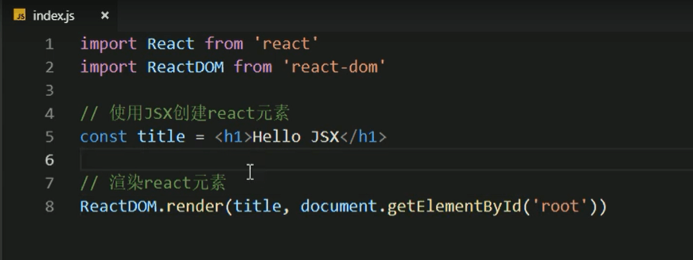
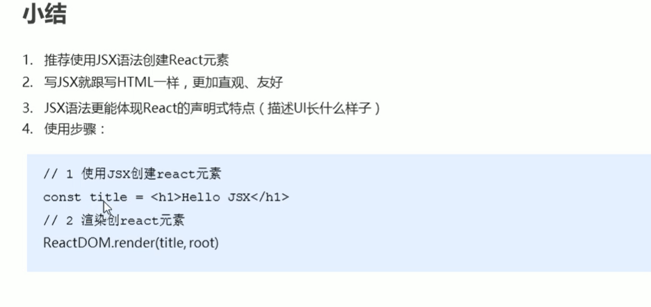
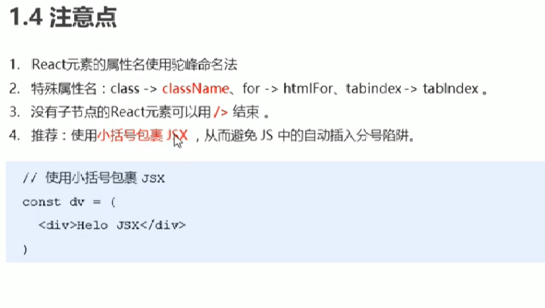

# 4.JSX的基本使用





### 1.JSX的基本使用

```
	1.1:createElement() 的问题--为什么不推荐使用
		1.繁琐不简洁。
		2.不直观，无法一眼看出所描述的结构。
		3.不优雅，用户体验不爽。
		
		
```


**createElement的问题**


**JSX的结构**


### 2.JSX的基本使用

```
	JSX是JavaScript XML的简写，表示在JavaScript中写XML（HTML）格式的代码。
	优势：声明式语法更加直观，与HTML结构相同，降低了学习成本，提升开发效率。
	JSX是React的核心内容。
	
	
```


### 3.使用步骤






**页面显示**







