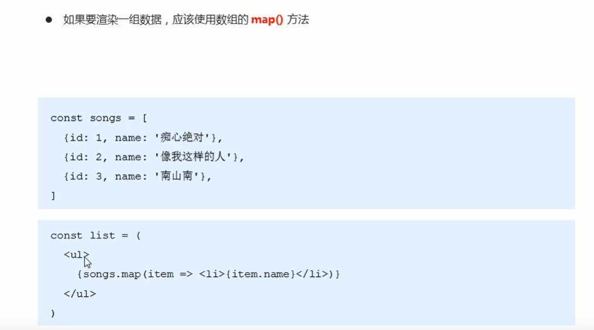
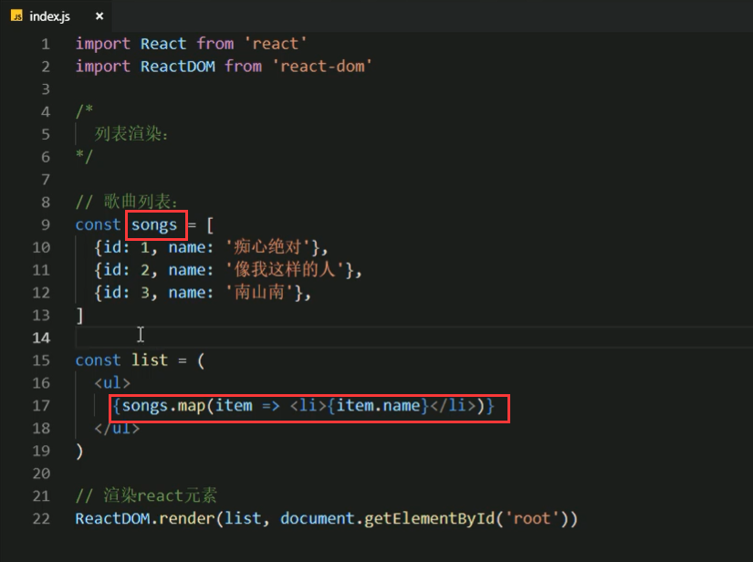
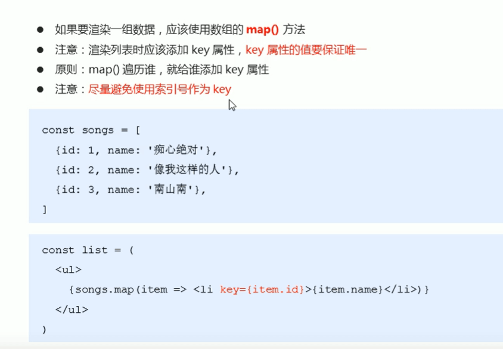
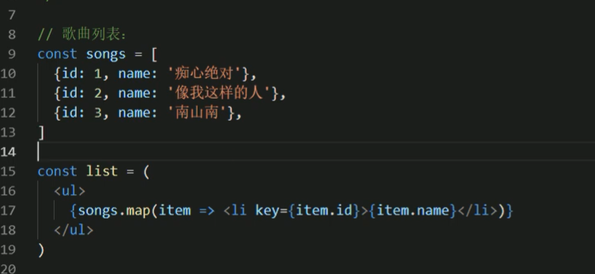
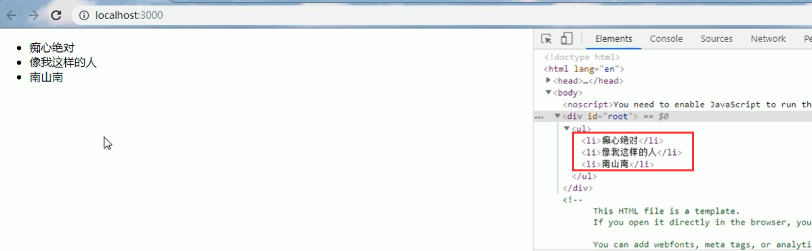

# 7.JSX的列表渲染

​	将map结构或者list结构数据循环渲染，比如使用map()方法遍历






上面这样可能在控制台会有报错，原因是没有key


将key加入








页面中不会有key属性，key是给React内部来使用的。


#### 尽量避免使用索引号作为key

```
	因为使用索引的话插入数据修改数据等操作，可能会导致性能方面的问题，因为索引是可能会变的，应该使用唯一不可变的key
```

