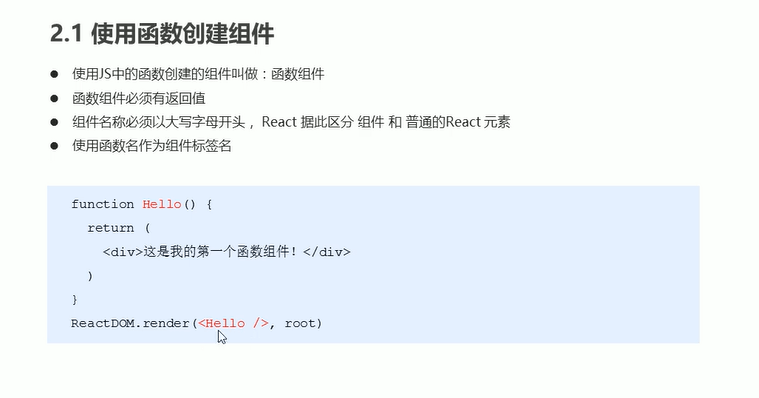
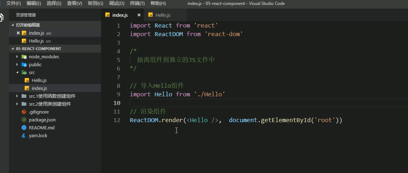

# 9.React组件基础


```
	React组件是非常重要的，他是React的核心，就好比乐高一样，以组合搭建的方式实现最终的功能。
	另外React和vue的一个大的区别是React是对JS原生的封装可以理解为JS代码，而vue是基于vue框架做html的增强操作实现的。
	
```


### 2.React组件的俩种创建方式


**创建一个函数组件（必须是以大写字母作为组件的开头，必须得有返回值）**


**使用箭头函数创建一个组件**





### 2.2使用类创建组件


### 2.3抽离为独立JS文件


代码中导入组件，渲染组件




