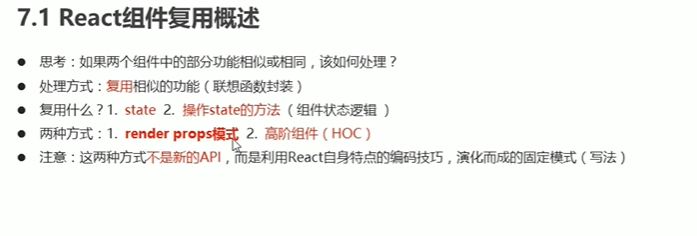
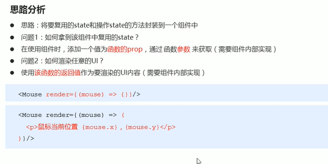
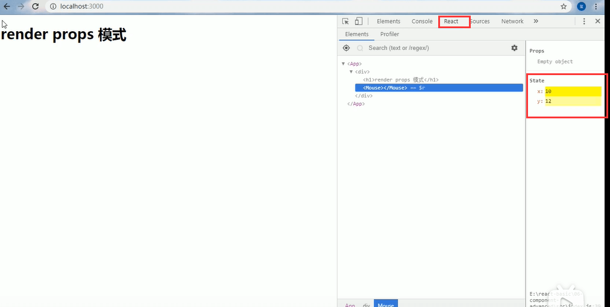
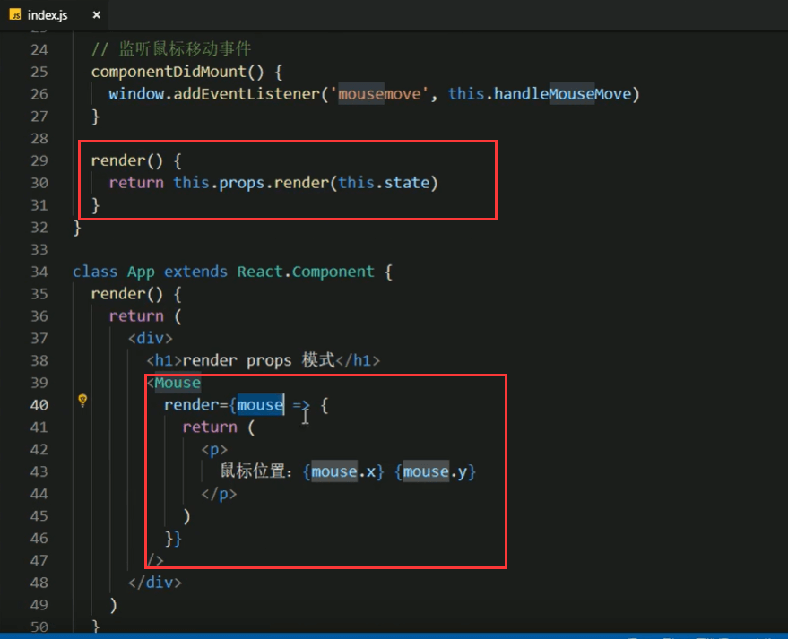
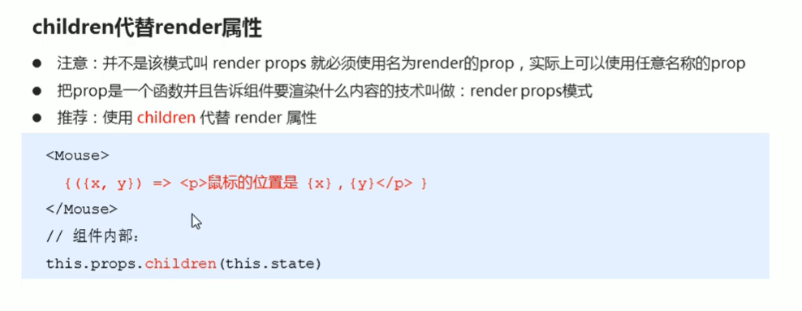
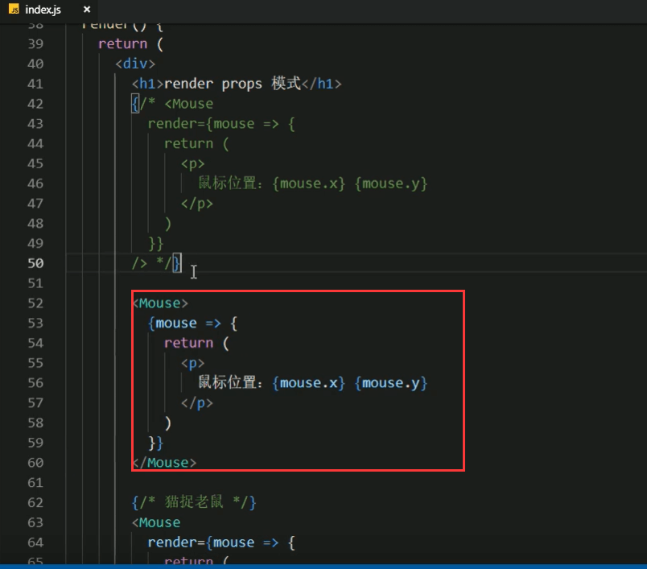
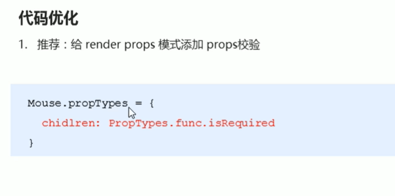

# 10.render-props和高阶组件

​		思考：如果俩个组件中的部分功能相似或者相同，该如何处理？

​		我们推荐的是组件复用

​		复用什么? 1.state   2.操作state的方法（组件状态逻辑）

​		那么我们怎么去实现这个组件的复用呢？有俩种方式

​			1.render piops模式， 2.高阶组件(HOC)

#### 1.render props模式（思路分析）

[视频地址](https://www.bilibili.com/video/BV14y4y1g7M4?p=65&spm_id_from=pageDriver)

#### 2.render props模式(使用步骤)

https://www.bilibili.com/video/BV14y4y1g7M4?p=66&spm_id_from=pageDriver

​	比如：我们创建一个鼠标复用的组件

##### 第一步，创建Mouse组件，在组件中提供复用的  逻辑状态  代码（1，状态，2，操作状态的方法）

渲染组件：

观察state

##### 2.将要复用的状态作为 props.render(state) 方法的参数，暴露到组件外部

​	组件中的render用返回值的形式将复用状态暴露出去也就是this.props.render(this.state)

​	而使用组件的元素的时候，就必须调用这个render了，并且需要传递一个函数，函数里面需要传递这个state的内容，就是 

render={(mouse形参获取到state鼠标的位置) = > {

​	返回值 return P标签鼠标位置：{mouse.x},{mouse.y}

}}

其实mouse形参就相当于是this.state

页面展示：鼠标移动的时候，坐标是有发生变化的

#### 3.render props模式（演示Mouse组件的复用）

这个鼠标的组件仅仅是实现代码逻辑的实现，并没有渲染要显示的内容，显示的内容渲染是交给调用它的App组件来实现的

下面我们做一个图片的鼠标，先导入img图片

页面展示：

想让这个猫在鼠标中间的这个位置 图片的大小是128*128，那么我们需要-64就可以了

总结复用：

#### 4.render props模式（children代替render属性）

#### 5.render props模式（代码优化）

组件卸载的时候移除事件绑定

