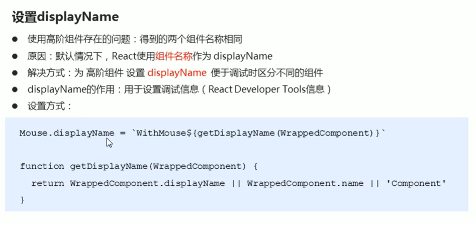
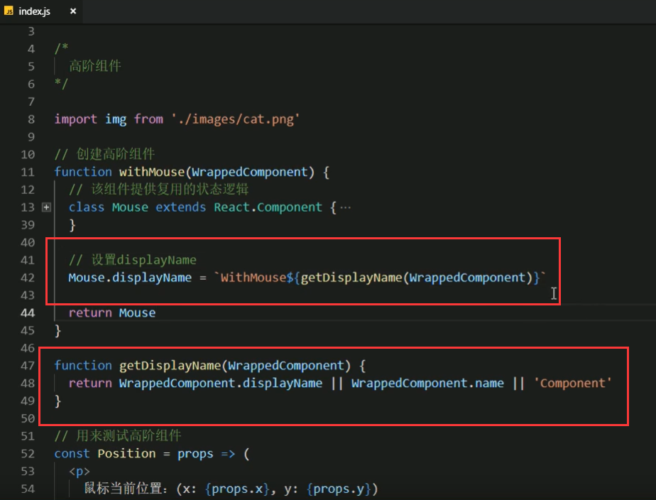
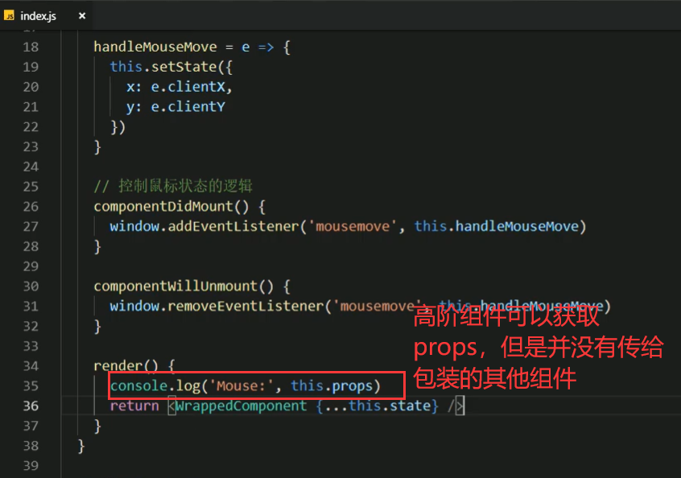
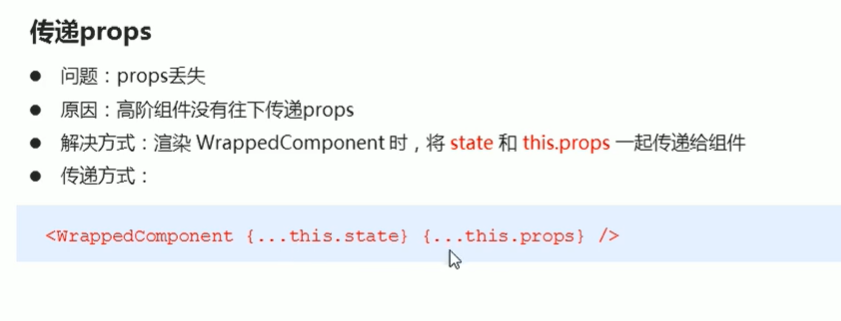
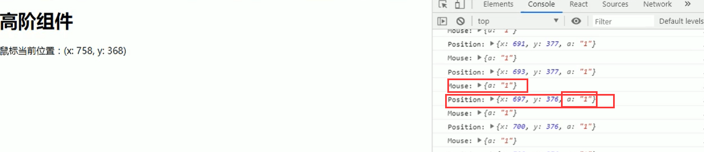
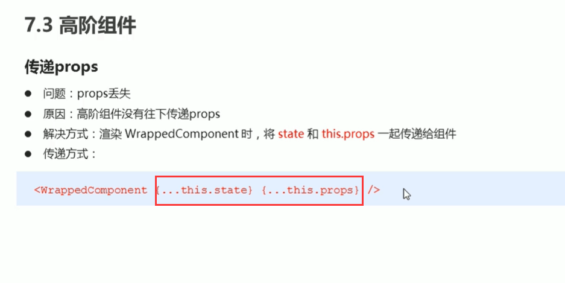

# 12.高阶组件2

#### 存在的问题

​	使用高阶组件，可能会存在俩个组件名称一样的可能比如：

原因：默认情况是，React使用组件的名称作为DisplayName的

因为这俩个组件都是通过高阶组件得到的，而高阶组件的组件名称是Mouse

解决方式：为高阶组件设置DisplayName便于调试的时候区分不同的组件。

displayname的作用：就是用于设置调试信息的（React developer Tools信息）

#### 高阶组件传递Props

​	为什么要传递props呢？

​	问题，如果不传会造成props丢失

我们发现在Mouse高阶组件里面是可以拿到属性值的，而在普通组件中却拿不到，原因就是Mouse组件并没有传递props给下一步被包装的组件中

解决：

 

好了都有a=1这个属性值了

总结传递props：

