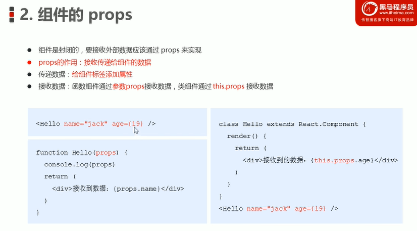
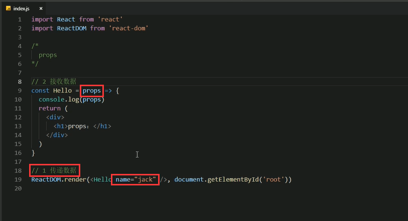
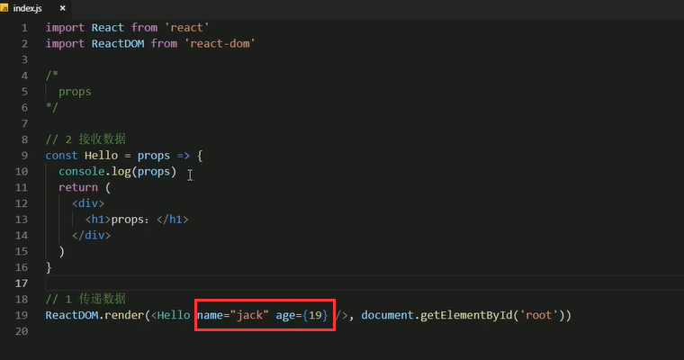
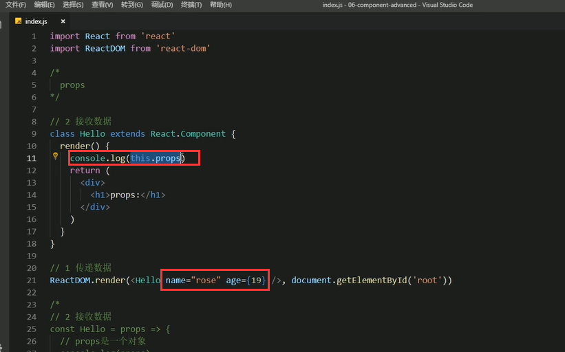
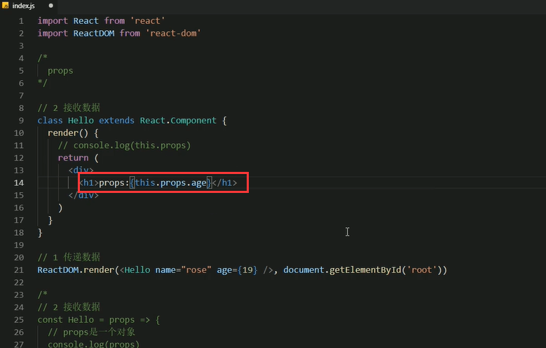

# 2.组件通讯的props

https://www.bilibili.com/video/BV14y4y1g7M4?p=48&spm_id_from=pageDriver

props只是一个形参，叫什么都可以，但是我们一般都叫props了

我们发现传递过来的props是个对象，对象的里面就有name的属性和值了。为什么是个对象呢，因为我们可以给组件传递多个值，所以默认就是一个对象了

比如

我们拿到props后，就可以在组件中使用这个值了

以上是函数组件的props传递

#### 类组件的props传递

	类组件中通过this.props就可以获取到传递的值了

使用传递过来的

