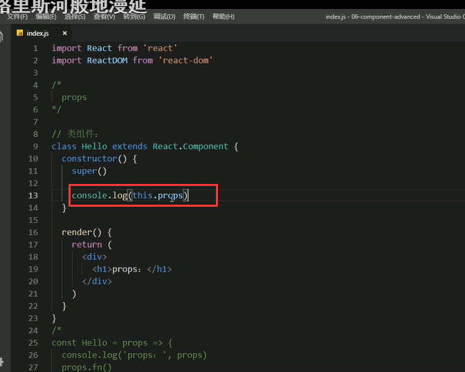

# 3.组件通讯的props特点

props是可以传任意类型的数据的：比如对象，字符串，数值{}，数组{【】}，函数fn，jsx结构的元素tag，都可以

修改props可不可以呢？

会发生报错

props是可以进行读取但是不能修改数据的，如果修改的话是会报错的。

如果我们使用类组件的时候，需要在constructor中传入props

在页面中是undefined的，说明没有获取到

说明一个问题，如果在类组件中写了构造函数，那么需要将props传递给super()，否则在构造函数中无法获取到props的值。

但是在render中是可以获取到props中的值的 

这样构造函数中就可以获取到props了，推荐使用props作为constructor的参数。

render中是使用this关键字一直可以获取到值的