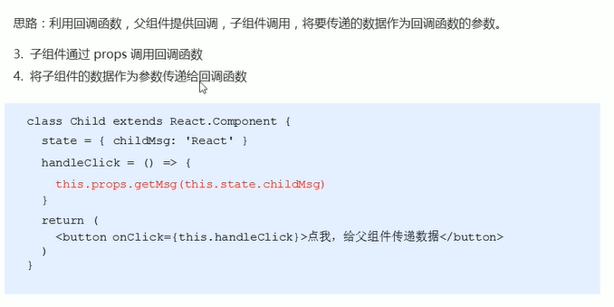
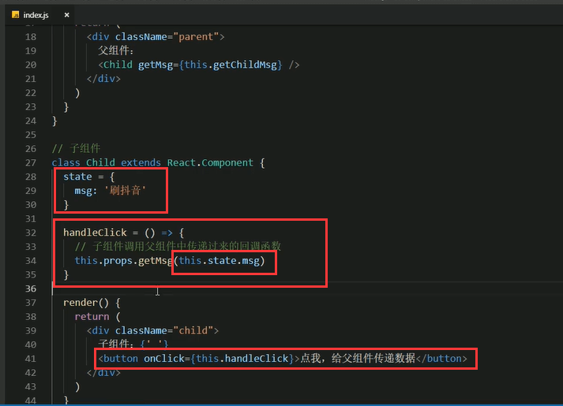

# 4.组件通讯的三种方式


```
#### 一般分为三种通讯方式
```

```
	1.父组件--》子组件
	2.子组件---》父组件
	3.兄弟组件的通讯
	
```


#### 1.父组件传递数据给子组件


代码实现父组件传递给子组件数据的过程


页面展示：


#### 2.子组件传递数据给父组件

```
	思路：利用回调函数，父组件提供回调，子组件调用，将要传递的数据作为回调函数的参数。
	其实这种组件通讯和vue的通讯方式是一样的。
	
	1.父组件需要提供一个回调函数--用于接收数据
	
	2.将该函数作为属性的值，传递给子组件--子组件就可以通过props调用这个回调函数了
	
	
```


##### 代码实现，第一步提供回调函数，第二步将回调函数传给子组件


##### 第三步 子组件通过props调用回调函数，第四步将子组件的数据作为参数传递给回调函数






页面展示


页面展示


注意：回调函数中this指向的问题。


#### 3.兄弟组件的通讯

	**需要将 共享状态 提升到最近的公共父组件中，由公共父组件管理这个状态**


##### 代码实现


第一步：父组件给子组件传递初始值


第二步：父组件提供修改状态的方法，将修改的方法作为回调方法，给子组件传递过去，子组件调用方法


这样就实现了俩个Child1和Child2兄弟组件的通信了。

https://www.bilibili.com/video/BV14y4y1g7M4?p=52&spm_id_from=pageDriver