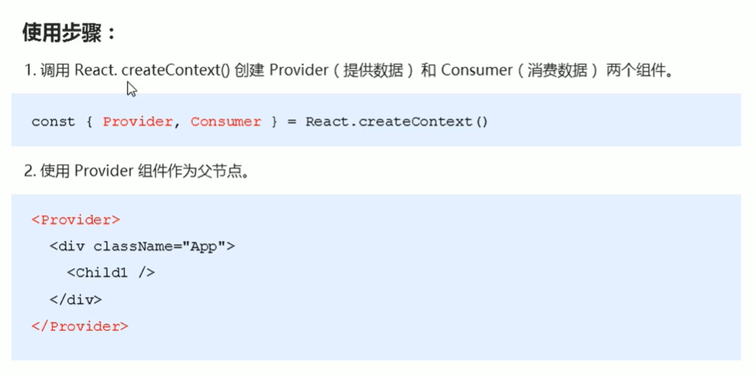
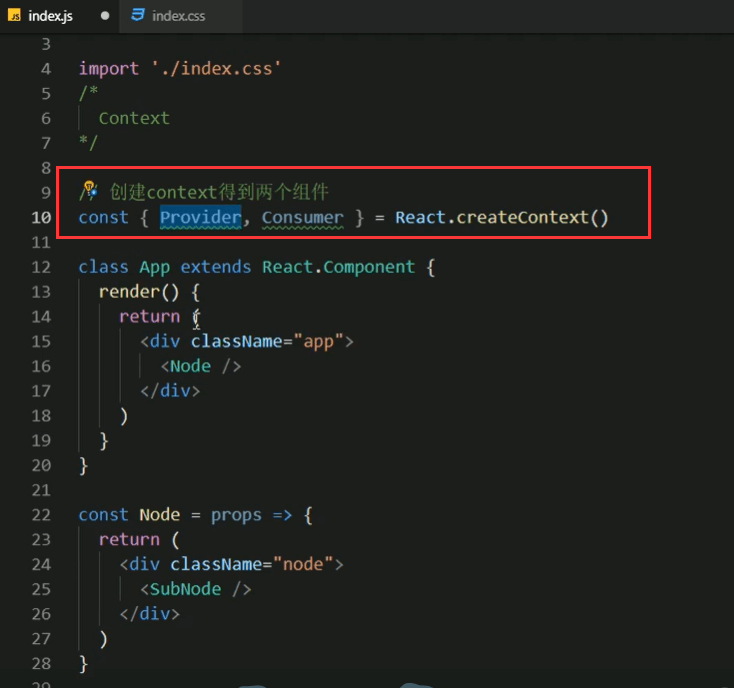
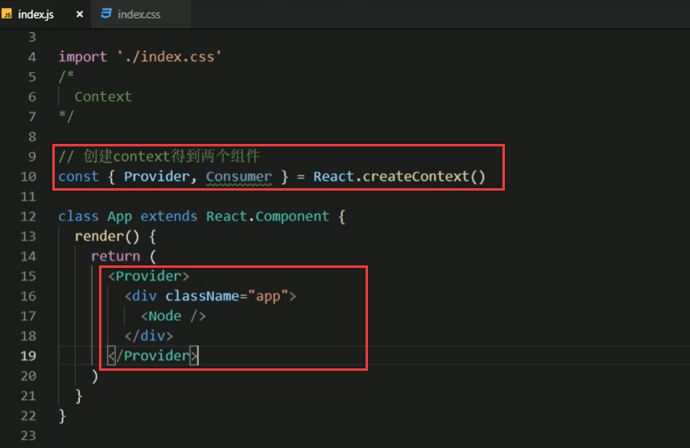
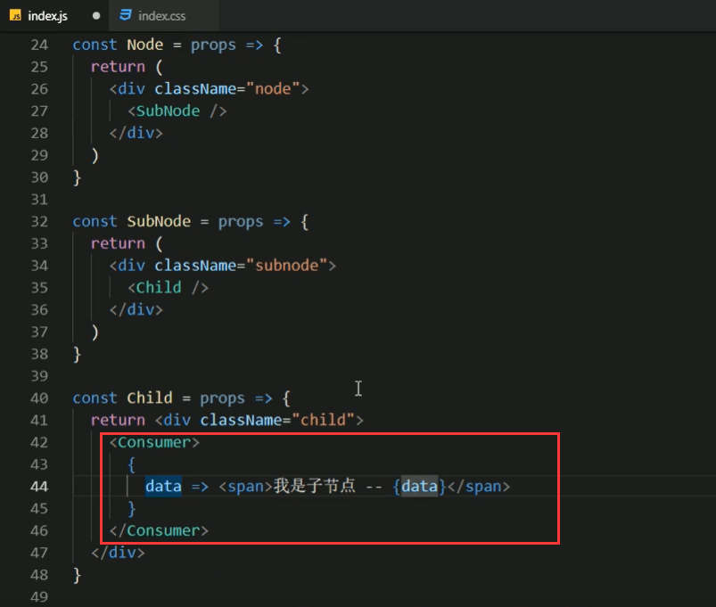
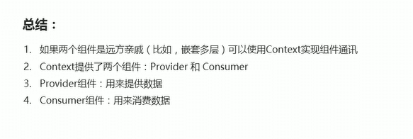

# 5.Context的基本使用

如果从App组件一直传递的这样进行组件的通讯就有点太繁琐了，因此Context就诞生了。

那么更好的方式是使用Context

作用就是实现跨组件的数据传递

#### 使用步骤：

代码示例：

	1.创建context得到Provider数据提供组件和Consumer数据消费组件。

2.第二步，一般用数据提供组件Provider来包裹我们的根组件的内容

3.第三步，需要设置一个value属性，表示要传递的数据

4.第四步，使用Consumer这个组件来接收数据

	在Consumer的组件标签里，使用{}包裹，然后使用一个回调函数，通过回调函数的参数来获取到数据

这个data的回调获取到的{data} 其实就是value中的pink

我们获取到了pink的值，说明我们可以直接由子组件获取到根组件的数据

https://www.bilibili.com/video/BV14y4y1g7M4?p=53&spm_id_from=pageDriver

