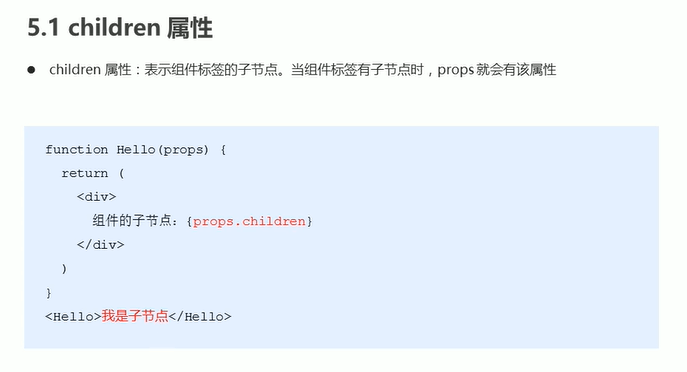
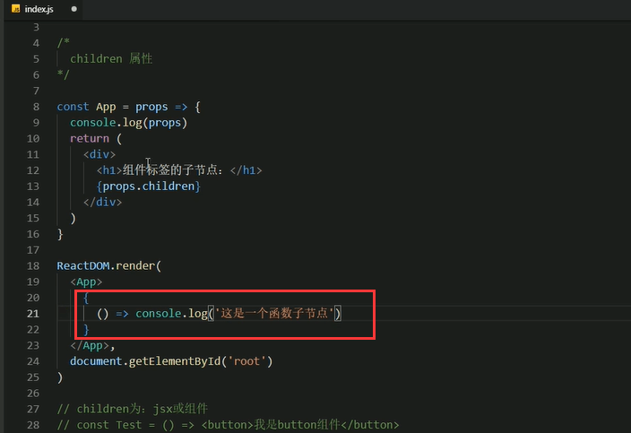
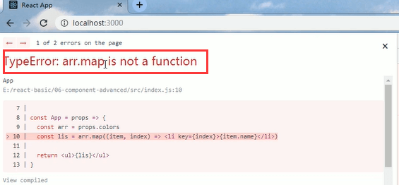
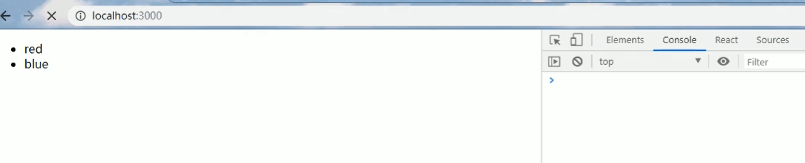
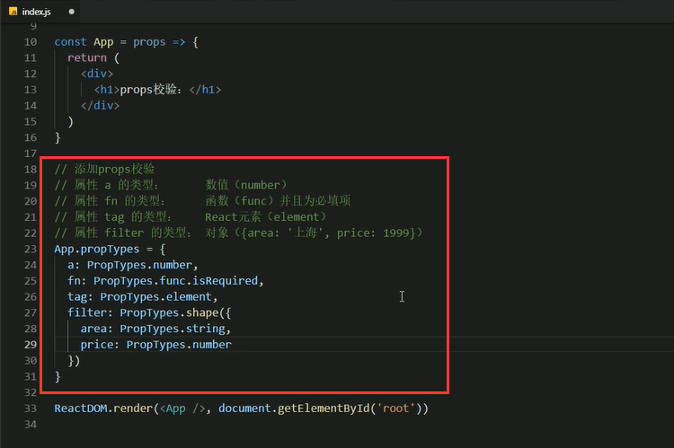
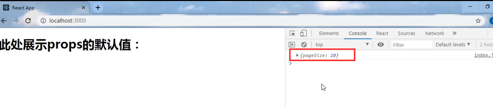
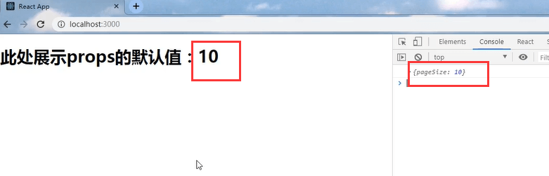

# 6.props的深入

#### 1.children 属性

可以传任意的值

##### 代码展示

	JSX结构的放式传入

	传递组件也是可以的

传入一个函数

#### 2.props校验

	组件传递的值可以是任意的，但这样就可能发生个问题，传递过来的数据并不是我们想要的类型，并且可能会导致错误的发生

比如：小红传递的是一个19的数字，而App组件需要的是一个数组，这就会导致错误的发生

还有的情况就是使用第三方的一个组件，不进行校验的话也是会发生类似错误的，关键的问题是组件的使用者并不知道发生了什么错误。

那么这个时候其实就应该使用props的校验了

	添加类型约束--这样就可以捕获到错误的明确提示了

#### 使用步骤：

	1.安装包，yarn add prop-types
	
	2.导入prop-types包
	
	3.使用组件名.propTypes={} 来给组件的props添加校验规则

代码展示：

这样就会有明确的报错信息比如报错：colors的类型是一个number类型的，但是我们期望的是一个array类型的

我们修改一下类型

发现没有报错

#### 3.props校验-约束规范

	以上是部分常用规则，如果想看更多规则去官网的Docs下找PropTypes下面进行查看

代码案例展示：

	

#### 4.props的默认值

可以使用这个默认值

注意：只有在未传入的时候是使用默认值是生效的，如果传入了值那么默认值就失效了

https://www.bilibili.com/video/BV14y4y1g7M4?p=58&spm_id_from=pageDriver