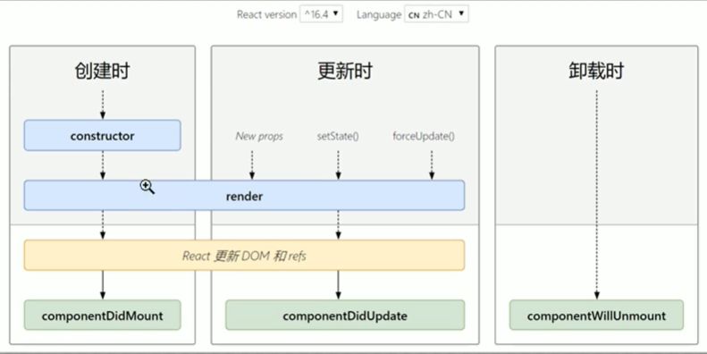
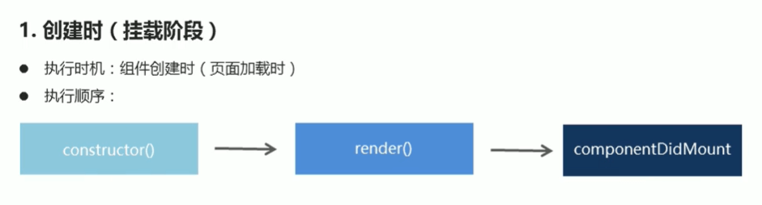
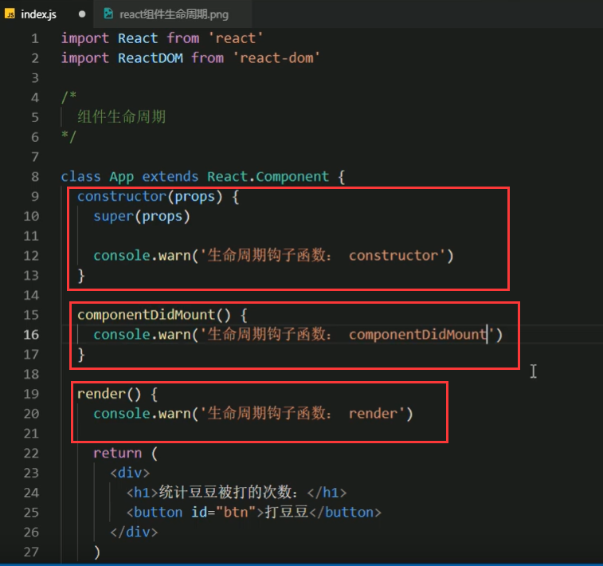
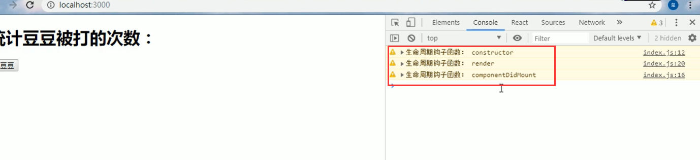
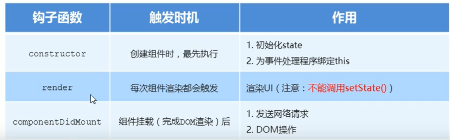
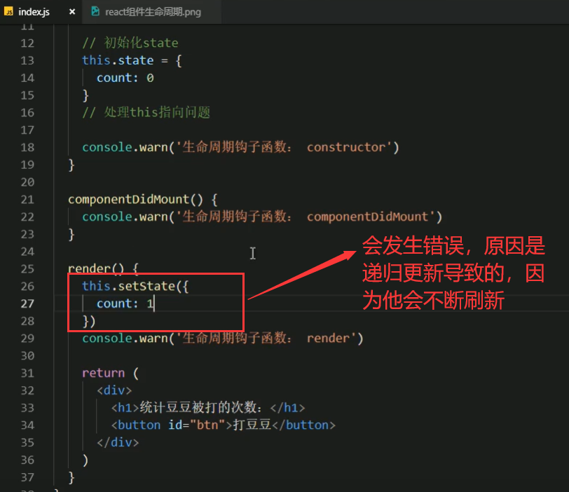
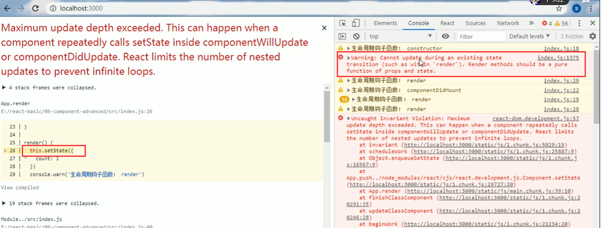
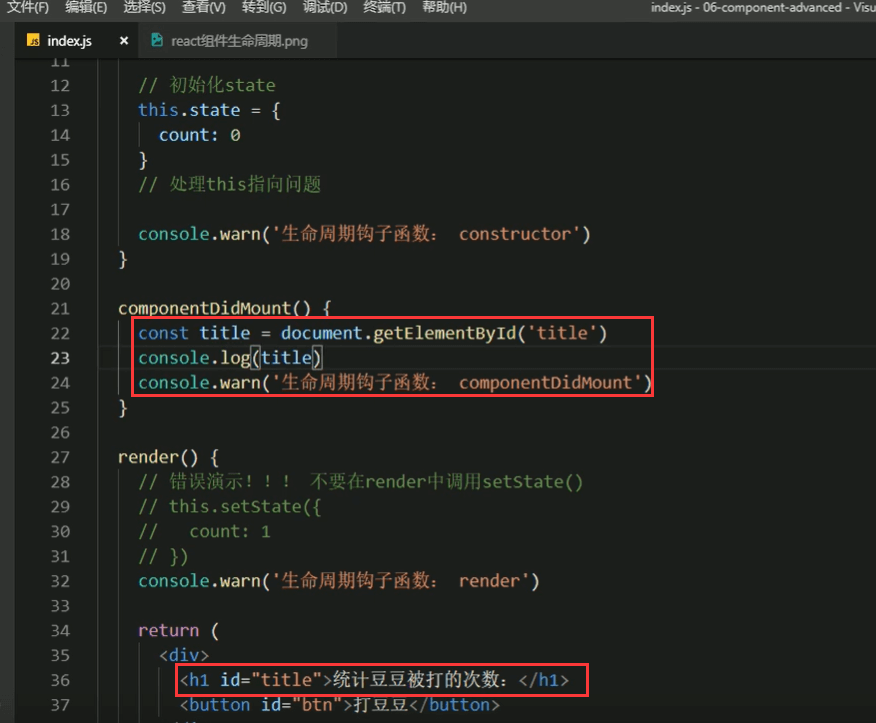
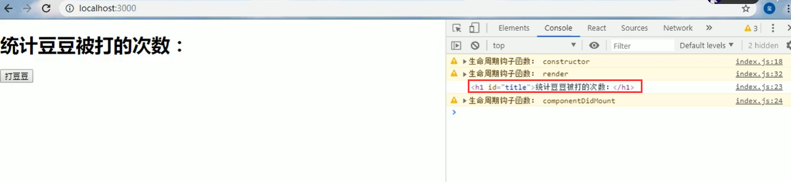
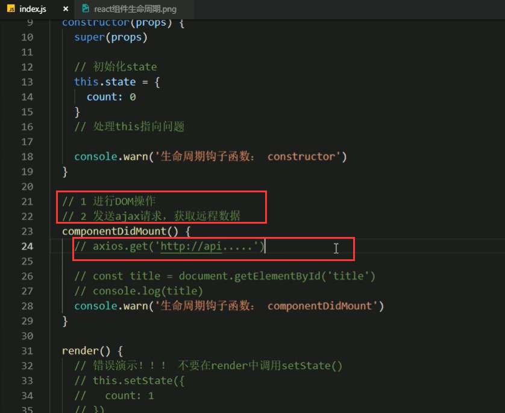

# 7.组件的生命周期

		可以帮助我们理解，组件是如何被创建出来，如何在页面中运行，怎么又被卸载掉，我们需要了解他的一个全过程--那么就是他的生命周期。

		了解了生命周期之后，我们就可以做一些更复杂的功能了，因为一些复杂的功能是需要借助于生命周期中的内容来完成的，并且了解了组件的生命周期后，也比较容易的可以定位到组件发生错误的地方。

#### 生命周期的三个阶段

##### 代码展示钩子函数的执行顺序

##### 我们看一下每一个钩子函数触发的时机和作用

注意：不能在render中调用setState如果调用会发生错误，因为属于递归调用了，报错提示，我们不能在状态变化的时候你再来进行更新，render方法应该是一个纯的函数， 只接收props和state的纯函数，你不能在这里做再次的更新了。

componentDidMount这个钩子一般用于请求或者操作Dom

在componentDidMount执行的时候其实已经完成渲染了

另外就是可以componentDidMount钩子函数发送Ajax请求

https://www.bilibili.com/video/BV14y4y1g7M4?p=59