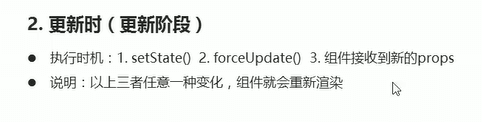
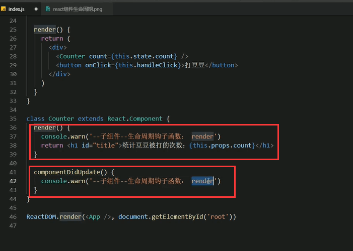
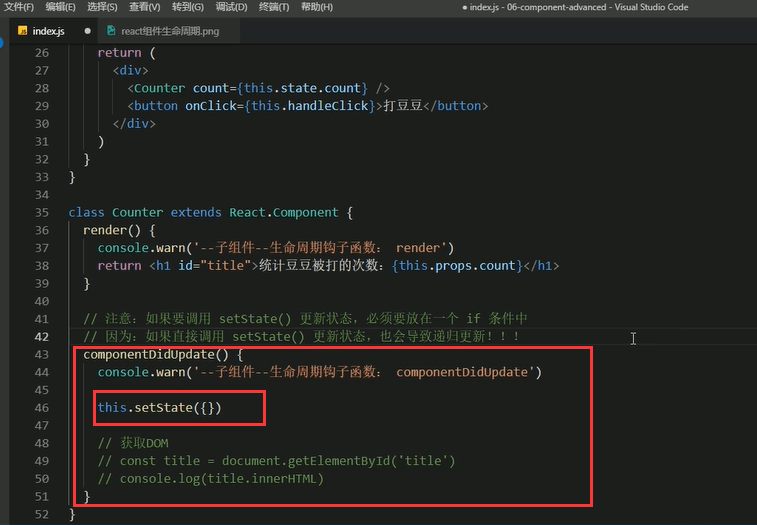

# 8.组件的生命周期2

##### 组件的生命周期第二个阶段--更新阶段

##### 1.在调用setState的时候会调用到render这个钩子

子组件的render也会被触发

这就是前面的俩种情况，当更新时setState也会触发钩子

##### 3.还有一个情况是forceUpdate()的时候--也就是强制更新

#### 总结一下更新时的生命周期会触发的钩子问题

#### 这个阶段的执行顺序

验证一下触发执行顺序

##### 这些钩子函数的作用

验证最终渲染完成才触发这个componentDidUpdate这个钩子函数，并且获取到dom元素

更新组件过程阶段中，触发钩子componentDidUpdate进行请求

注意：如果调用setState更新状态，必须要放在一个if条件中---否则会发生报错

这个错误其实是和我们在render中调用setState的后果是一样的--他也导致了递归更新，其实就是你在钩子函数componentDidUpdate中进行setState的时候，进入setState他会调用render，而render之后又会调用componentDidUpdate，就导致递归死循环的问题发生报错。

正确做法--加if条件，新旧值进行比对-不一致就更新

不会发生错误-会执行俩次，第一次不一样执行更新，第二次数据已经修改为一致了render渲染之后就不执行了，避免了递归

