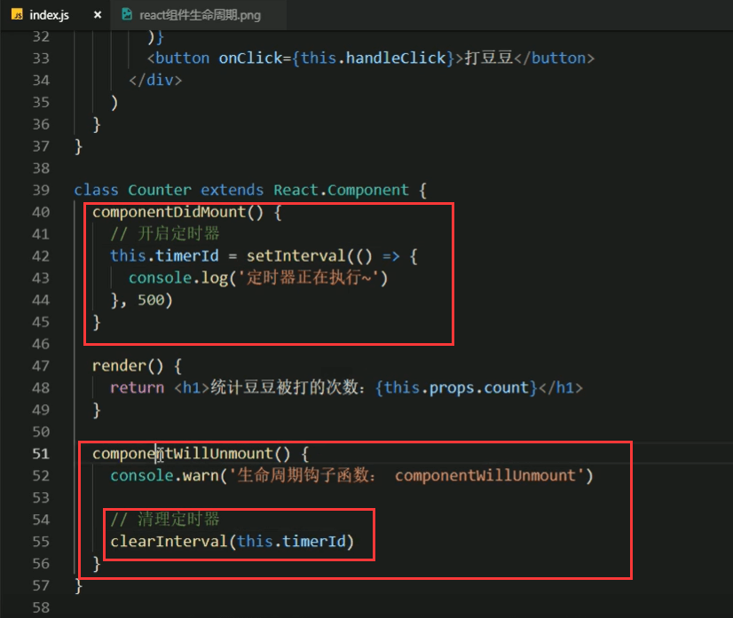

# 9.组件的生命周期3

#### 生命周期第三阶段 属于卸载阶段

​	一个组件在页面当中由于某种原因导致组件消失的时候，会触发卸载阶段的钩子。一般用于执行清理的工作

componentWillUnmount这个钩子函数

一开始组件是在页面中显示的，等满足一定条件之后组件不需要显示了。

比如：跟据条件作为判断使用组件，那么就有可能会不使用组件，在不使用的时候就会触发销毁的钩子componentWillUnmount这个钩子函数。

组件消失的时候会触发钩子的函数方法componentWillUnmount

另外一个案例：比如开启定时器，每隔500毫秒打印一个内容

但是发现组件都因为条件判断没有了，但是定时器还在执行，那么我们就可以利用componentWillUnmount钩子函数，在组件消失的时候我们来清理定时器

组件消失，定时器被销毁

#### 不常用的钩子函数

我们先看看旧版的生命周期

这些标红框的都不推荐使用这些钩子函数了，因为已经为过期的旧版钩子函数了

新版的生命周期钩子函数：这个是完整的生命周期钩子函数图，我们之前看的是常用的

有俩个我们之前没有使用过的钩子函数：getderivedStateFromProps,和getSnapshotBeforeUpdate    这俩个钩子函数虽然是官方新提供的，但是不建议使用，因为其他的基本已经满足我们的常规开发需求了，而且使用起来也特别的繁琐。

还有shouldComponentUpdate这个主要用于组件的性能优化方面

为什么会有新版和旧版的生命周期钩子函数：

​		因为React的库也是在不断更新的，更新的过程发现一些老版的钩子函数和新版的一些使用模式有点不相匹配了，所以就不建议使用了。

https://www.bilibili.com/video/BV14y4y1g7M4?p=64&spm_id_from=pageDriver

