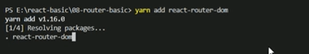
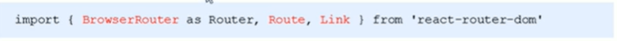
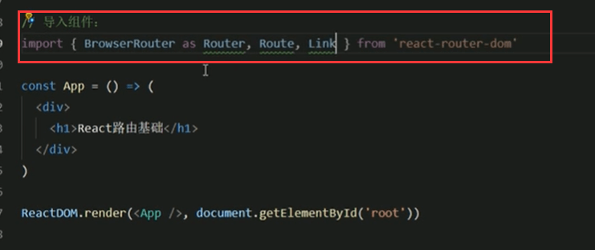
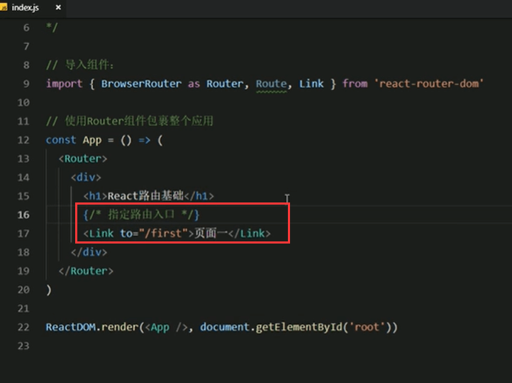
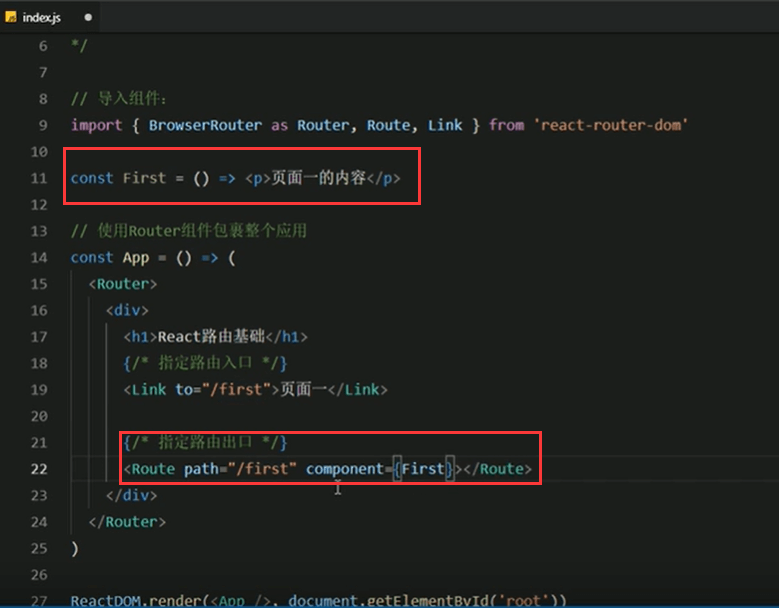

# 2.路由的基本使用


1.第一步先安装 react-router-dom这个包

```
yarn add react-router-dom
```




2.导入路由的三个核心组件：Router,Route,Link






3.使用Router组件包裹整个应用（重要）

​	必须使用Router包裹之后才可以使用路由


4.使用Link组件作为导航菜单（路由入口）

​	这个组件使用Link的to属性，这个组件将来会被解析成一个<a>标签，来作为导航菜单




5.使用Route组件配置路由规则和要展示的组件（路由出口）


​	path属性代表路由的规则，要和上面的Link组件里面的to属性内容是相匹配的， 然后通过component属性指定一下当匹配时要展示的组件。 比如说First，那么First就是我们的一个组件了。




页面中看一下效果：


点击页面一，url地址栏会发生变化


