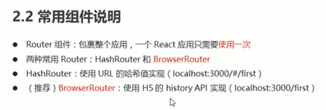
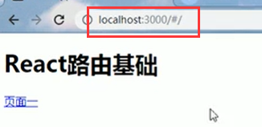
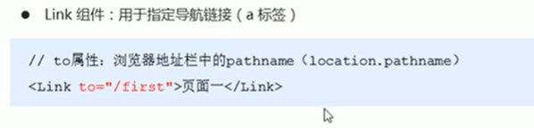
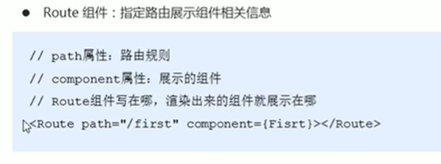
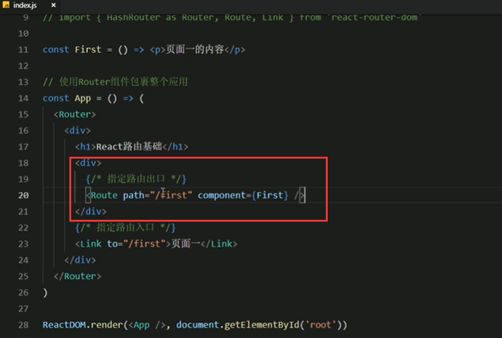
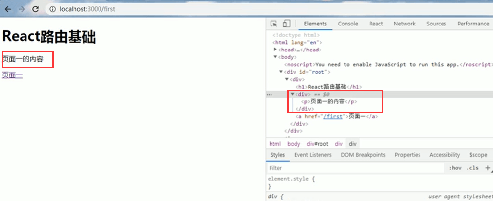

# 3.路由的基本使用2

我们不推荐使用HashRouter，我们演示一下HashRouter这个组件

地址栏会有一个#号

**Link组件的说明**

**Route组件的说明**

 Route组件不止可以指定规则，还可以指定组件渲染的位置，Route组件写在什么位置，渲染的内容就在什么位置

代码演示：切换Route的位置，页面中也会变换组件渲染的位置

渲染到Route标签所在的位置

