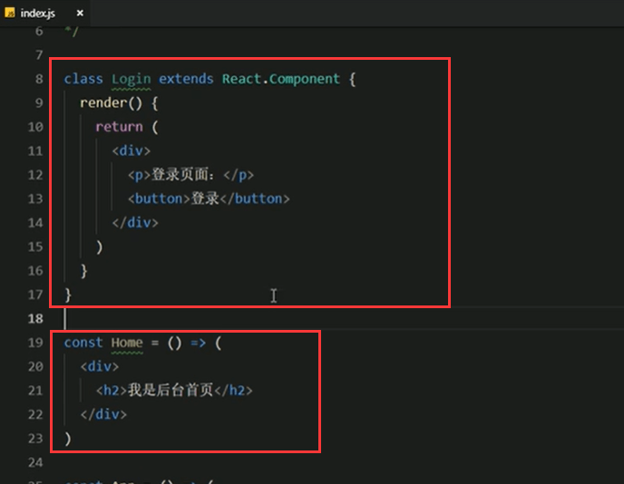
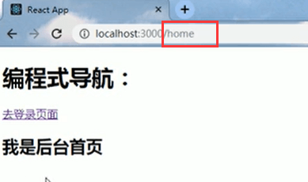

# 5.编程式导航


```
	场景：点击登录按钮，登录成功后，通过代码跳转到后台首页，如何实现？
	
```


**代码实现**

创建Login登录组件和首页组件




导入路由


配置导航菜单


我们希望点击登录按钮，跳转到后台首页功能


给按钮绑定单击事件，然后通过this.props.history路由方法进行页面的跳转 push里面放入路由规则


**验证，点击登录按钮**



发生跳转


**我们希望在后台首页再有一个按钮可以返回我们的登录页面**

​	我们可以使用history的go这个方法，他可以前进或者后退到某个页面，参数n表示前进或者后退页面数量（比如：-1表示后退到上一页）


代码演示：


页面展示：


点击返回登录


https://www.bilibili.com/video/BV14y4y1g7M4?p=95&spm_id_from=pageDriver


