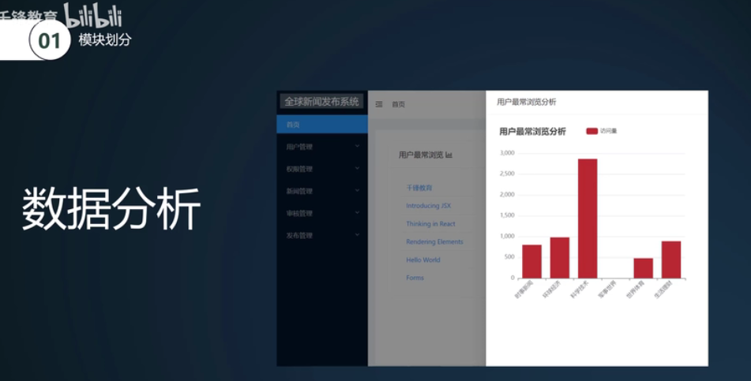
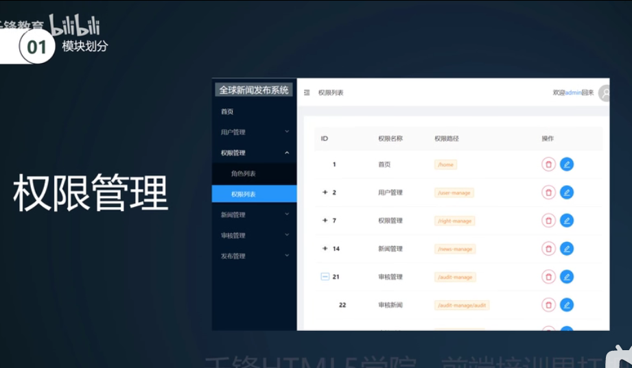
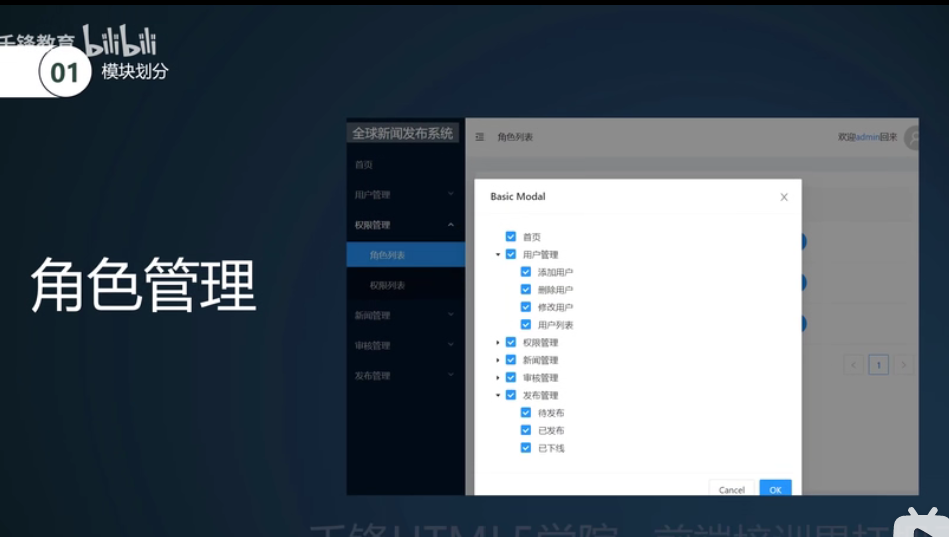
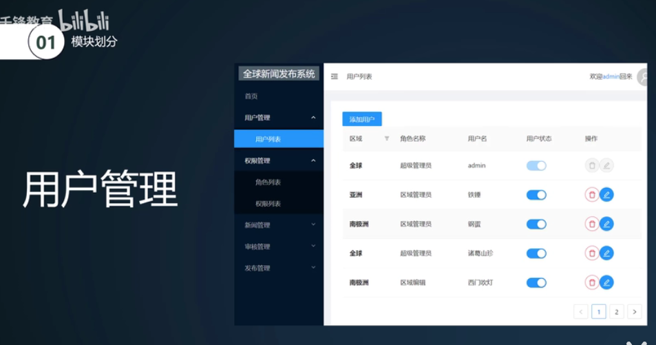
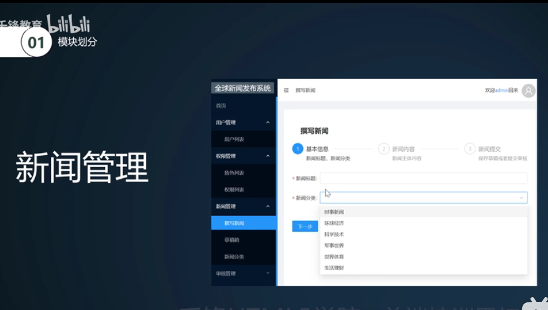
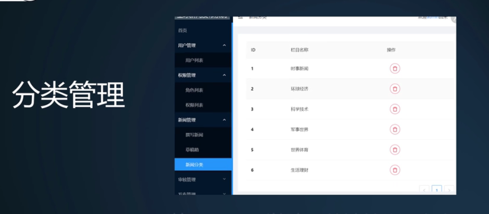
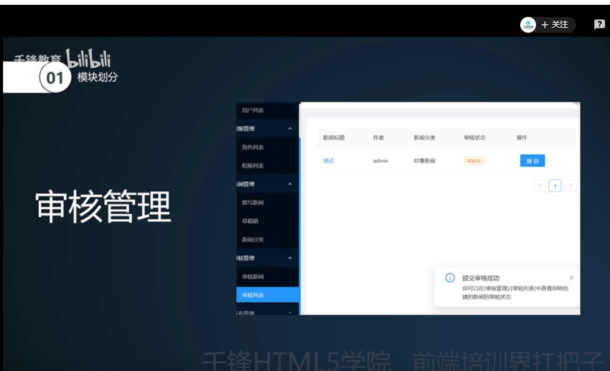
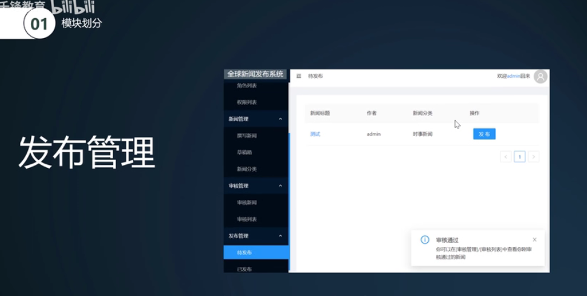

# 1.项目介绍

#### 1、React中万物皆组件

#### 2、React hooks函数式编程才是精神

#### 3、React Router路由的使用----路由可以把我们的路径和组件一一映射起来

​			通过路由可以构建一个非常强大的单页面应用

#### 4、React Redux 

​		每个组件的状态都分散在各个角落去管理，那可能你会用到一些组件共享状态，这个时候我们就需要把这些状态，集中式的管理到redux中，也可以做好一些后端数据的快照，所以：通过redux可以更好的管理整个项目中的状态

#### 5、Antd组件库

​		这个组件库中提供很多精美的组件，

## 项目模块介绍：

#### 1、登录模块

#### 2、数据分析模块

#### 3、权限管理

#### 4、角色管理

#### 5、用户管理

#### 6、新闻管理

#### 7、分类管理

​		对新闻的分类

#### 8、审核管理

​			审核新闻

#### 9、发布管理

