# 10.sideMenu动态实现

#### 1、动态渲染sideMenu

​		我们根据数组中的数据然后进行动态渲染侧边栏菜单

我们使用个函数来处理：然后全部交给这个函数来处理

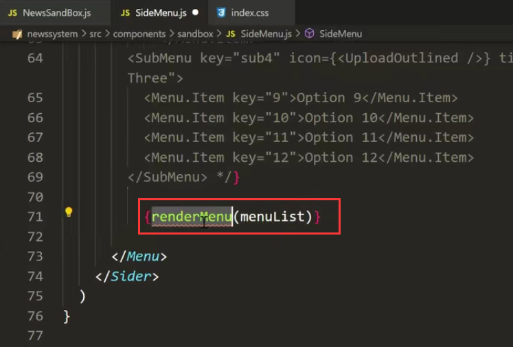

注意：这个函数必须要有返回值 return

然后我们把这个menulist数组，映射成JSX代码

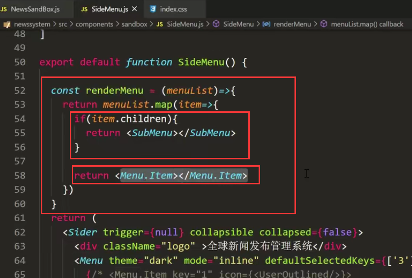

填充内容：

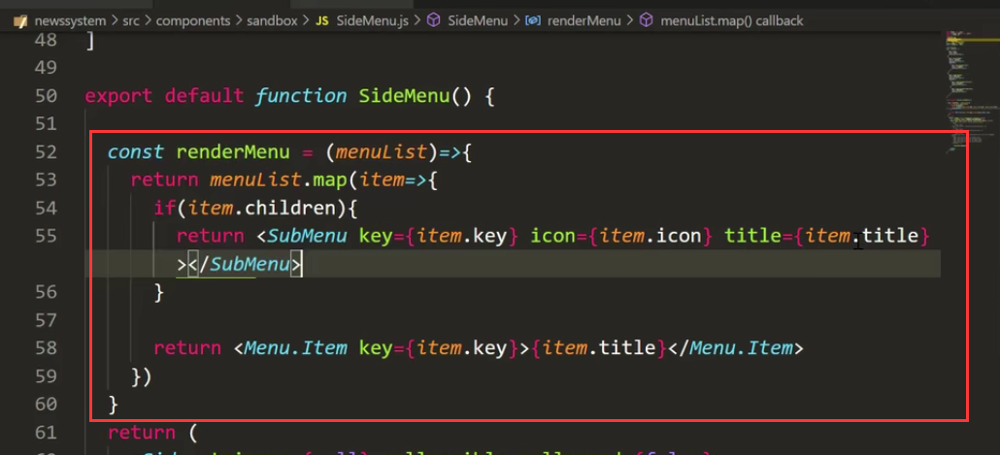

查看页面效果：

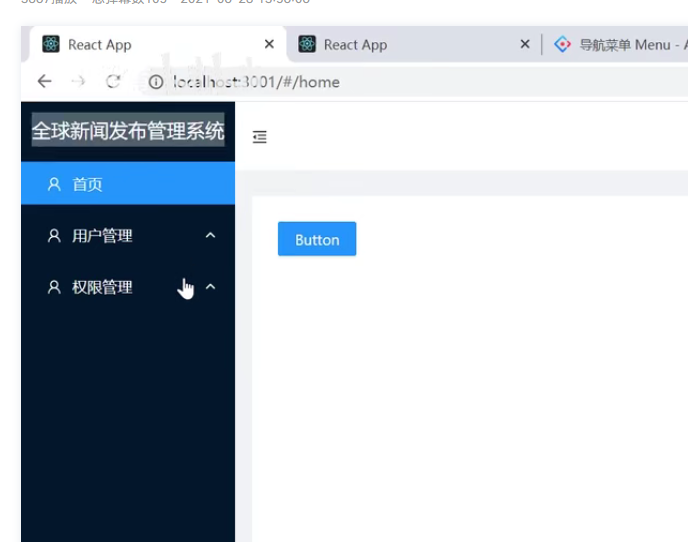

然后我们发现现在子菜单 还没有渲染出来：

​		我们使用递归的方式--再调用renderMenu这个函数

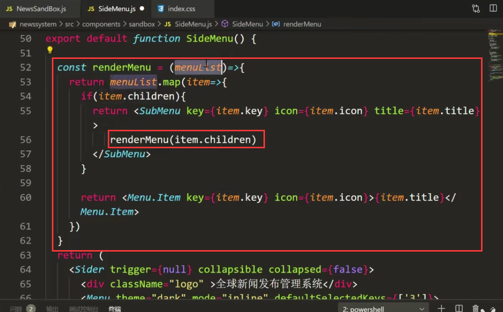

我们查看页面效果：发现子菜单也显示出来了，但是显示怎么是一行代码呢--原来是没有使用{}进行包裹

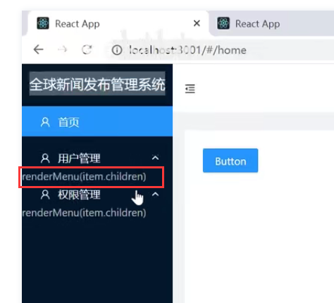

将函数进行大括号包裹一下：

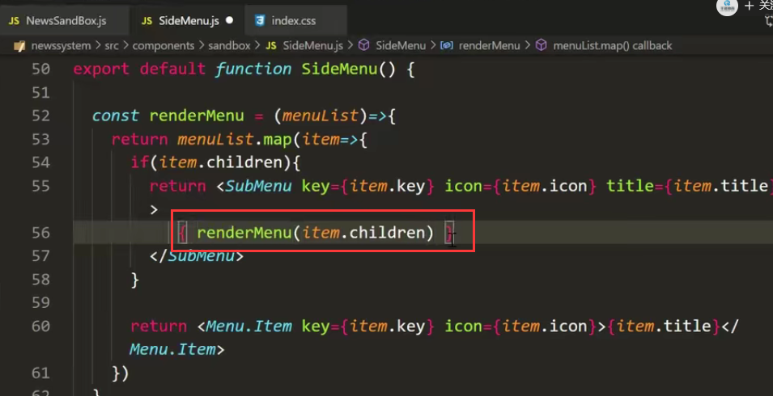

再次查看页面效果：好的页面成功了，成功渲染了侧边栏菜单

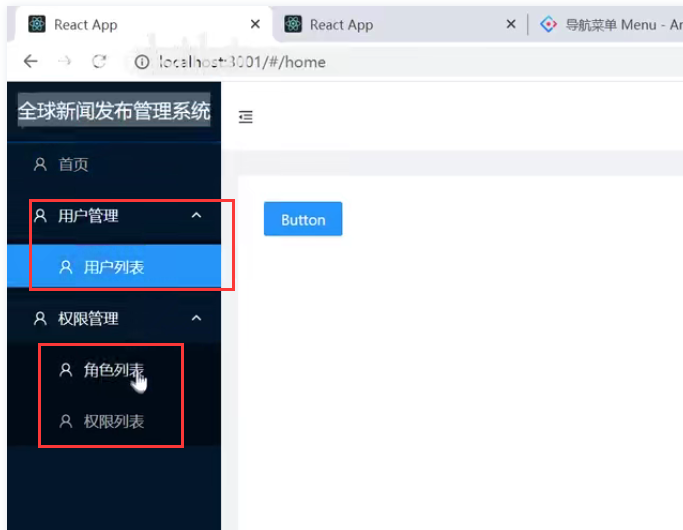

我们现在已经将侧边栏菜单动态渲染完成了，后续就需要我们点击菜单进行页面的切换了

#### 2、点击菜单进行跳转

我们给菜单绑定一个事件--我们通过item的key 因为他就是路径，然后进行页面的跳转

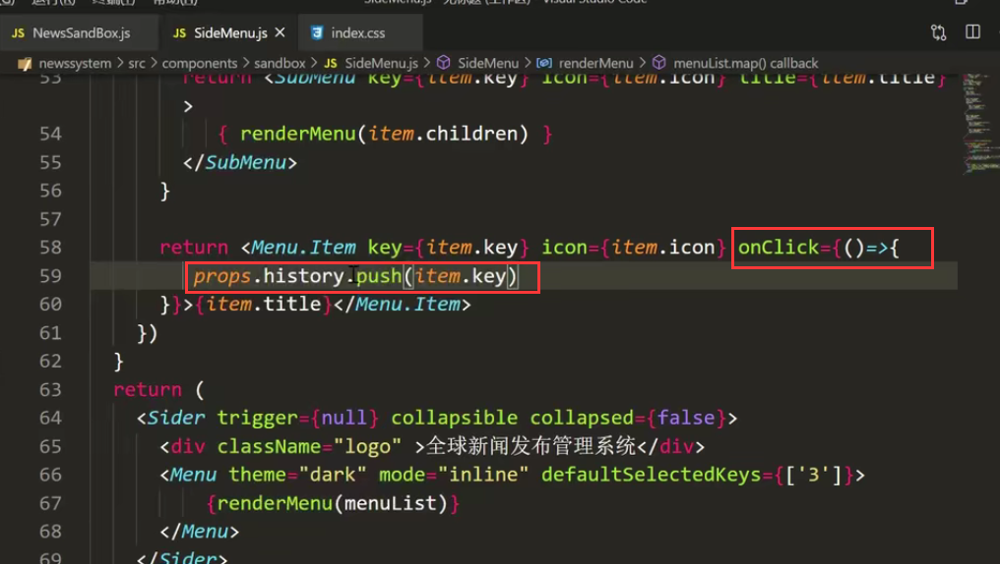

然后我们点击测试：发现报错--我不能读一个push属性在undefined身上，难道我的props是undefined？不是路由会传给我props对象吗

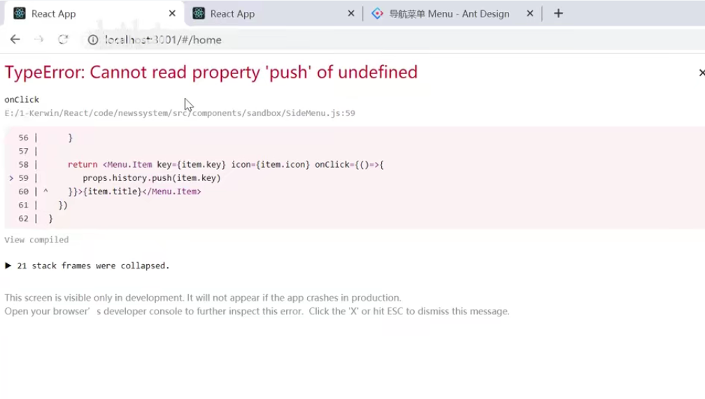

测试一下props是不是undefined

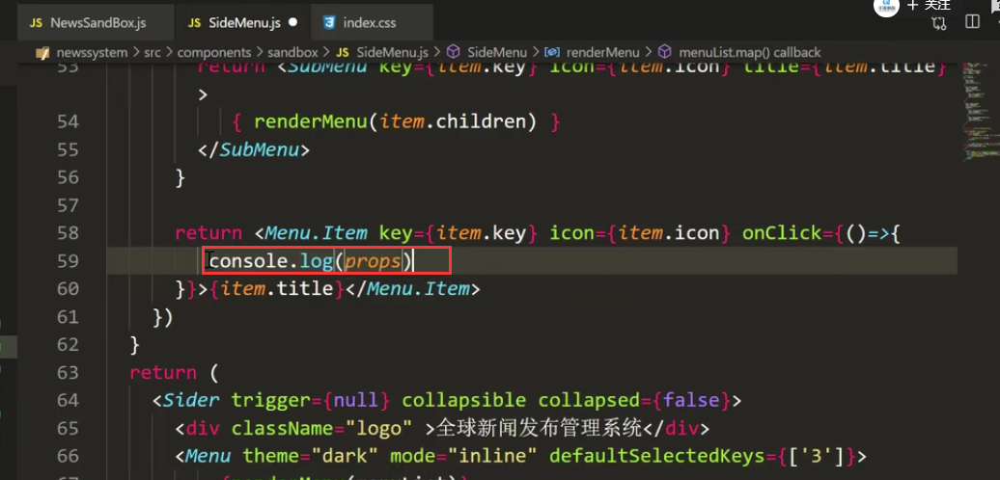

发现props竟然是个空的--这不对呀，我们之前学过路由，路由这个东西只要是被Route包裹的，会自动的给我们传一个props对象，里面有history，location，match这些好用的路由属性，我们通过这些属性可以拿到路径，拿到我们跳转页面的方法，怎么这个没有呢？

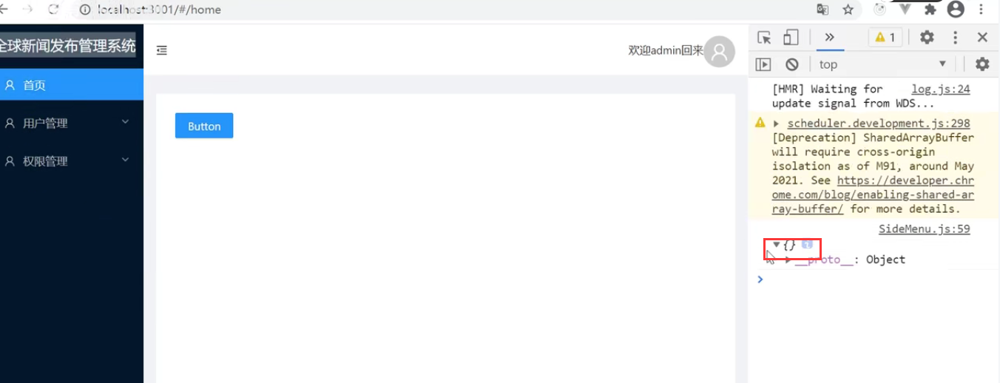

我们考虑一下为什么没有props属性？SideMenu组件的父组件是NewsSandBox组件

而NewsSandBox的父组件是--Route组件

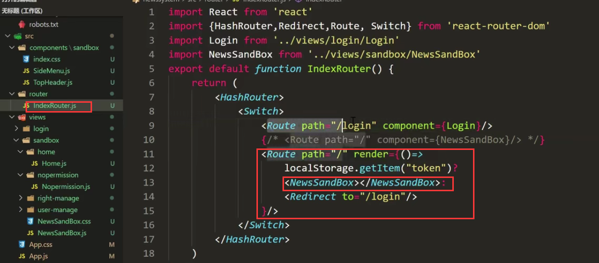

使用这种写法的可以拿到props属性，而我们使用 render=这种方式是拿不到的

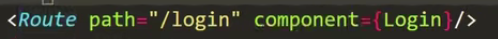

我们演示一下：看看是不是這種方式可以拿到props

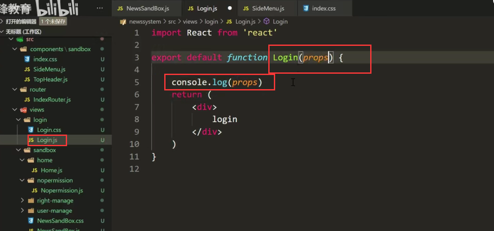

我们发现是可以拿到props的属性的

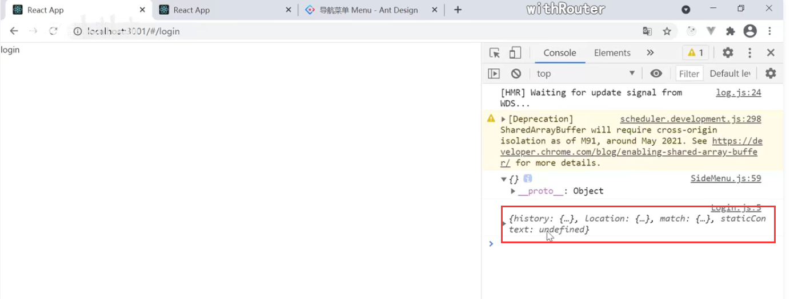

然后我们怎么处理呢？第一种方案就是可以一级一级传入这个比较麻烦，还有一种就是我们可以使用高阶组件

比如我们引入withRoute组件---只要使用withRoute组件就可以拥有他的全部属性，他就可以将props的属性都给你，他的实现原理其实是为你在外面新创建了一个组件，他会给你提供这些属性

有人称为高阶函数-也可以称为高阶组件

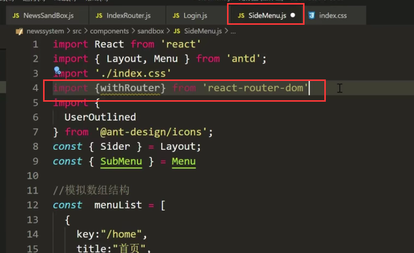

#### 3、高阶组件withRoute的使用

这个高阶组件WithRoute怎么使用呢？

先将export default 截切 然后导出的是高阶组件withRoute，然后高阶组件中包裹低阶组件SideMenu

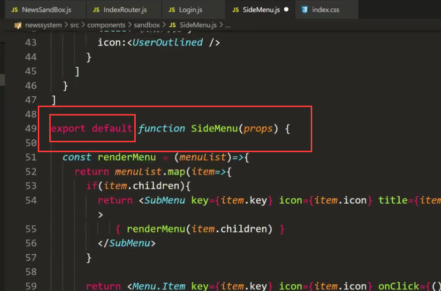

高阶组件 获取低阶组件 获取高阶组件，从而让低阶组件拿到props

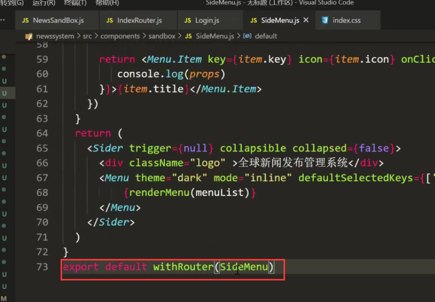

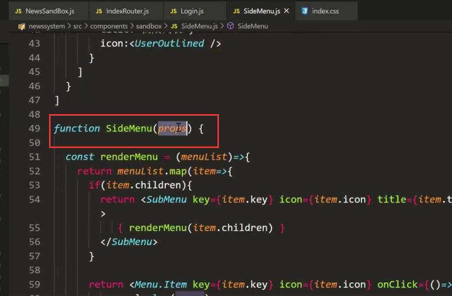

这次再打印一下props：发现props可以获取到了

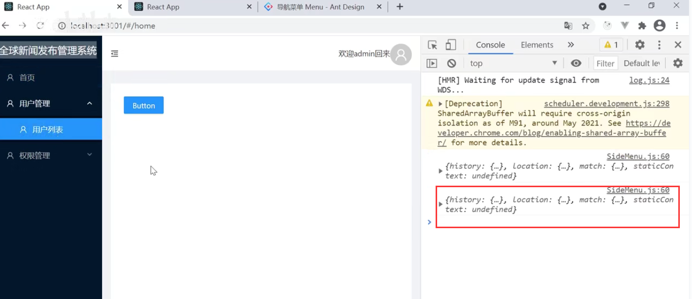

然后我们再进行页面的跳转：

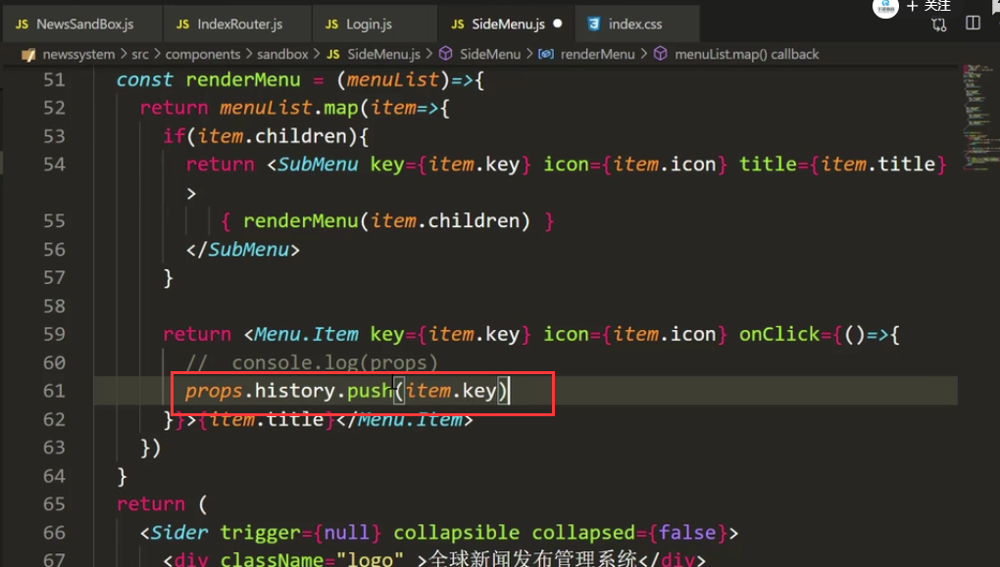

然后我们发现页面的跳转也是ok的

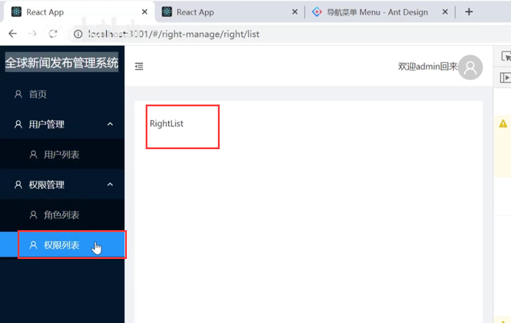

我们在点完之后，再次刷新页面，发现不是刚才打开的选中菜单的页面了，刷新后菜单不进行选中了，因为这些数据是我们在前端进行模拟的，因为之后咱们这些数据是从后端获取的，后期是基于后端的数据再来进行菜单页面的渲染，再来实现页面跳转的功能，这个就是接下来后续研究的问题了。

