# 11.JsonServer-1


想要实现路径刷新之后--让高亮能够跟随


JsonServer的作用是不用写一行代码就可以实现多个接口--好上手，0编码实现RestFul API


Json是非常强大的，只需要一个JSON文件，就可以快速的构建出N个RestFul 的接口  --对于前端而言是一个非常好用的制作假数据，模拟接口，通过这个模拟接口我们可以快速的投入到开发中。


#### 1、JsonServer的安装

​	全局安装 npm insert -g  

安装JsonServer模块

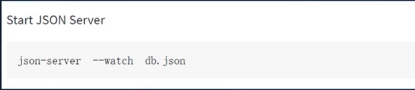


我们在https://www.npmjs.com/search?q=json-server 中搜索json-server-里面会有具体的使用流程

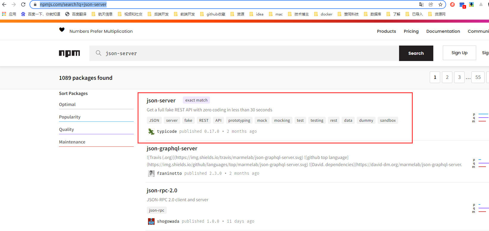


全局安装：

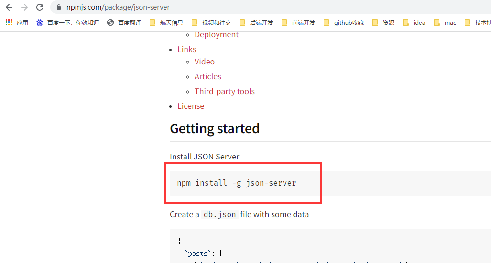

 

然後在创建一个db.json的文件

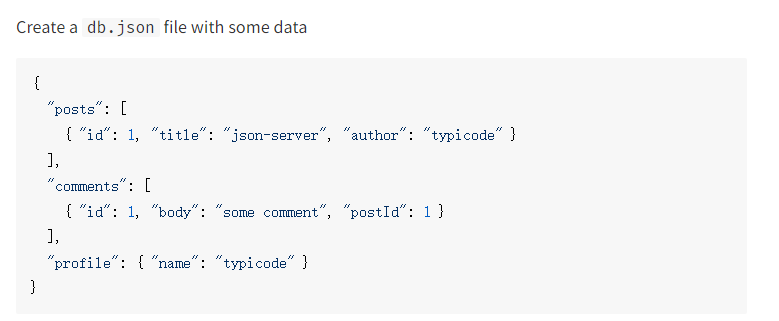

```
{
  "posts": [
    { "id": 1, "title": "json-server", "author": "typicode" }
  ],
  "comments": [
    { "id": 1, "body": "some comment", "postId": 1 }
  ],
  "profile": { "name": "typicode" }
}

```


通过json-server --watch db.json去启动这个文件

```
json-server --watch db.json
```


#### 2、测试JsonServer

我们先编辑一个.json的文件


我们现在使用JsonServer启动一下这个.json

--watch是监听这个文件   --port是设置端口  这样就启动完成了

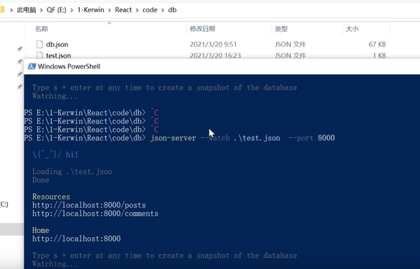


然后我们访问这个地址：localhost：8000

​		我们发现会自动生成2个接口，在json一级的key会自动的当成一个接口

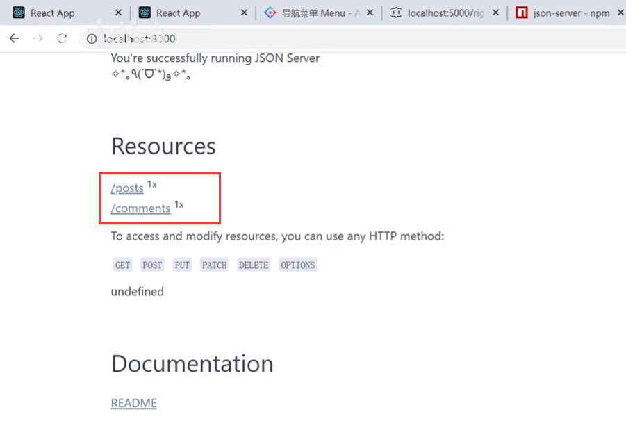


比如：localhost:8000/posts地址

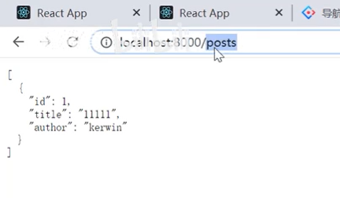

我们代码测试一下：

​		发起一个ajax请求--这个地址难道没有跨域吗

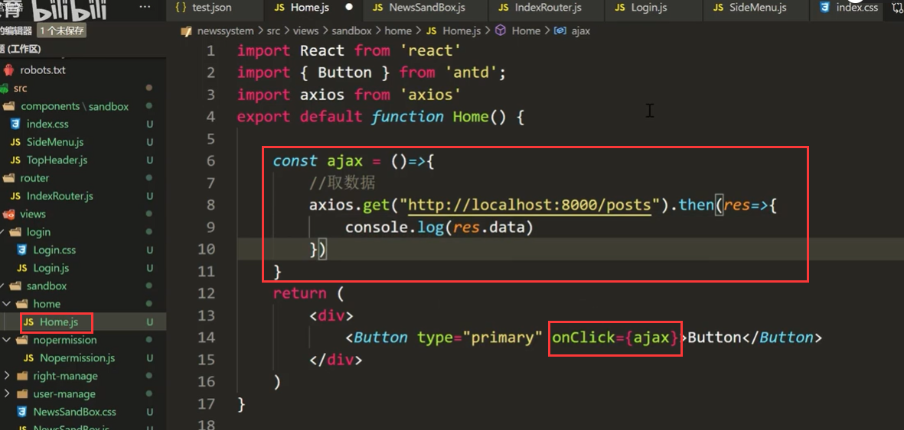


点击按钮：发现可以获取到数据，而且还没有跨域的问题，是因为JsonServer在启动的时候已经帮你解决了跨域的问题，JsonServer是基于node重新封装的

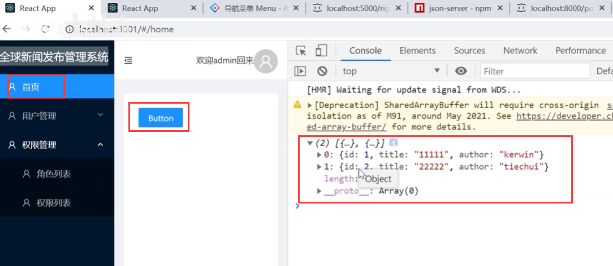


还可以进行条件过滤，比如查询id=1的

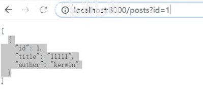


查询数据没有问题，可以增吗？


JsonServer也是可以做新增模拟的

我们代码测试一下新增：id是不需要填写的是自增的

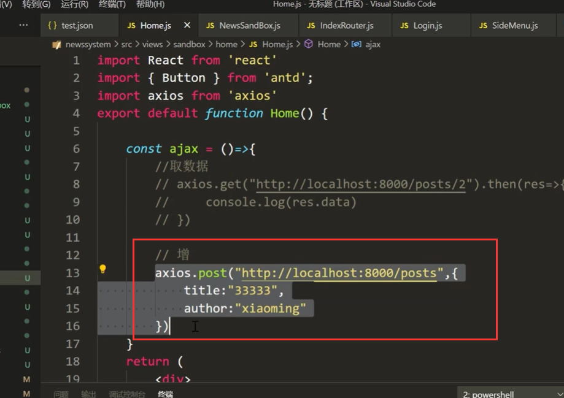


然后页面点击按钮后--查看我们的json文件--发现里面竟然新增了一条数据

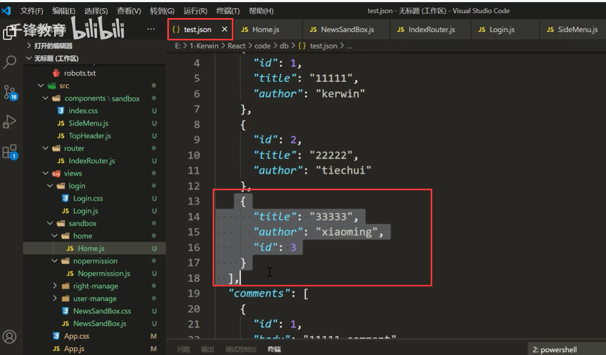


