# 12.JsonServer-2

​		我们现在可以测试一下JsonServer能不能修改和删除

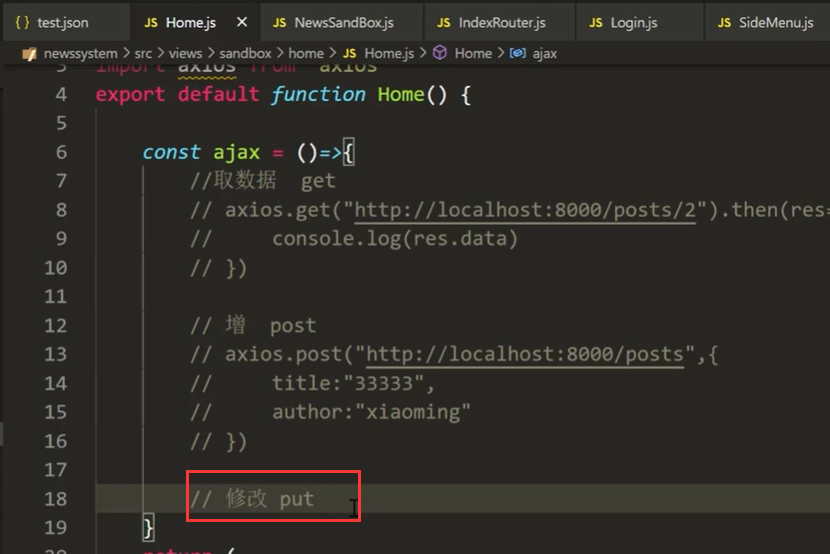

设置修改请求：

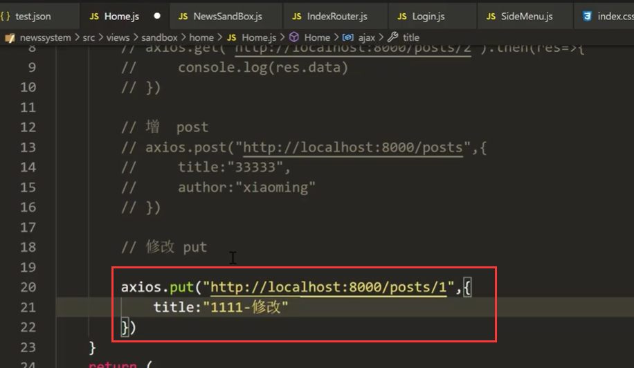

然后点击按钮：进行修改

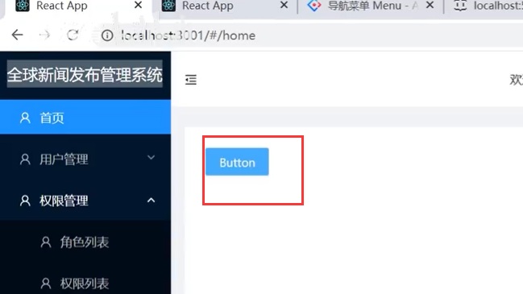

然后我们看一下json文件有没有发生改变

​		我们看到修改是确实修改了，但是有个问题就是 你没有修改的他以为你不要了直接就给去掉了，他是修改了整个对象

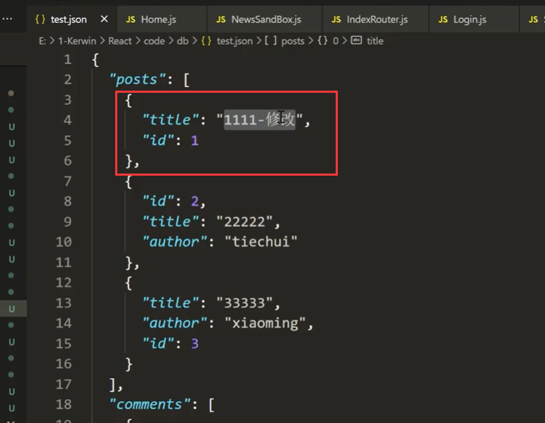

如果我们使用patch请求，就是补丁的更新这样就不是替换了

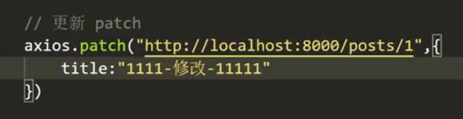

没有修改的值还是原来的值

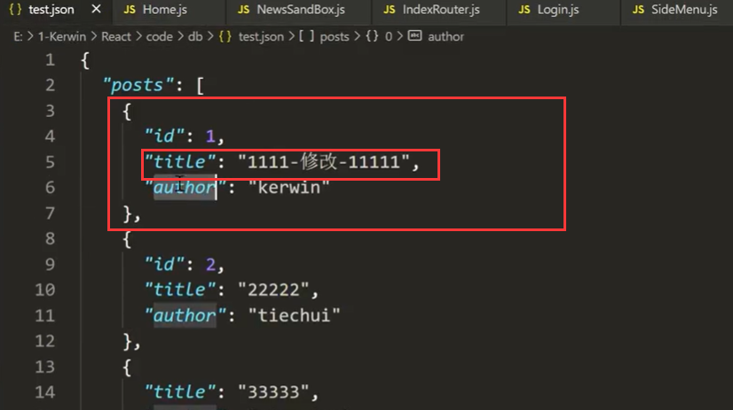

**删除：**

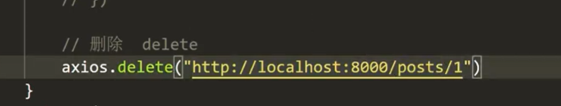

点击按钮后：查看json文件

​		发现数据消失了，被删除掉了----删除的话也会把管理的也删除掉

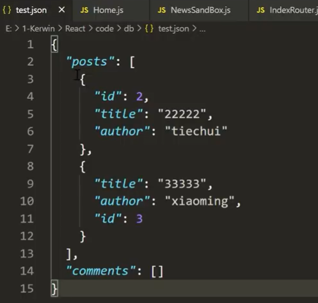

#### 高级功能

向下连接的： 可以模拟出表关联的查询效果

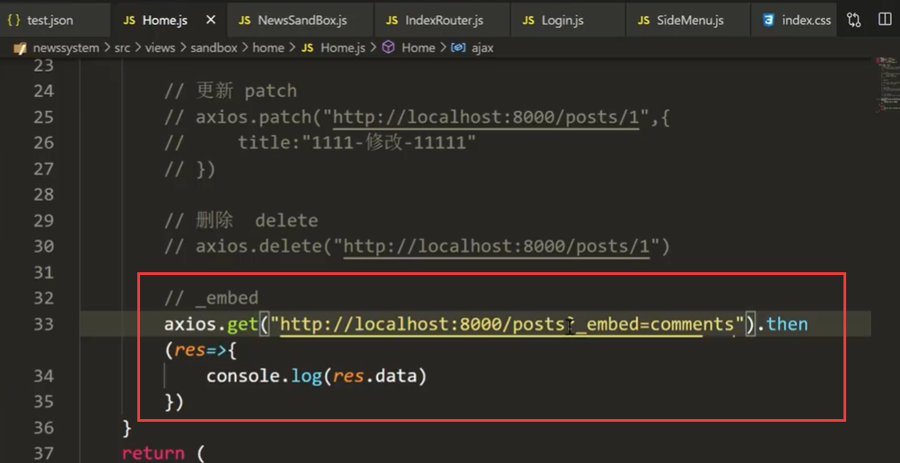

我们发现是可以联合查询出结果的

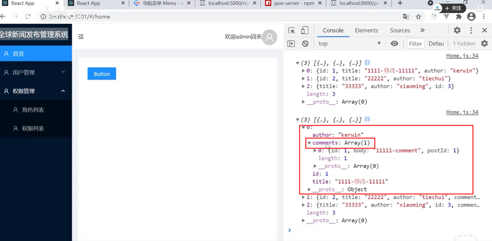

向上连接：解决向上查询出关联关系的模拟 --比如知道评论表的id 想找到标题等信息需要向上查询

使用_expand

​	注意这个post 在json文件中是posts

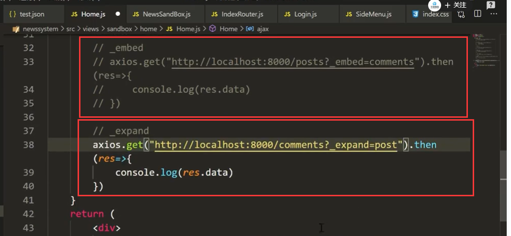

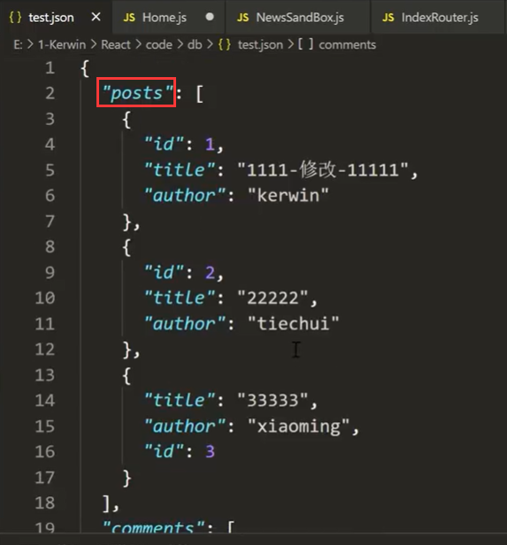

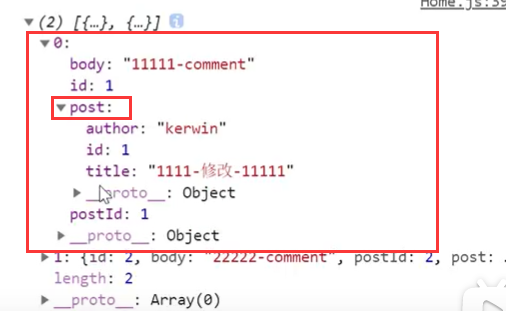

