# 13.后端SideMenu

我们先放入一个db.json的数据文件

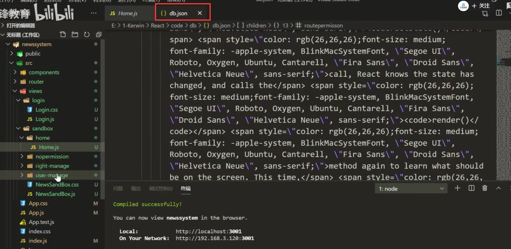

​		然后用JSONServer给运行起来

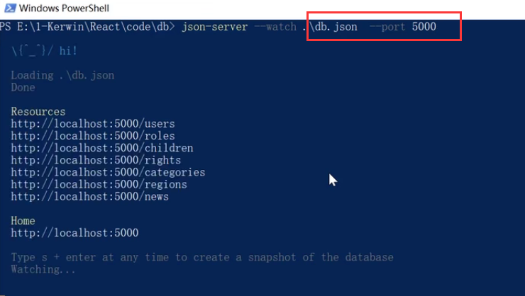

我们访问一下这个地址：可以看到Resources给我们提供了很多的接口

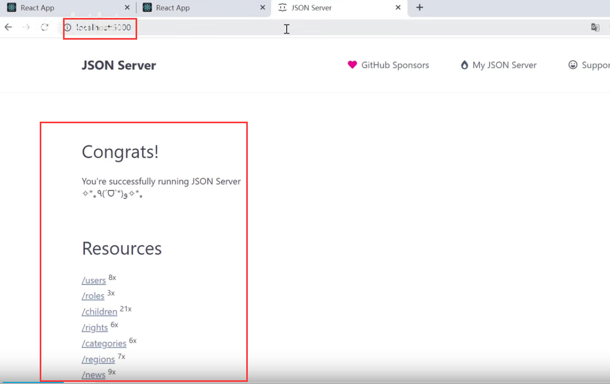

我们后端SideMenu需要的接口就是rights这个接口的数据---然后我们发现这个接口没有下级的属性--就是没有下一层，比如我们之前使用的是children 属性作为下一层，在这里下一层可以调用另外一个接口-children这个接口来获取下级的数据

我们可以看一下这个children接口

​		发现接口中的数据有rightId--可以向上关联获取到具体的 right接口的数据

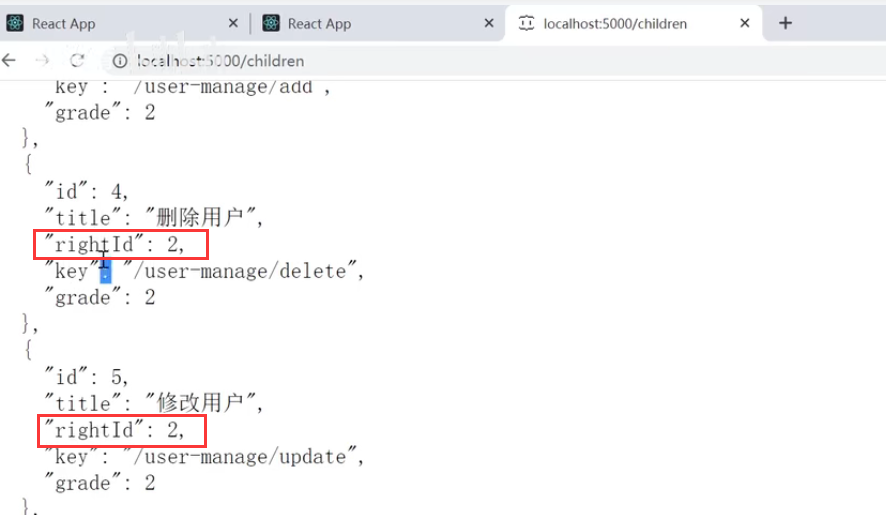

我们看一下这个rights接口：

​		children接口中rightId是2的都属于用户管理下的内容

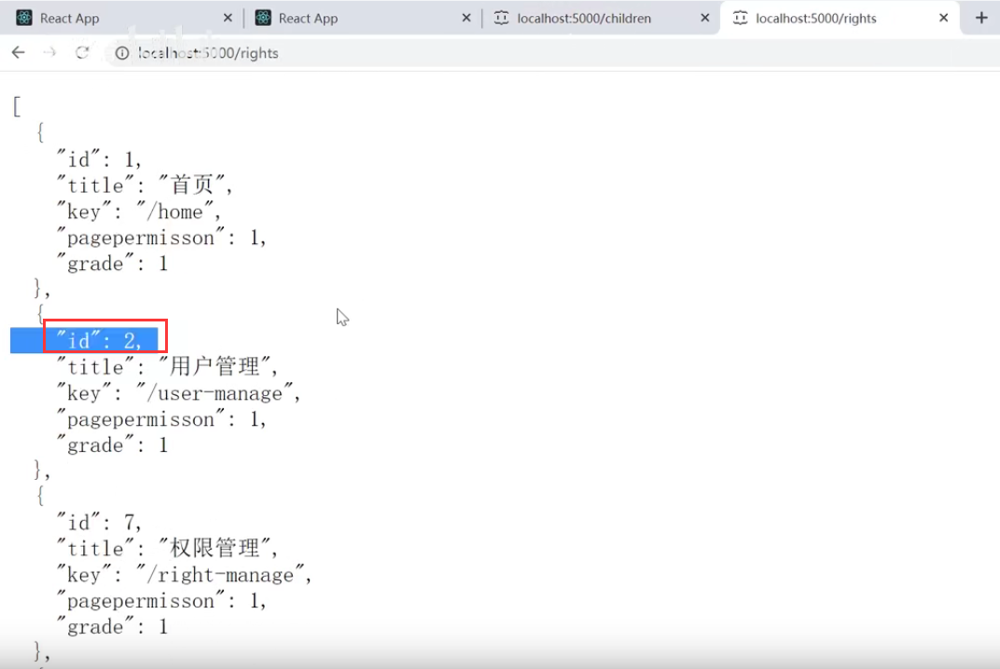

我们关联一下请求共同返回的效果看看---数据是我们正好需要的

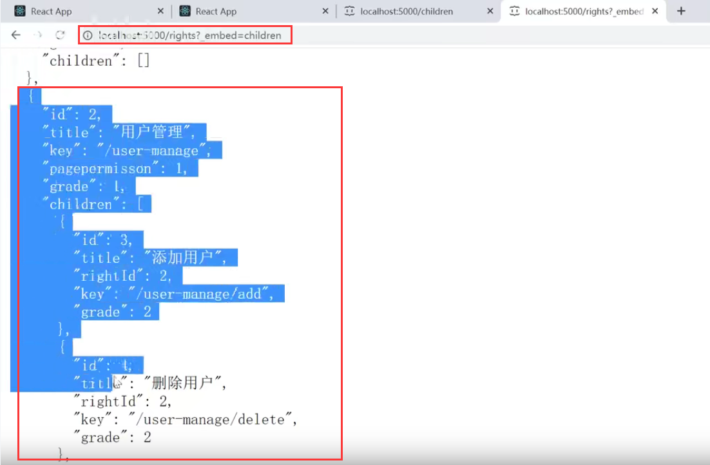

#### 代码实现：

​		发起请求：

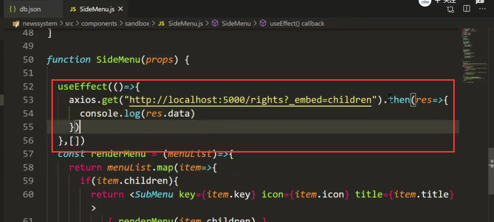

我们的数据是可以获取到的没有问题 

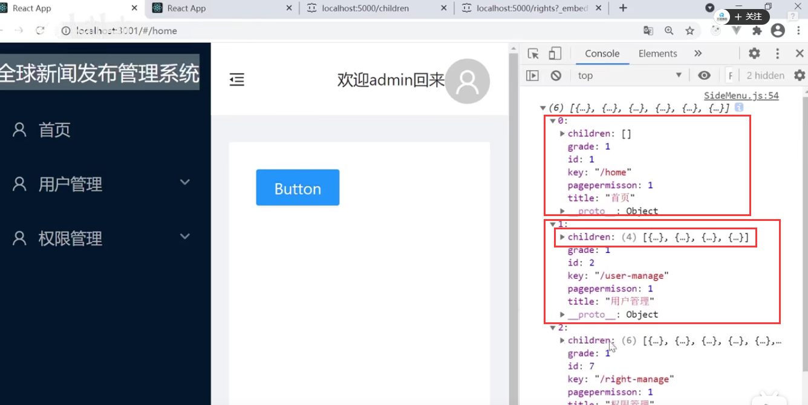

在我们获取到数据展示的时候，需要区分权限，而我们现在的权限和后台的约定是pagepermisson字段不为空的时候才显示---这个字段的用处还是比较大的，后期可以用于菜单显示的开关标识字段

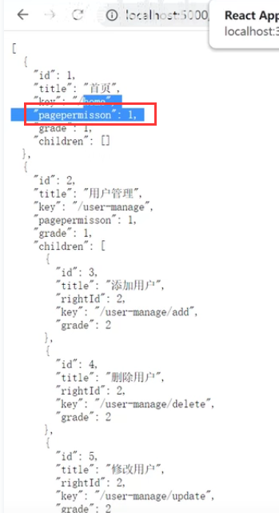

将请求回来的数据放入

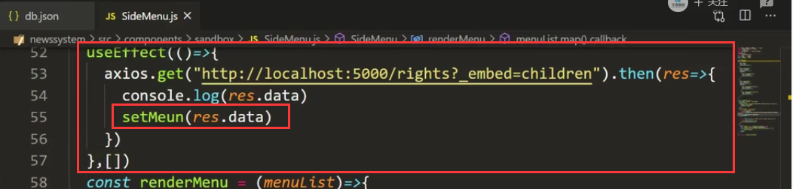

页面数据获取成功，可以全部展示

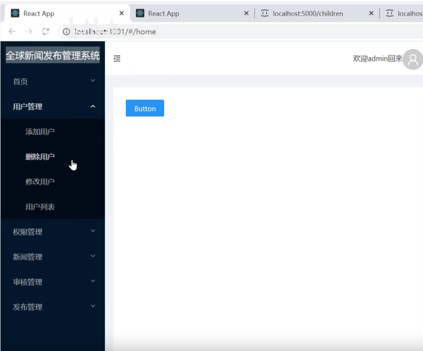

在页面渲染的时候加入判断，判断是否渲染

​	我们除了判断children 还需要其他判断放入一个函数中进行

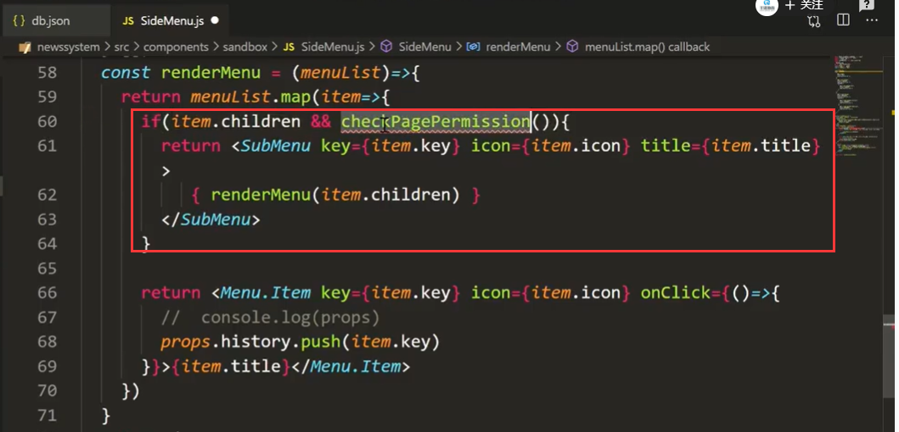

Menu.Item也需要判断一下

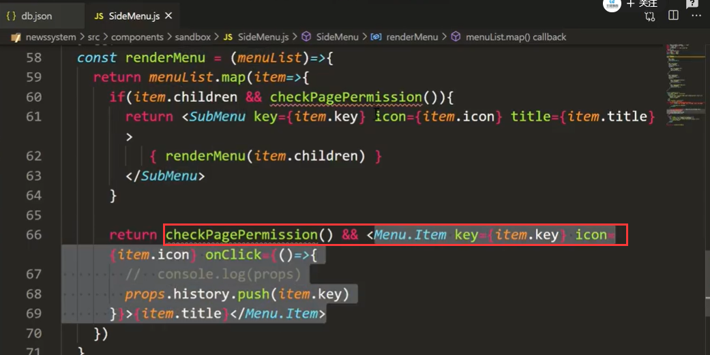

函数中判断pagepermisson===1的时候为真true ，其他的为false 

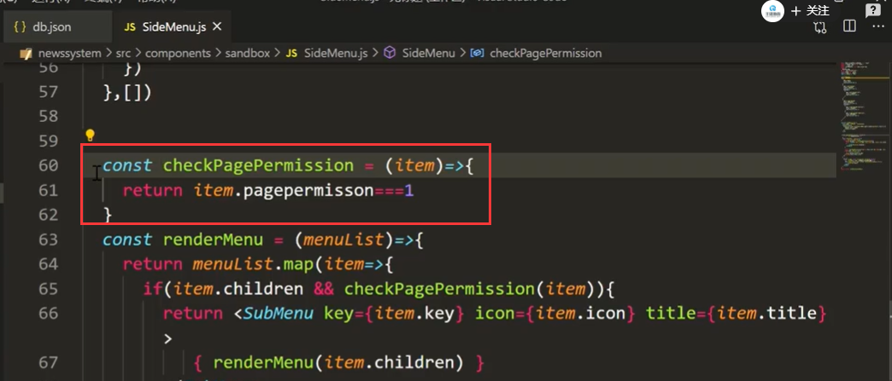

然后我们现在再看一下菜单栏效果：

​			发现菜单正常显示了

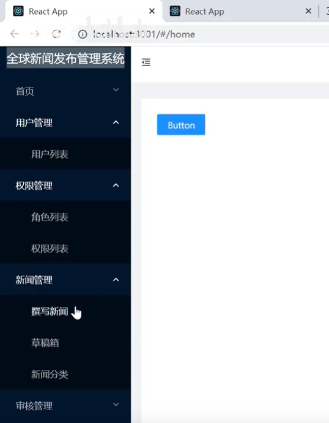

目前我们的icon图标不能显示---我们需要自己做一个icon图标映射表

​	我们把路径作为key 然后把图标组件作为value

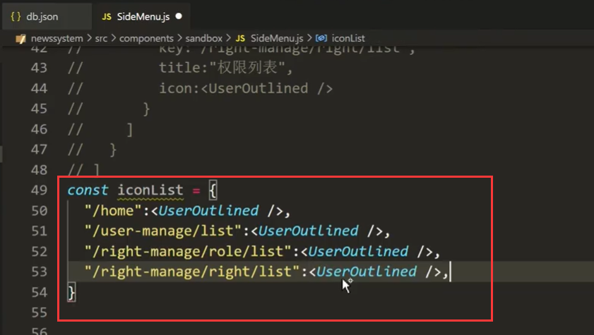

元素中获取icon对应的组件属性

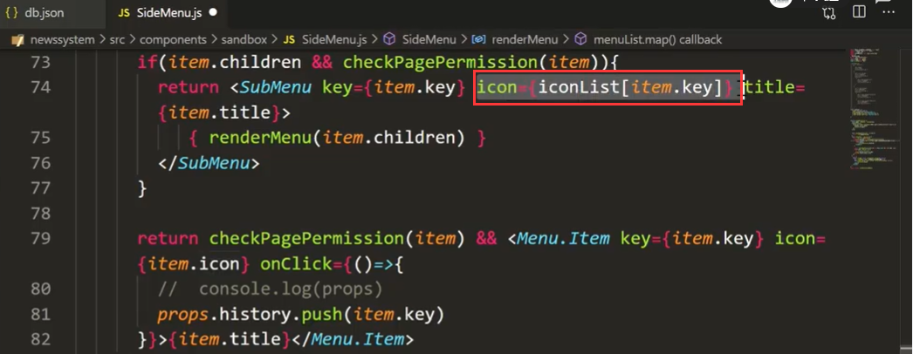

我们看一下页面效果：有图标了

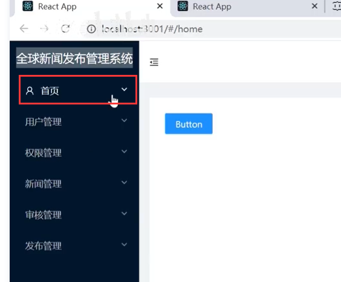

