# 14.SideMenu杀青

​		现在我们开始解决SideMenu的遗留问题

#### 1.首页不应该是折叠的

​	我们从后端获取到的首页对象中是包括children属性的，里面的内容是空的，那么我们就需要多加个判断，判断children的属性 大于 0 的时候才可以有折叠效果

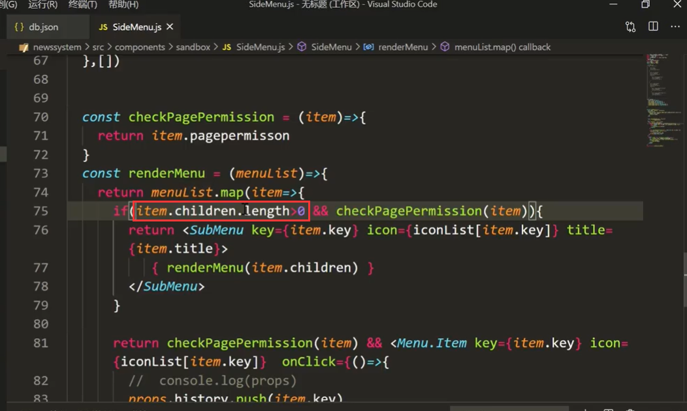

查看页面效果--发生报错了

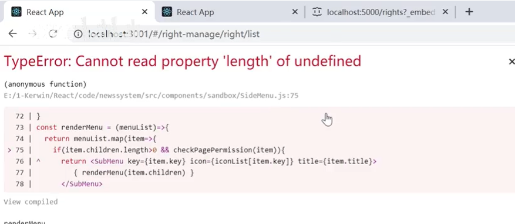

原因是，因为有些都没有children导致的，需要小处理一下 加个 ？ 如果为假后面的length就不会执行了

​			item.children?.length > 0

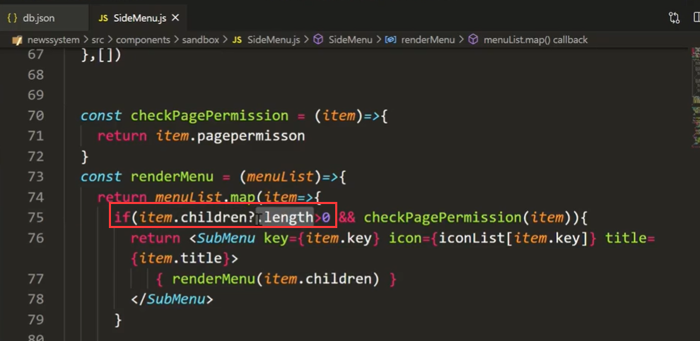

查看页面效果：首页折叠问题解决完成，没有空的子菜单了

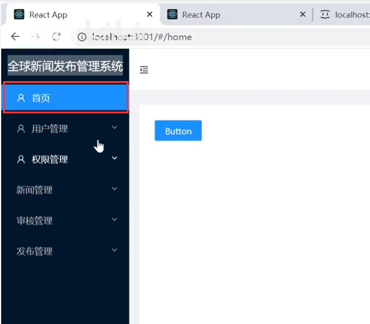

#### 2、菜单点击全部撑开后高度增加导致的滚动条处理

我们应该是在菜单栏这边加滚动效果--而不是整个页面撑开的滚动效果--应该是小范围的滚动效果是比较好的

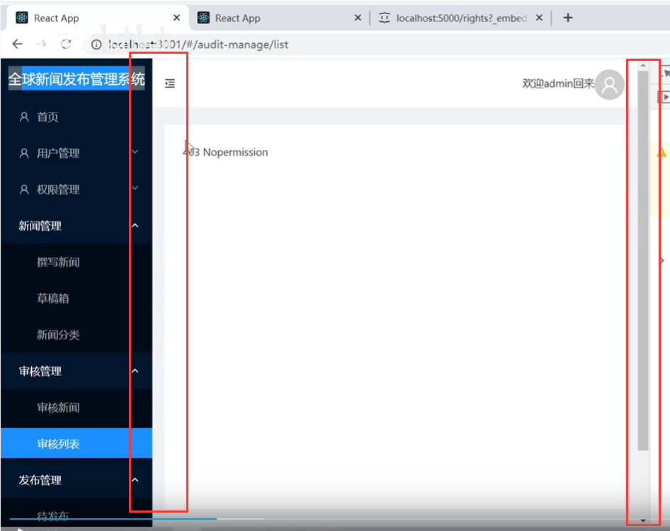

解决方案就是--稍微把样式修正一下

Menu组件的外层添加一个div设置固定的样式--然后在menu再加一个div设置行内样式flex=1，如果发生滚动overflow ：auto 就自动撑开滚动效果

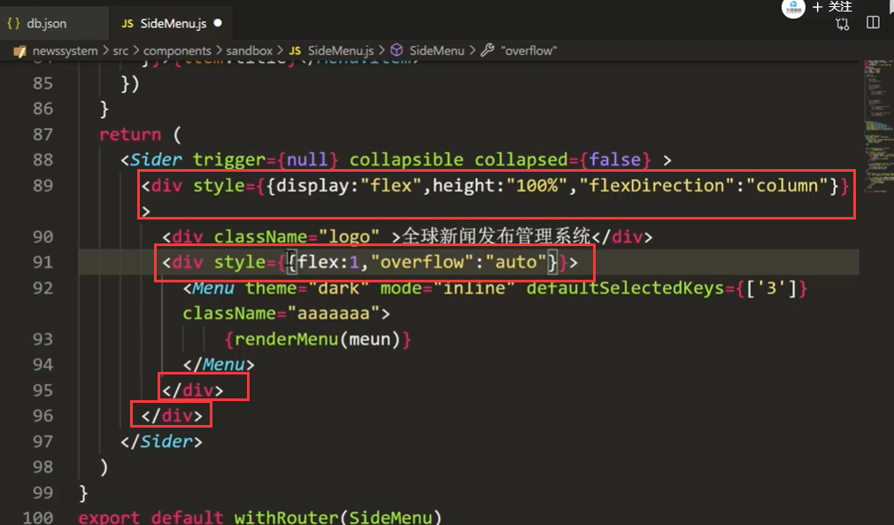

页面查看效果： 这样局部滚动是比较合适的

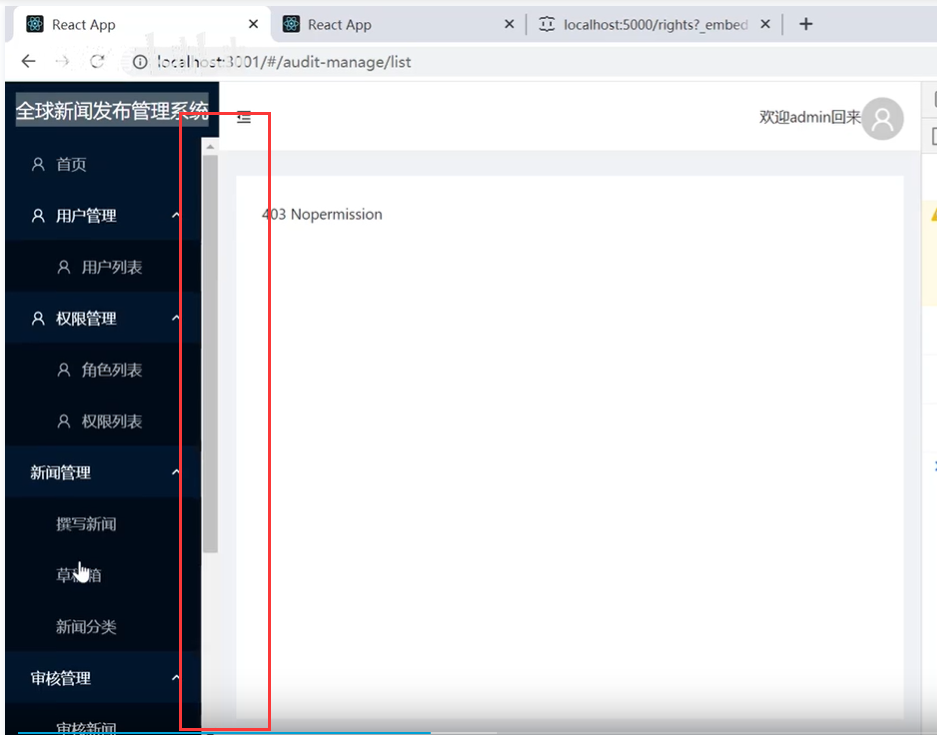

如果感觉我们这个滚动效果不好可以自己进行样式优化，比如使用这个样式

​		scrollbar：设置滚动条的宽度、高度

​		scrollbar-thumb:设置滚动条高亮的颜色

​		scrollbar-track ：被滚动的背景颜色

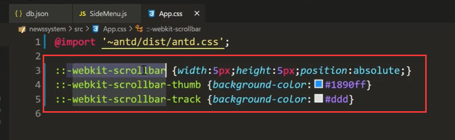

查看页面效果：

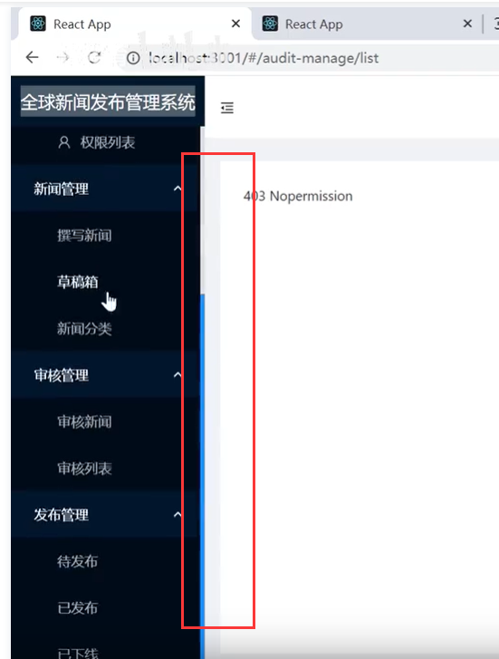

#### 3、菜单高亮刷新页面不回显的问题

​		刷新页面后--首页的高亮显示消失--如果点击二级菜单刷新页面后，不但不高亮而且还不展开

我们希望刷新完页面后对应的菜单还是高亮的，如果是子菜单应该也是展开的效果

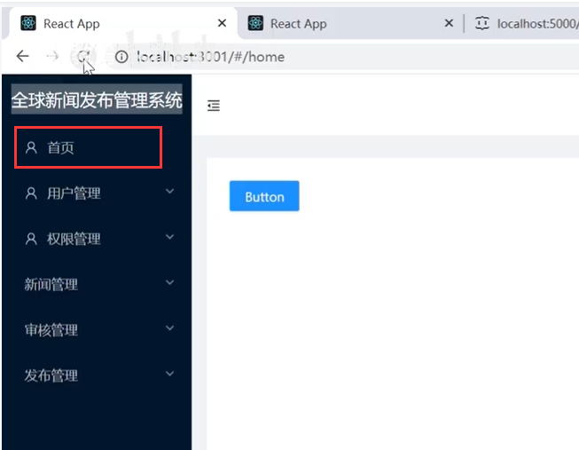

我们的解决思路是根据路由然后进行高亮选中的处理

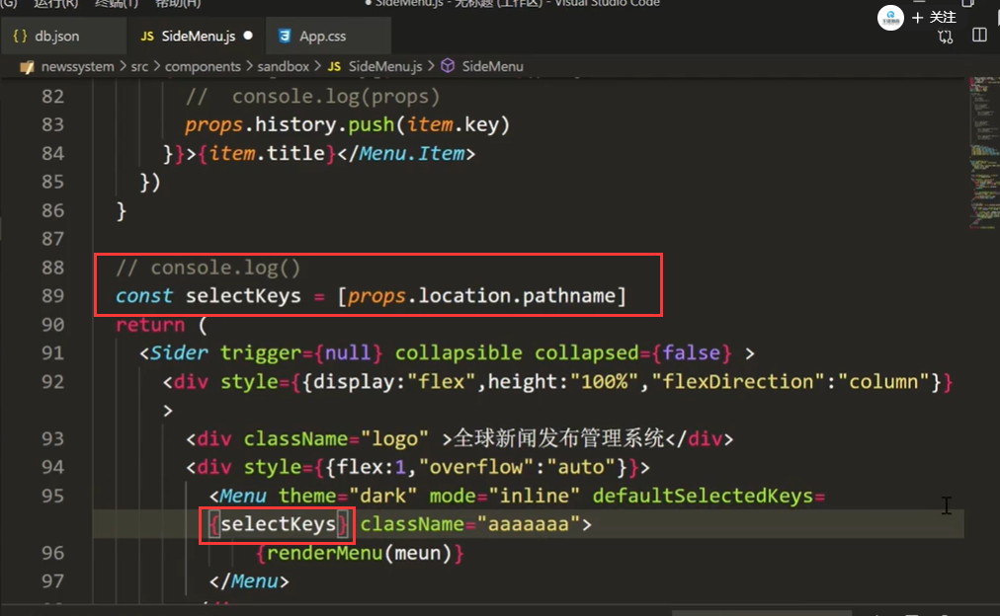

我们可以通过高阶组件获取到props，通过props可以拿到location

​		props.location的属性pathName 就是对应的路由地址

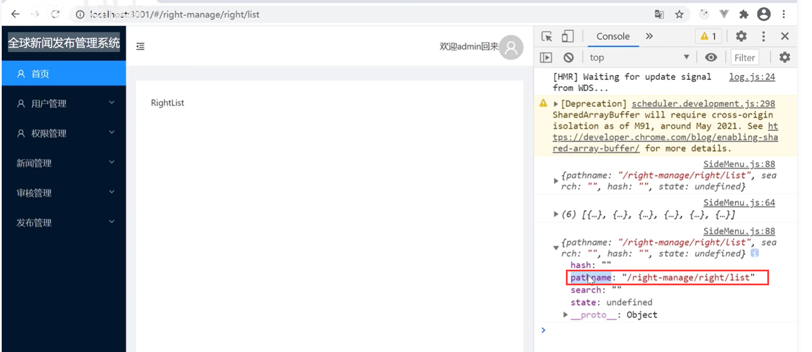

我们现在查看页面效果：刷新后高亮的效果处理了，但是折叠并没有展开

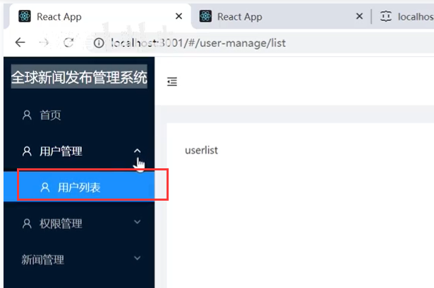

想打开菜单折叠会使用到defaultOpenKeys这个属性

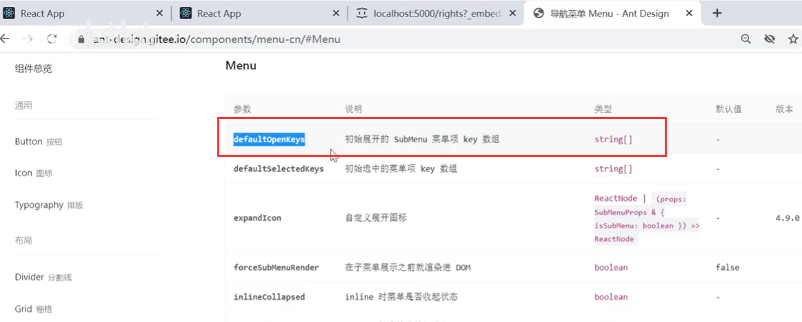

我们需要一个截取的操作--需要把props.location.pathname得到的路由路径截取一下

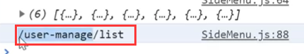

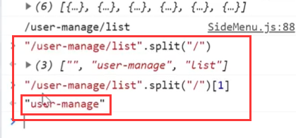

新建一个变量openkeys，我们获取一个完整的一级路由结构

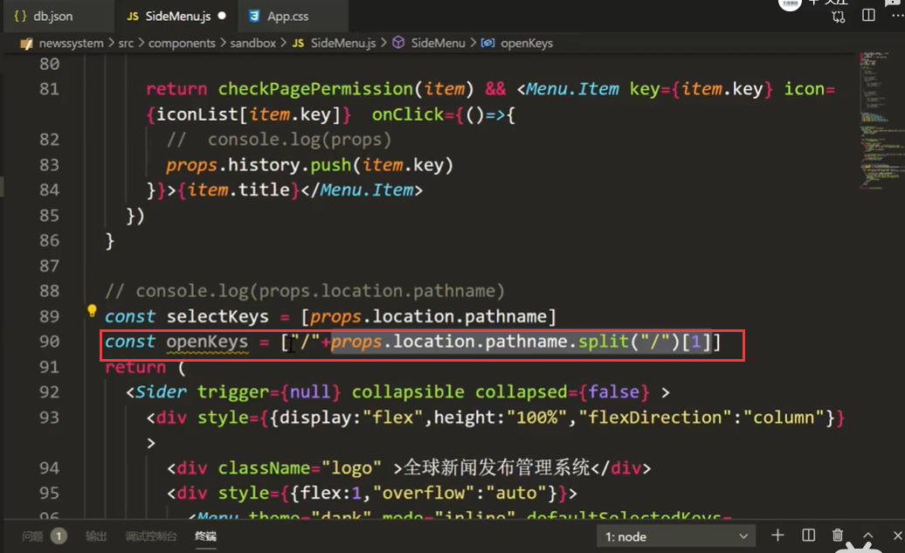

然后在defaultOpenKeys里面放入这个一级路由属性

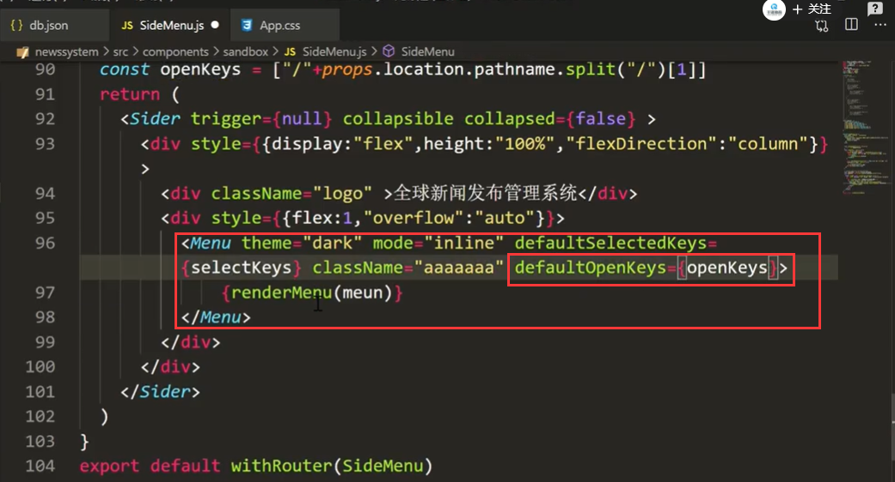

页面查看效果：刷新页面选中高亮显示，并且自动展开折叠的菜单

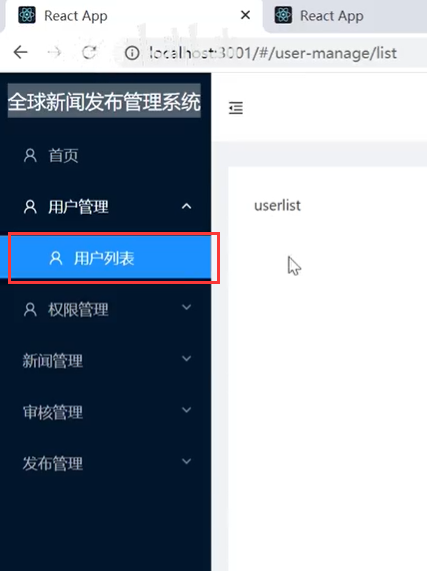

目前还有问题---如果我们只输入ip和端口会从定向到首页，但是这种重定向过来页面首页没有高亮显示

这就引出一个概念--受控组件和非受控组件

​	受控组件：就是当外部发生改变的时候，组件内部关联的内容也会发生改变

​	非受控组件：就是当外部发生改变的时候，组件内部是不受到影响的

Antd组件库中的default为前缀的属性，其实都是非受控组件，而去掉default就变成受控组件了

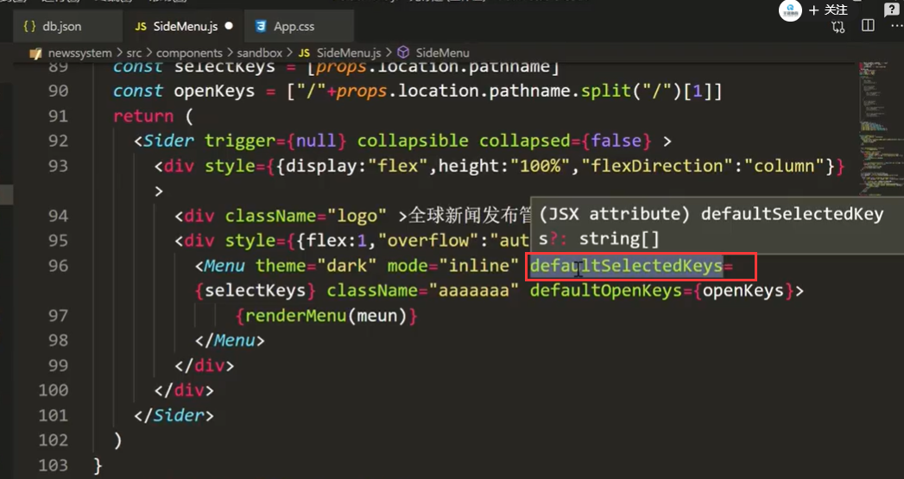

我们更换为受控组件属性：重定向也是没有问题的

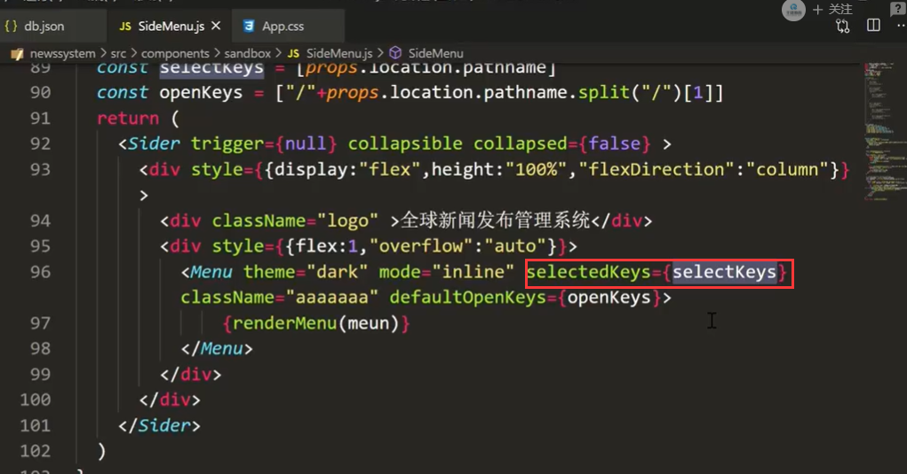

