# 15.权限列表引入

权限的图形思路：

​		权限列表来进行权限的CURD--会导致后端数据发生改变--后端数据发生改变导致侧边栏显示内容发生改变。

 另一个支线--用户登录 从用户列表得到用户--然后通过用户获取到具体分配的角色，然后从角色中获取到权限列表的权限，然后拿到权限列表数据页面进行展示

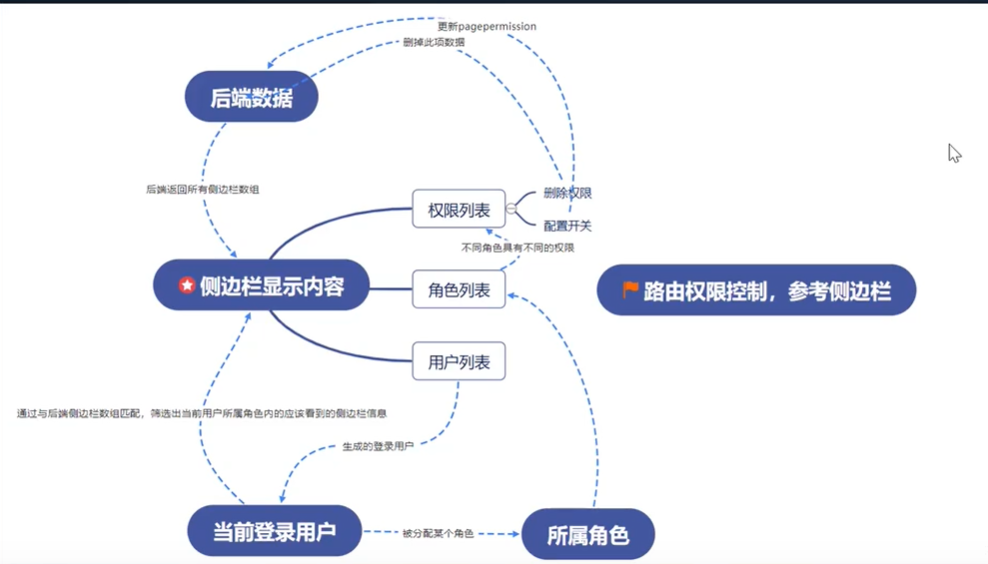

我们到Antd组件库中查看-----	

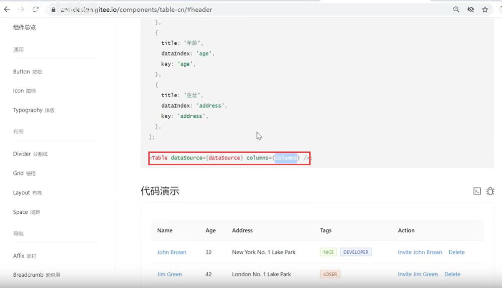

使用Table组件，设置状态值 dataSource为数据源----然后定义columns是列

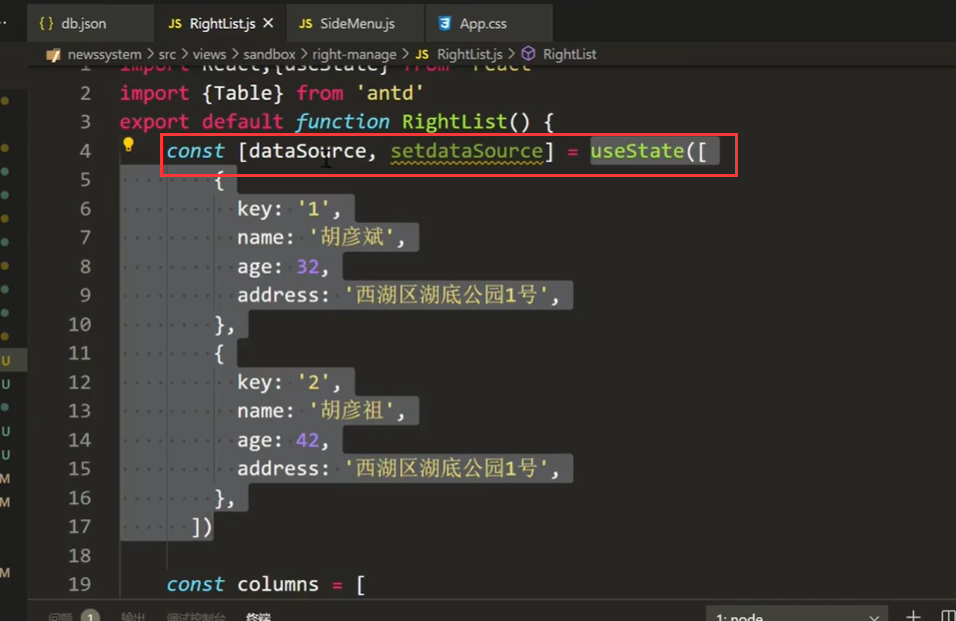

页面效果展示

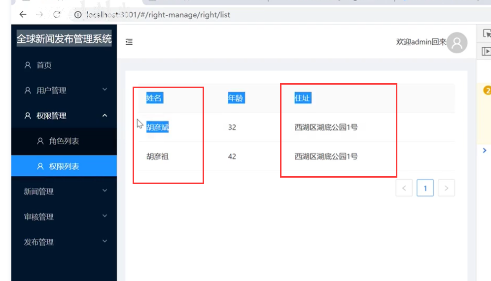     	

这个table的列是如何排的呢？ 是根据columns下面的dataIndex来决定的，dataIndex：'name'就代表第一个属性就是name，标题title就是姓名，columns的第二个对象就是第二列属性是age，标题是年龄 等等

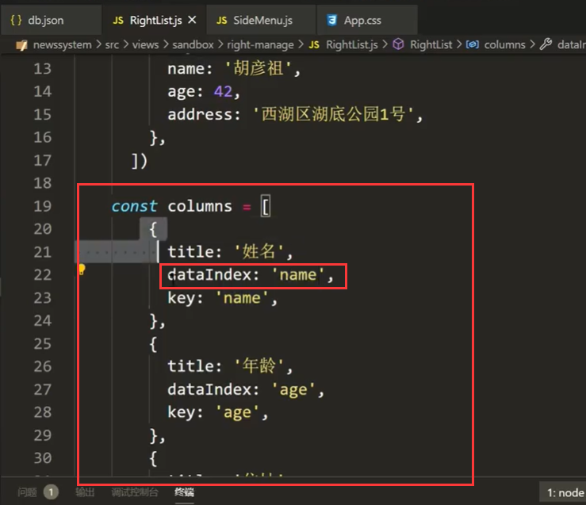

明白了以上Table组件的使用规则，那我们从后端获取数据在前端Table显示不就变的容易了

我们先整一层的数据，在请求的时候先没必要整多层的数据，整一层数据玩一玩

引入useEffect

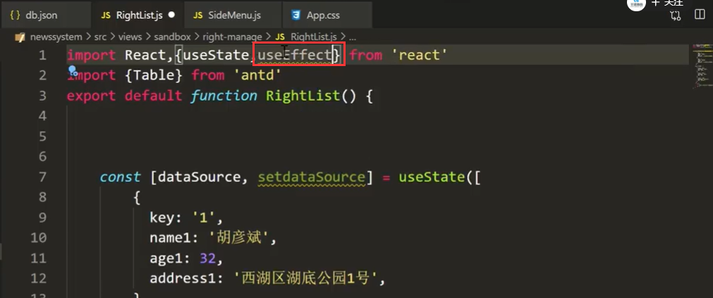

然后设置useState是个空数组---后续由后端给返回

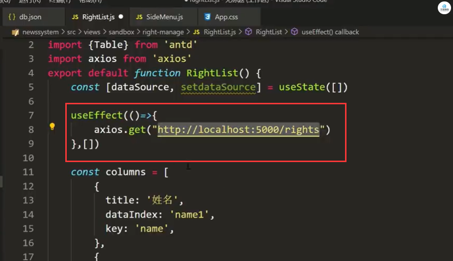

拿回来之后给dataSource设置上去值

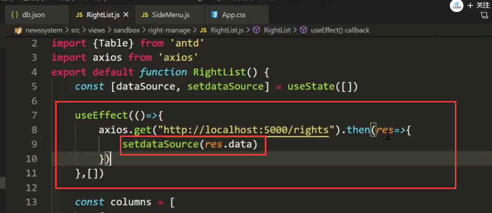

然后我们现在把列修改一下--我们需要的是ID、权限名称、权限路径、操作

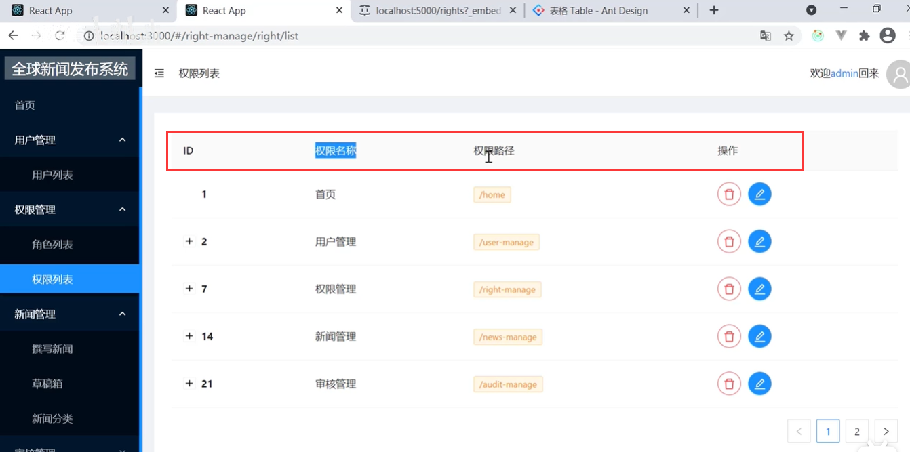

我们获取的数据结构是这样的：

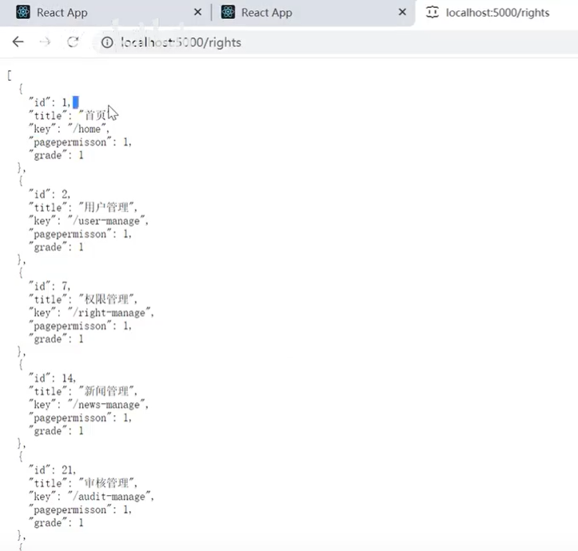

然后我们根据这个返回的数据结构设置列属性：

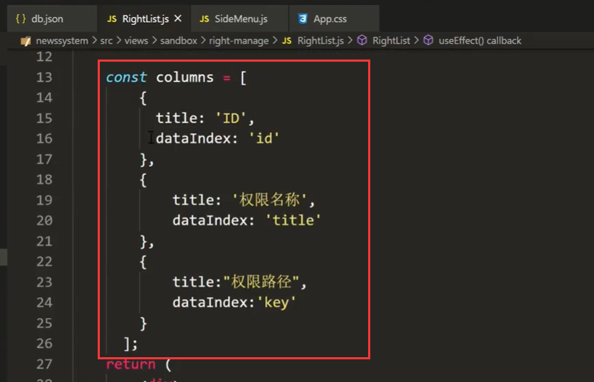

我们查看页面效果：

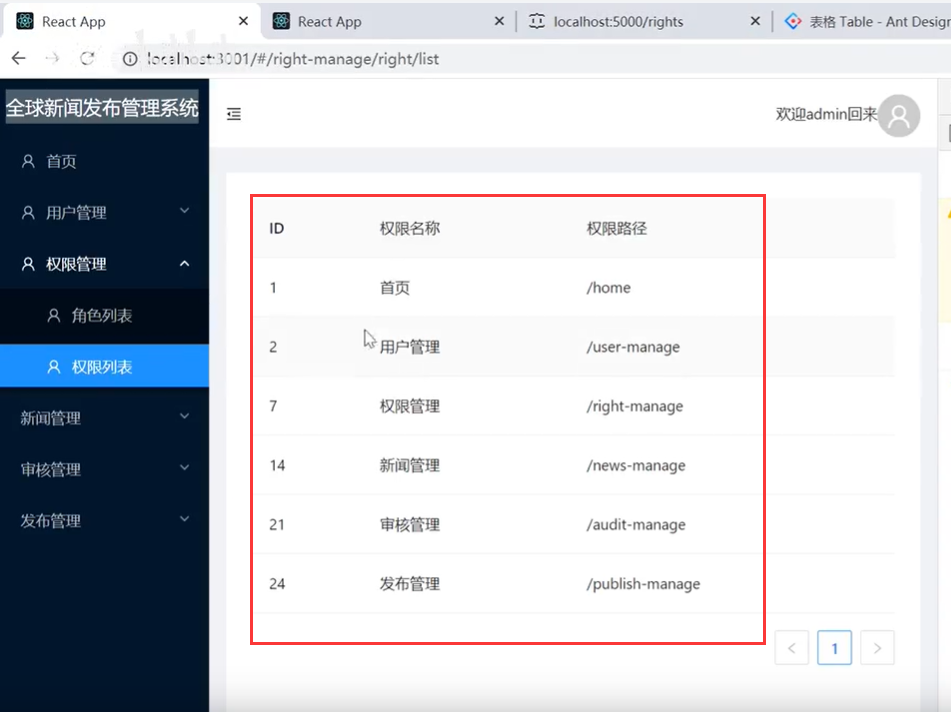

现在只是初步的实现--我们还需要把分页，还有操作列等后续完善

