# 16.权限列表-树形表格

如果我们现在使用Table组件来渲染表格的话，那么表格的样式想定制怎么办呢？

我们可以在列属性中加入render属性--注意加入render属性后必须将dataIndex的属性传入给render，render以形参的方式接收后用于渲染后的内容输出，不传的话后端传来的值是无法显示的

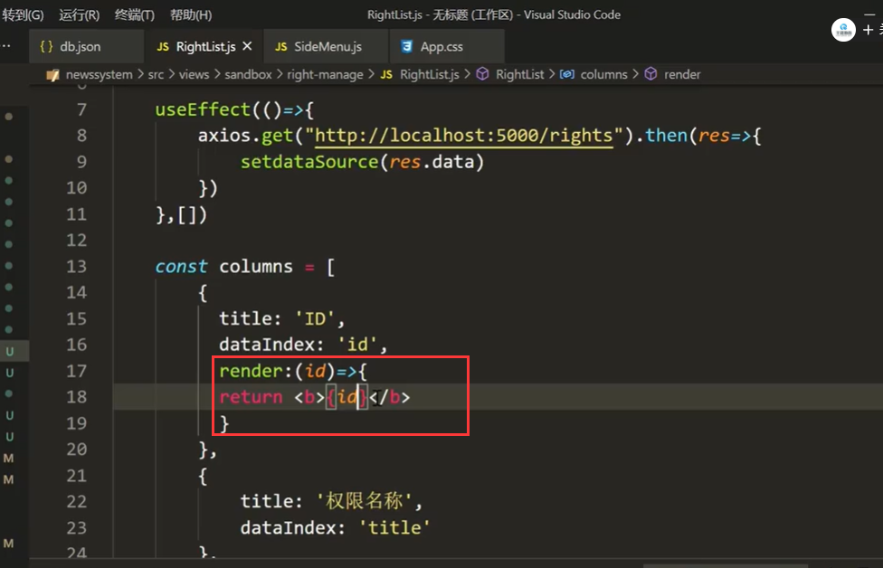

查看页面效果： id加粗了

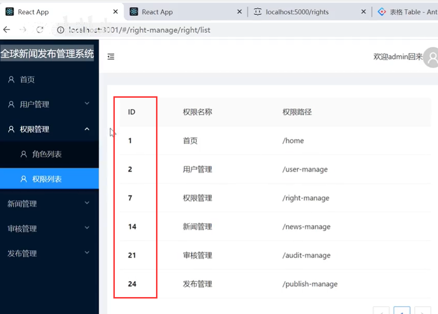

给权限路径设置样式：

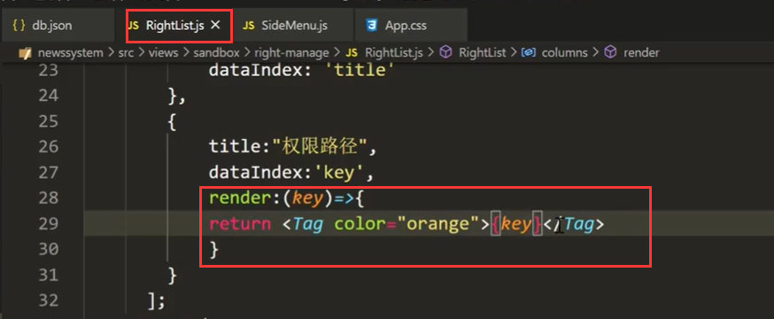

查看页面效果：

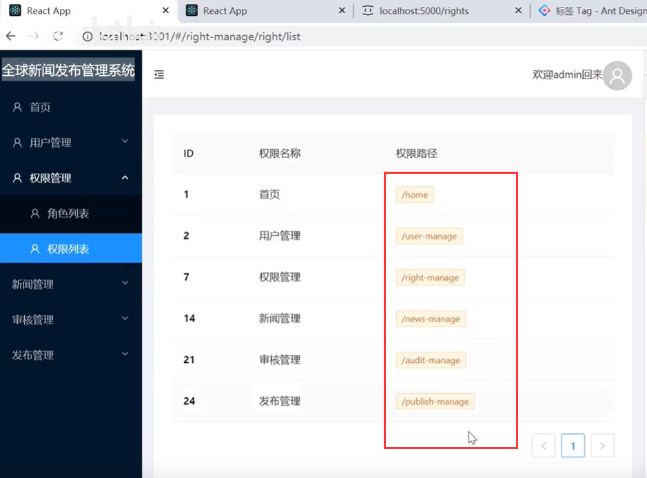

我们现在再添加一列操作列---因为他并不是从后台获取的属性的值所以他的dataIndex就不需要写了

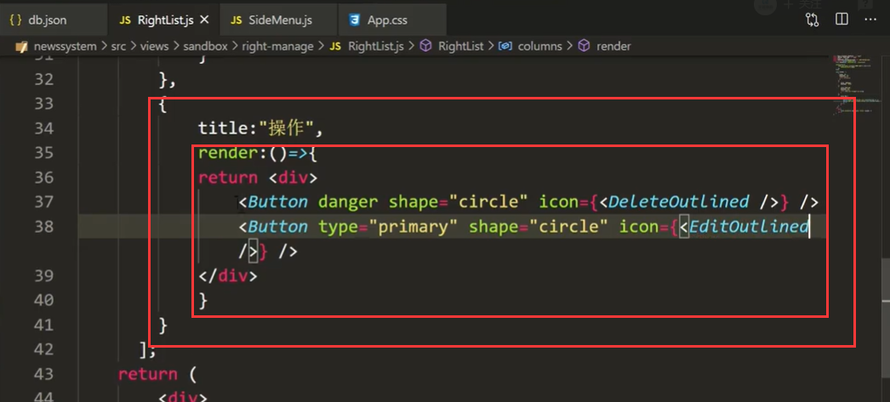

查看页面的效果：

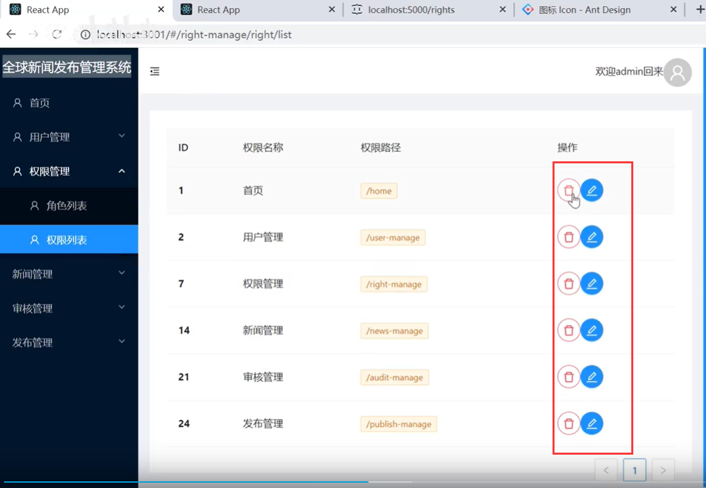

这个Table组件默认是显示10条数据，我们可以调整一下分页器中的显示条数

​		使用这个属性pagination

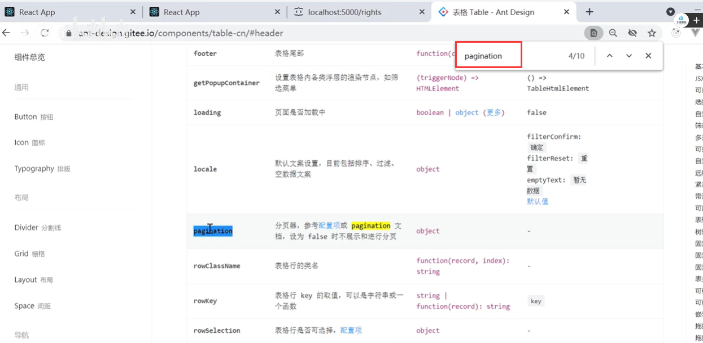

然后点击进入查看到条数的配置属性

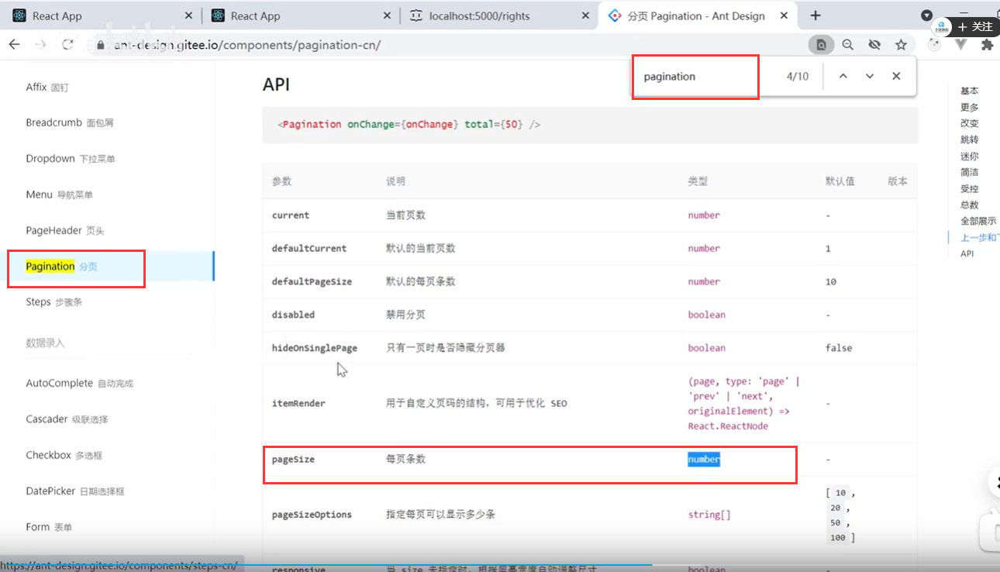

我们设置为5条一页

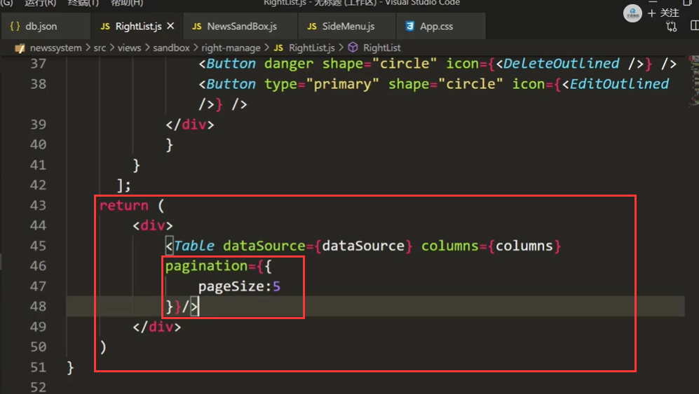

页面查看效果：已经给我们分为2页了，我们是6条数据

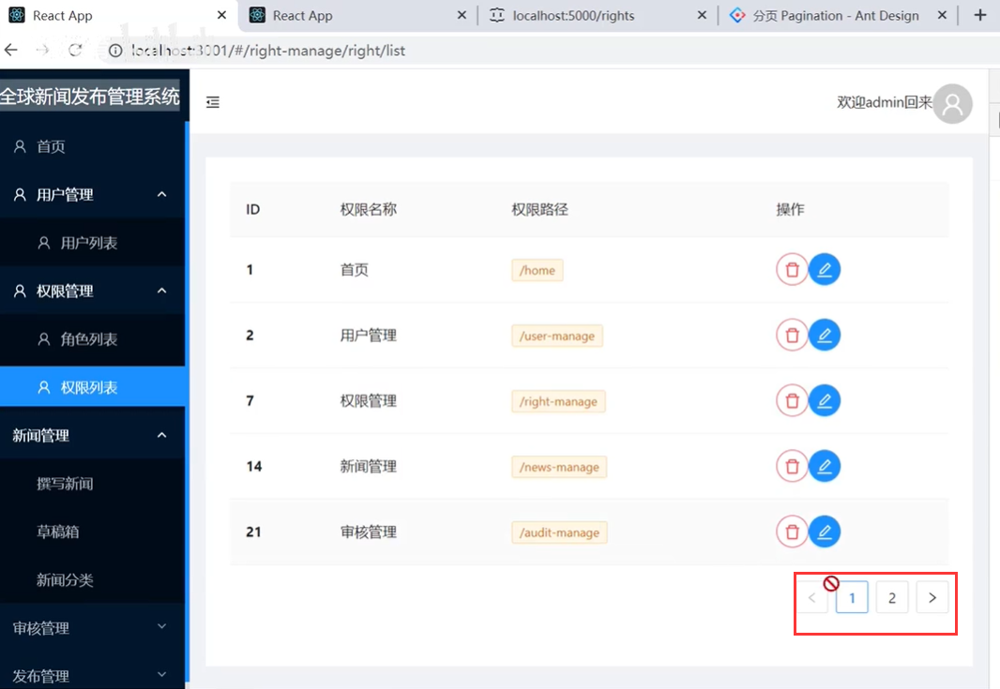

我们目前只是展示了一级，如果是多级的，而且要求动态的树形展示效果呢，类似下图这样

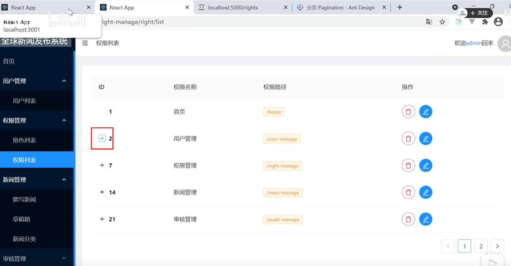

#### 多级展示

我们先寻找一下解决方案和思路

​		可以在antd中找到可展开的

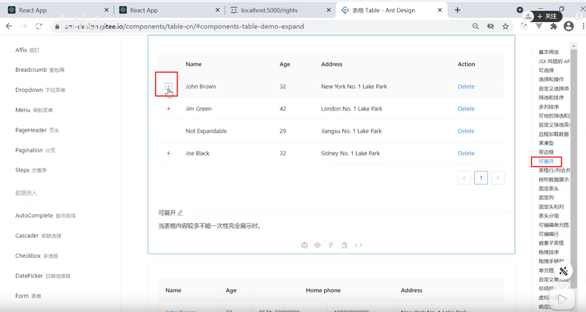

嵌套子表格的

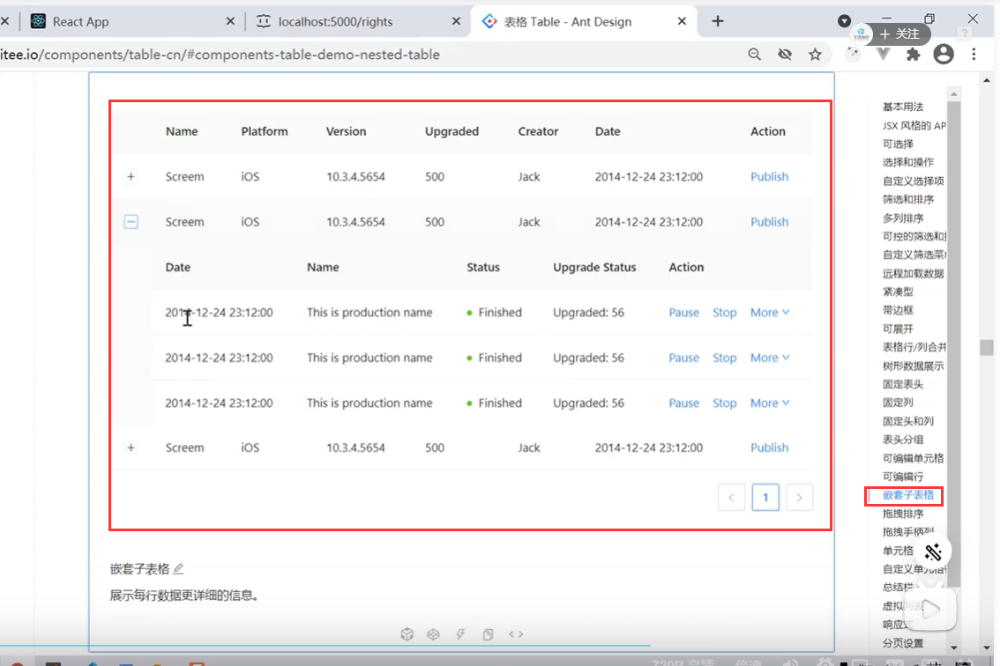

树形数据展示：

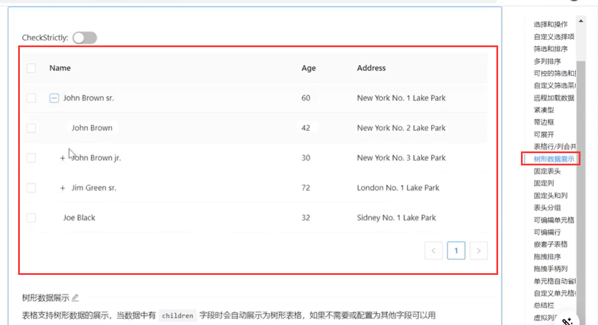

我们的数据展示更适合使用树形结构的方式

现在我们把二级菜单的数据都取回来

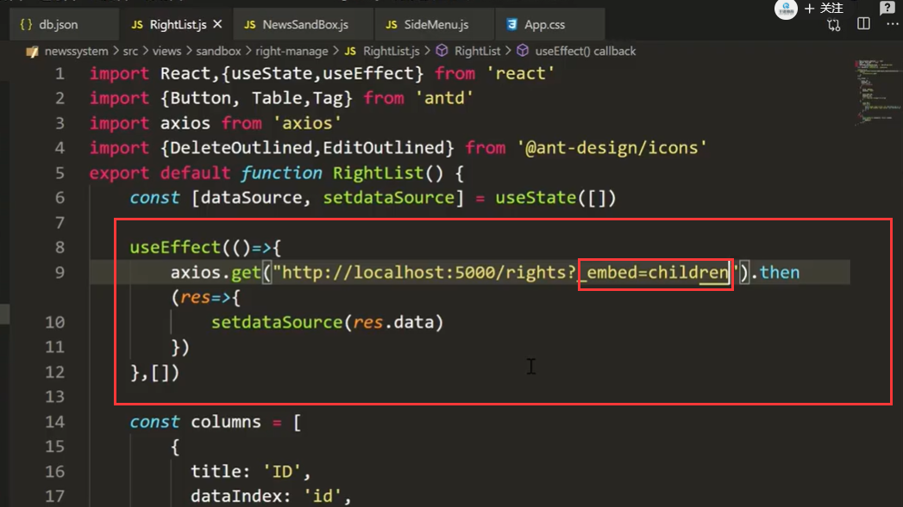

然后页面查看效果：突然发现成功了，并没有任何操作怎么就成功了呢？

​		原因是返回的字段子菜单属性名称是children 默认使用这个属性就是树形结构的数据展示属性

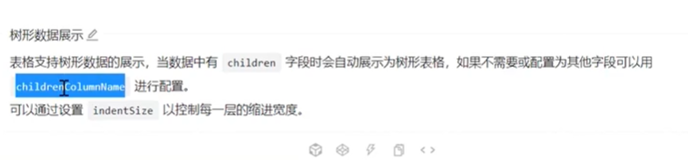

​		如果不是children这个字段的话，我们可以使用childrenColumnName属性来指定对应的子菜单的字段

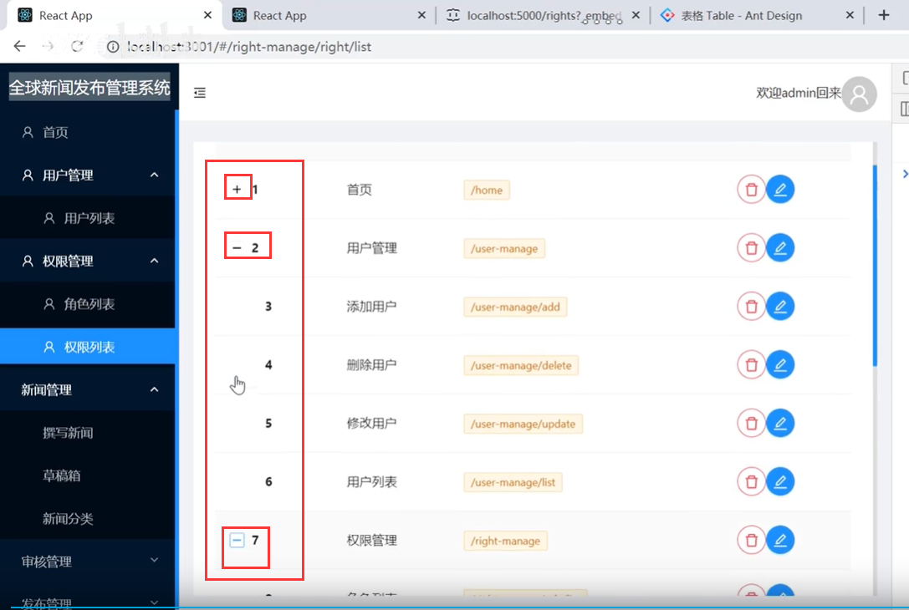

有个小问题：首页也是有子项目的，原因是后台给返回的数据有children属性，但是这个属性还是空的

我们就在前端给这个数据做个处理

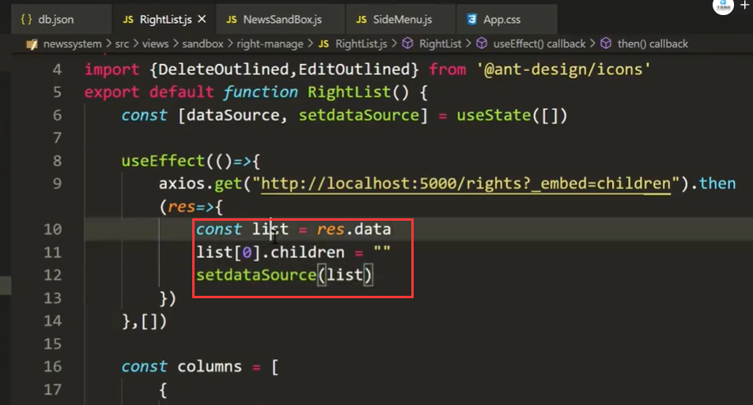

然后我们查看页面的效果

​		ok处理完成

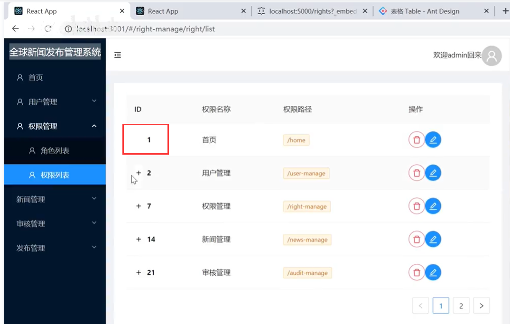

