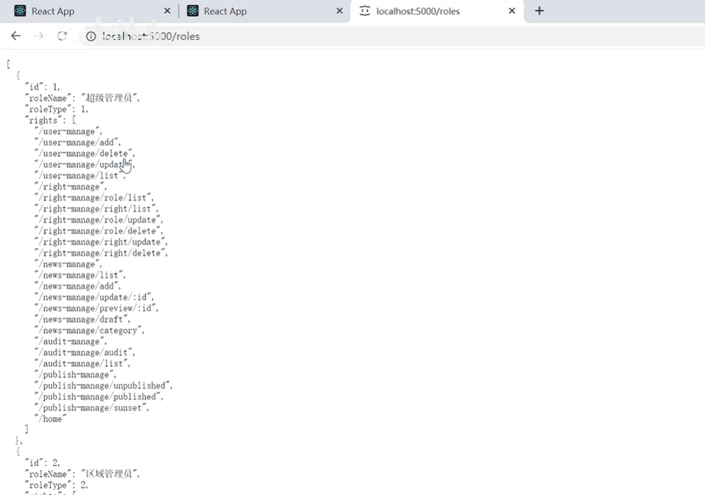

# 19.角色列表-引入

#### 1、页面结构初始化

我们先把这个结构搞定

​		需要Table组件--然后需要useState用于结构数据，useEffect用于发起请求

然后引入axios去后端请求数据：

我们先查看一下后台接口数据的结构：

然后配置请求--

目前数据是拿到了--接下来就是将数据展示在页面中的时候了

#### 2、设置页面数据

设置dataSource

设置columns表格的列

页面查看一下效果：没问题id列可以展示

但是现在有个报错：list中每一个child应该有唯一的key

​		之前使用没有问题是因为之前后端有返回一个唯一的key

我们可以在Table中指定一个key，就是你别找这个key了我给你指定一个，如果Table中不写这个rowKey默认是从后端去取key字段，如果指定就是使用指定的

查看页面效果：不会发生这个错误了

然后在columns中把其他的列也放入一下

查看页面效果：

#### 3、设置操作按钮功能

​	删除按钮操作其实和权限控制的使用方式是一样的，修改一下逻辑和接口地址就ok了

页面查看效果：

