# 21.角色列表-权限分配

我们想在勾选权限之后--把数据从新setState后，同步后端

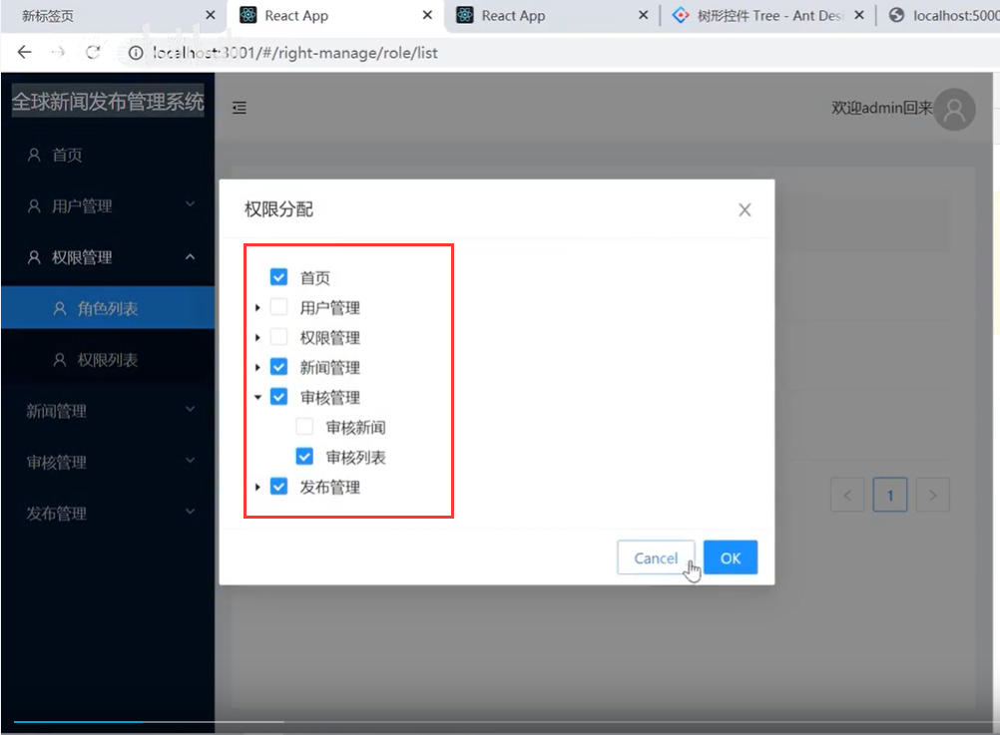

点击ok的时候--我们看一下这个值

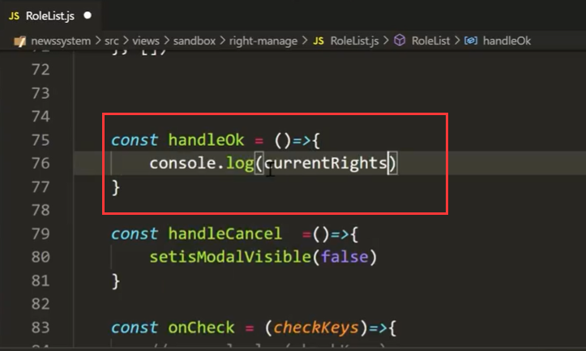

发现数据有点不对--应该是使用checkKeys.checked

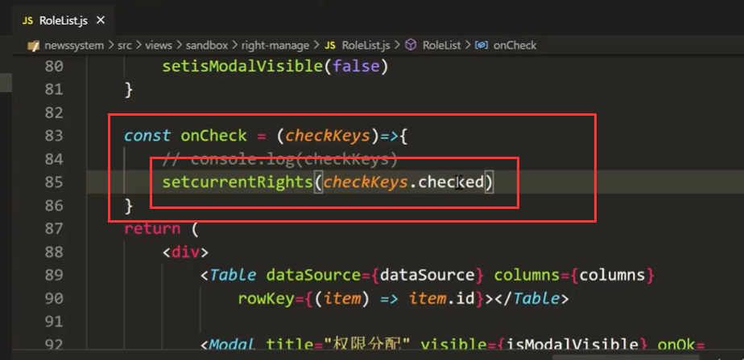

我们取消勾选后--然后获取到的值就是现在选中的值，取消勾选的被去掉了

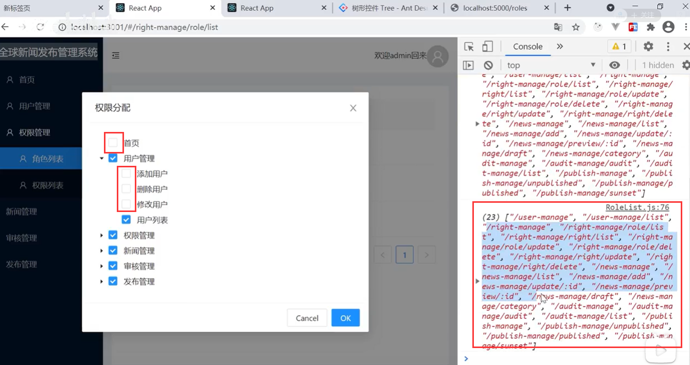

点击ok后先隐藏modal框

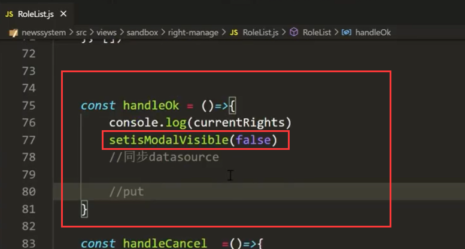

设置一下点击编辑按钮时的元素id变量--用于后续我们知道修改的是谁的权限--当前权限属于谁

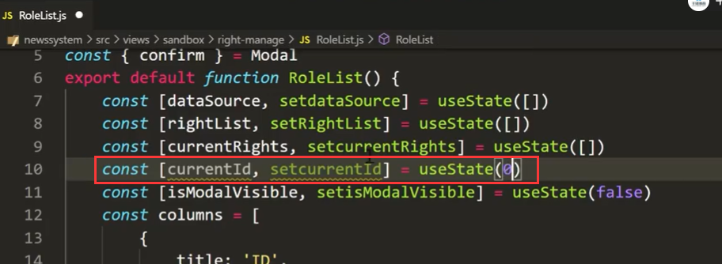

在按钮上同步一下id的值

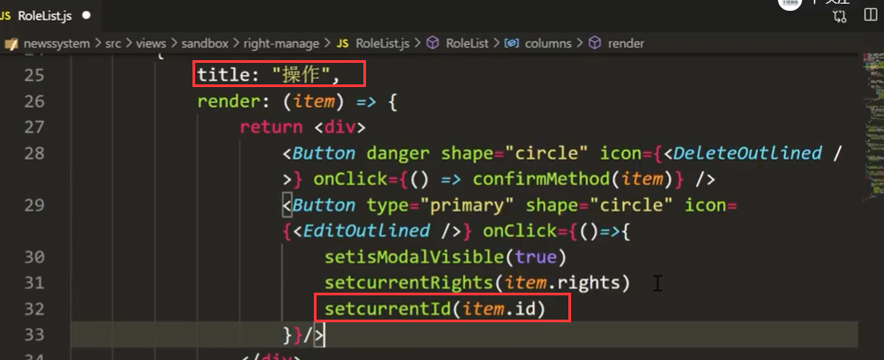

同步设置dataSource数据：

​		我们循环dataSource然后根据元素的id进行判断--如果与点击的按钮一致，然后return 展开item，将当前currentRights权限赋值给rights

​		如果是不相等的情况下-就原膜原样的返回item

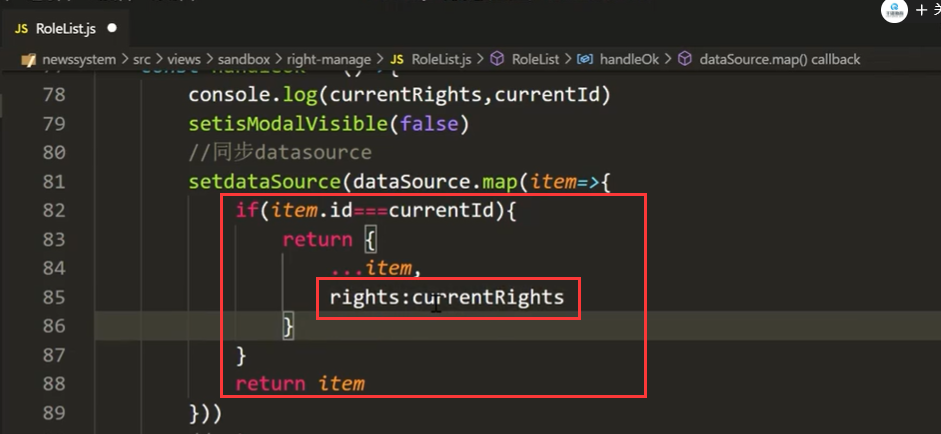

页面效果：点击ok后可以选中和取消，重新点开后也生效了

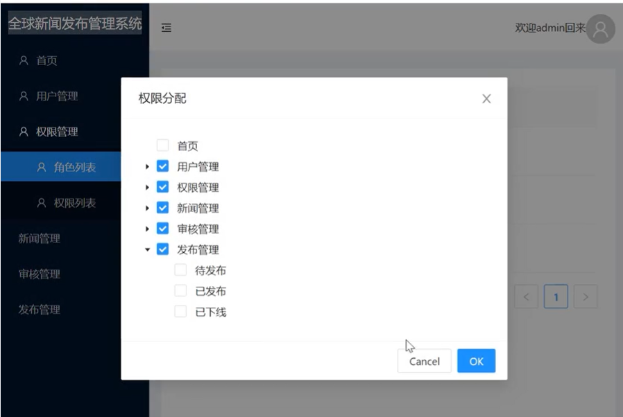

在我们刷新页面之后又被打回原形了，因为我们没有同步后台的数据

同步后端数据：

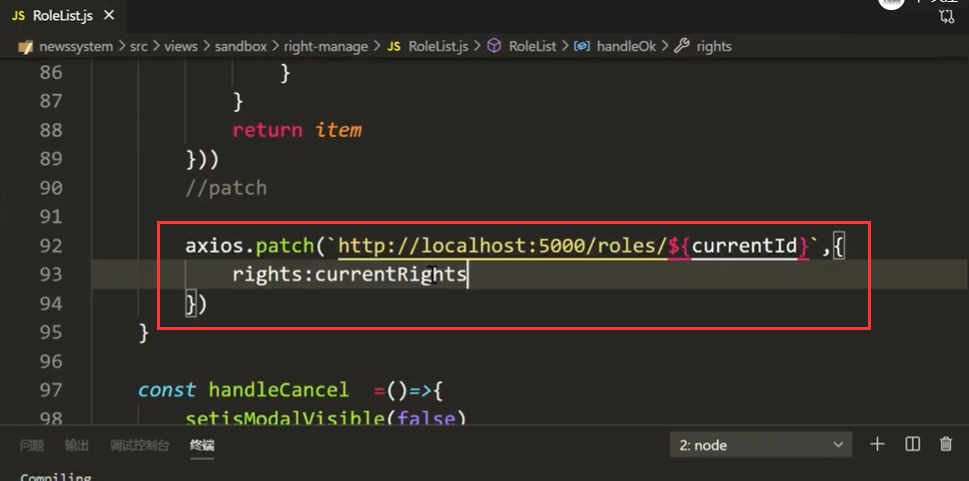

现在就完全搞定了后端的数据也发生改变了

比如home权限被去掉了

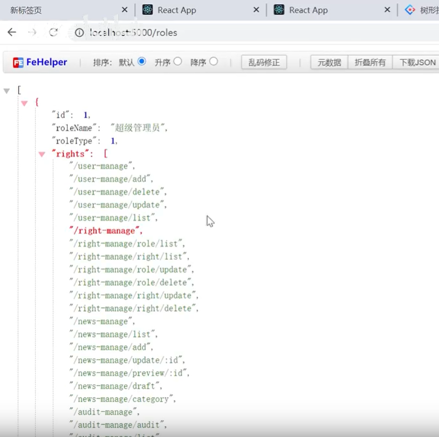

