# 22.用户列表-引入

之前我们把 权限列表 和 角色列表已经搞定了，现在差的是 用户列表


​		我们的目标是 我们得有用户列表 用户拥有 一些角色，角色拥有一些权限，从而完成整体的侧边栏权限的控制

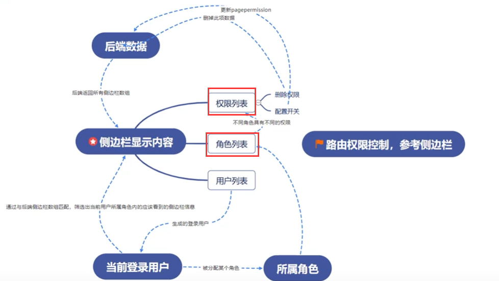


目前的用户列表

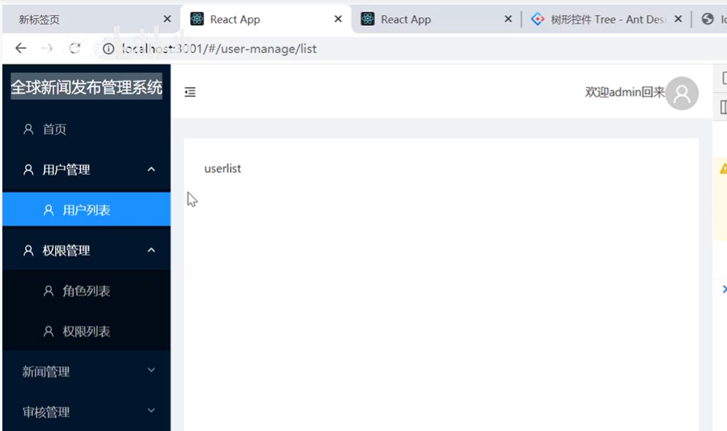


需要实现的原型是这样的

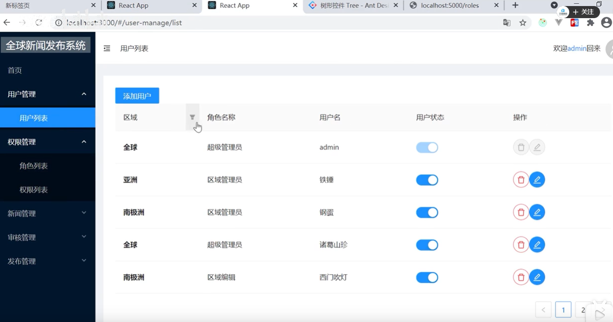


查看一下后端用户列表的接口数据

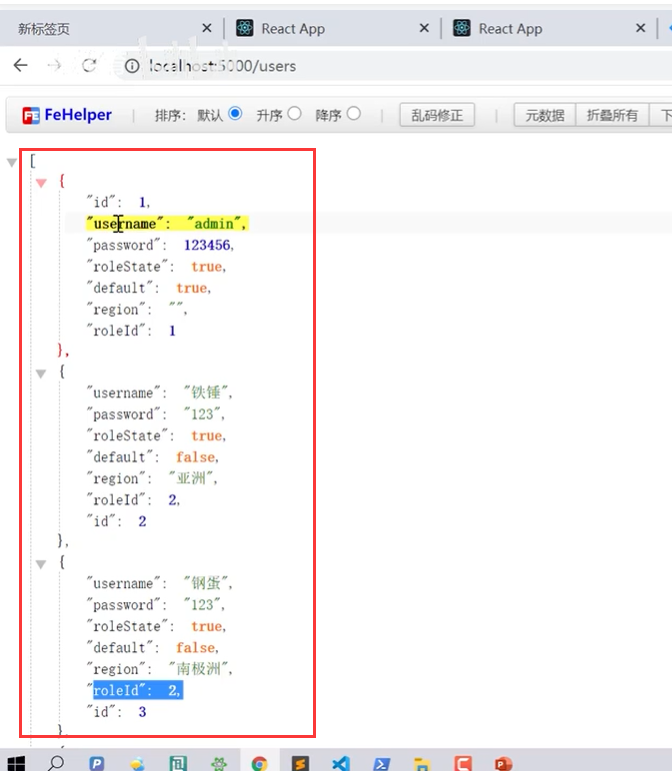


先设置Table表格

```js
import React, { useState, useEffect } from 'react'
import { Button, Table,Modal, Switch} from 'antd'
import axios from 'axios'
import { DeleteOutlined, EditOutlined, ExclamationCircleOutlined } from '@ant-design/icons'
const { confirm } = Modal
export default function UserList() {
    const [dataSource, setdataSource] = useState([])

    useEffect(() => {
        axios.get("http://localhost:5000/users?_expand=role").then(res => {
            const list = res.data
            setdataSource(list)
        })
    }, [])

    const columns = [
        {
            title: '区域',
            dataIndex: 'region',
            render: (region) => {
                return <b>{region===""?'全球':region}</b>
            }
        },
        {
            title: '角色名称',
            dataIndex: 'role',
            render:(role)=>{
                return role?.roleName
            }
        },
        {
            title: "用户名",
            dataIndex: 'username'
        },
        {
            title: "用户状态",
            dataIndex: 'roleState',
            render:(roleState,item)=>{
                return <Switch checked={roleState}  disabled={item.default}></Switch>
            }
        },
        {
            title: "操作",
            render: (item) => {
                return <div>
                    <Button danger shape="circle" icon={<DeleteOutlined />} onClick={() => confirmMethod(item)} disabled={item.default}/>
                    
                    <Button type="primary" shape="circle" icon={<EditOutlined />} disabled={item.default}/>
                </div>
            }
        }
    ];

    const confirmMethod = (item) => {
        confirm({
            title: '你确定要删除?',
            icon: <ExclamationCircleOutlined />,
            // content: 'Some descriptions',
            onOk() {
                //   console.log('OK');
                deleteMethod(item)
            },
            onCancel() {
                //   console.log('Cancel');
            },
        });

    }
    //删除
    const deleteMethod = (item) => {
        // console.log(item)
        // 当前页面同步状态 + 后端同步
       
    }

    return (
        <div>
            <Table dataSource={dataSource} columns={columns}
                pagination={{
                    pageSize: 5
                }} 
                rowKey={item=>item.id}
                />
        </div>
    )
}

```


页面查看效果：

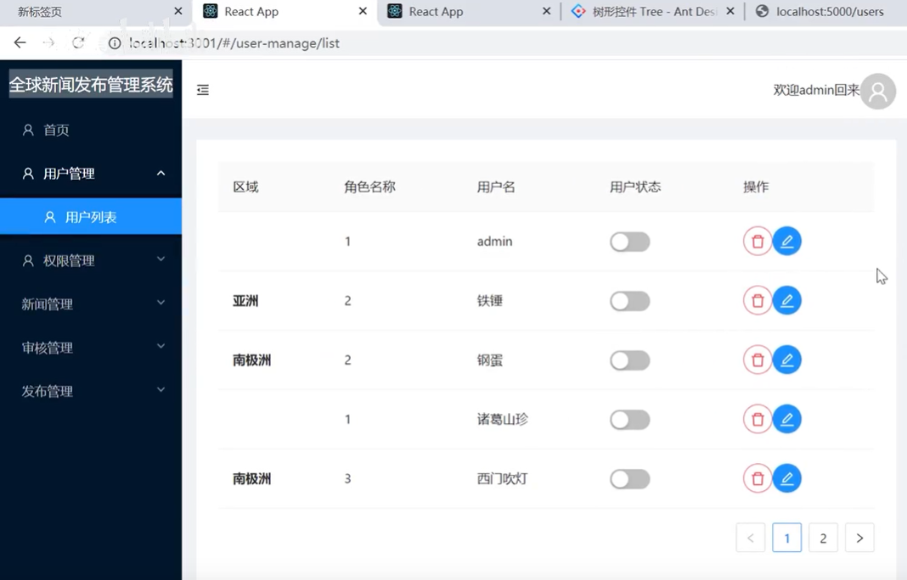


如果region区域是空的话就是全球区域-如果不为空就显示实际返回的区域

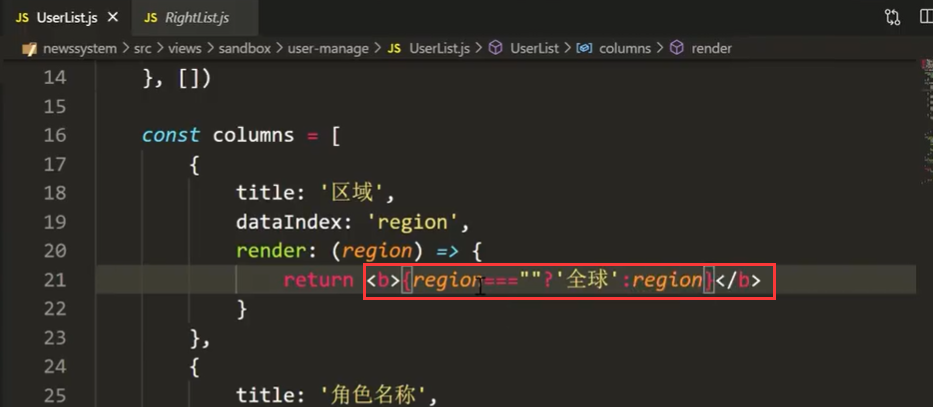


在取数据的时候应该关联role查询-否则显示的为roleId是不对的

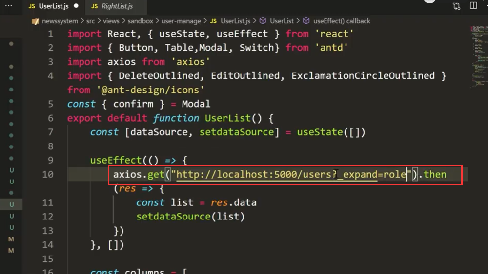


然后列也需要修改一下--使用的是roleName

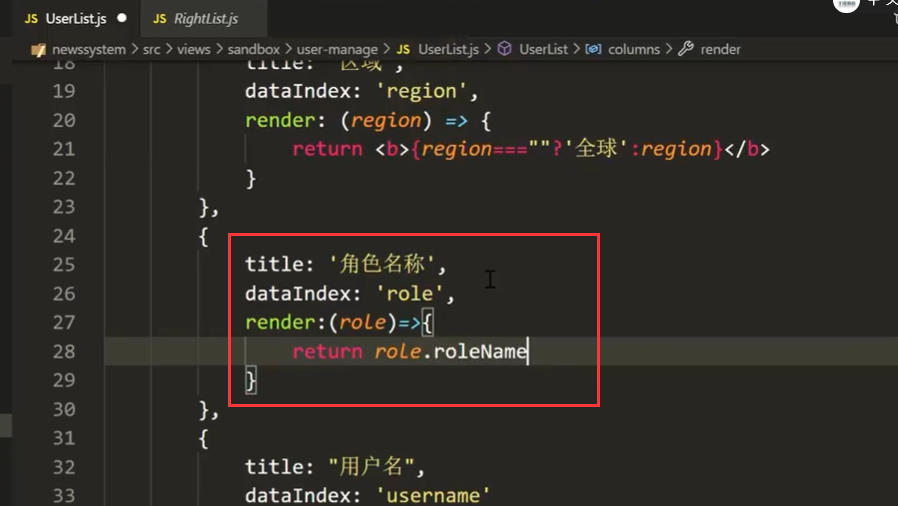


页面查看效果：区域和角色名称目前显示是没有问题的

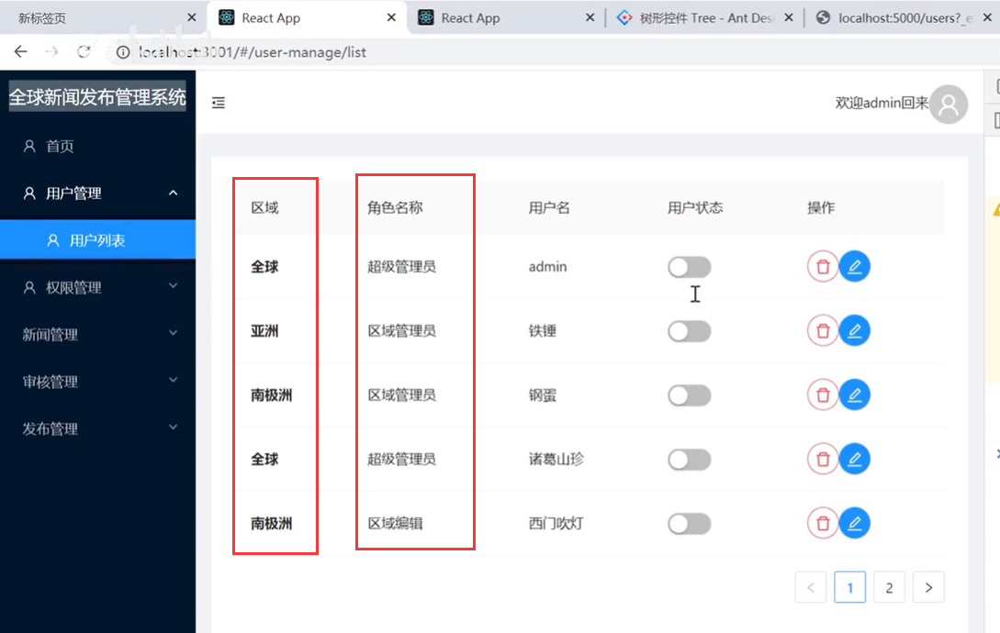


现在给用户状态的开关设置值，如果传的是true就是打开--如果是false就是关闭

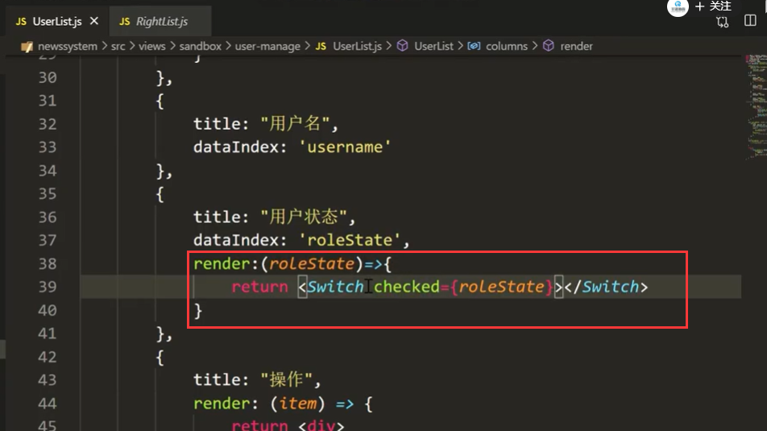


列中形参也是可以传入多个值的--我们再传入一下item代表整个对象，然后根据default属性来判断是否禁用

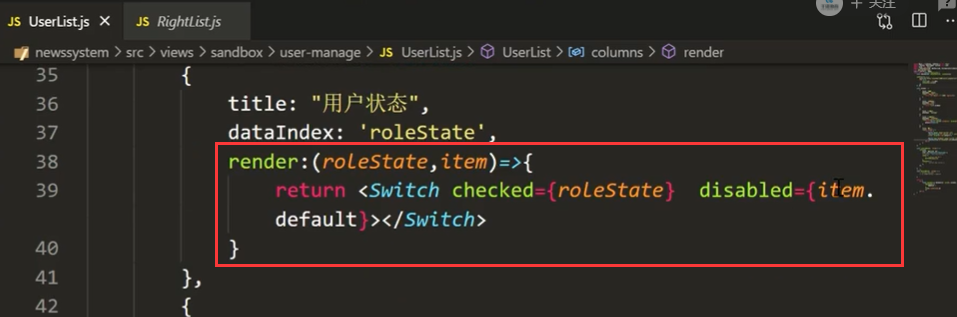


我们看一下这个效果--禁用标签ok了

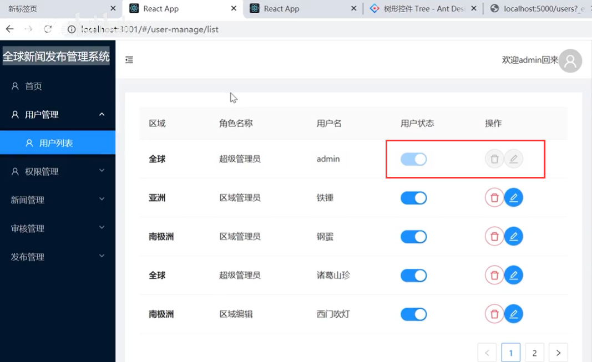


