# 23.用户列表-表单组件

现在我们需要在用户列表上面新增一个按钮---创建用户

​		点击这个按钮需要一个modal弹出框，里面的内容是个form表单

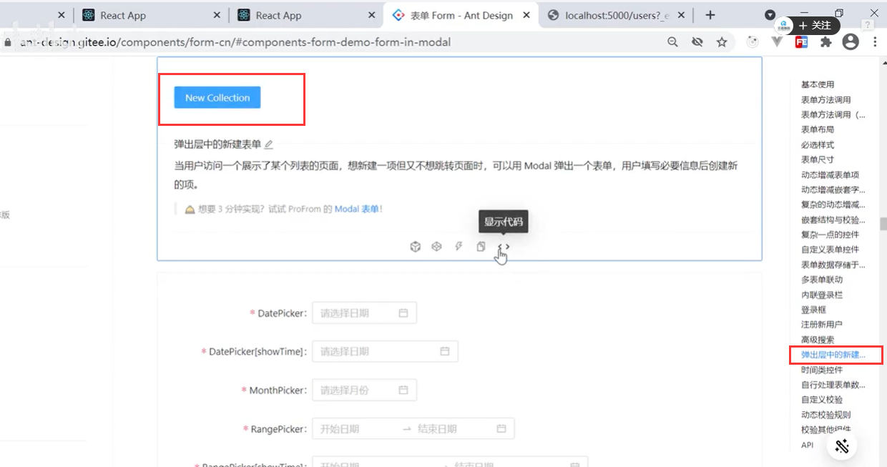

点击添加用户按钮--将modal的显示属性设置为true,然后就可以打开motal框了

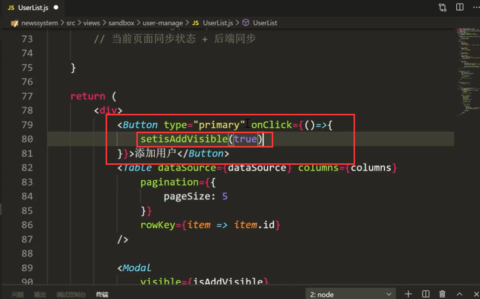

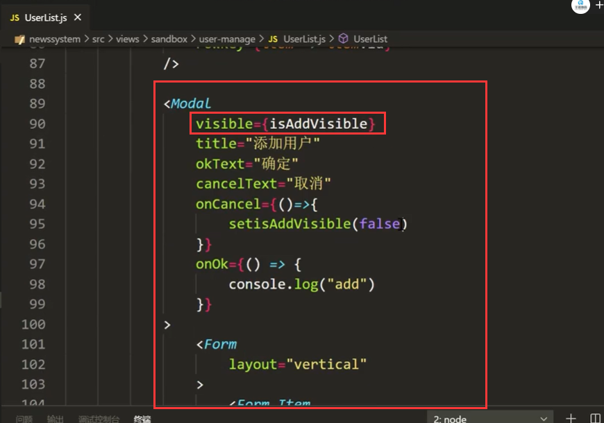 

页面查看效果：发现label是上下的，如果你想是左右结构的，将layout=vertical注释掉

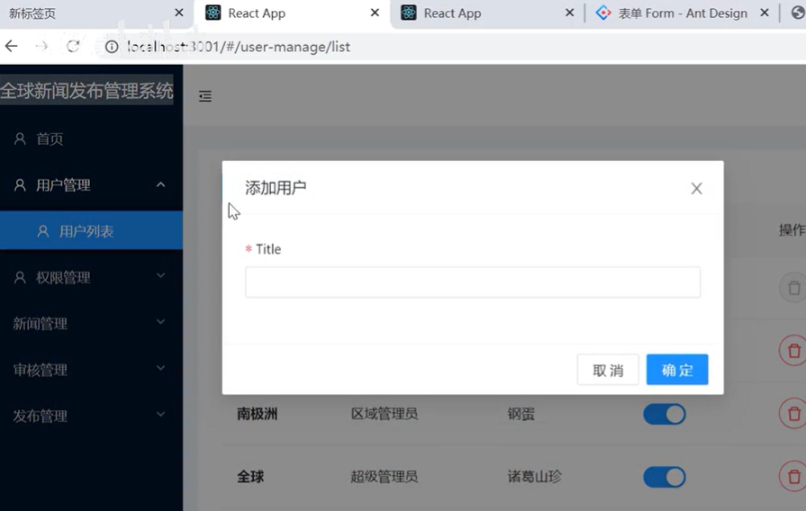

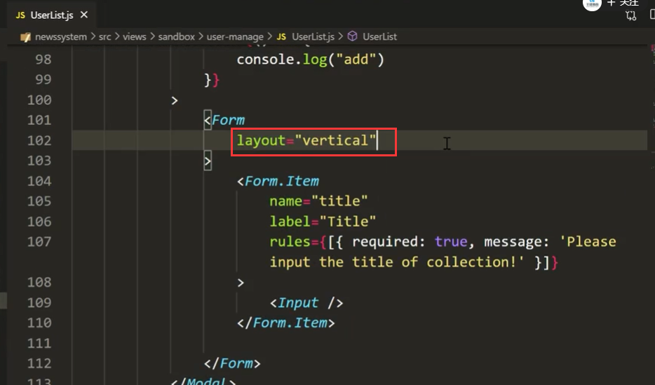

如果注释掉，就排成一行了

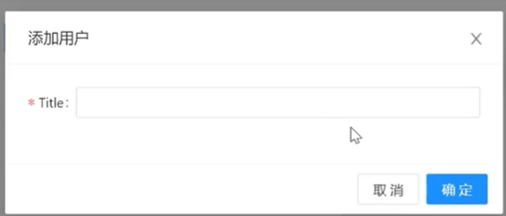

rules是一些校验规则--

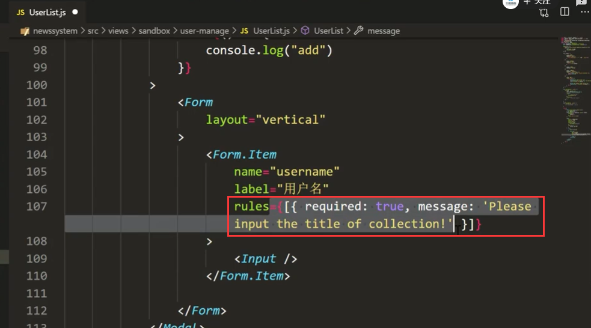

比如required : true 就是必填项 

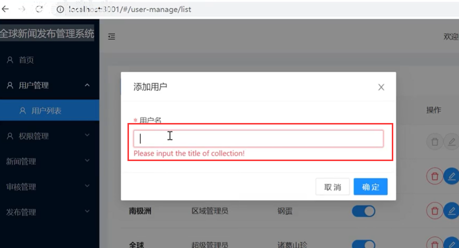

我们需要获取 region区域的列表数据-用于select框显示---还需要获取角色的List用于-选择权限的select

​		定义这2个变量 都是空数组

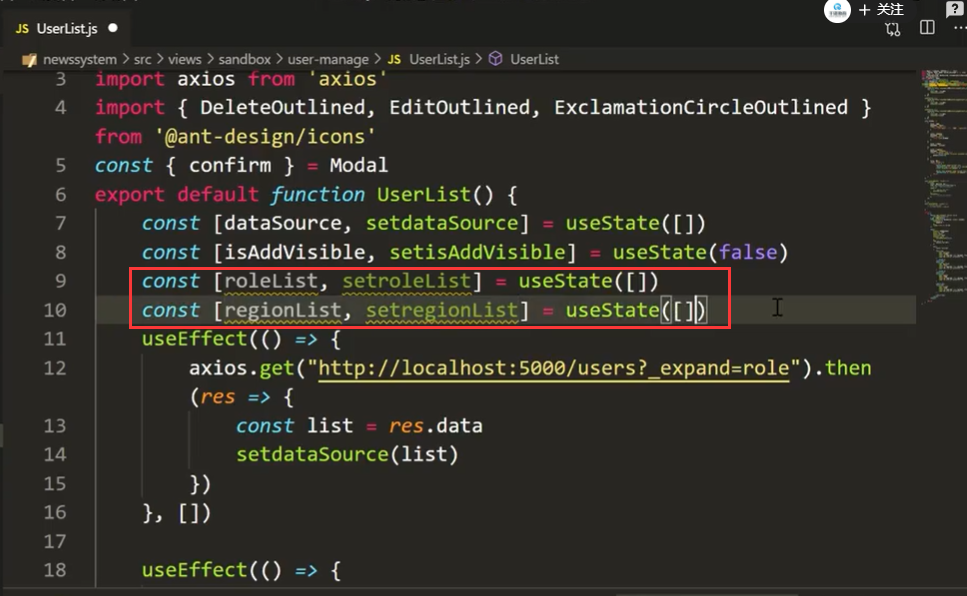

发起请求获取数据

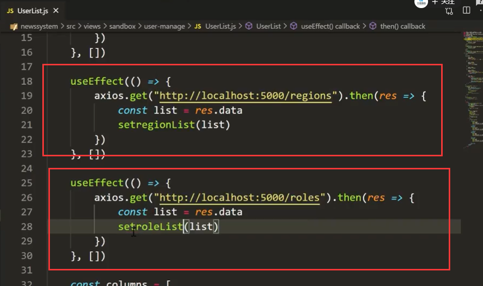

使用Select组件和select结构出来的Option组件，然后进行动态展示Region区域

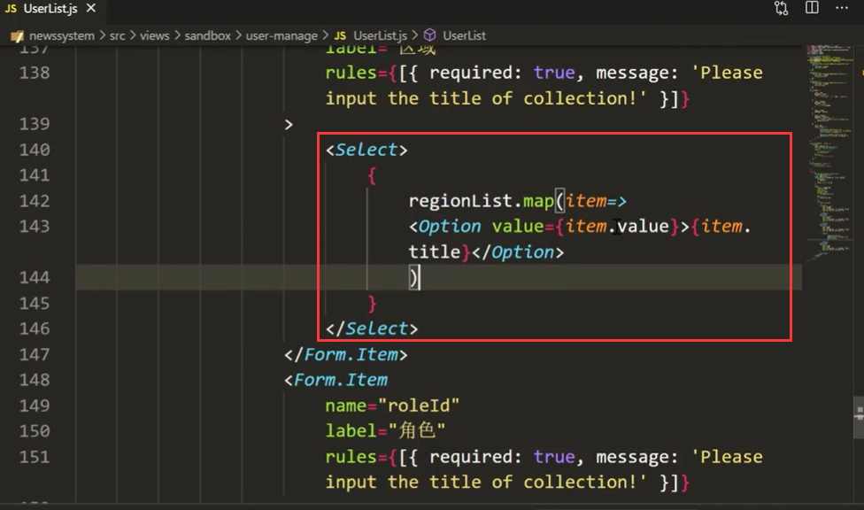

注意：Select中的Option需要加入key

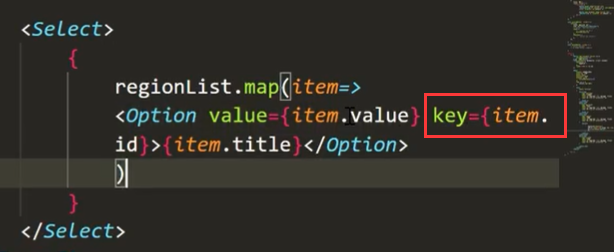

现在我们看一下页面效果--select好使了

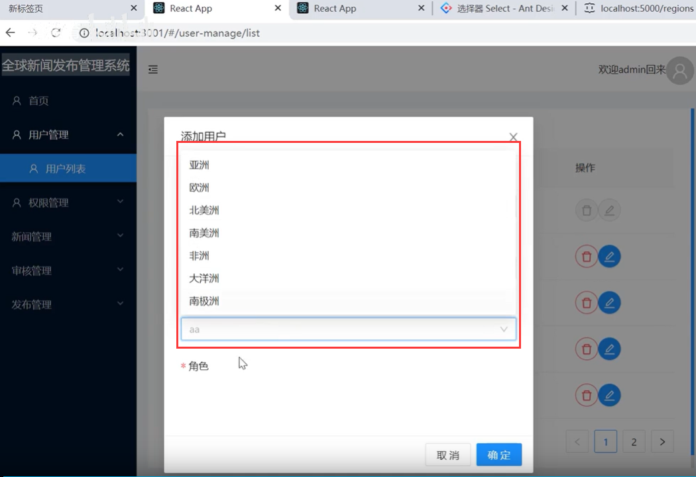

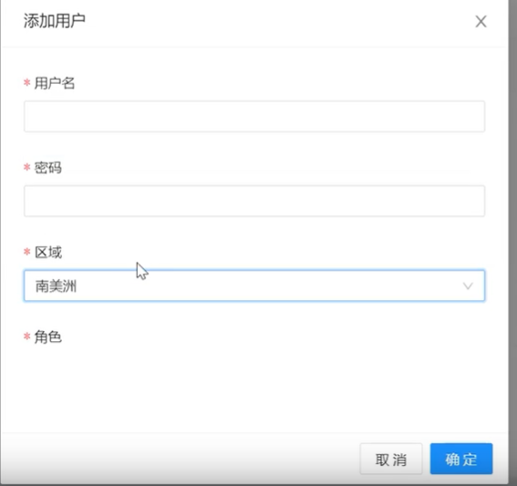

角色的下拉选择也是一样的

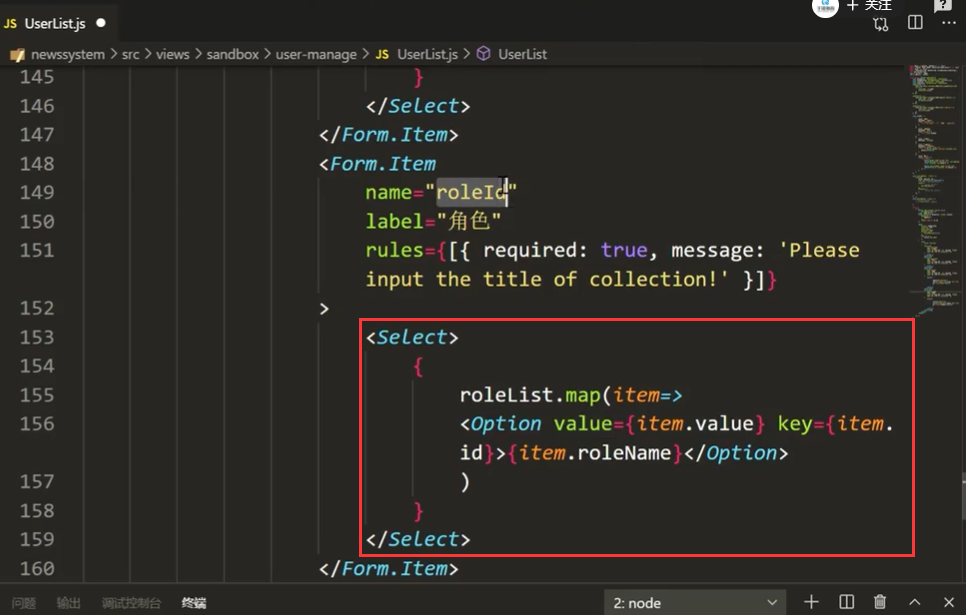

因为我们后续要把id传入后台--所以value应该传入id，显示应该是roleName

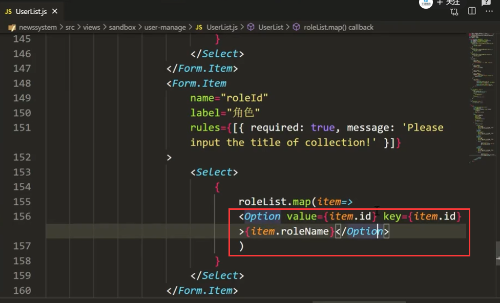

