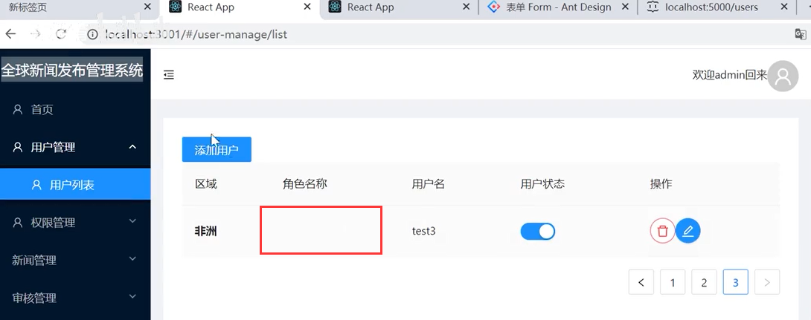
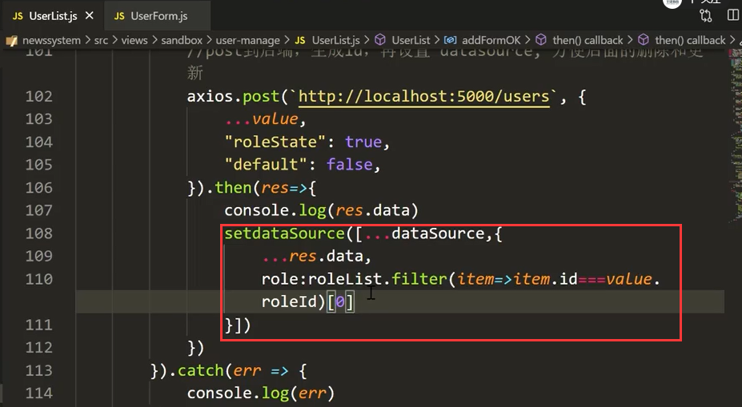
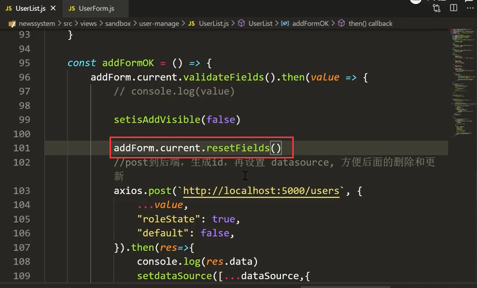
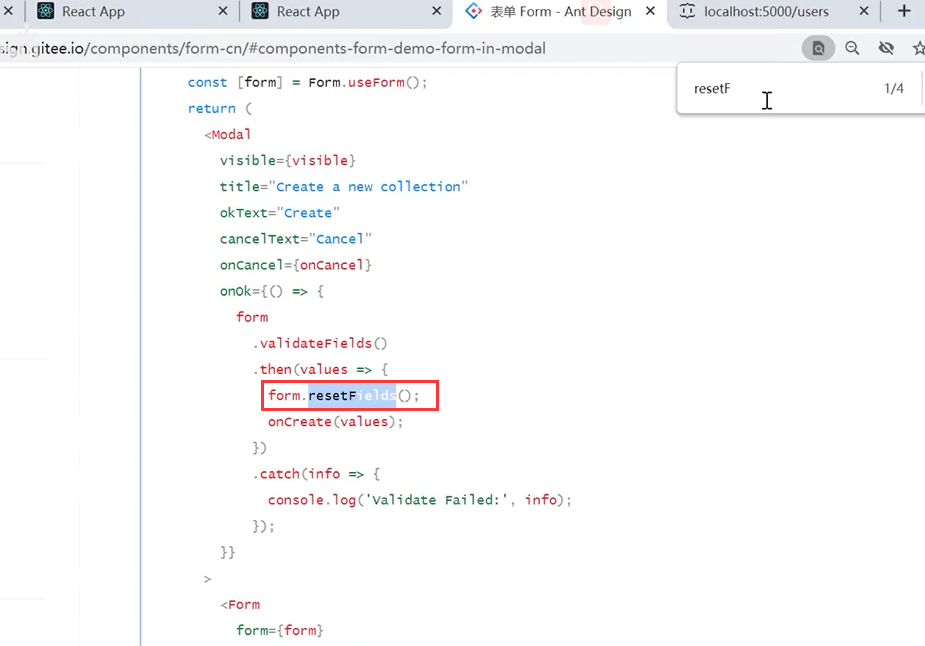
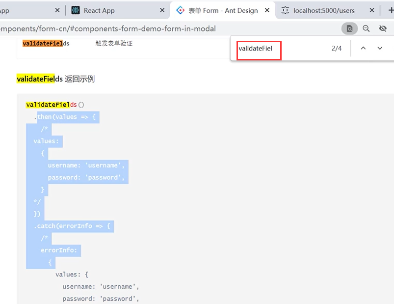
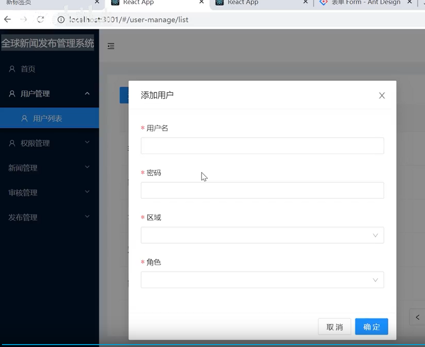
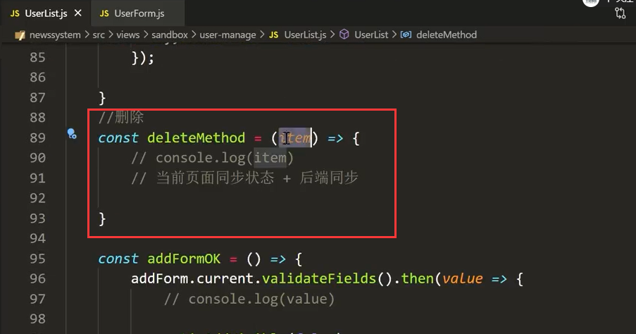
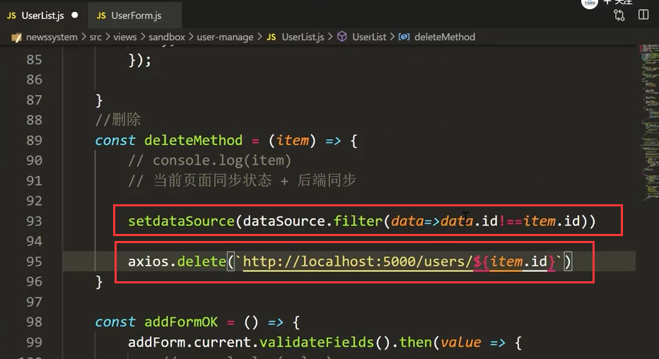
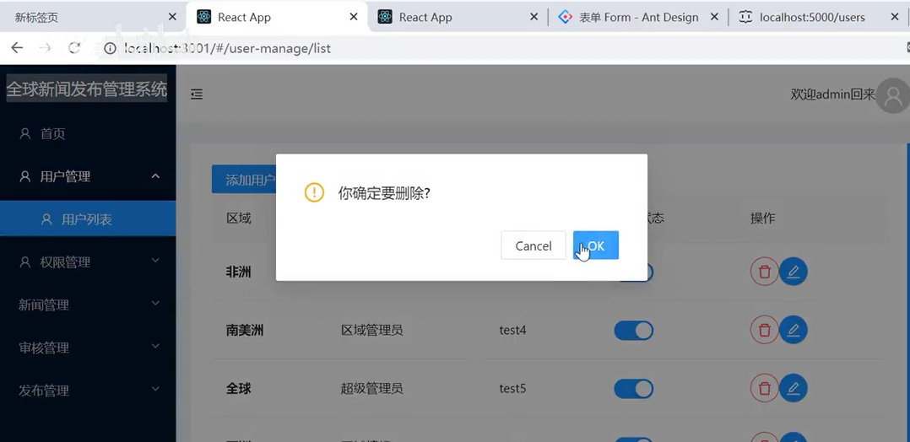

# 25.用户列表-删除用户

#### 1、添加用于遗留问题处理

#### 1.1 先解决刷新页面才显示新增用户的地域的问题

​	

​	原因是：因为我们创建完的数据 然后接口返回给我们的值里面，其实是没有关联查询角色内容的，所以就没显示，在我们重新刷新页面的时候，他又去管理查询所以就显示出来了--其实这个问题应该是后端来处理，后端直接给我们进行关联的数据返回，我们现在使用的是JsonServer 他现在满足不了这一点

如果是前端来处理的话：

​			我们将res.data先展开，然后添加role，role的内容是通过roleList中进行过滤 我们value中的roleId与roleList的roleId相同的时候我们取他的0个作为role的值

现在显示区域完全没有问题了

#### 1.2 每次添加用户的时候清除上次添加的内容

​		我们使用resetFieldValue这个方法进行重置表单字段值

​	我们在文档中查阅一下都有什么方法

重置filed查看效果：清除掉了上次填写的内容没有问题

#### 2、删除用户

我们先设置同步数据状态  将列表数据过滤，过滤掉要删除的id的内容，保留其他进行更新渲染

​		然后发起delete请求--传入删除的id

页面测试：点击ok 删除是没有问题的，可以删除的掉

