# 27.用户列表-筛选功能

比如筛选区域

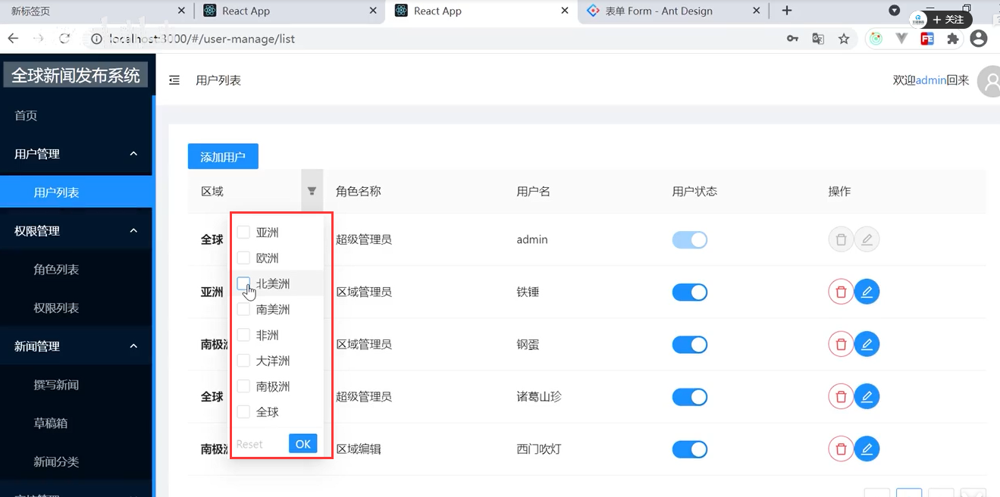

其实这个筛选功能--table组件中就带这个功能的呢

我们查阅一下文档--我们找一下筛选和排序

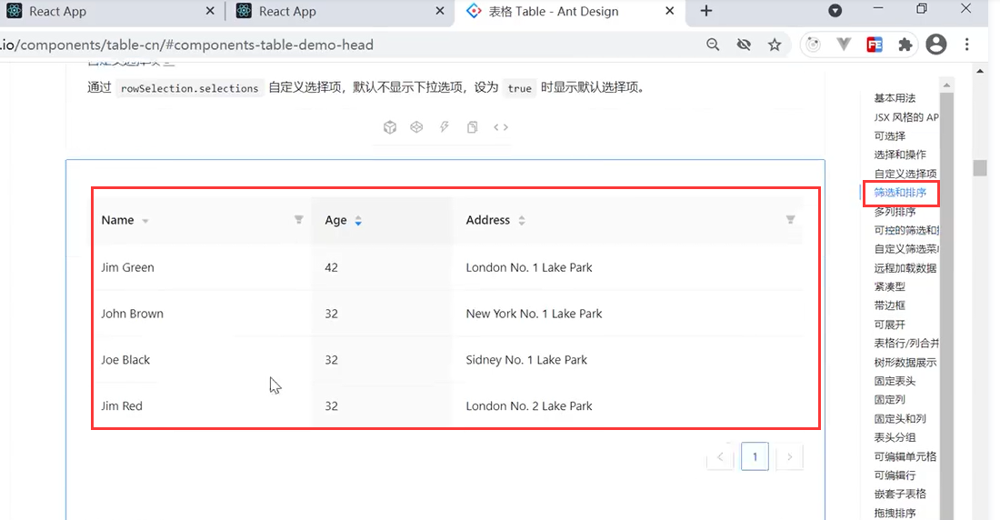

其实就相当于控制这个onFilter这个属性--过滤后满足条件的

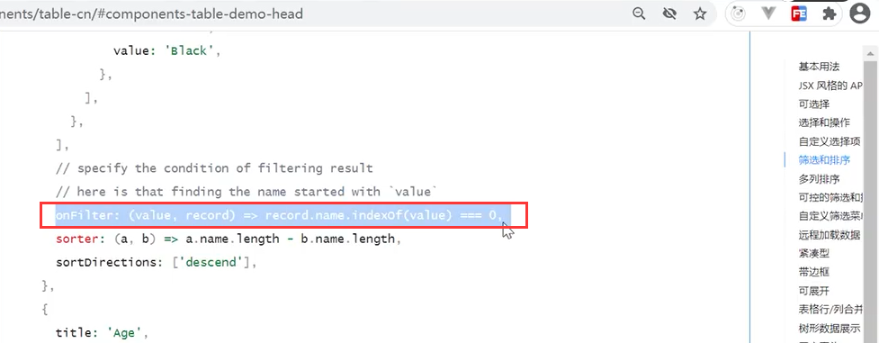

还需要Filters的信息内容--他就是你能够下拉选择支持的那些值数据

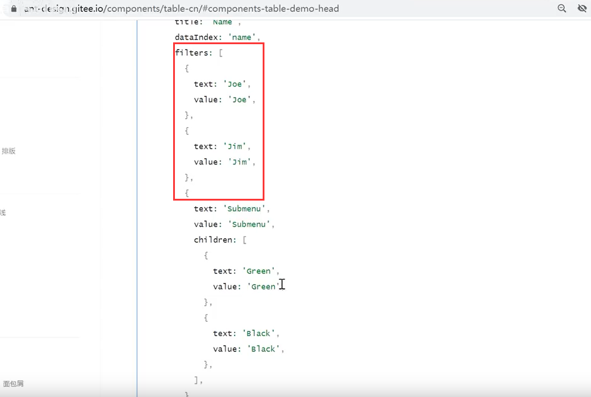

我们的区域需要过滤功能

​		将区域集合遍历--然后设置text和value值，别忘了三个点结构一下

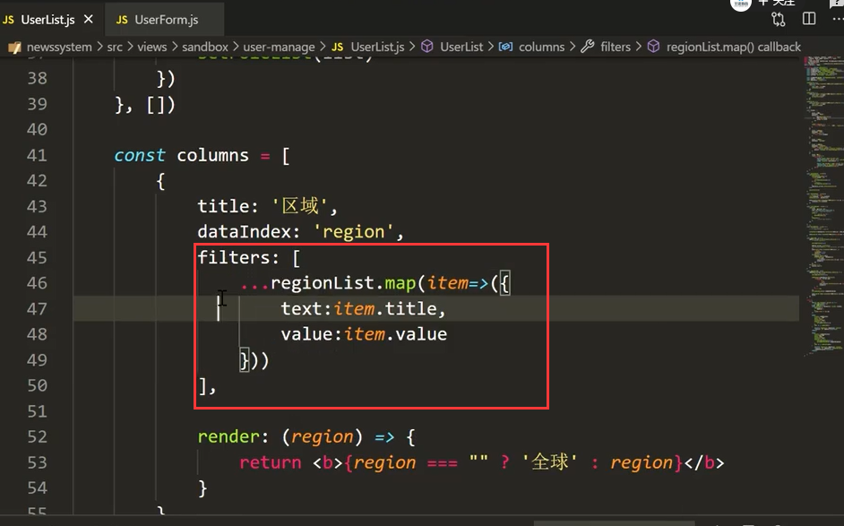

页面查看结构：正是我们想要的--好像没有显示全球

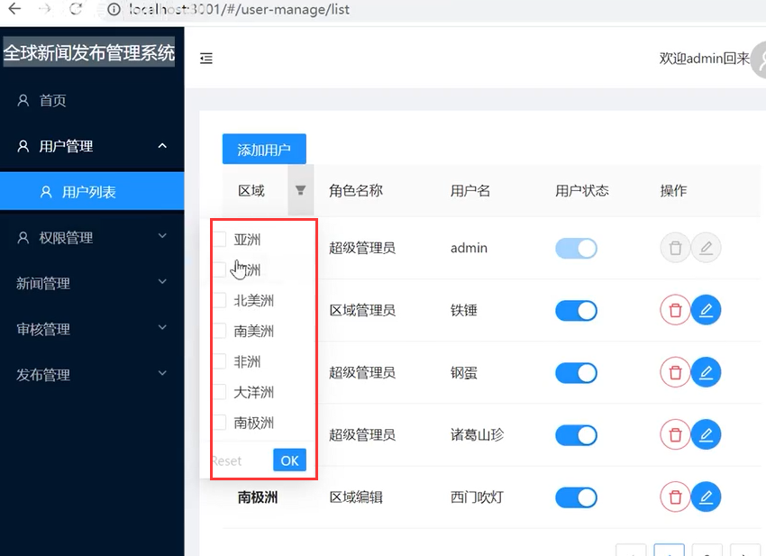

我们加一个全球

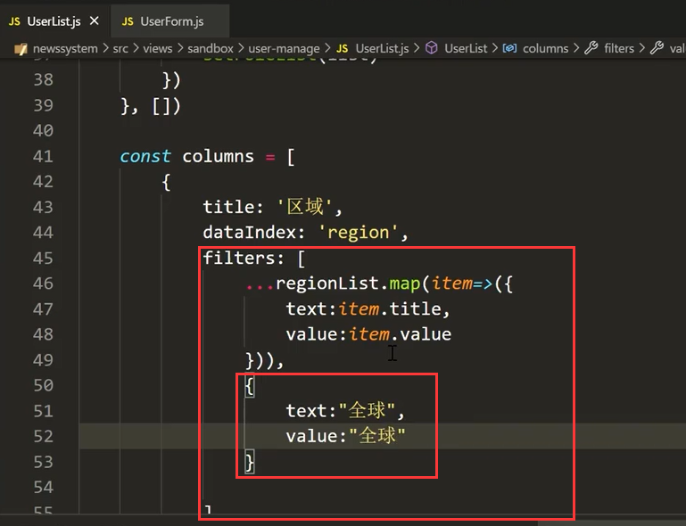

我们现在写onFilter过滤---他的写法是一个会滴函数的写法

​	我们点击勾选一个filter后--value就是这个filter比如亚洲，然后把第二个参数item过滤一遍如果是item.Region===value成立的显示出来

item.Region===value 相当于 value加入勾选 亚洲如果item的Region也是亚洲的话就符合过滤条件，显示了

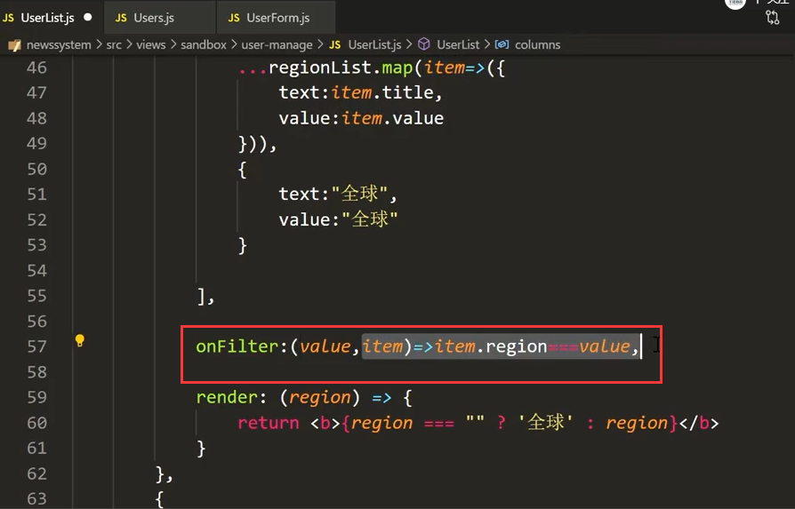

筛选是好使的

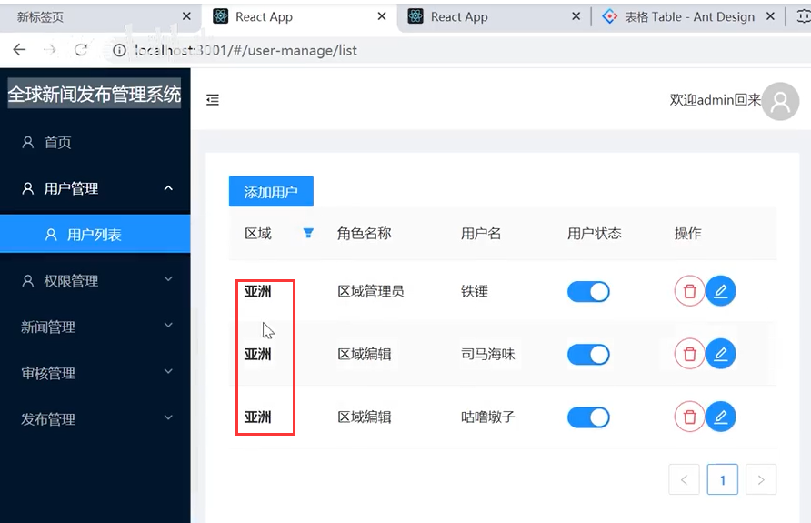

有个小问题--如果筛选全球的时候--发现没有过滤出内容--原因是其实全球的Region其实是个“”

然后我们添加一个判断--如果选择筛选条件是全球的话，那么就匹配地域值为空的

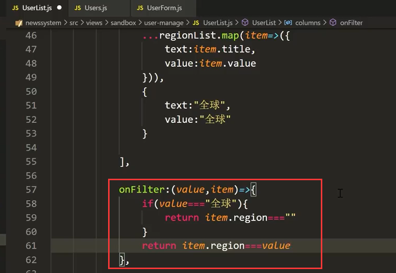

测试一下：没有问题

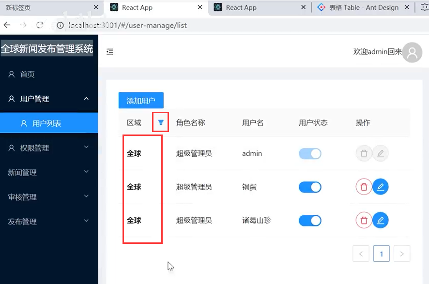

