# 3.项目启动与配置

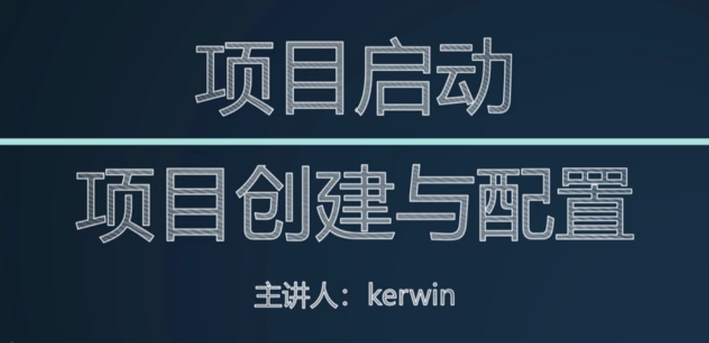

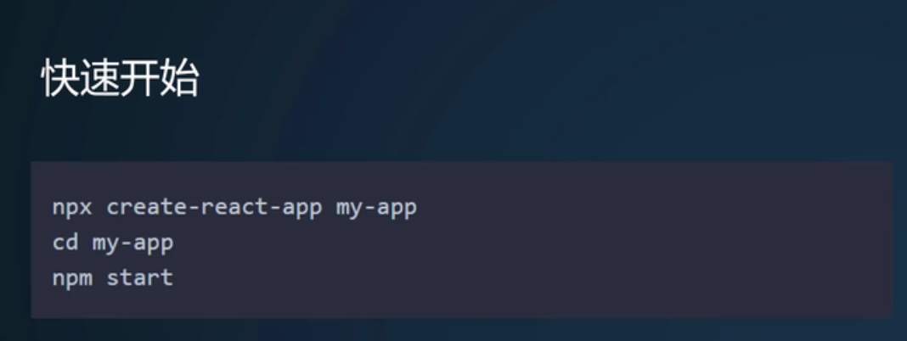

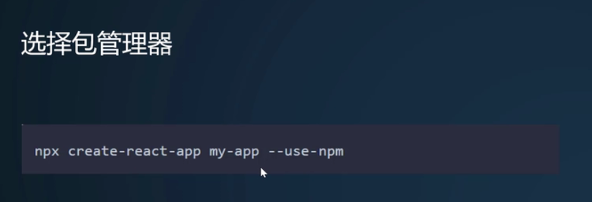

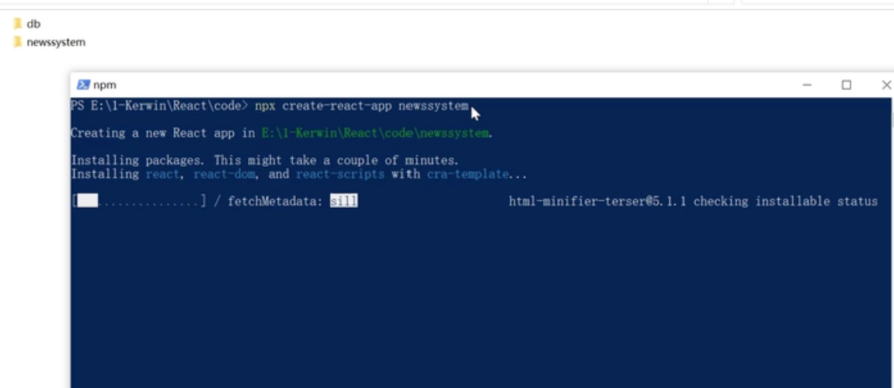

配置反向代理用于以后跨域请求

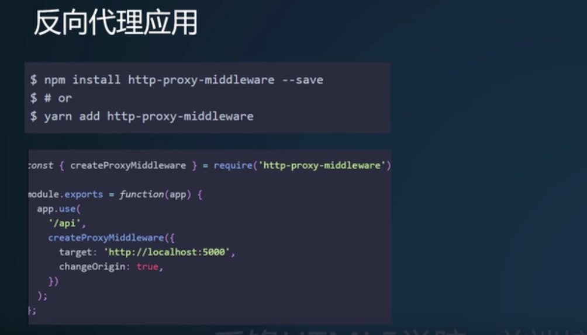

我们在请求不同域名的时候，可以请求回数据吗？跨域问题

我们想测试一下能不能跨域请求--我们使用axios请求--先安装axios

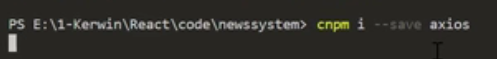

使用axios：

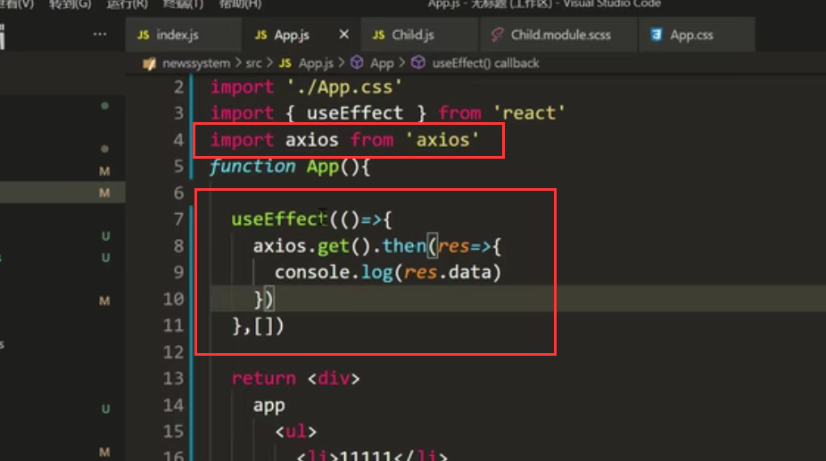

我们找一个接口测试一下：

比如我们随便找个网站-如猫眼，然后我们找个接口请求一下

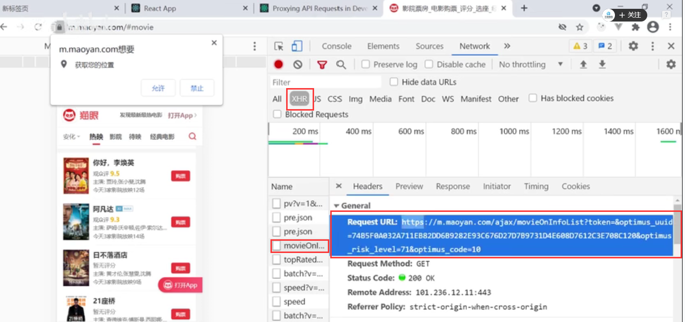

然后测试发起请求：

然后我们在页面查看一下：报错--意思是你违反了浏览器的CORS策略，Access-Control-Allow-Origin不存在，其实这就是跨域了。

​		对于跨域问题：一旦遇到了之后，解决方案无非是要求  后端帮我们加上一些响应字段，或者让后端为我们写好Json 接口，（前2种方案对于猫眼这种接口是不可以实现的），如果后端啥也不做的情况下，我们前端做好反向代理，这种是最好的解决方案

​		我们可以使用我们脚手架中集成的一个模块叫 http-proxy-middleware --他是nodejs的一个中间件，他可以非常轻松的帮你实现跨域的请求问题，因为他自己启动了一台反向代理服务帮你去做跨域的事情

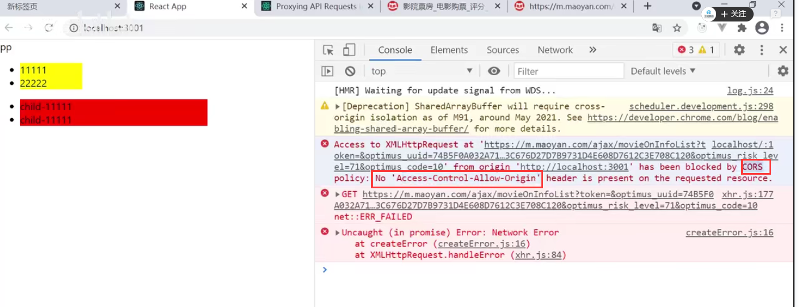

怎么去配置这个 http-proxy-middleware中间件呢，我们打开这个create-app这个脚手架的地址可以查看文档

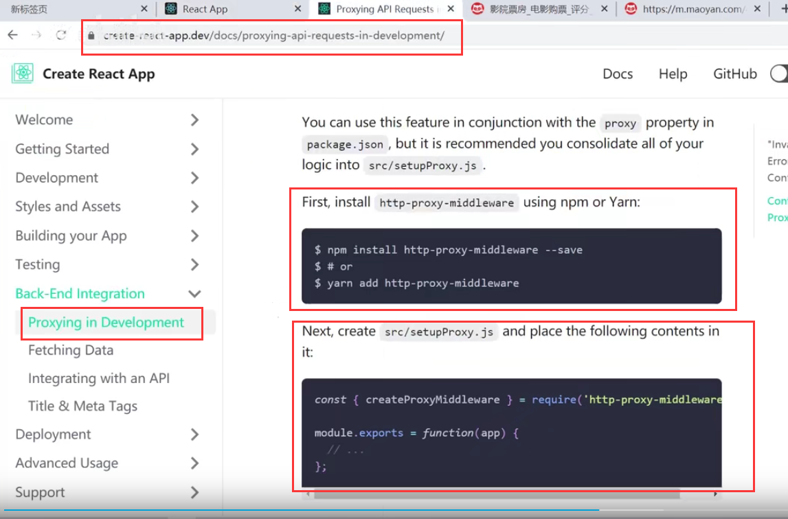

需要在src下创建一个setupProxy.js文件

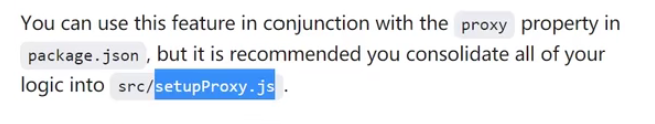

然后需要在这个setupProxy.js文件下配置代理

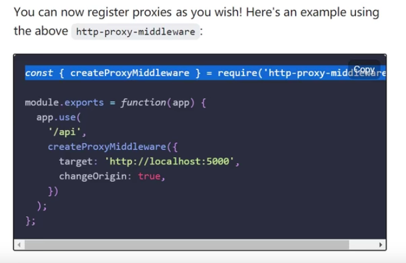

安装中间件http-proxy-middleware模块

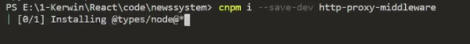

我们代码测试一下：

​		target：就是你访问/api的时候都会帮你代理到 这个地址去取数据

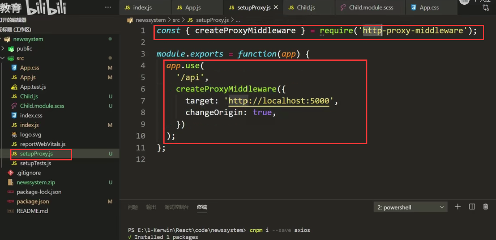

然后我们查看一下之前的请求猫眼的地址：

​		我们分析一下如果使用这个地址肯定是行不通的，我们需要把他的域名去掉

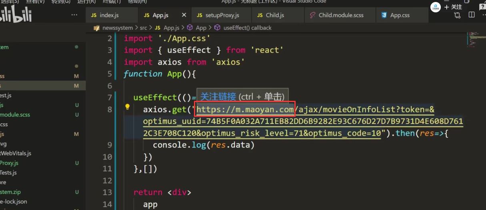

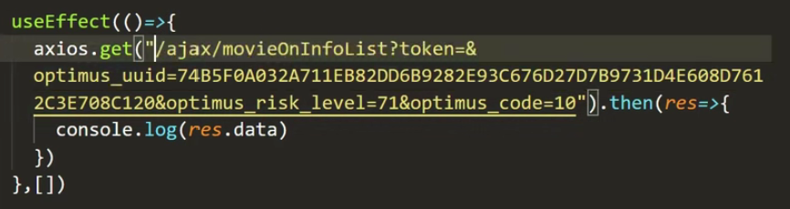

然后我们配置代理：将/ajax的请求拦截 然后 代理到猫眼的服务地址去获取数据

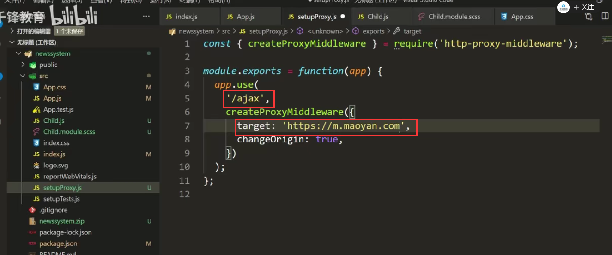

如果有多个跨域的请求就可以设置多个代理：

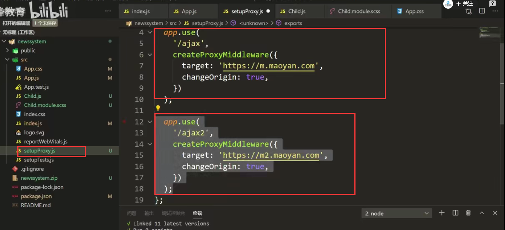

然后我们现在代理配置好了，刷新页面查看一下：

​			结果发现还是报错，如果改动了这个反向代理的服务配置，必须要重新启动项目才可以加载到我们配置的反向代理。

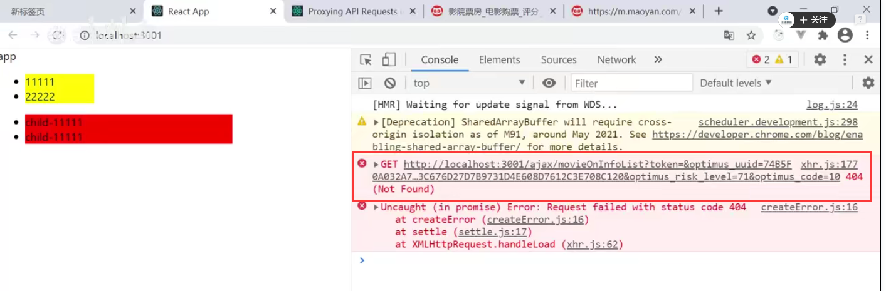

重新启动服务查看：

​		可以看到--我们已经获取到数据了--证明反向代理成功

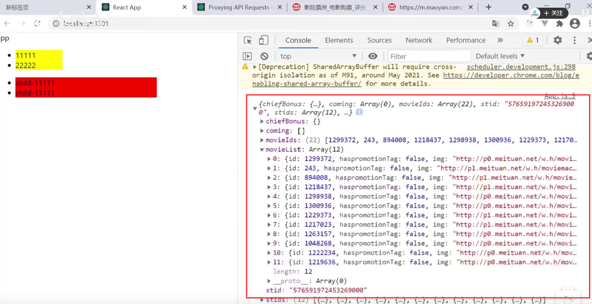

