# 4.项目路由架构

路由架构图：

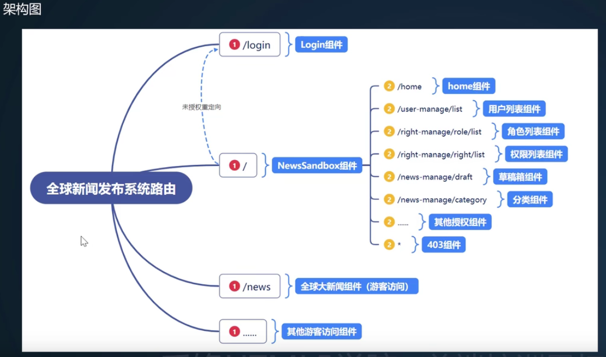

#### 1.路由结构设置

新建路由文件夹--然后创建indexRouter.js路由组件

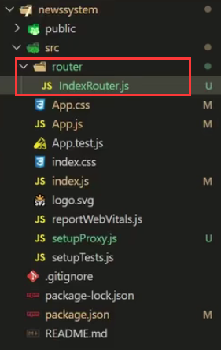

需要依赖react-router-dom这个组件，安装这个组件

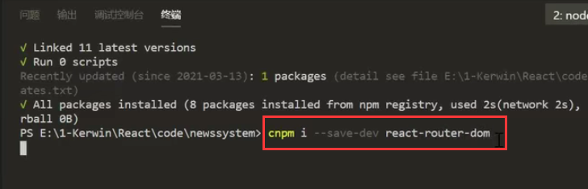

我们使用的是HashRouter-他是带#号的，而BrowserRouter是不带#号的（更像一个真正的路径）

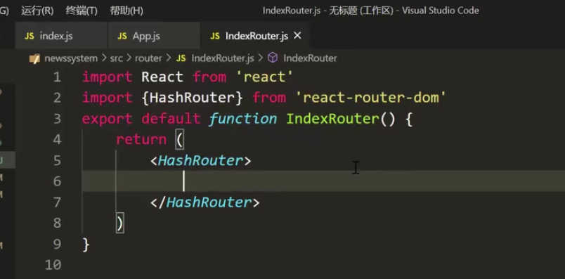

创建我们需要的路由：

​		如果是/login 那么就进入Login这个组件中

​		如果是/** 那么就进入NewSanBox组件中

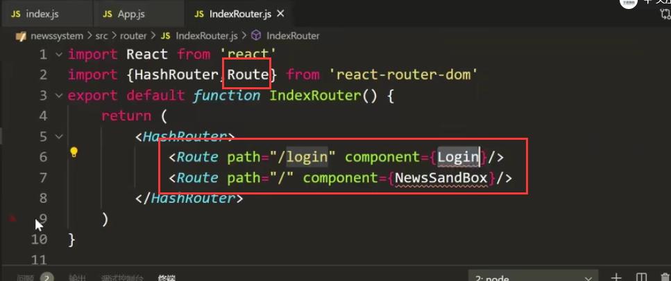

创建view文件夹--里面放和路由相关的组件，创建component文件夹--里面放页面共享的组件

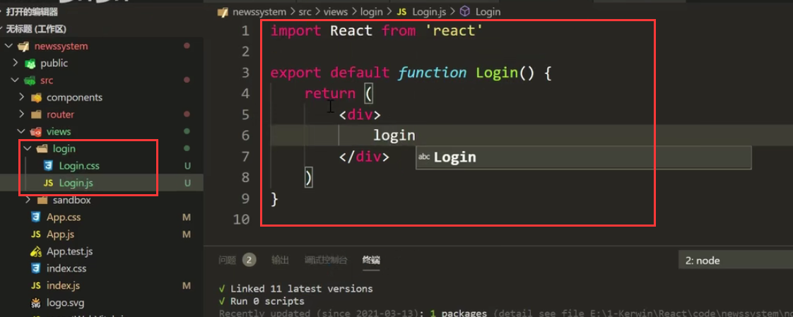

创建沙箱路由组件newSanBox

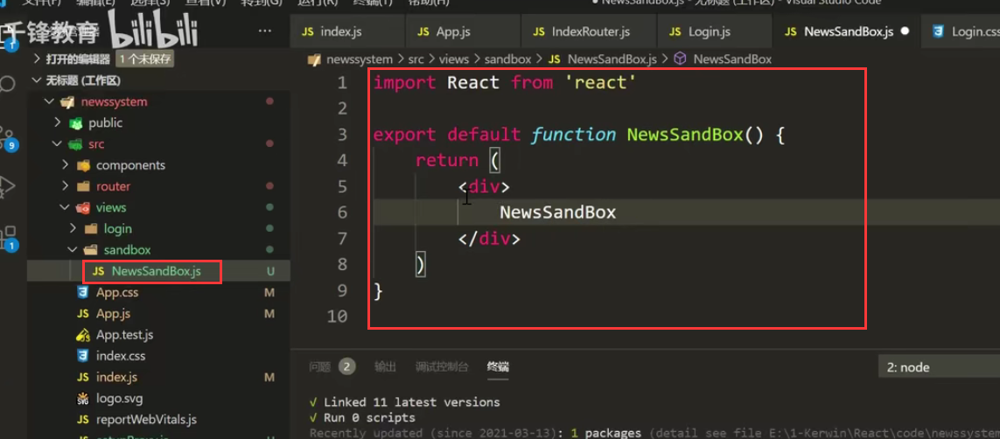

引入刚刚创建的组件：到此我们的路由组件的结构就创建好了

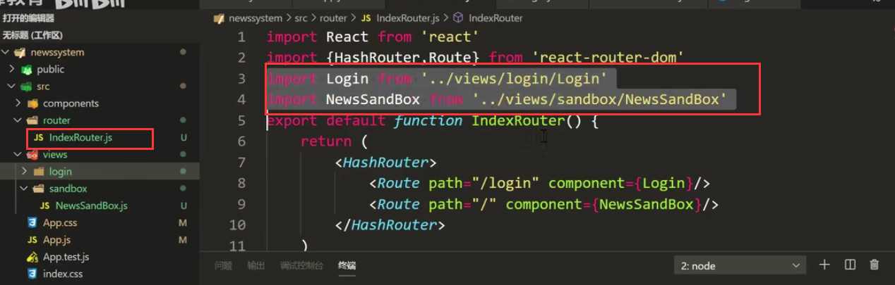

但是目前这个路由并没有和项目融合--我们需要在App.js引入一下

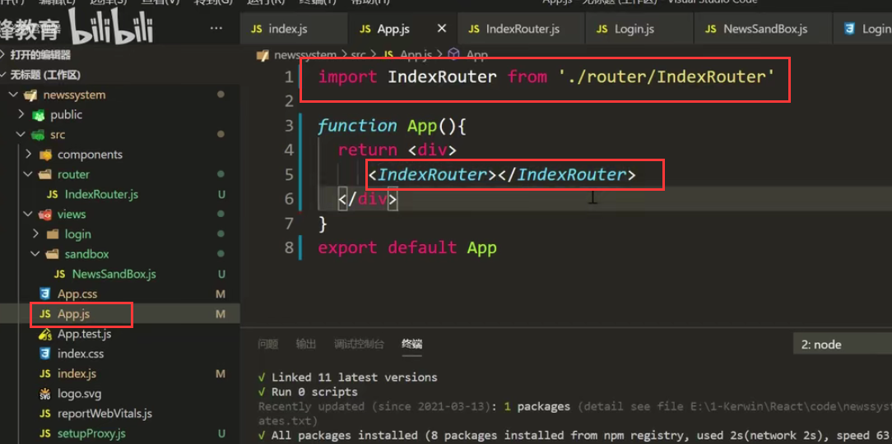

我们现在可以页面测试一下：

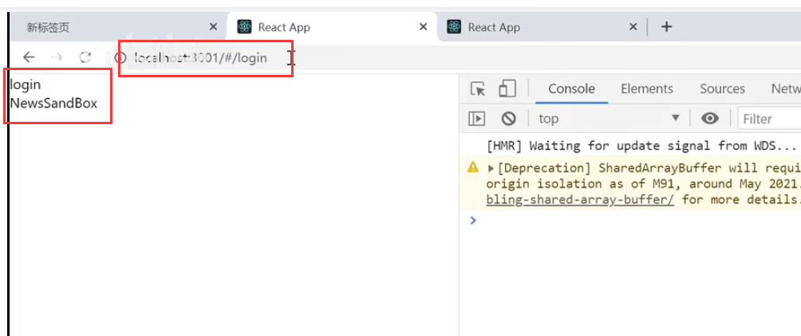

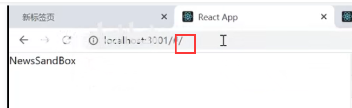

发现和想象的有点不一样，需要的是/的请求是newsSandBox路由--而/login的请求是login路由，并不需要包含newsSandBox路由

​	

因为现在是属于模糊匹配的，我们想要单一匹配，可以通过Switch组件实现

​		他的行为是如果匹配到第一个后，后面就不进行匹配了

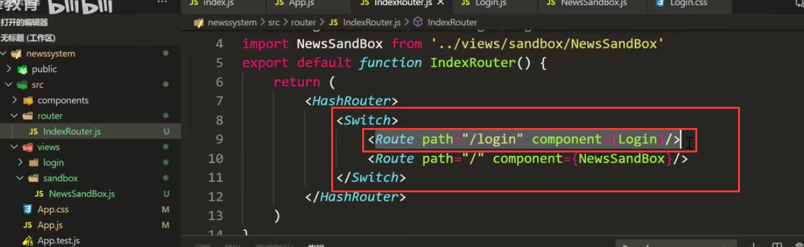

查看效果：现在就可以正确匹配了

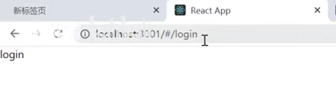

#### 2.重定向路由设置

​		如果访问没有权限的将重定向---就需要我们对路由拦截，而路由拦截需要我们使用三目控制就可以了。

​		我们可以使用另外一种写法使用属性render然后他的回调就是返回的路由组件

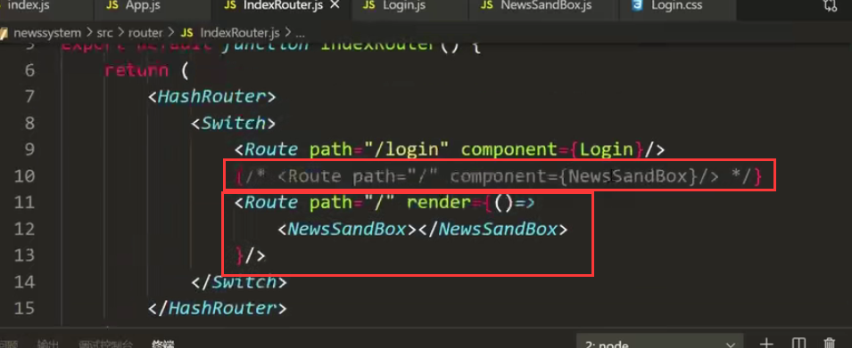

我们现在可以通过localStorage.getItem("token")获取token，看看如果有就说明有权限，没有就重定向到登录组件

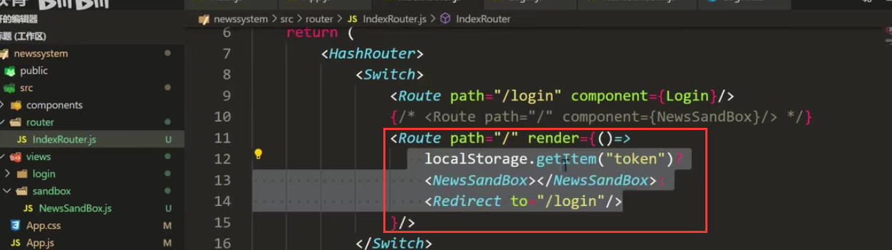

查看页面效果：我们使用路径/请求，但是给重定向到/login了，说明是好使的

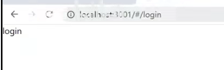

比如我们设置一个假的token

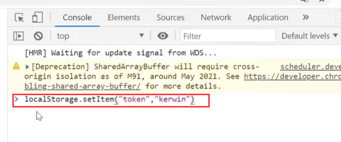

然后我们重新测试：这样就可以走到SandBox这个路由组件中了

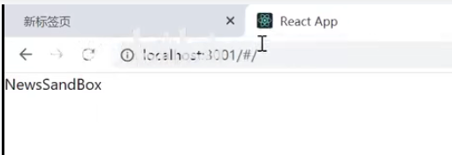

