# 5.项目路由搭建-2

如果我们走/的路由组件，其实就是/home，我们发现--左侧菜单栏是固定的，顶部导航栏是固定的，我们在点击菜单的时候变动的是导航栏下面的内容

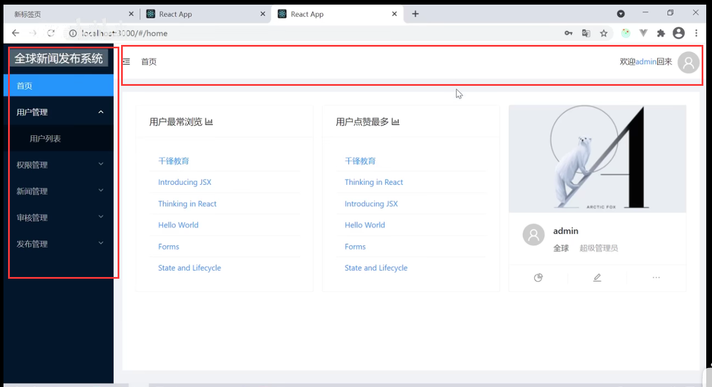

然后我们在NewsSandBox.js路由组件中，设置需要侧边菜单的组件和 顶部导航的组件

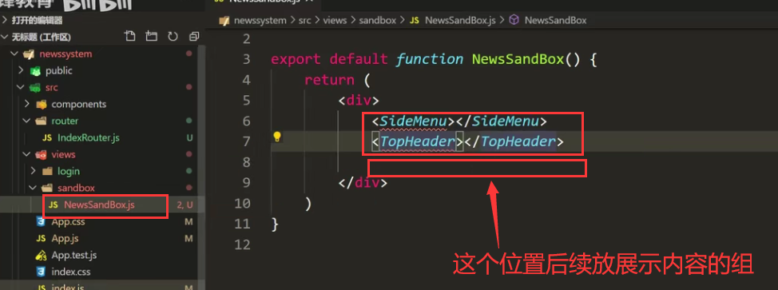

然后我们创建SideMenu组件和TopHeader组件，放在components公共组件文件夹中

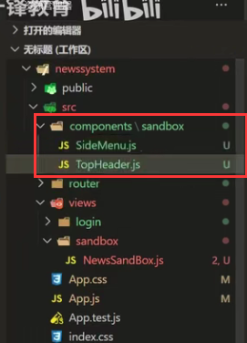

然后引入组件，页面测试查看效果

​		然后发现menu组件也加载了，导航栏组件也加载了，正确

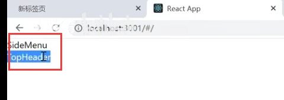

然后固定的结构我们都创建对应的组件了，那么显示的内容是根据菜单的变化而变化的，也就是需要一个二级的路由功能，想到路由我们先加上Switch组件-匹配到对应路由后就不继续往下匹配了

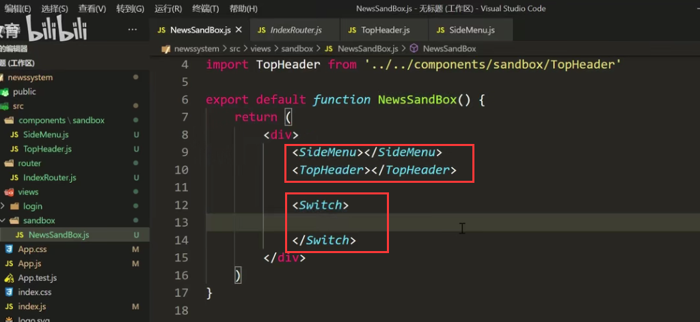

然后我们设定对应的路由和进入对应的组件：

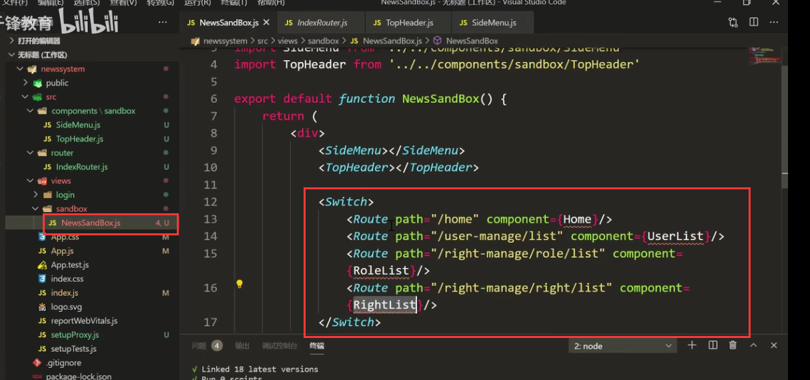

现在我们把Home，UserList，RoleList，RightList这些组件创建一下，放在sandbox这个文件夹下，因为他们属于路由相关的组件

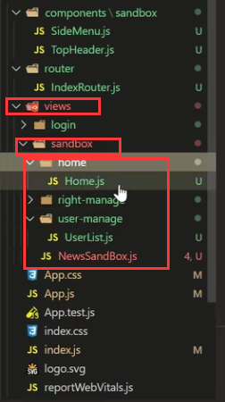

页面测试一下效果：

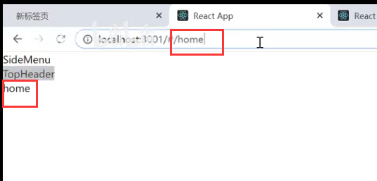

当然现在还有个问题就是在/的时候路由 内容啥也不加载了，需要默认加载一个首页的内容

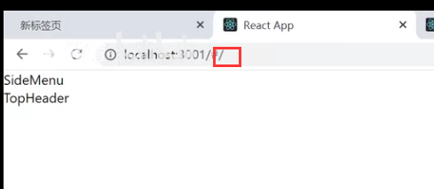

然后我们需要重定向一下：如果是/而且还有权限的情况下，我们重定向到首页/home的路由中

​		注意-目前是如果在浏览器地址随便输入值请求，也是会路由到首页的

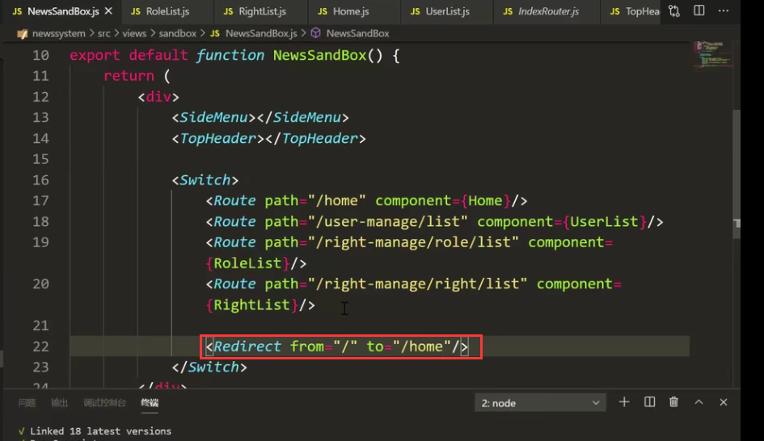

如果我们希望输入的浏览器接口地址不对的话，就提示报错页面---那么首先得让重定向的 /是精确匹配需要加exact 属性

​	然后就是加一个*的路由，以上都没有匹配上，没有权限的时候走这个NoPermission组件--这个优先级是最低的

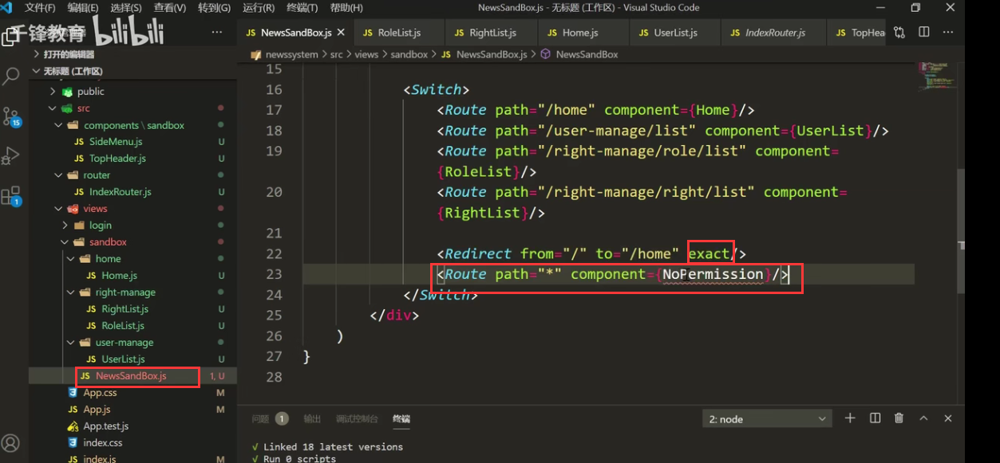

创建NoPermission组件：

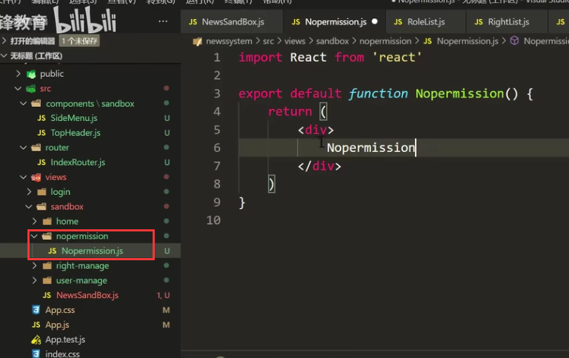

测试一下，页面查看效果：

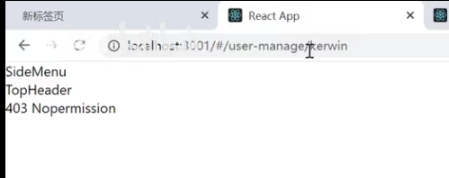

 

