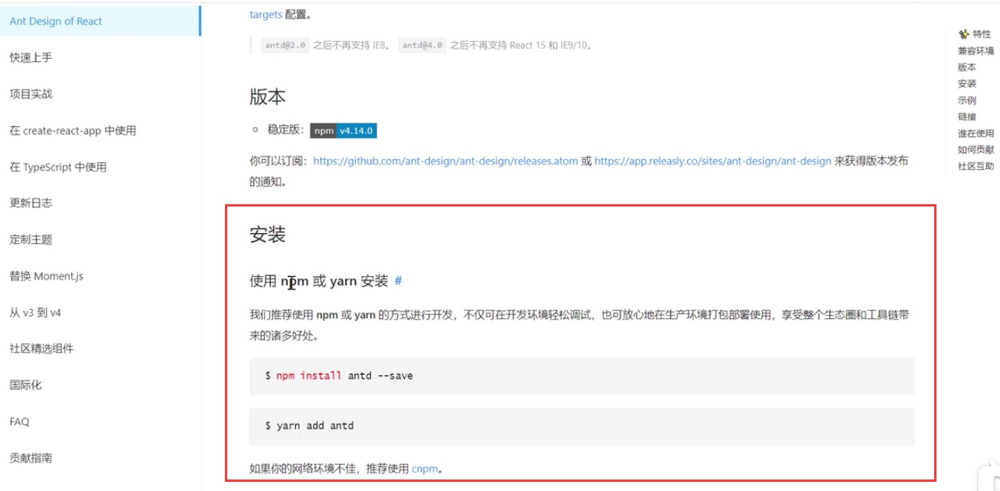
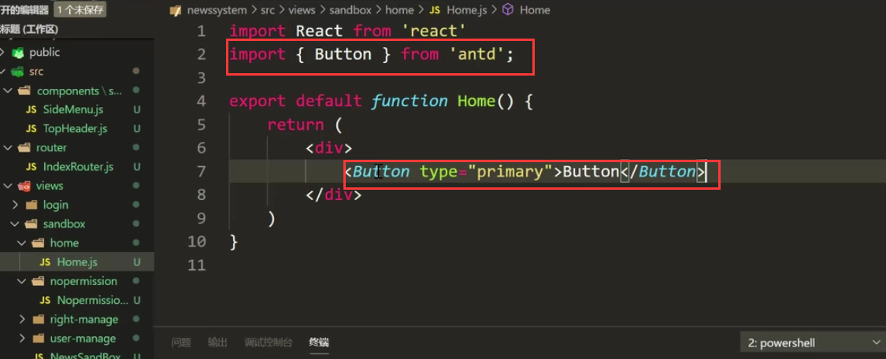
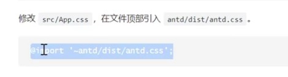
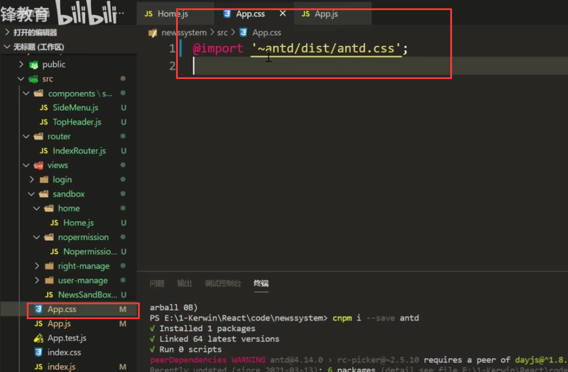
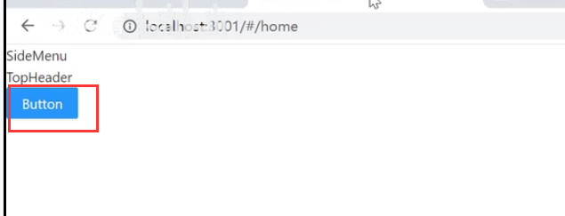

# 6.引入Antd组件库

​	

​		上面我们搭建好了路由，现在需要写我们页面中的内容了，那么您不会想自己写页面吧，我们可以通过antd组件库的使用才写我们的页面。因为你写的再好也不如站在巨人的肩膀上写的更完美

​		在Antd刚出来的时候，开始是未React提供的一套设计标准，以及出现配套的组件库，后来大家对他的认可度越来越高，然后就出现了移动端的组件库，PC端的组件库，有Angular的组件库，有Vue的组件库。

项目地址：ant-design.getee.io

​		然后进入点击开始使用--里面就有一些使用的例子

v

通过npm或者是yarn的方式去下载：

引入和使用组件

然后我们发现不对呀--这个按钮也没有变的优化样式的，原因是我们没有导入样式

​		需要导入一下antd的样式：

我们在App.css中引入antd的css样式，然后其他组件在使用的时候只需要引入App.css就可以了

页面查看效果：

**然后其他组件的使用也是这样，我们只去组件库中看文档去操作就可以了**

有时间的话可以对这个An-td的组件库-通读一遍

