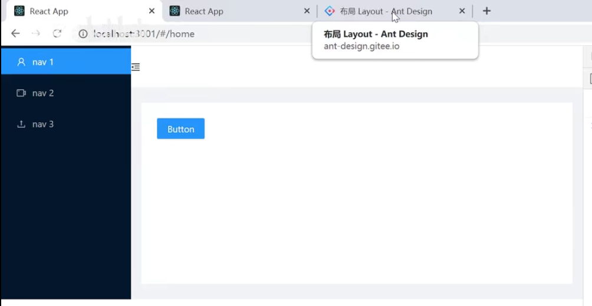

# 7.layout布局

Layout布局：

然后我们查看组件库中Layout的文档

然后我们代码实现一下：

​	SideMenu.js首先实现侧边栏---将侧边栏的代码放入我们侧边栏组件中

然后我们设置TopHeader

#### 2.content显示的内容放在什么位置？

​	应该放在newSandBox组件中，把Switch包裹 在Switch中显示内容，因为Content组件中是需要显示的内容，那么内容是根据Switch路由组件匹配相应的路由去加载对应的页面，路由到什么页面就匹配显示什么页面

我们现在看一下页面的效果：

样式显示明显有问题，我们需要去找一下css样式：

我们创建一个NewsSandBox.css文件，然后把copy的样式copy进来

然后引入css

查看页面效果：基本差不多了

