# 8.topHeader组件

现在有个问题需要处理一下，就是高度并没有占满，需要把高度撑满

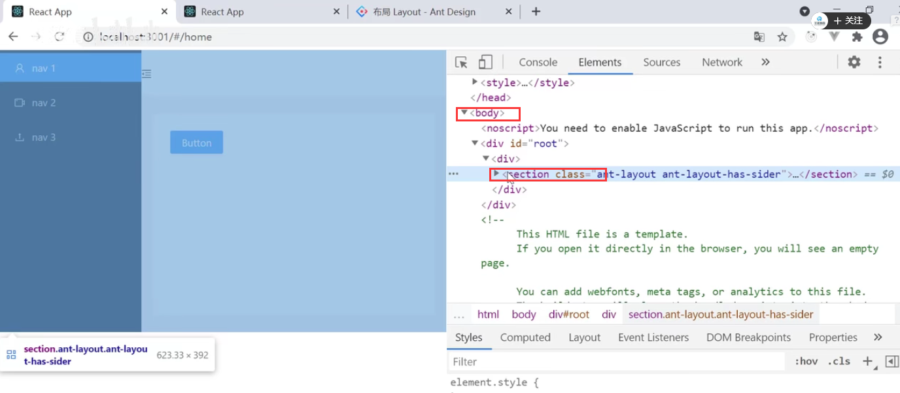

解决思路就是，想让section 标签 和 div id =root的标签 高度如果和body的高度一致的话就可以解决这个高度的问题了

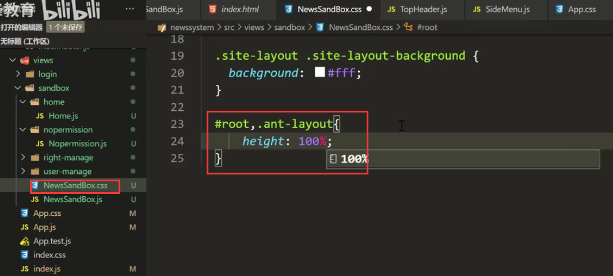

运行查看效果：成功了

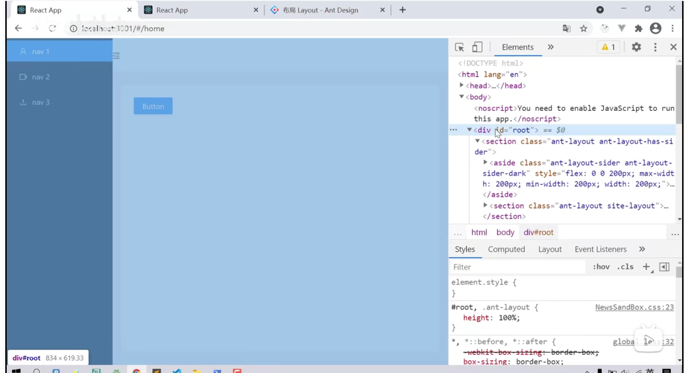

#### 2、现在处理TopHeader的问题

​			TopHeader目前点击按钮无效，正常应该是可以控制侧边菜单栏来回伸缩的

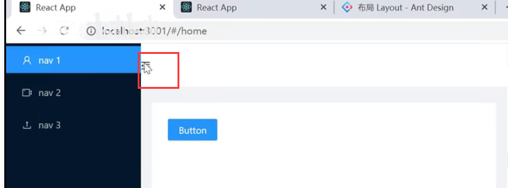

点击如果想要达到伸缩的效果的话，是需要2个组件进行通信的，我们现在先不着急去管理，后期我们会使用redux来进行统一的管理

点击这个按钮 图标如果想发生变化--添加一个事件

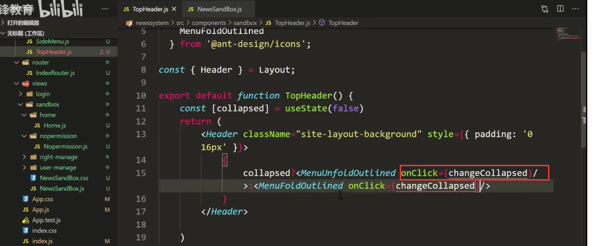

单击事件的函数 值取反就可以了

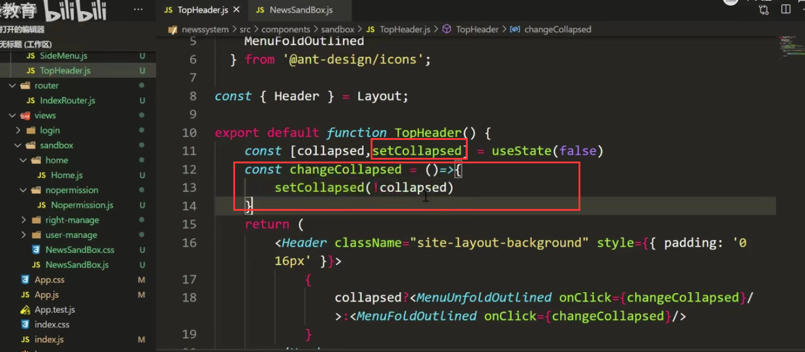

查看效果：然后页面的图标点击后 图标进行切换

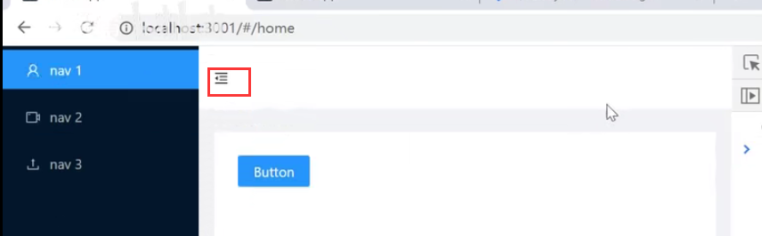

顶部导航组件中 右侧还需要一个人员 信息和下拉按钮

我们需要使用Menu组件--定义一个Jsx结构

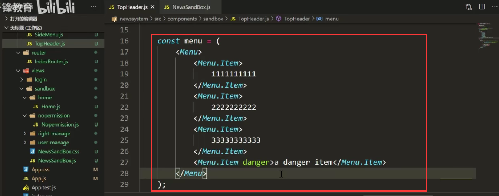

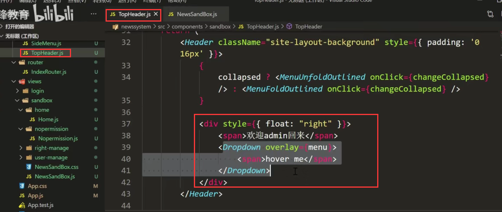

页面查看效果：

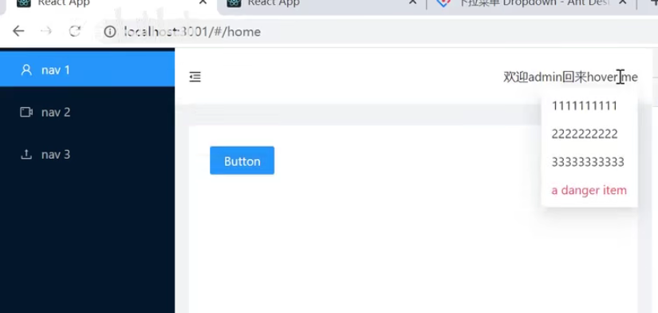

然后我们设置个头像

使用头像组件Avatar

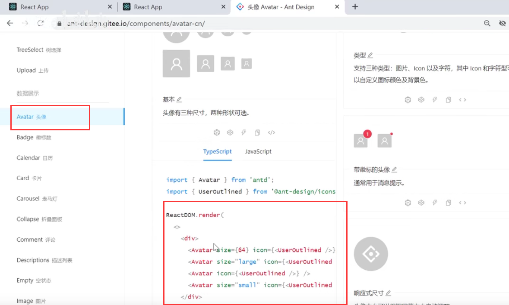

代码实现：

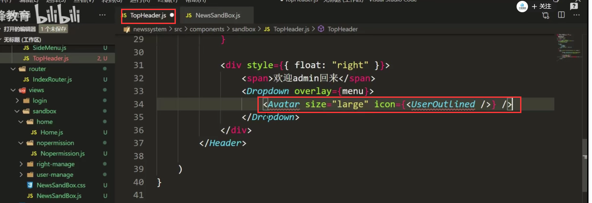

引入相关组件

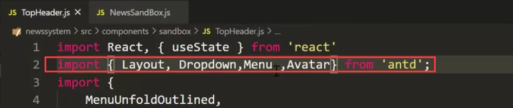

引入图标

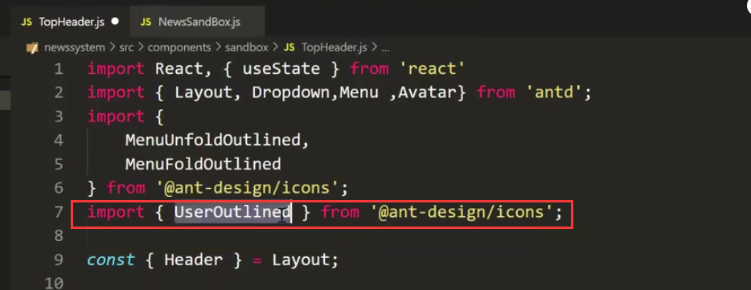

页面查看效果：

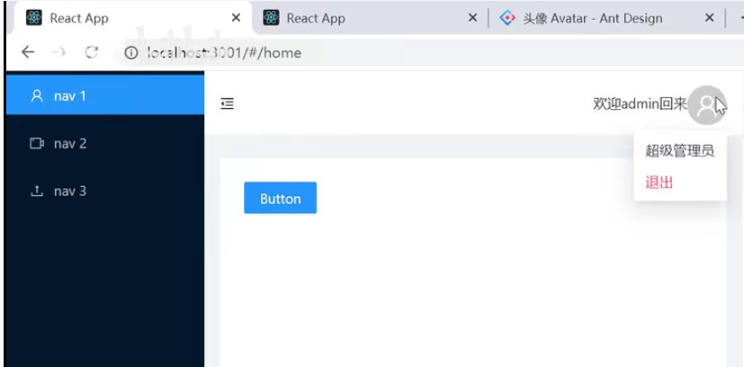

