# 9.sideMenu组件


https://www.bilibili.com/video/BV13v411H74b?p=10

先研究一下这个侧边栏的结构：

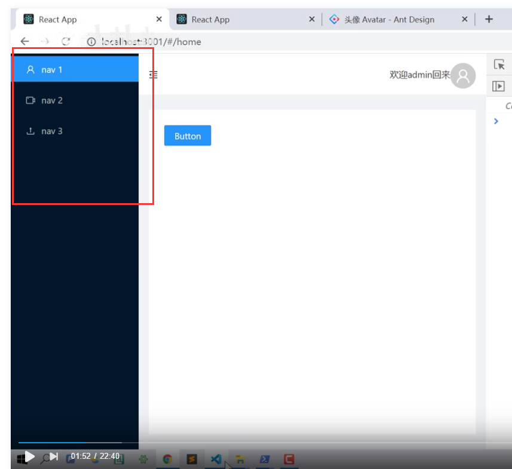


然后我们在An-td组件库文档中查看一下，你如果知道具体使用的组件的话可以搜索一下

​	比如Sider组件

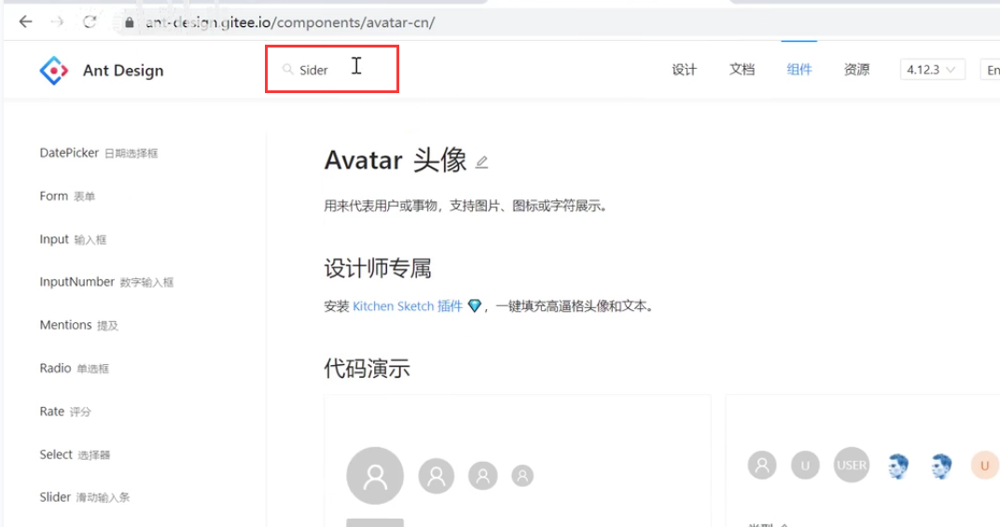


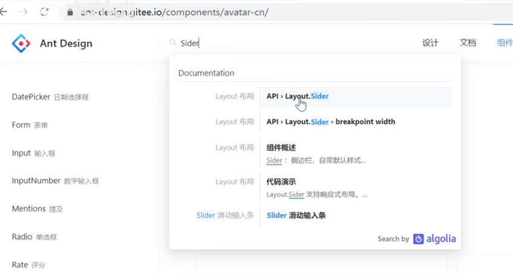


#### 1、侧边栏组件的使用


找到具体Sider组件的API使用：

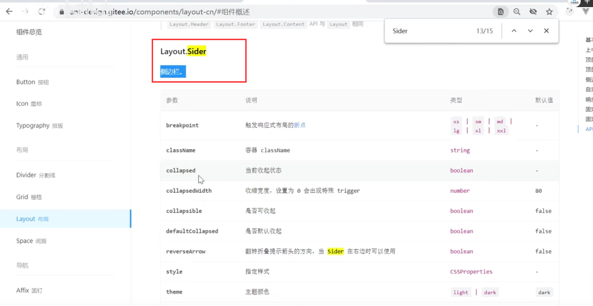


代码实现：

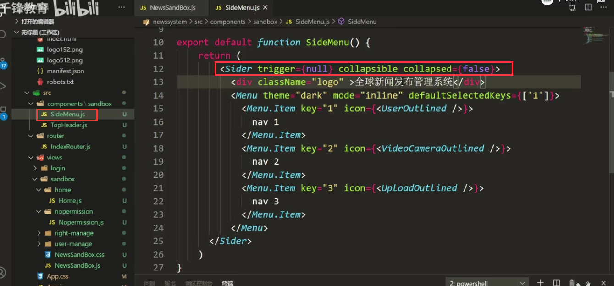


查看一下效果：

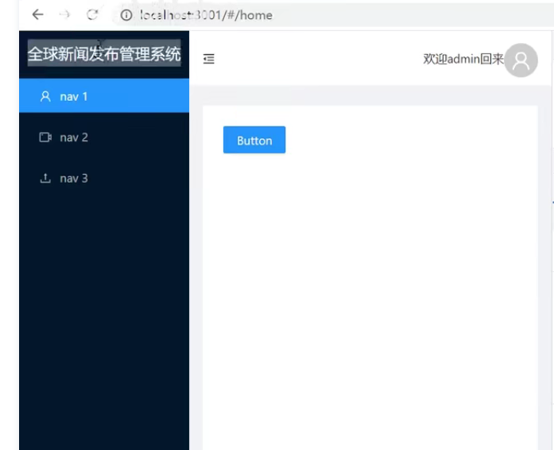


默认选中高亮显示的key是：

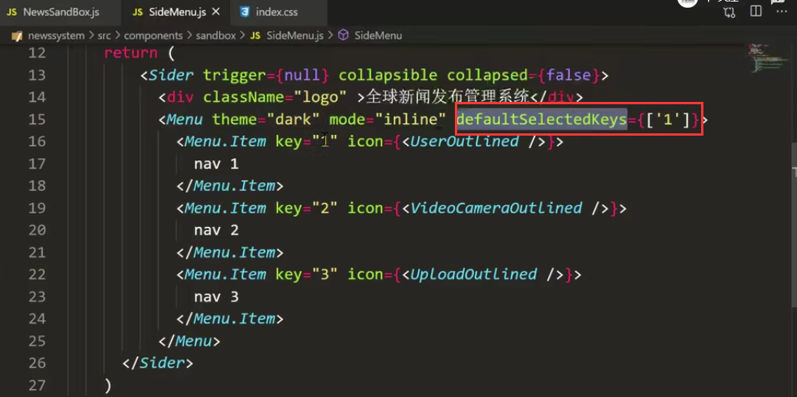


比如： 所以每一个Menu-Item都需要有一个key值

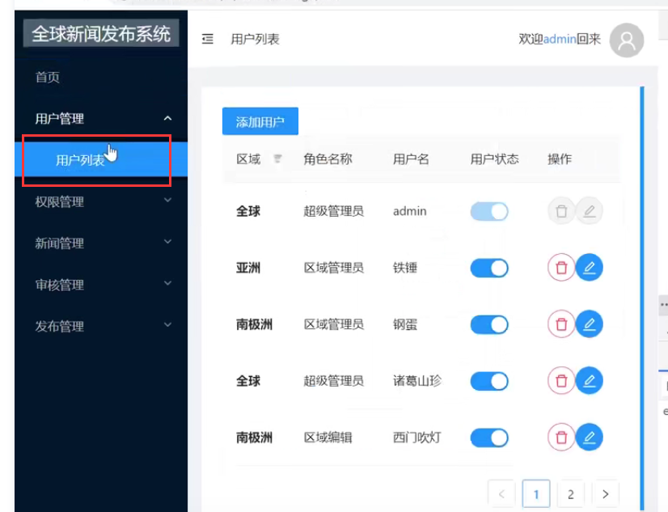


#### 2、多级菜单：咱们目前做的都是一级的菜单，由上图显示咱们是需要二级或者三级菜单的：


​	我们查看文档：看一下具体怎么实现


搜索一下menu组件

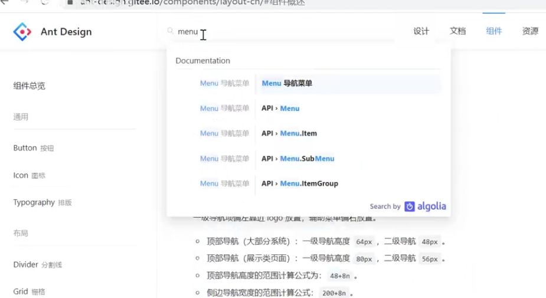


然后我们找到--内嵌菜单，然后感觉需要的就是这样的效果的菜单

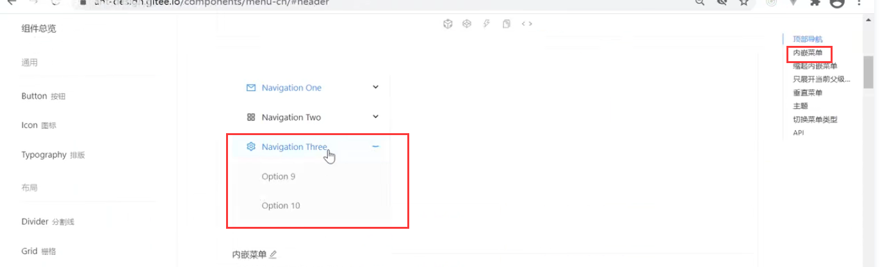

​	


然后我们使用SubMenu这个组件可以实现对于菜单的嵌套

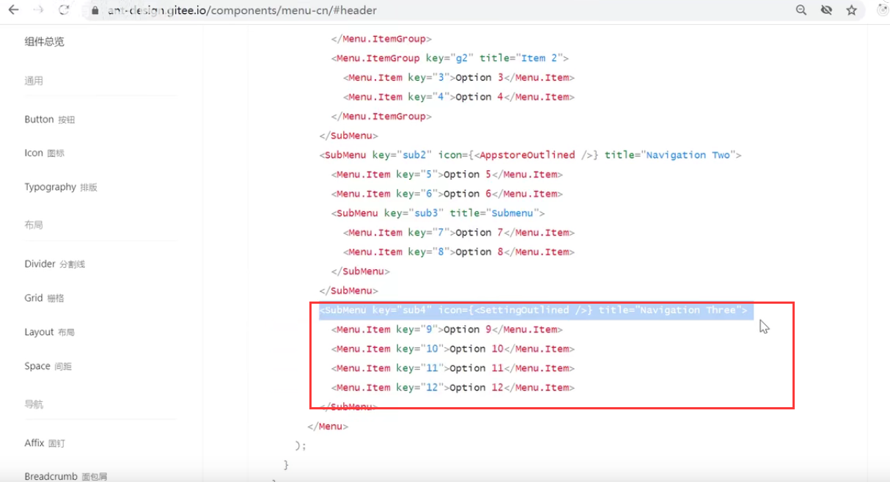


代码实现：

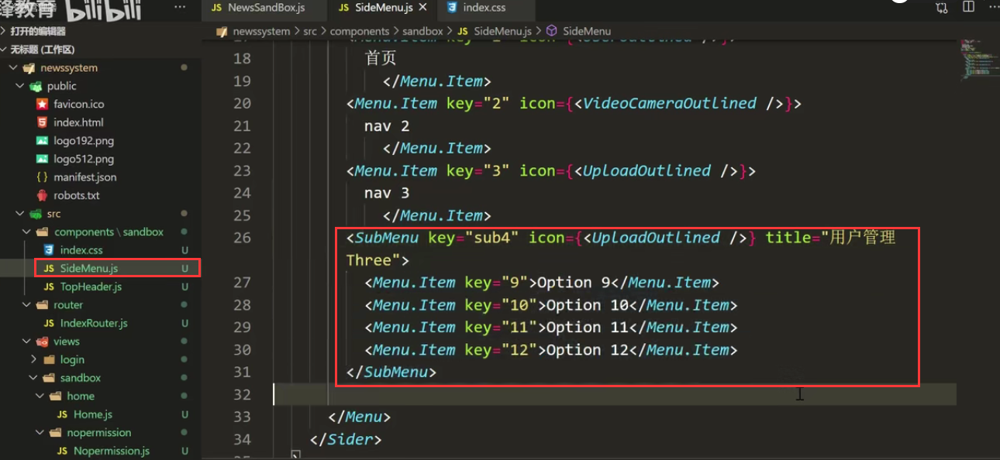


查看一下效果：

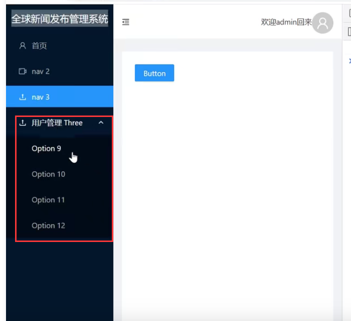


目前是写死静态的，未来这个一定是动态的创建出来的sider menu

**这块的菜单权限--我们应该是从后端-给我们返回一个数组结构---我们可以根据这个数组结构动态的创建出我们的侧边菜单栏**

​	如果我们的权限换了之后--我们只需要重新获取新的数组结构，重新渲染就可以了，或者我们根据用户登录返回的数据结构和我们总的结构进行一个对比，就可以了。


我们先自己创建这么个数据结构：因为无论是后端返回还是前端创建-我们都是需要先模拟一下，心里有个底


```
//然后我们发现 key肯定需要，icon图标也需要，菜单内容也需要，每个对象起码得有这三个属性
//我们发现key可以设置为路径 这样的设计会使用更方便一些

我们发现这三个属性作为一个对象的这种结构， 那么就还需要一个属性child然后完成这种嵌套的结构

```

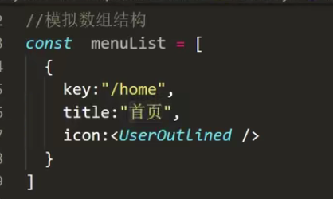


然后我们发现--如果数据中有child属性的 我们就渲染成SubMenu 如果没有Child属性的就渲染成Menu

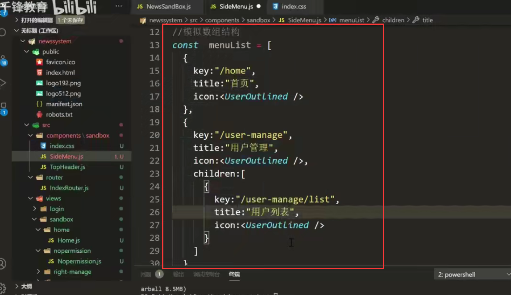

 

现在我们就差动态实现sideMenu了


