# 1.新闻分类

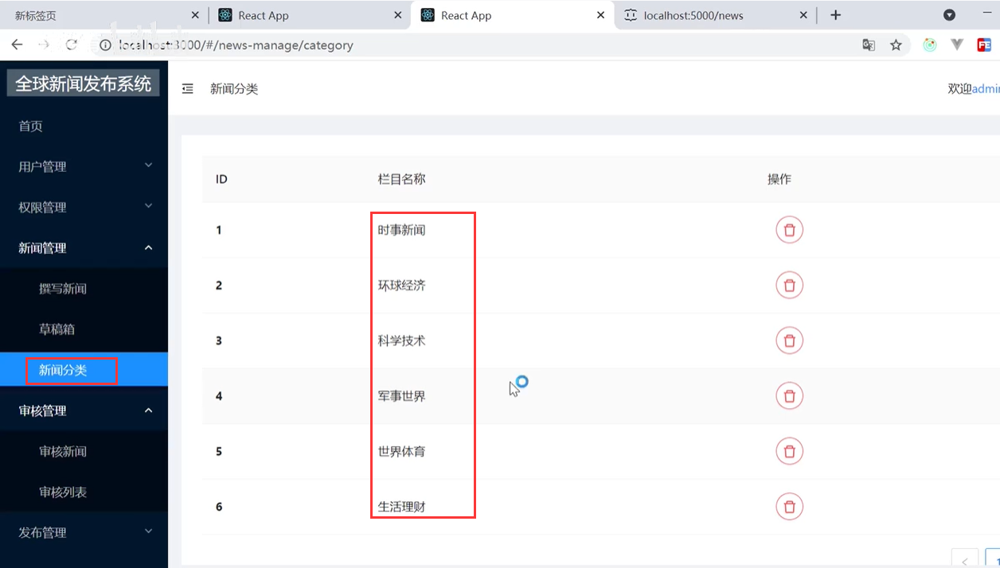

​		这个新闻分类没有做添加功能---我们也可以加上

这个新闻分类目前支持--行内编辑

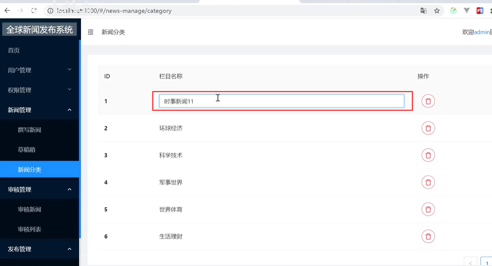

这个行内编辑-使用的是table的单元格编辑

​	这个功能看似简单--其实是比较复杂的

#### 1、基本结构实现

​	我们先实现一下这个--基本的页面结构

​	设置请求路径--设置列属性

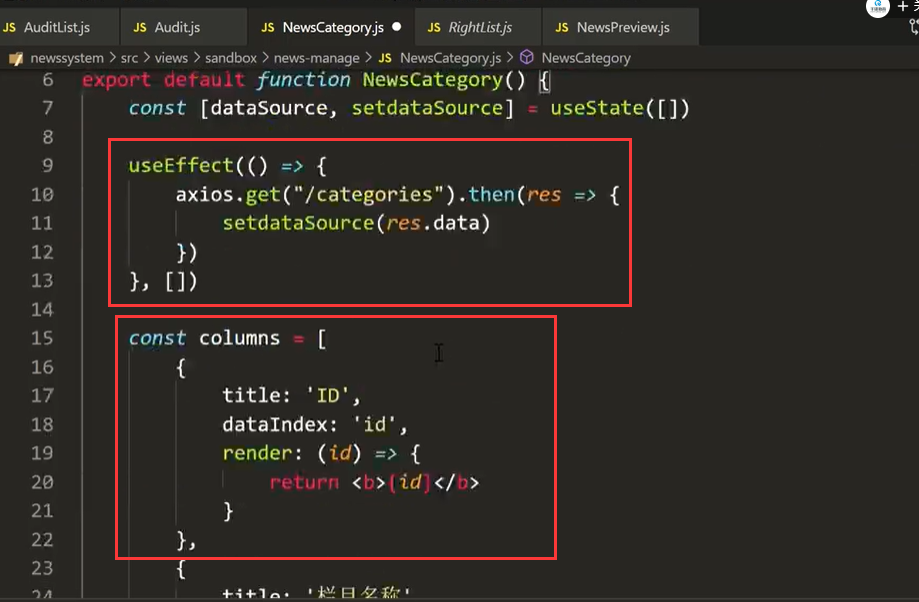

删除按钮：

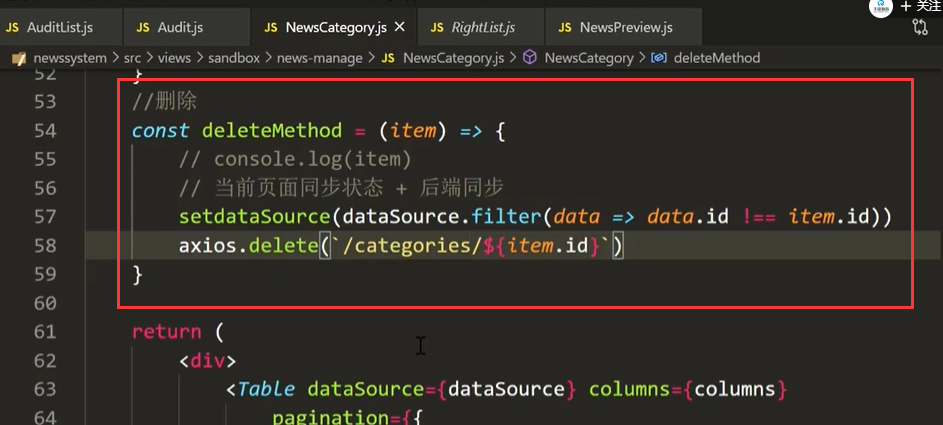

查看页面效果：基本功能已经实现

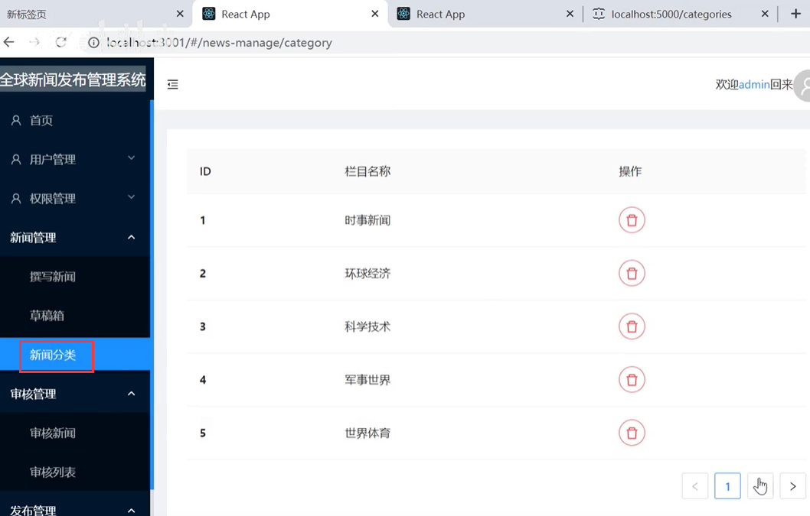

#### 2、行内编辑实现

​		进入组件库--查看一下文档

​		然后我们找到可编辑的单元格

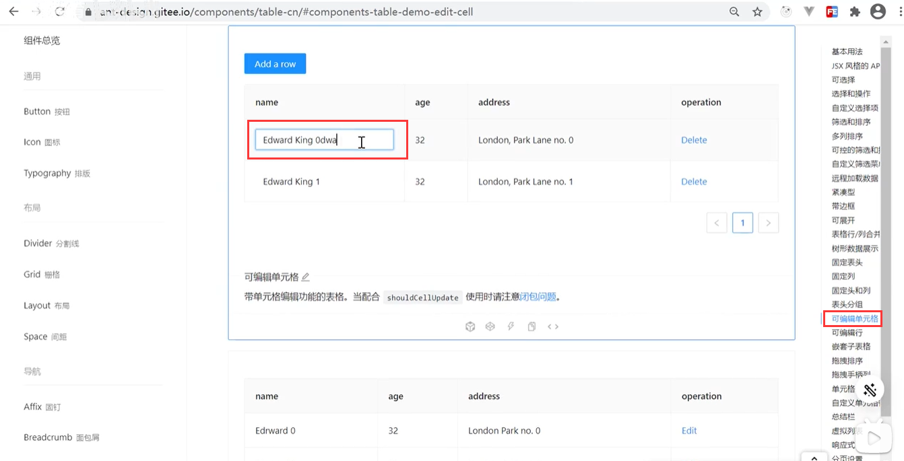

Table组件中需要一个自定义的组件

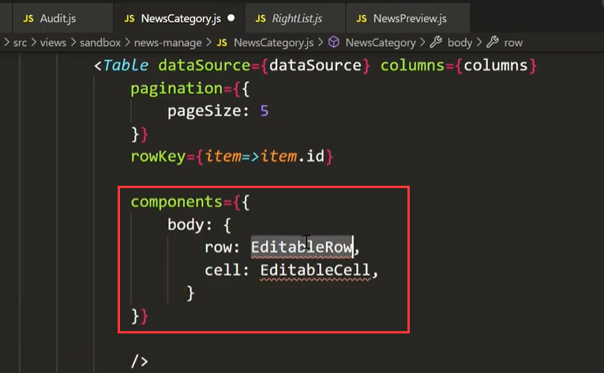

EditableRow 和 EditableCell 这俩个可编辑的函数代码都比较多

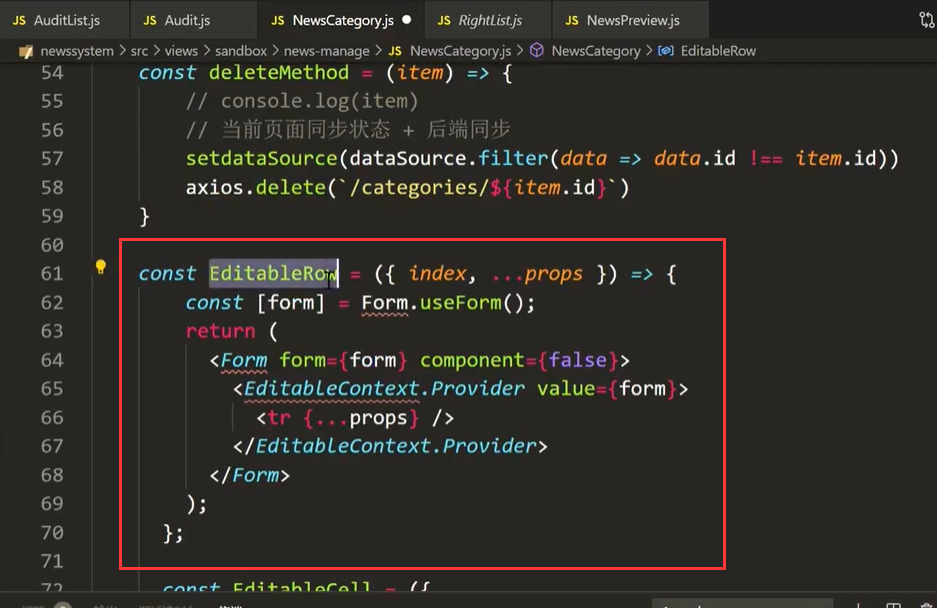

EditableCell 

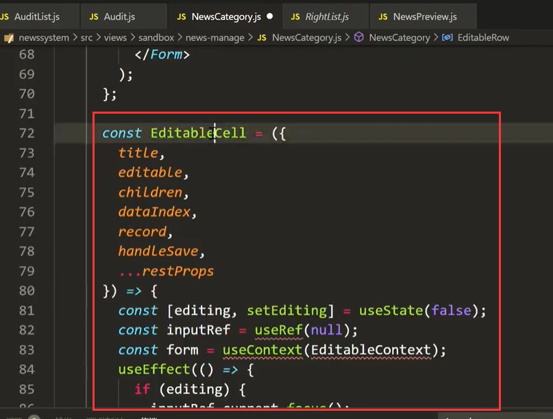

如果想让行内编辑生效-- 可编辑的函数中需要可以结构出你列的数据才可以生效

​	那么我们必须要提供这个属性值--这样才能按你所期待的功能去显示

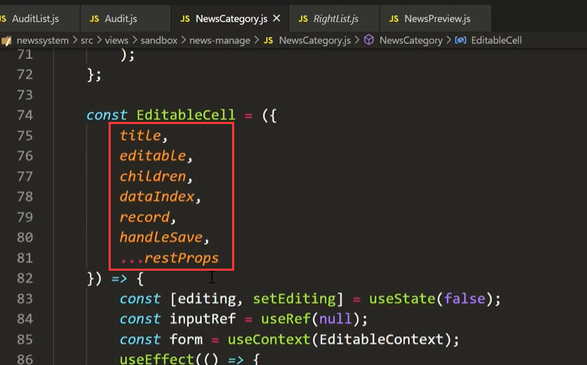

我们需要在编辑的列，加入onCell属性

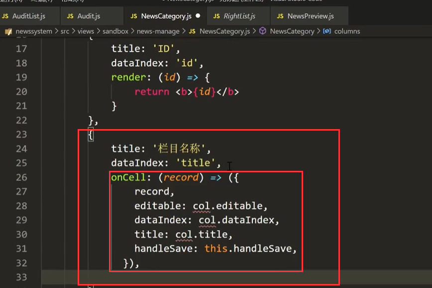

然后修改一下属性值内容：

​		现在我们还差handleSave 这个函数是 非常重要的最后回调得到最新的值

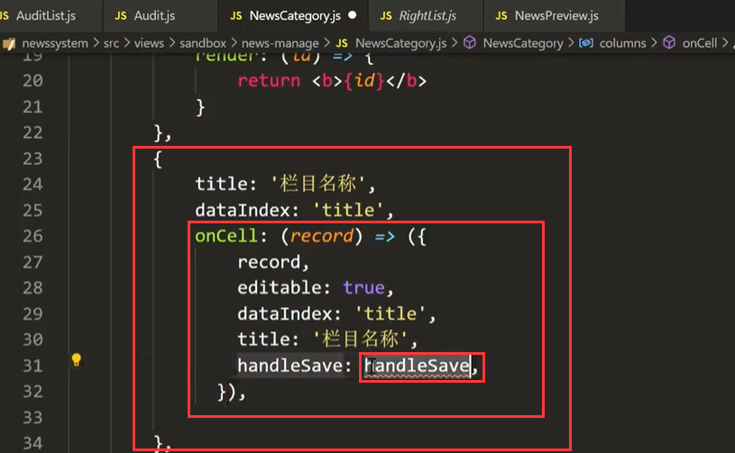

我们获取一下handleSave获取到的值看一下

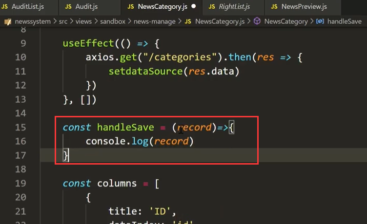

现在我们就可以进行行内编辑操作了--而且在失去焦点的时候走handleSave函数-获取到数据

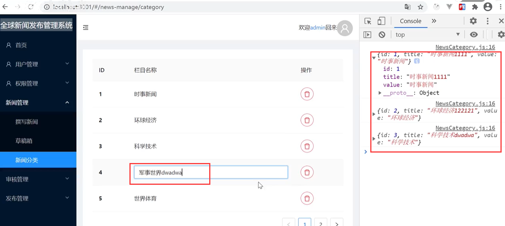

接下来--我们只需要在handleSave函数中，设置一下页面的值，再请求后台设置一下后台的值就ok了

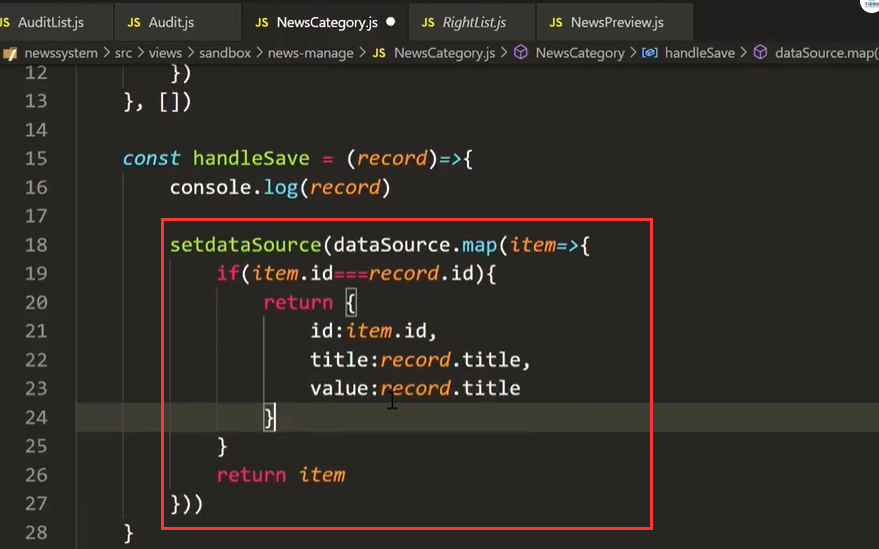

在页面可以保存住值了

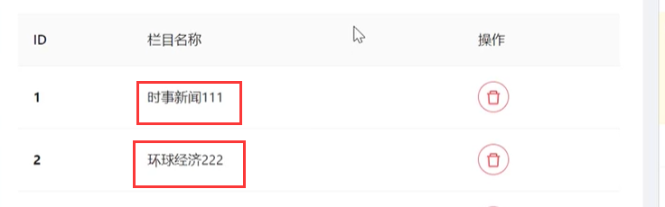

然后修改的请求同步到后端

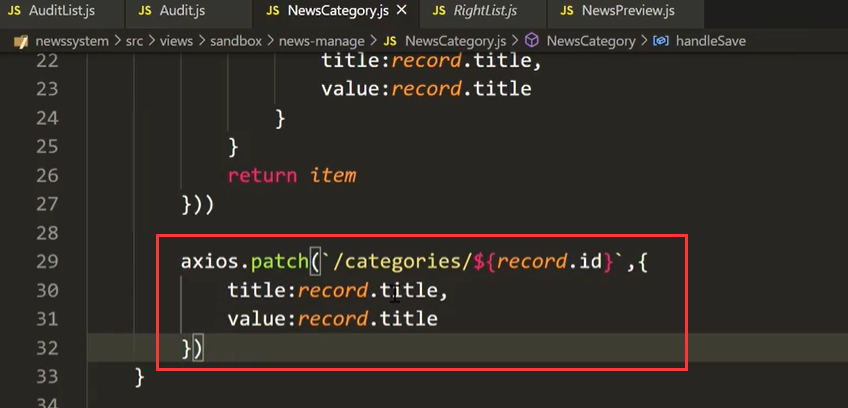

没有问题后台也更新了

https://www.bilibili.com/video/BV13v411H74b?p=51&spm_id_from=pageDriver

