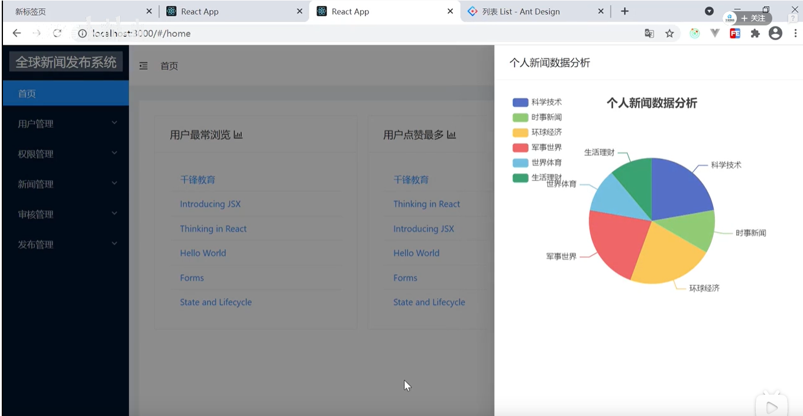
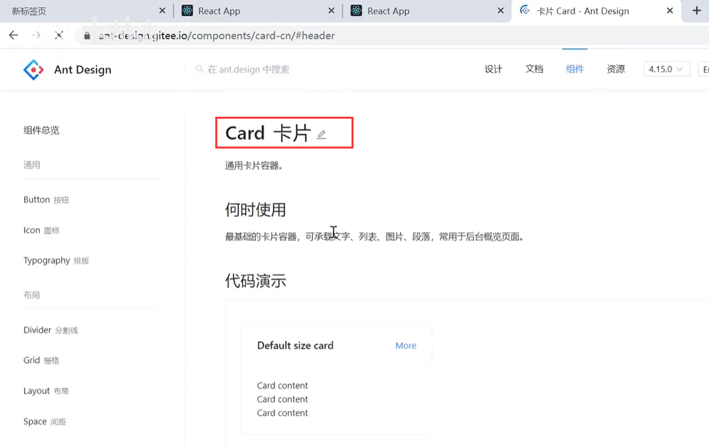
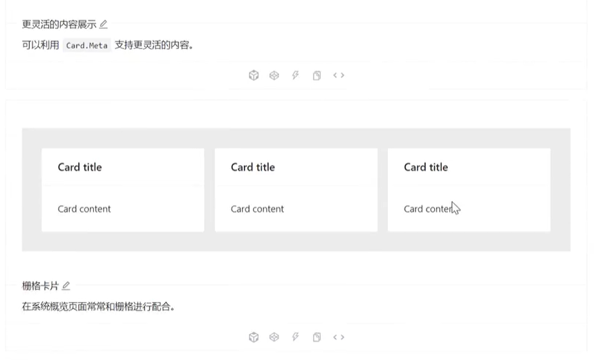
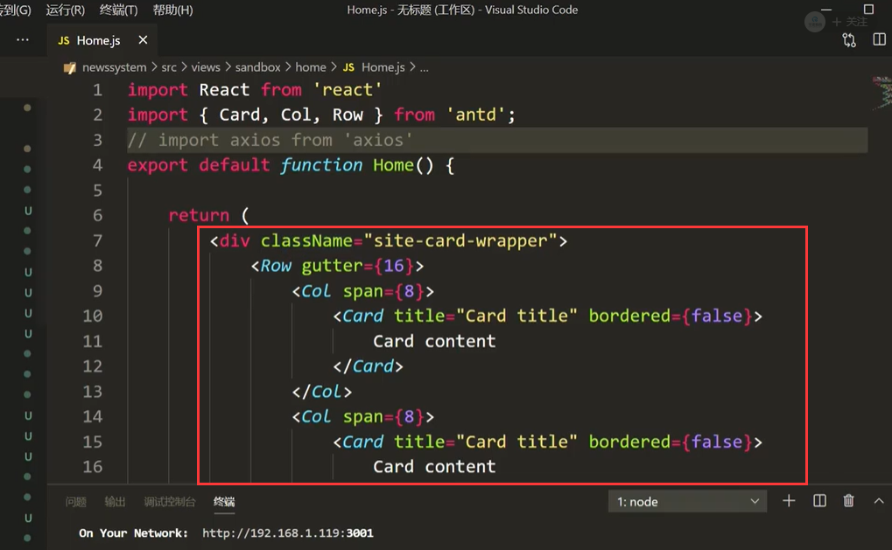
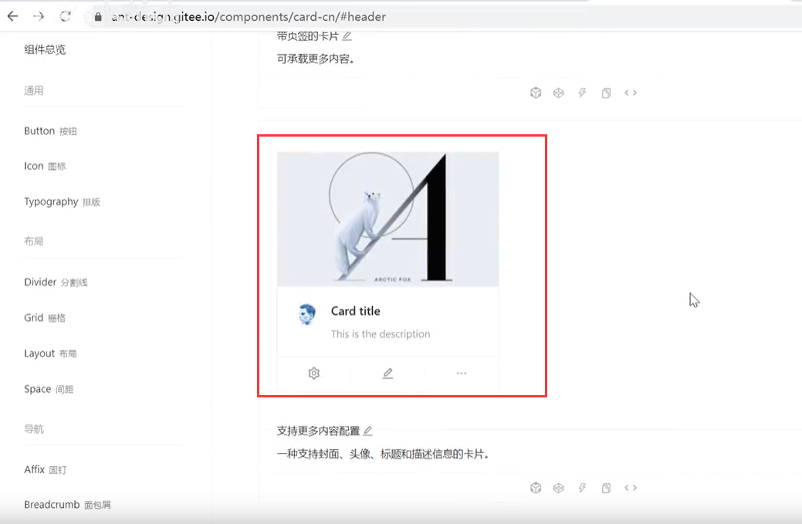
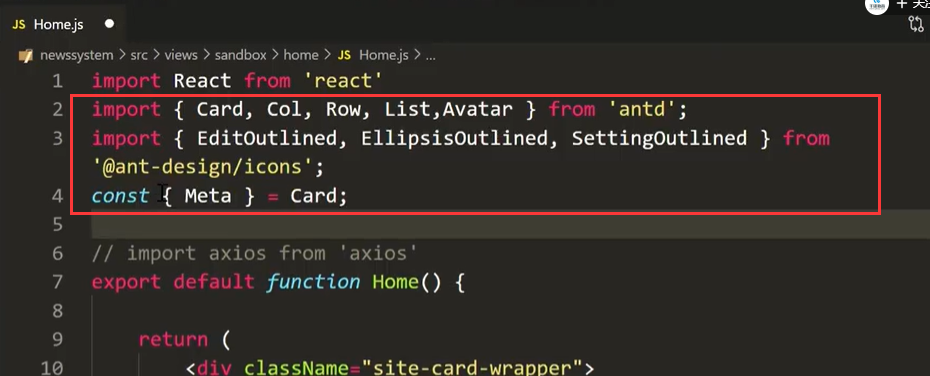
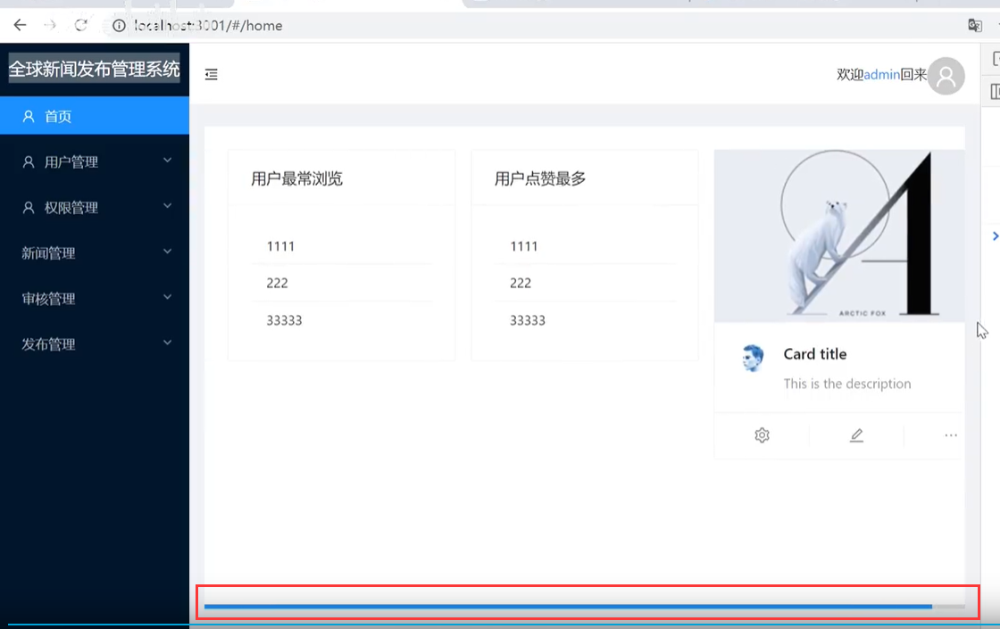
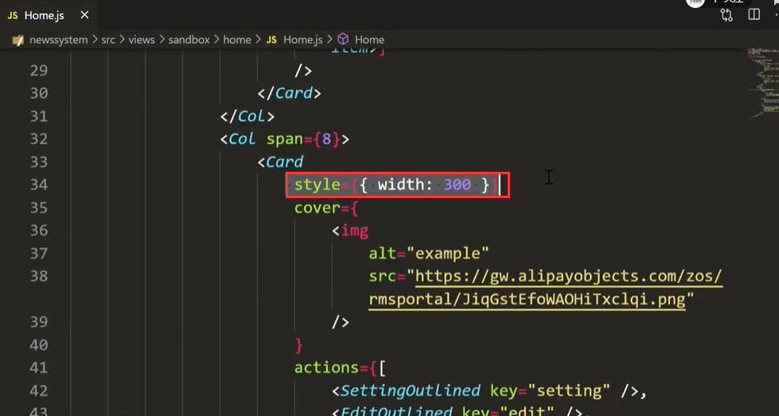
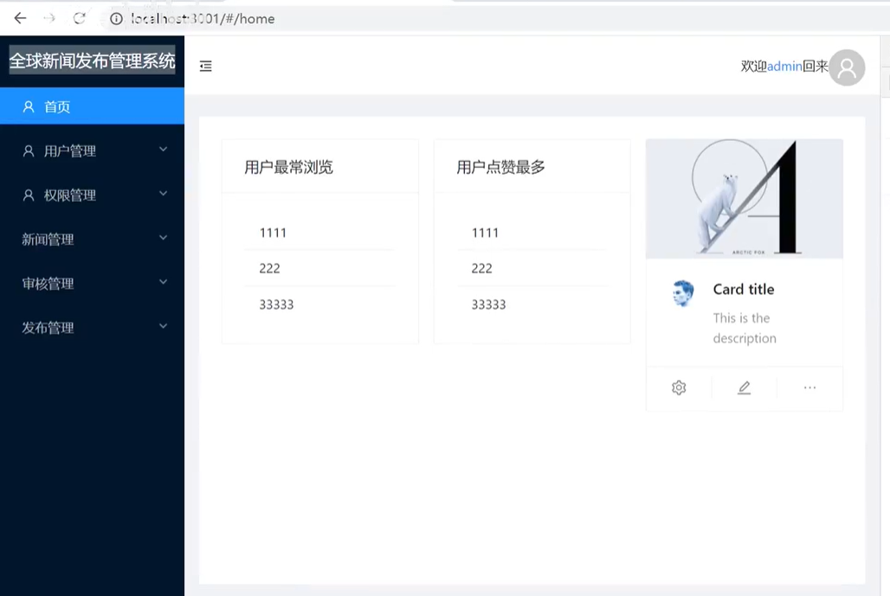

# 10.首页数据展示-排版

​	在首页我们想展示一些数据可视化的东西--类似仪表盘

比如目标效果：

在这里我们会使用到card组件

### 1、首页布局

​	首页--我们使用栅格card来做3个区域

还会使用到这个card来做第三个card

需要引入一下

现在我们看一下页面的效果：页面展示效果差不多了，但是怎么有滚动条需要优化一下

将固定宽带给删除掉

这样就好了

https://www.bilibili.com/video/BV13v411H74b?p=60&spm_id_from=pageDriver

