# 11.首页数据展示-数据

### 1、最常浏览的数据

​		最常浏览的 肯定就是已经发布了的，还需要关联展开类别数据，然后还需要一个sort排序，按字典view就是访问数进行排序，然后使用order=desc进行倒序排列	

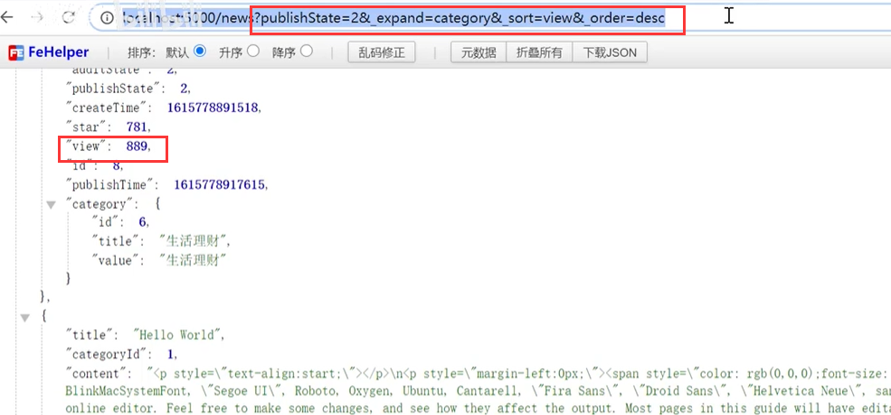

​	然后在加入条件limit = 10 我们使用前10条数据

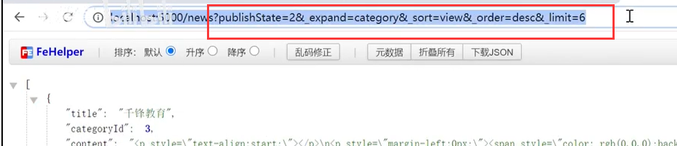

现在我们在代码中设置请求：

​	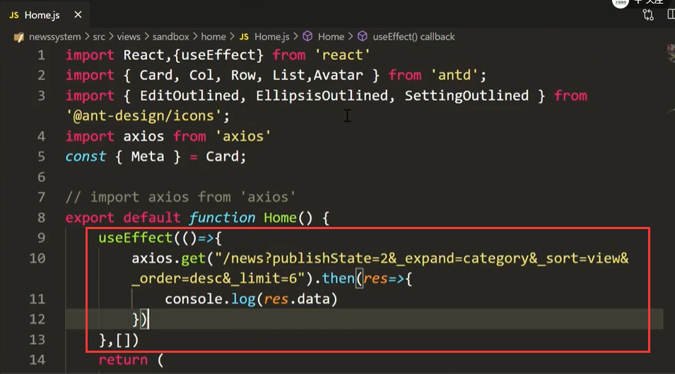

可以看到这个home中的第11行，打印的内容---我们的数据获取到了

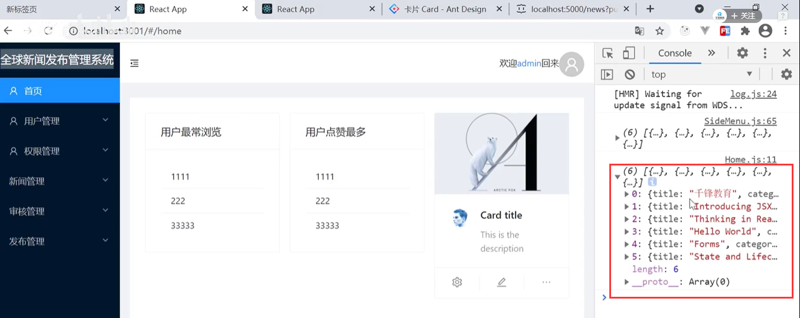

设置值给状态

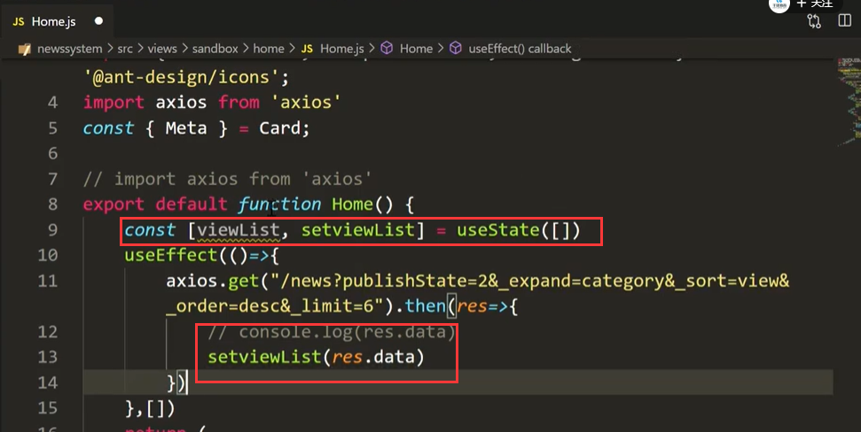

List渲染：

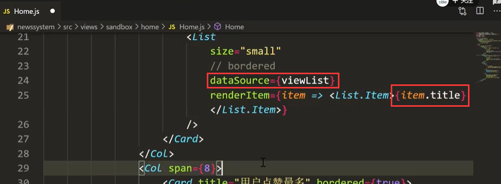

页面查看效果：

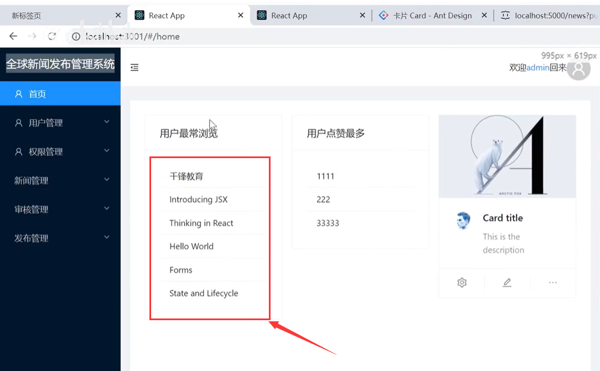

还需要加入一个连接--可以跳转到预览页面查看新闻

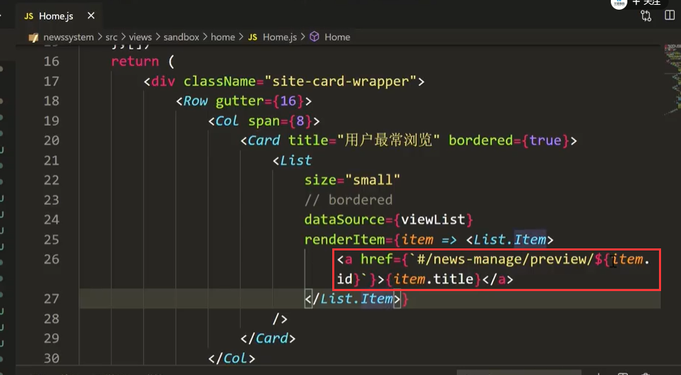

点击跳转没有问题

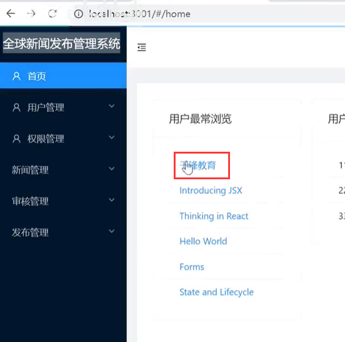

### 2、点赞数最多

​	和以上一样，我们模仿一下就ok了，主要是接口--主要排序的字段需要改动一下是star

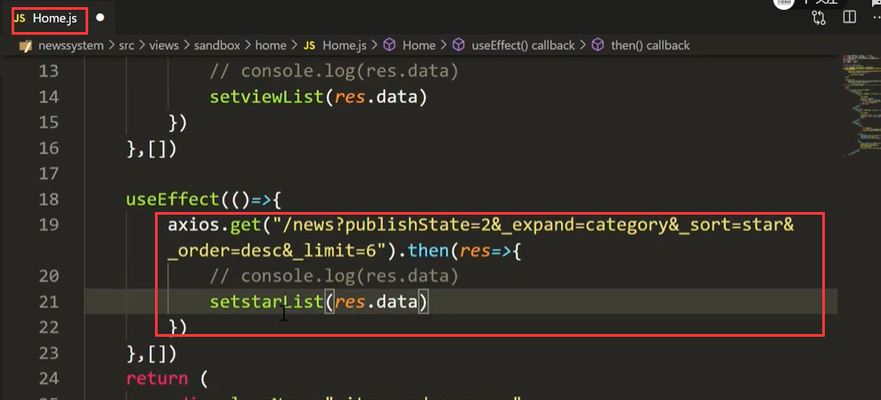

查看页面效果：

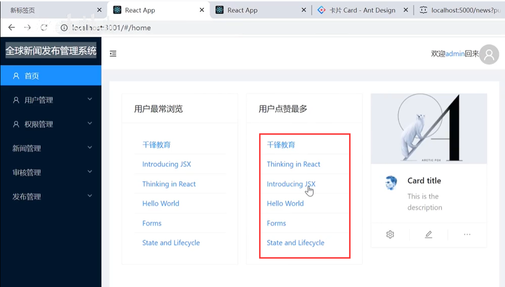

### 3、最右侧card数据

​	最右侧需要显示的内容是：用户的信息，用户名，用户权限，用户的区域

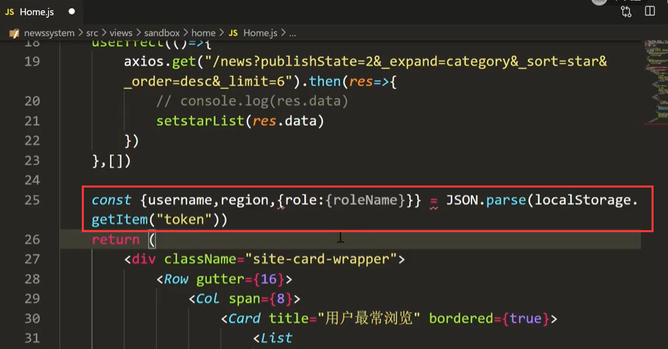

设置用户属性值

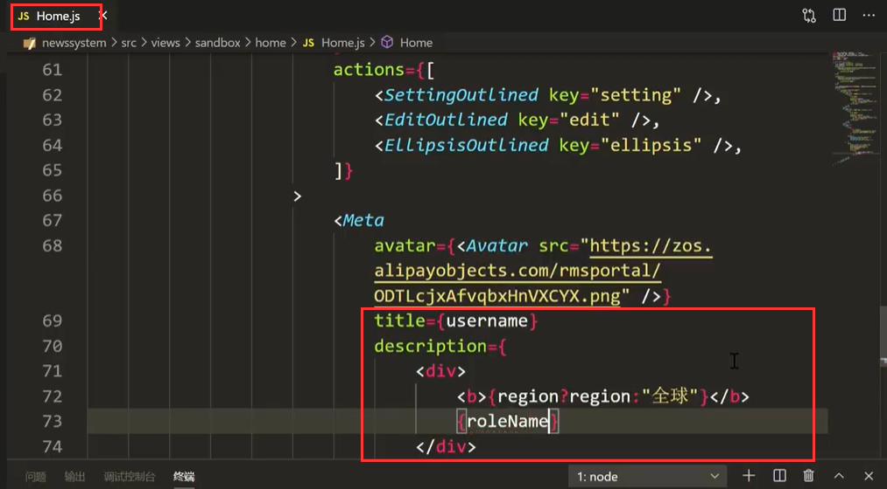

页面查看效果：

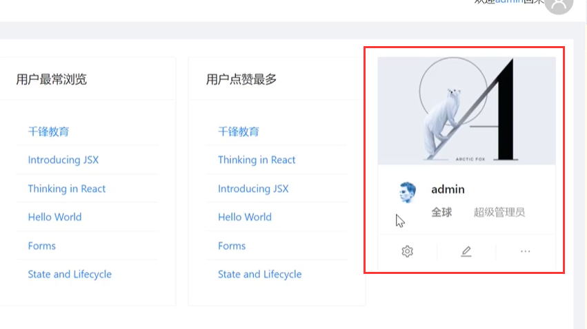

