# 13.首页数据展示-饼状图

我们的目标需求是，在点击第三card的配置按钮时候，从右侧弹出一个饼状图

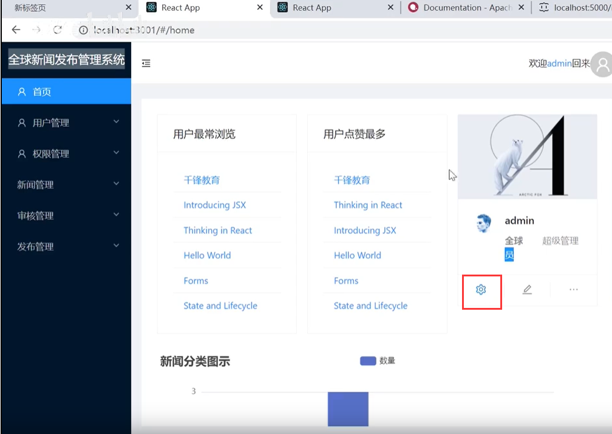

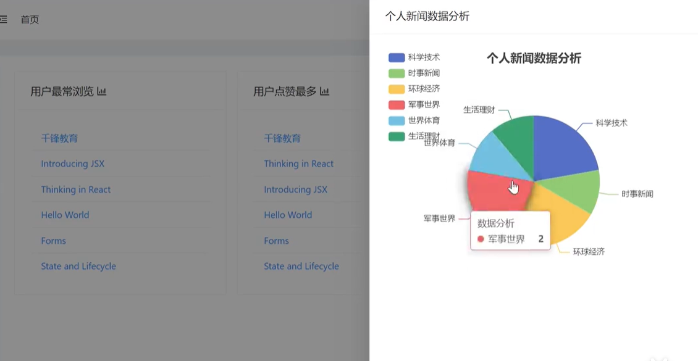

​	实现这个功能就会用到一个抽屉组件

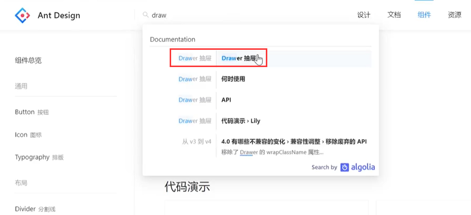

closable是--是否允许点击关闭，onClose--关闭，visible--是否显示

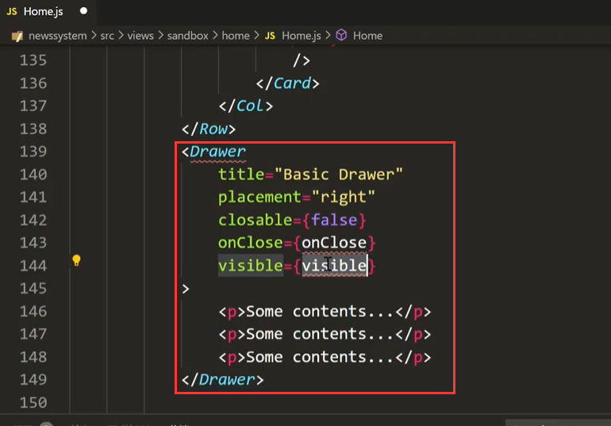

配置参数：

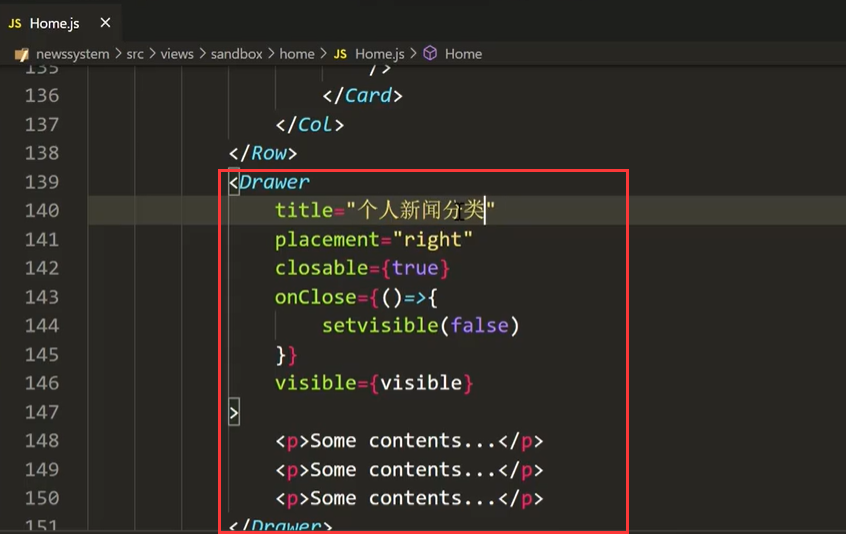

给按钮添加事件处理触发抽屉弹出：按钮中将显示状态设置为true

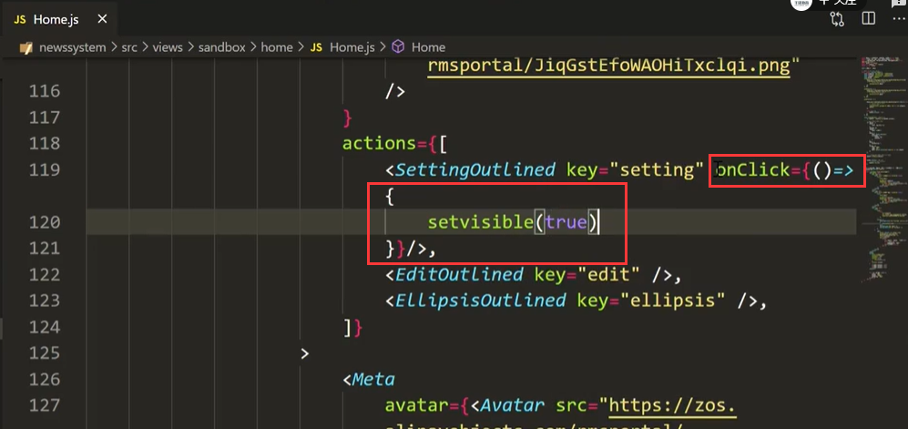

查看一下效果：没有问题可以显示

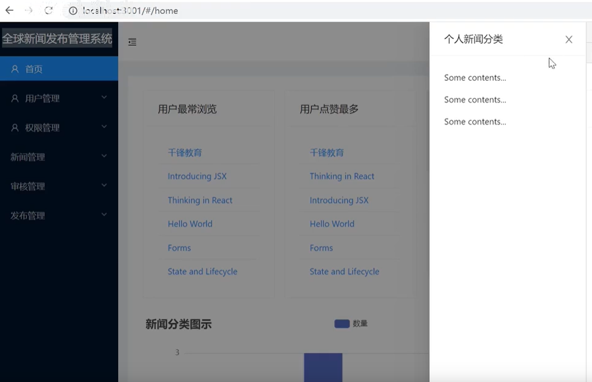

然后我们到ECharts示例中找一个饼状图的示例来使用

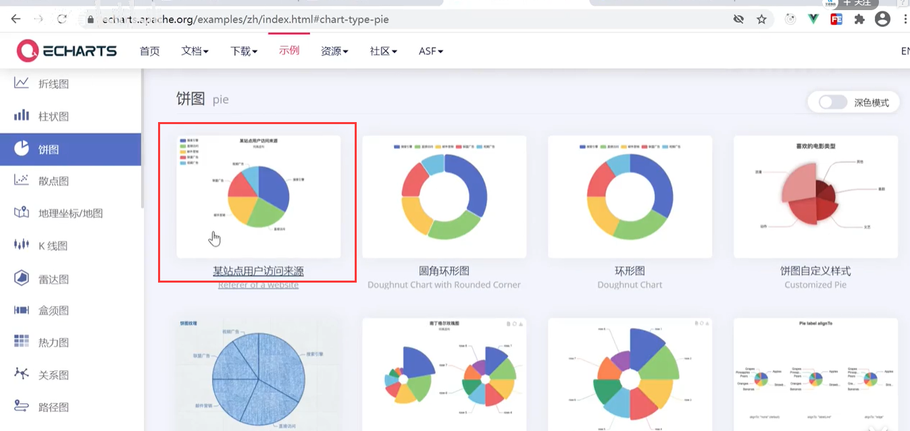

拷贝完整代码--

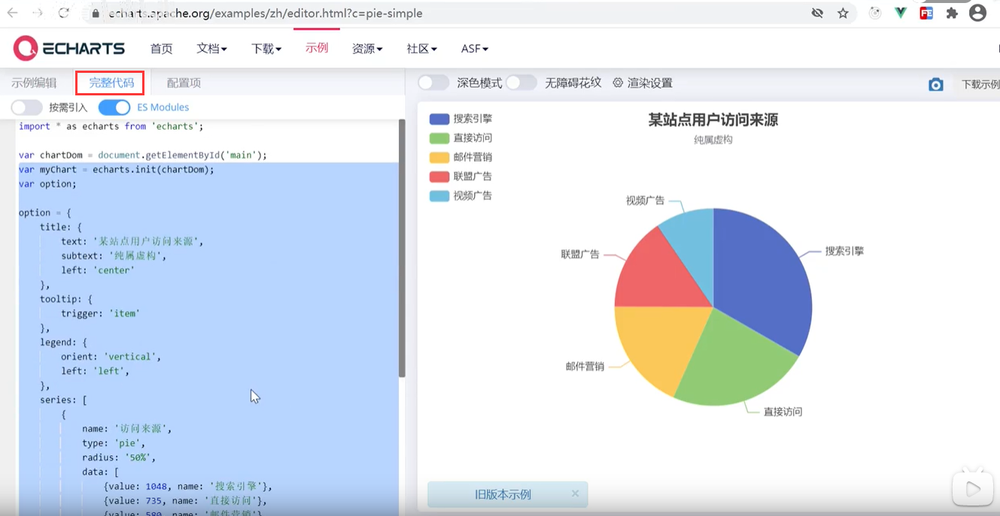

然后放到renderPieView函数中

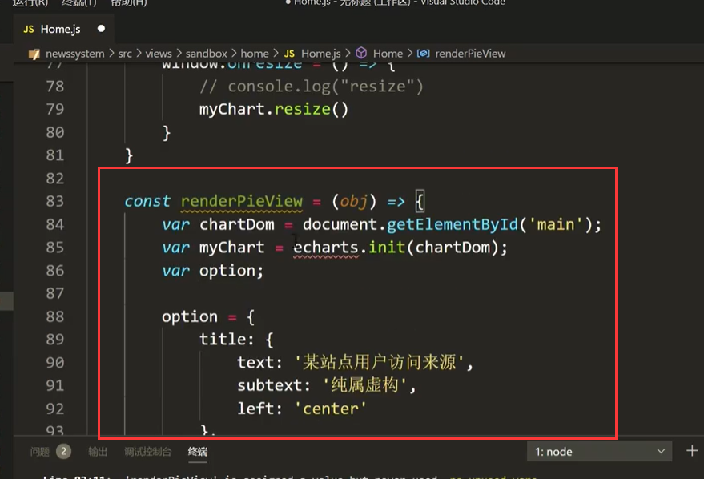

点击完按钮--进行显示抽屉组件和进行初始化饼状图

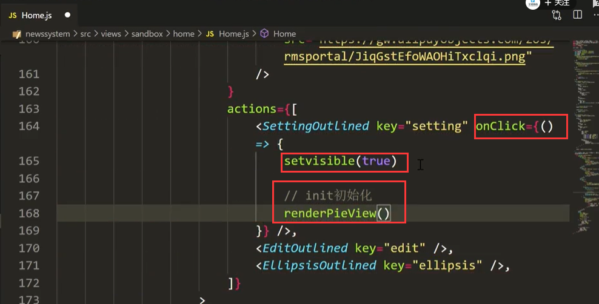

以上会发生错误，在dom还没有完全创建完毕，就进行render导致的错误，因为他们是异步的

将他们放在一个setTimeout异步中，然后内部的方法变为同步

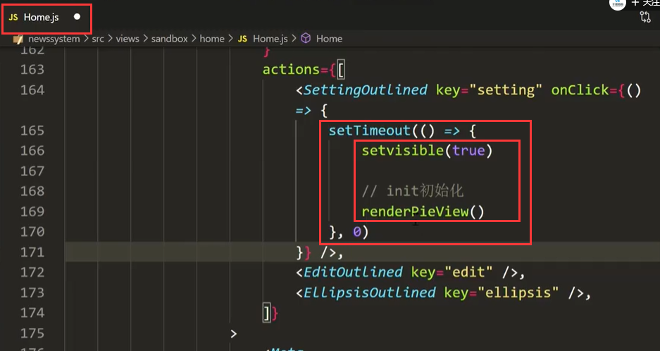

点击按钮查看效果：没有问题

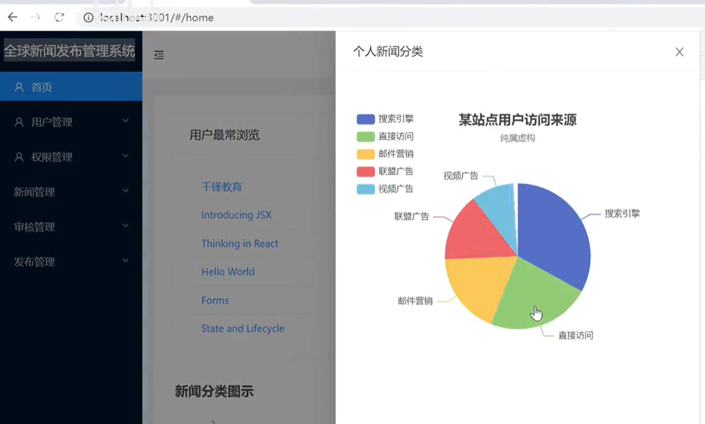

我们设置一下每次点击都初始化一次其实是不需要的，我们判断处理一下

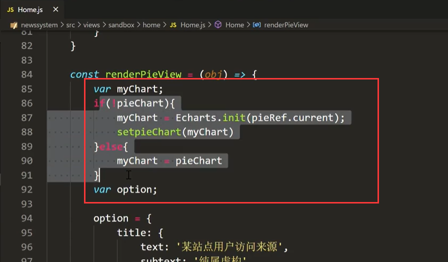

因为我们之前就把所有的数据都取回来了--所以现在我们需要将数据过滤一下，过滤出登录用户的数据，然后进行展示就可以了

我们将获取回来的全部数据保存到allList中

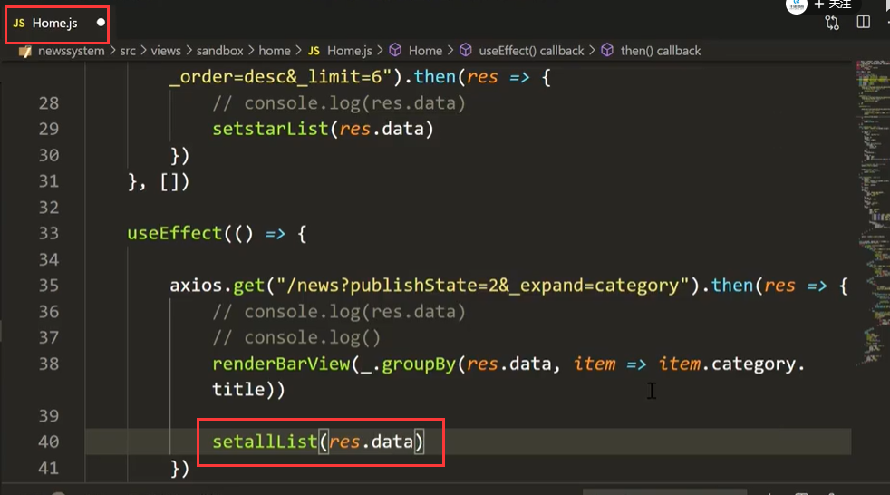

在pieView中处理过滤数据--过滤出为当前登录用户的数据

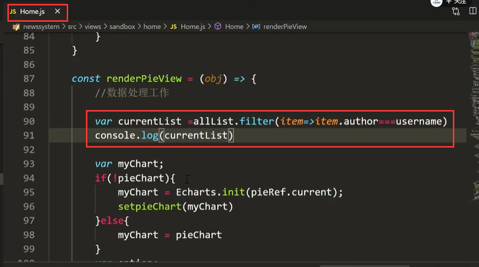

使用lodash 对数据进行分组：

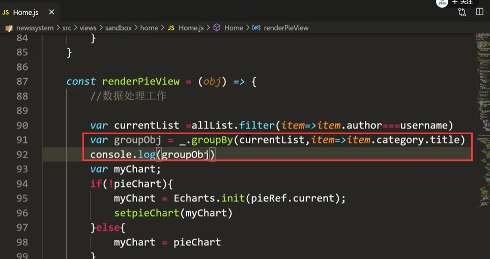

还需要转换一下--转换为一个 key，value结构的集合

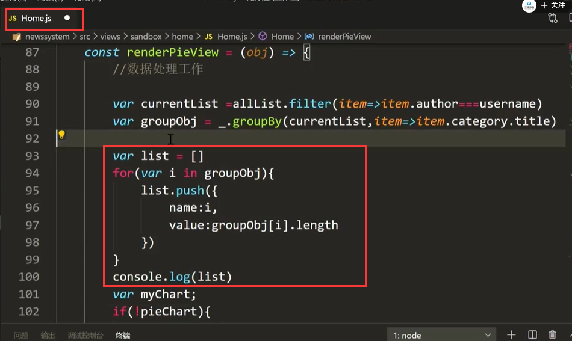

 

然后查看页面效果：

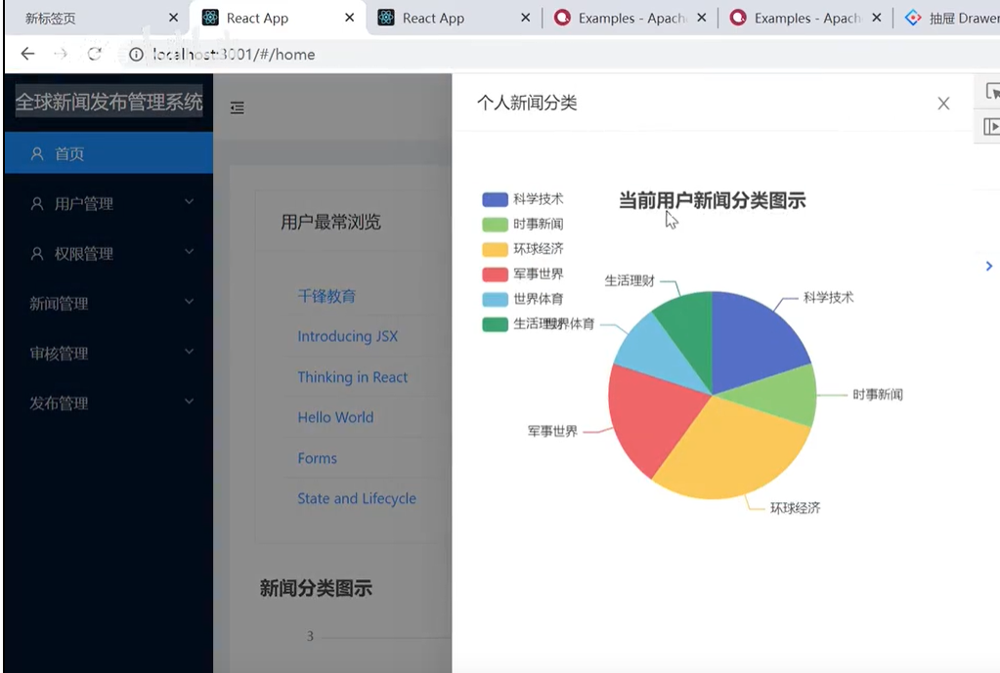

