# 15.游客系统-首页

​	我们需要的数据是--全部发布的数据

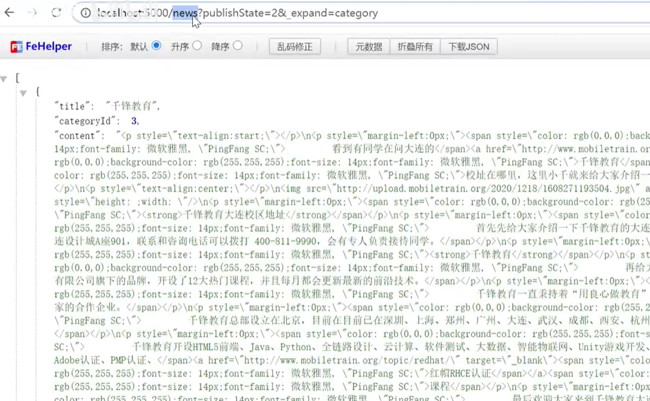

然后是页面的布局

​	需要pageHeader组件

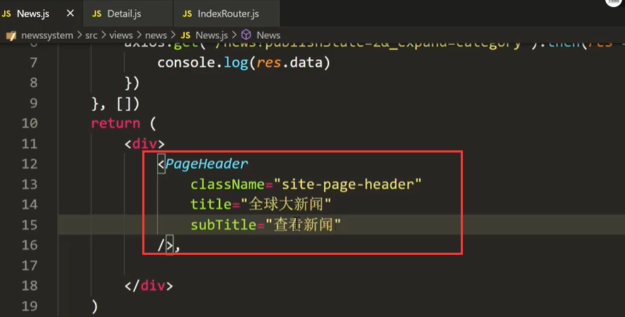

然后使用card组件

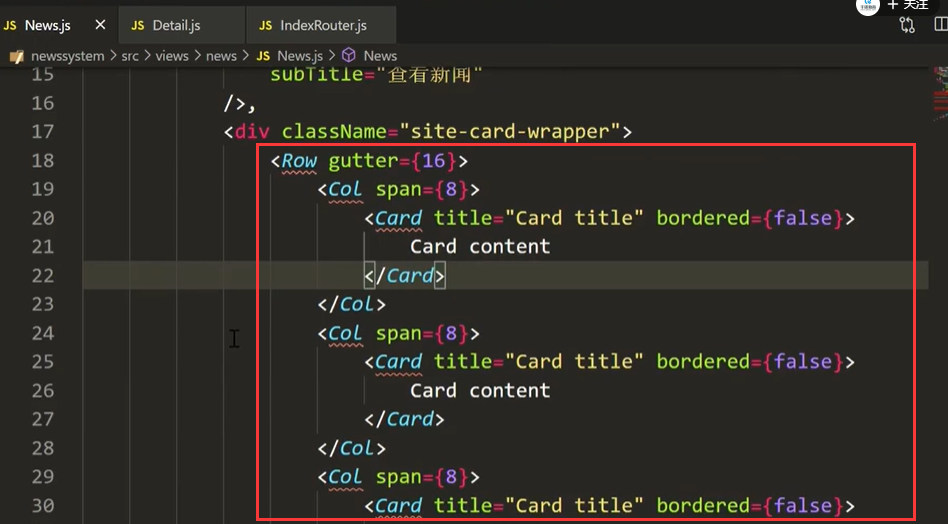

在card组件中使用列表组件

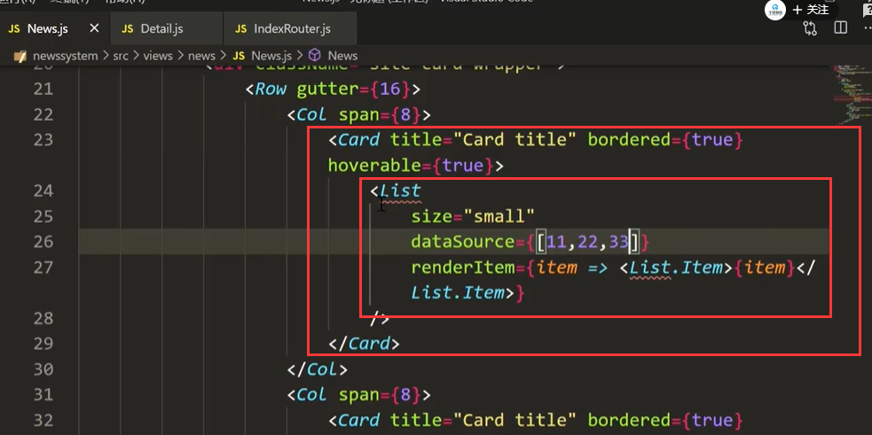

如果列表的数据太多--就会导致列表顶到下面的高度越高--所以我们需要使用一下分页的功能

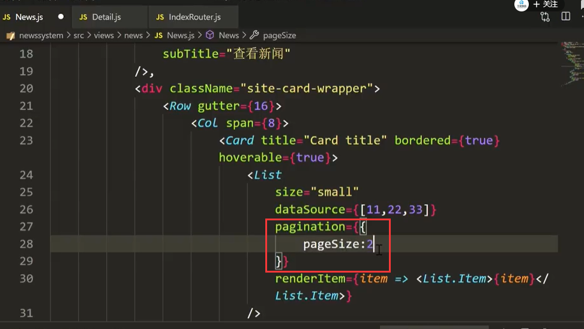

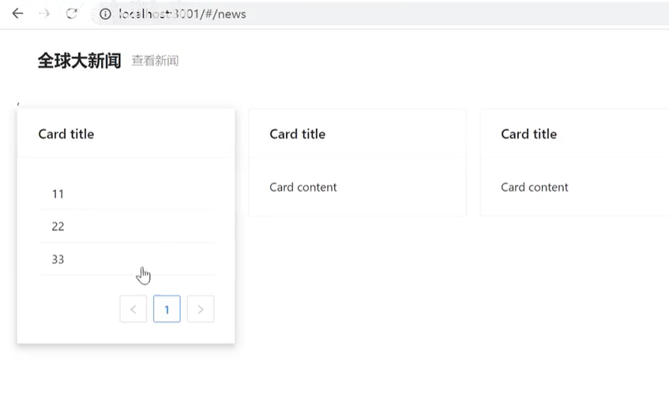

### 2、数据的处理

​		我们将获取回来全部的发布数据进行分组---然后再进行，对象转数组，变成一个二维数组了

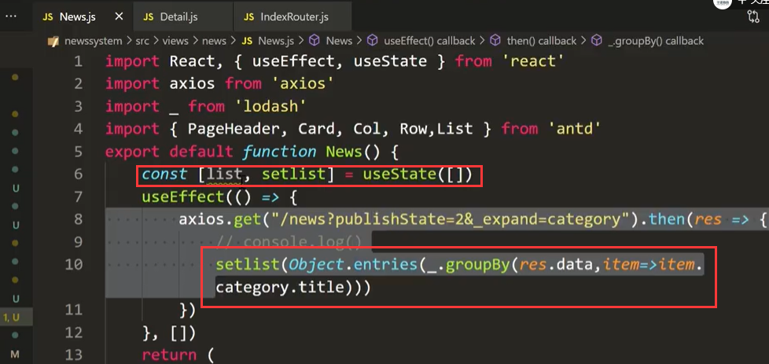

list遍历循环创建card

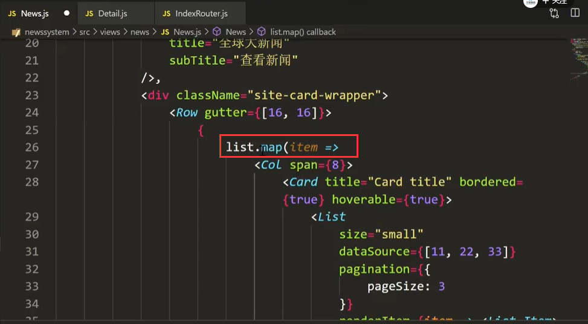

设置内容

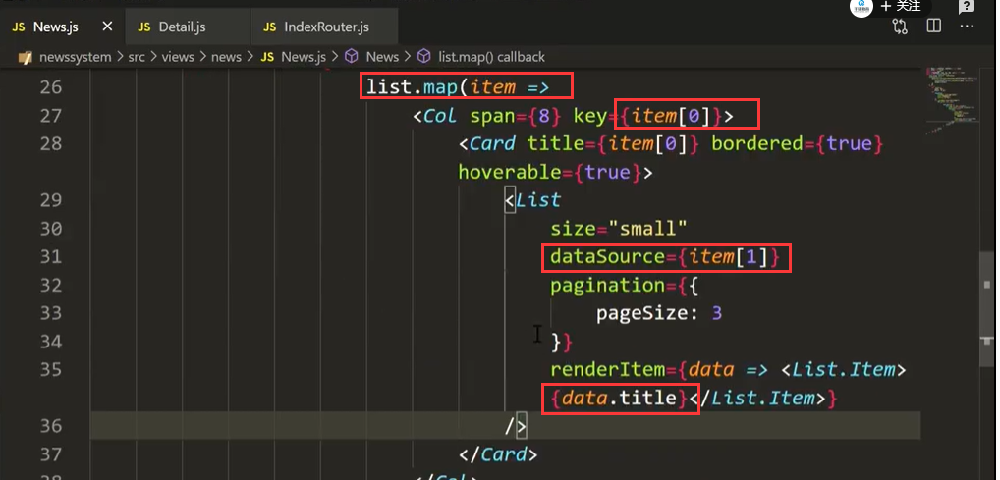

查看页面效果：

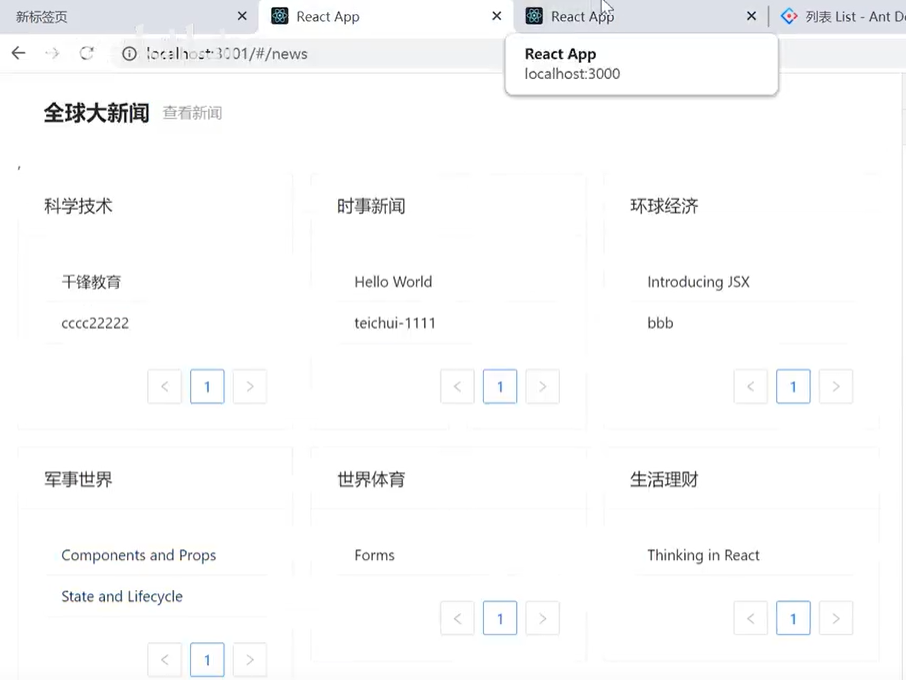

添加连接--进行页面的跳转

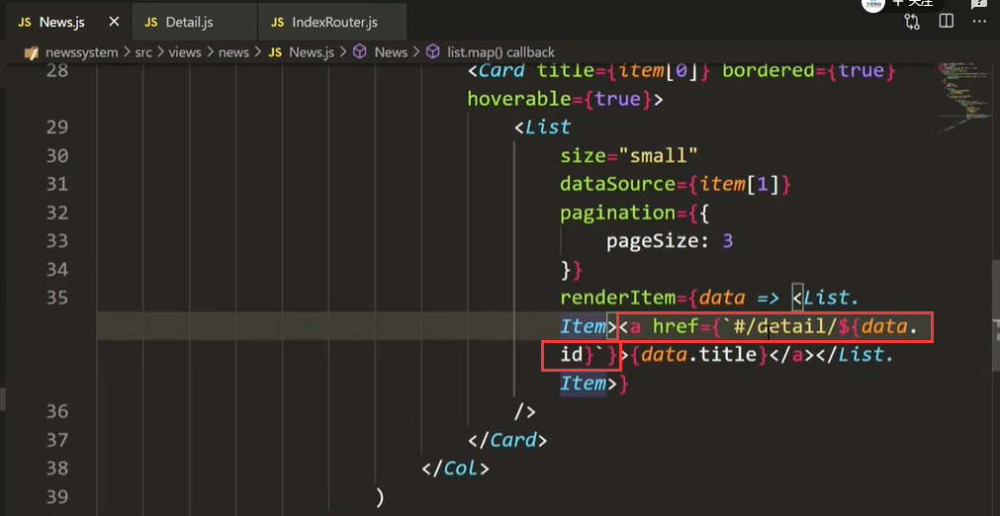

访客的首页就到此完活了

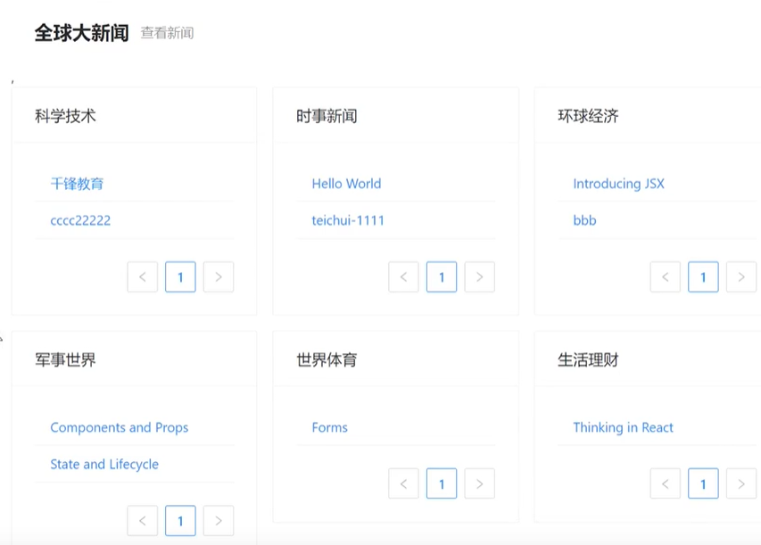

