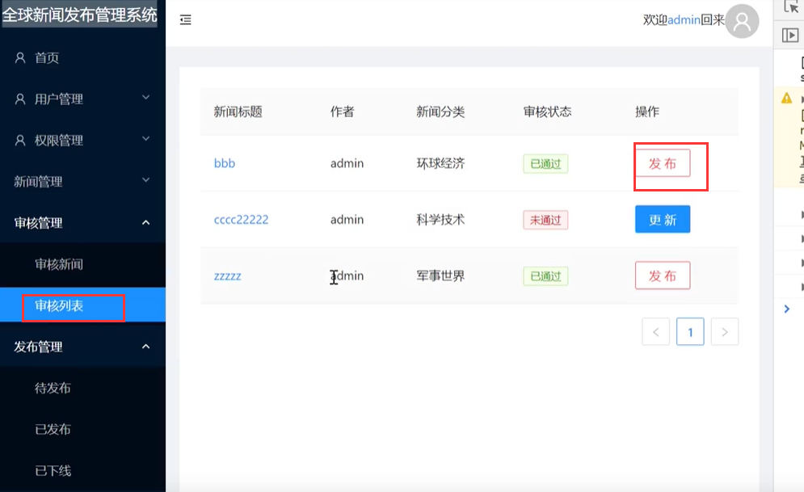
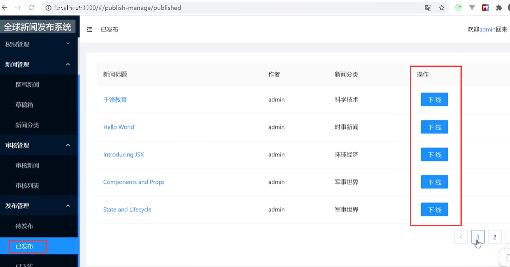
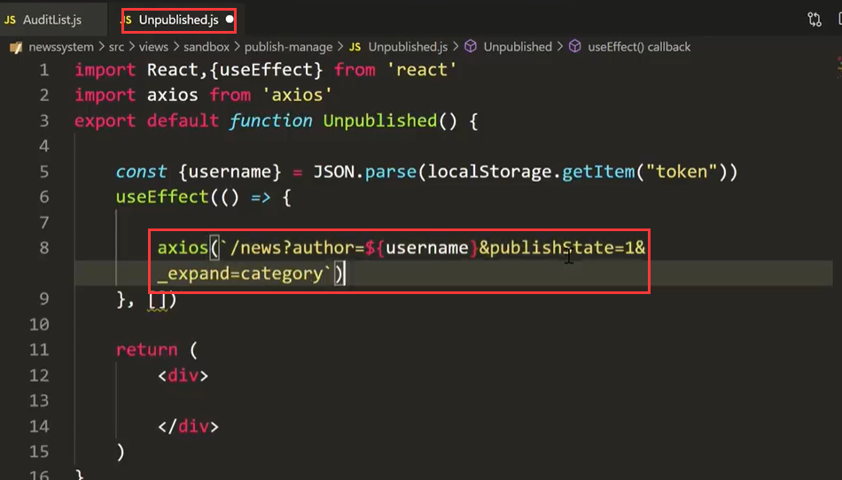
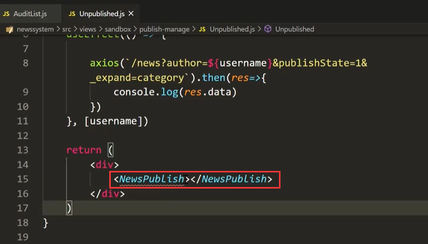
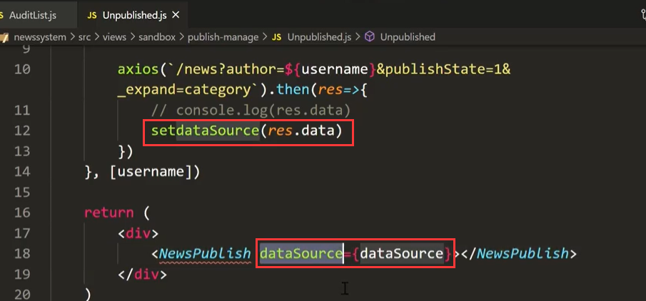
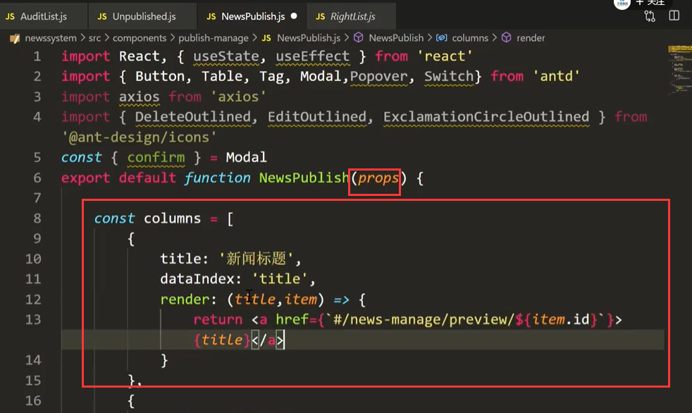
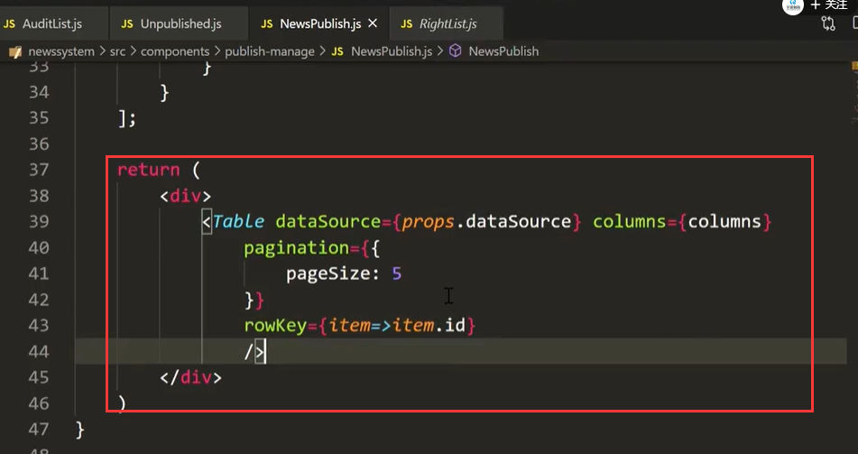
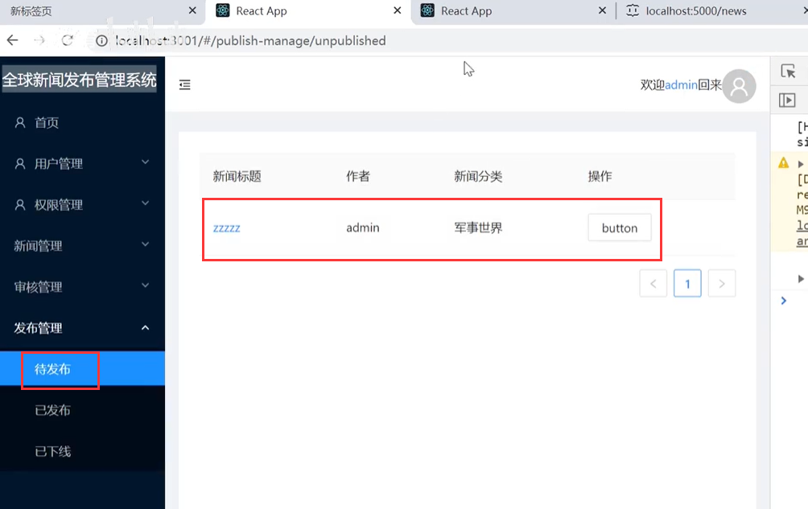

# 2.发布管理-组件封装

#### 1、基本功能介绍

​		之前在我们的审核列表中，如果是已经审核通过的 我们修改状态然后设置成待发布的状态

已经通过的都会显示在待发布的列表中

在我们点击发布后--就会跳转到发布管理中的--已发布 

点击发布后的--在已发布中就可以查询的到了，先看一下实现后的效果

其实待发布和 已发布 ，已下线 这三个功能的基本布局结构都是一样的

​	待发布是 publish =1 已发布是publish = 2 已下线是publish = 3

我们可以把这三个组件--共同调用一个组件来实现就可以了

#### 2、组件封装

​		创建Unpublished组件

​		请求获取--作者是当前用户的，并且publishState是1的--查询出的是待发布的数据

我们每次使用一个Table组件--写的比较麻烦，但是如果我们自己封装一个自己的组件，然后将我们的数据放入然后再渲染设置Table组件

然后将获取到的dataSource设置值，然后传入到我们封装的组件中

​		这个属性是我们自定义的

然后我们创建子组件--并且让 props给子组件传入数据

​	设置Table列

​	

​	并且设置table组件内容

 

我们运行查看一下效果：

