# 3.发布管理-自定义hooks

​		因为我们的发布管理的内容的 待发布 已发布 已下线 这三个页面基本结构差不多

这样我们就可以考虑使用hooks了，把他们的核心逻辑抽出来，放入自定义hooks中--这样我们就可以更快的把这几个页面给划分出来

我们来创建一个usePublish这么个hooks---注意这个不是个组件

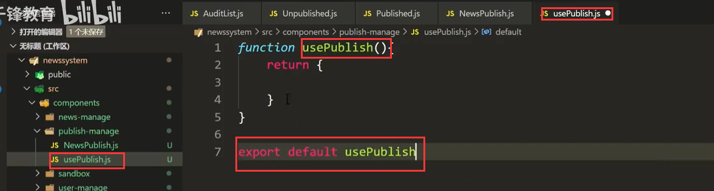

我们把一样的类似代码捡走，放入到我们的自定义hooks中 usePublish

​		然后我们把dataSource给return

​		这样我们的hooks基本就差不多了

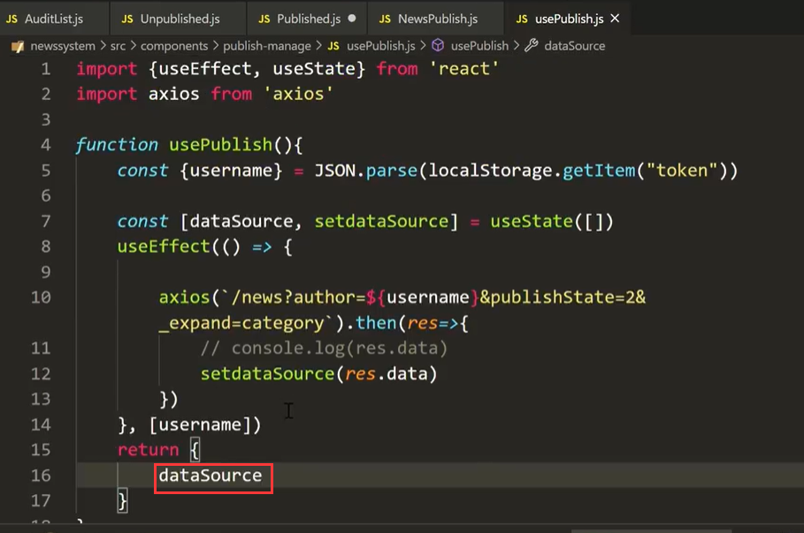

我们原来的内容只需要将 dataSource 需要的数据结构出来就ok了

​		这样不就非常的简洁了代码

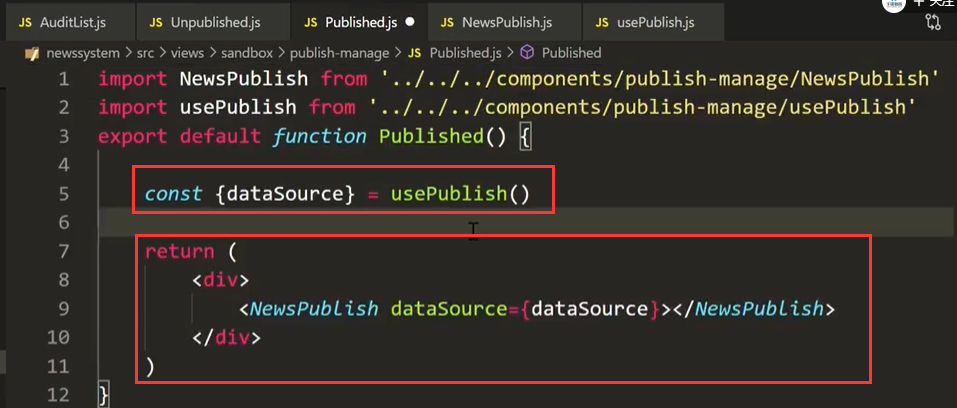

各个请求的数据不一致需要传入的状态不同--我们就设置--传入一个参数

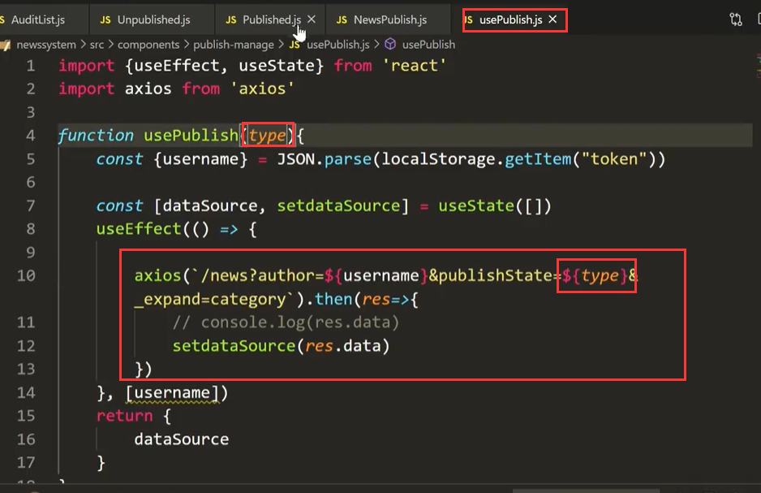

我们给他传入 2---》表示已发布的状态

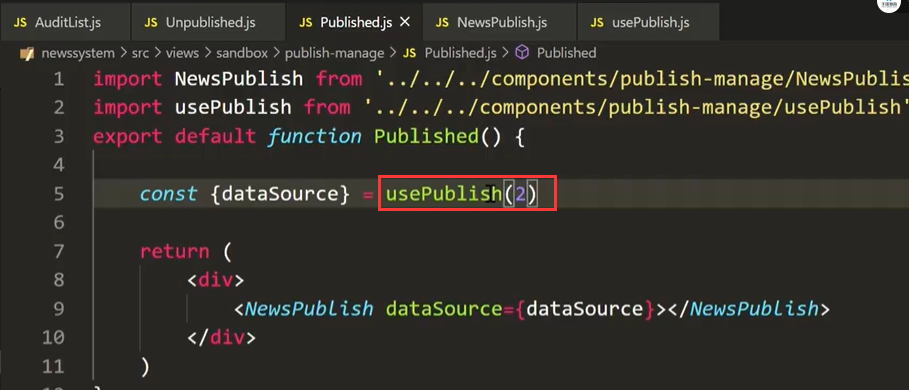

那么同理--我们也修改一下unpublish 待发布的组件--传入1状态

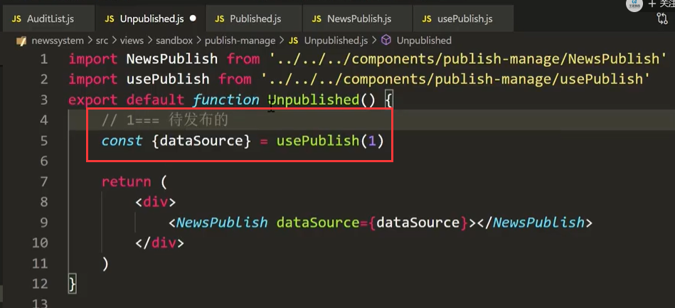

已线下的也一样

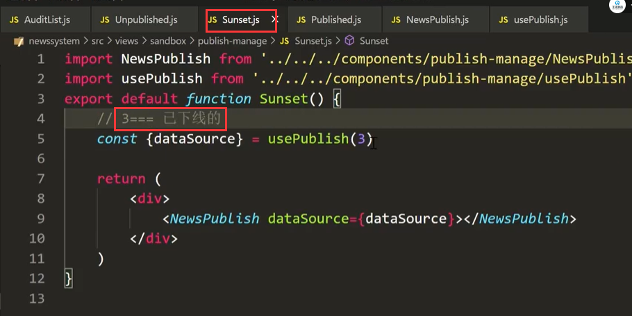

页面效果：没有问题

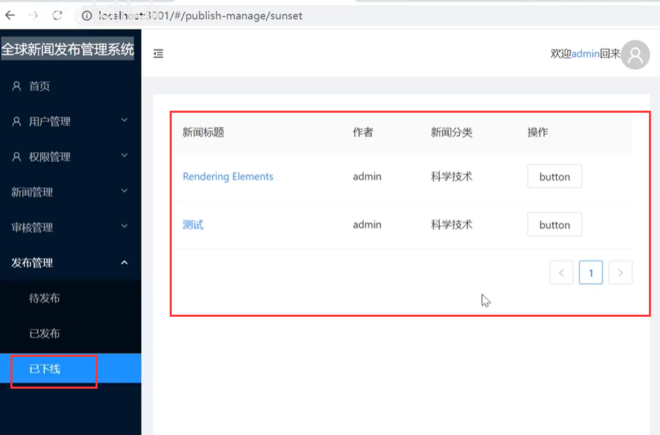

#### 还有个问题就是右侧的操作--是有区别的

- 待发布的---可以发布操作
- 已发布的可以下线操作
- 已下线的可以删除操作--或者是恢复上线

现在我们使用的是同一个组件--那么我们如何来自定义操作按钮呢

​	在父组件中给子组件传入 告诉子组件要显示什么

​	比如传入button

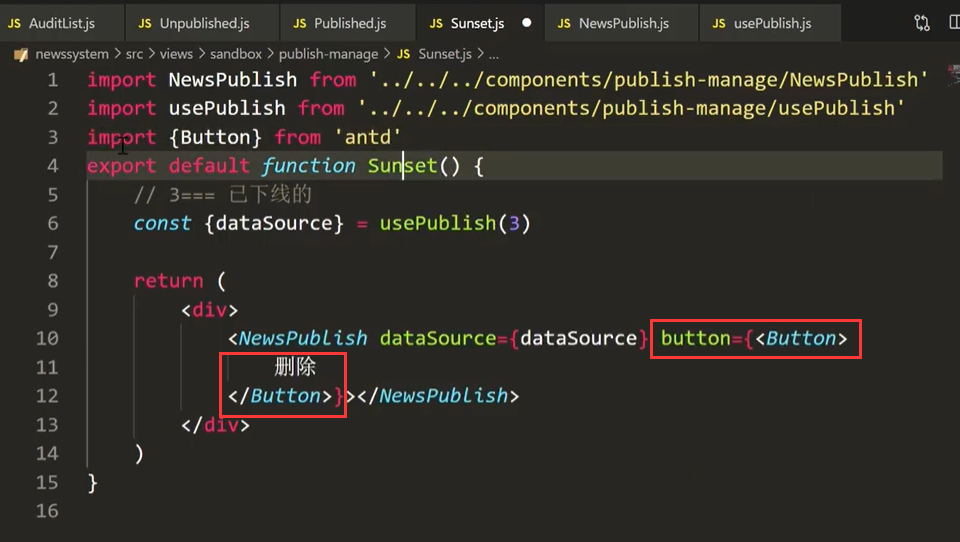

比如在待发布页面--传入要发布按钮

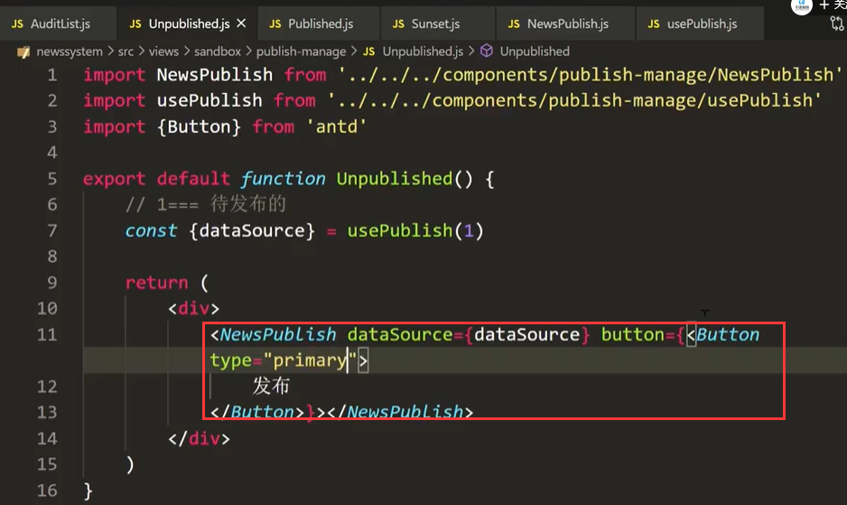

在子组件中，Table的列设置为从组件传入获取的按钮

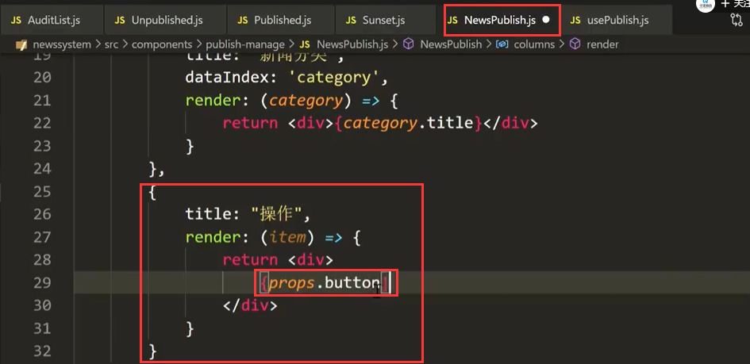

查看效果:  没有问题

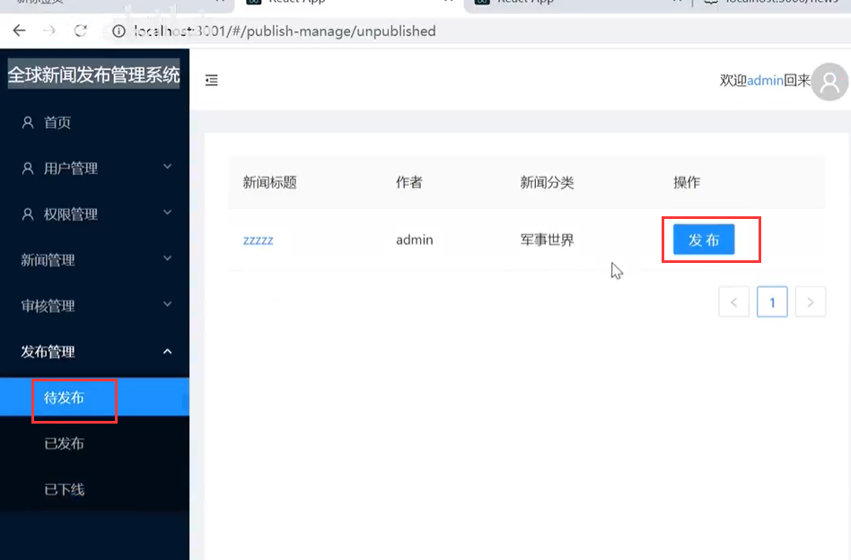

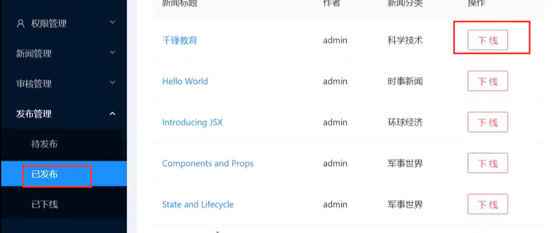

#### 点击按钮的时候如何操作

​	我们还是把他放在hooks中，先定义三个方法

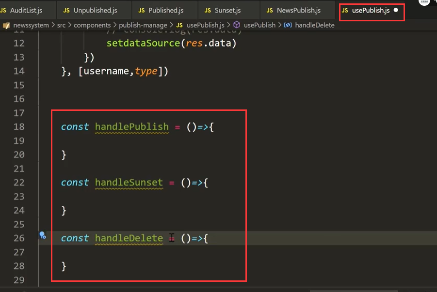

并且要把这三个方法导出

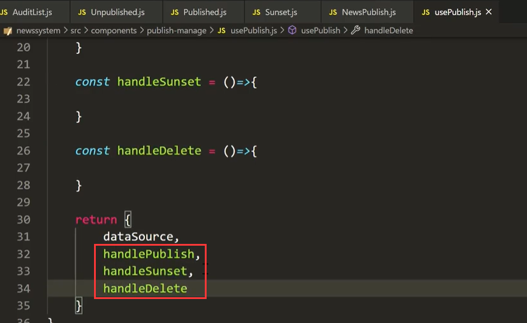

​	然后我们在组件中结构出来-使用的时候调用就可以了

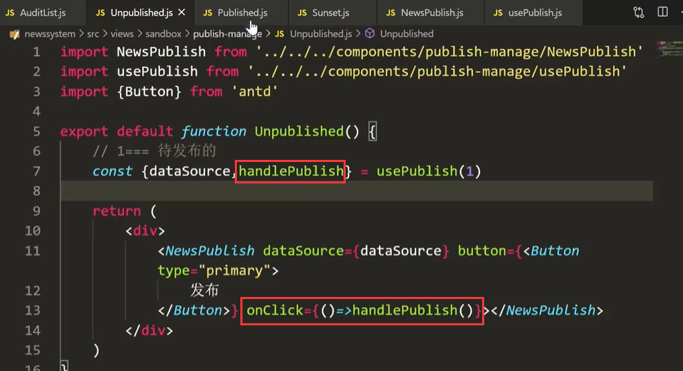

​	那么我点击按钮的时候，点击的是那条呢？我如何能将点击的这个按钮对象传给父组件这个按钮中呢

​	

​	我们使用函数式写法--将id获取过来，将来在处理事件的时候使用这个id，回调的id

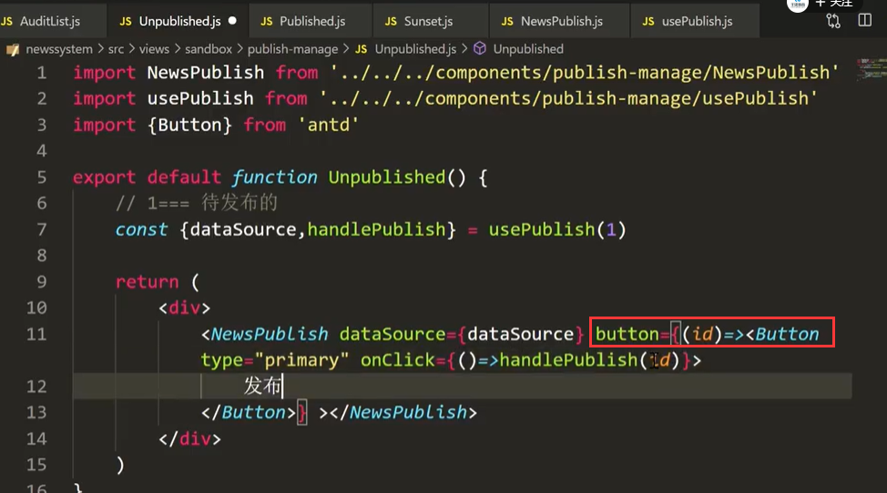

然后在 子组件中回调传回id

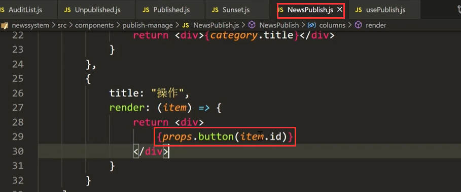

然后我们在hooks中看能不能获取到id的值--如果可以获取到，那我们执行对应的流程就可以了

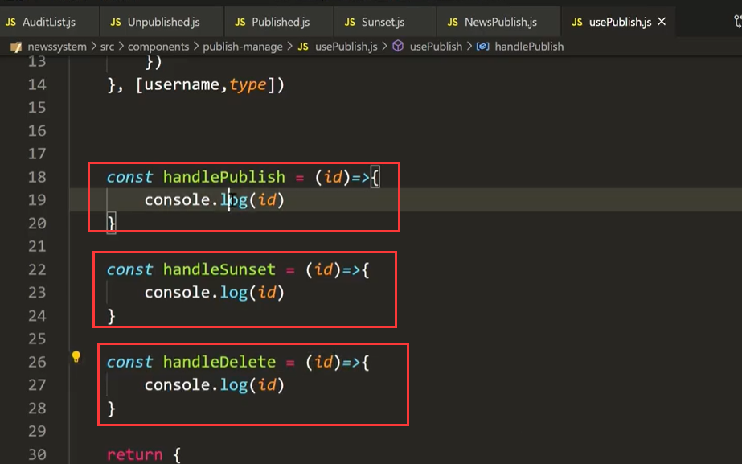

可以获取到对应的id

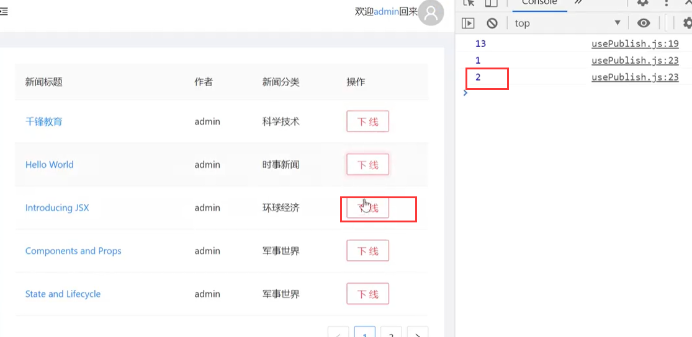

https://www.bilibili.com/video/BV13v411H74b?p=53&spm_id_from=pageDriver

