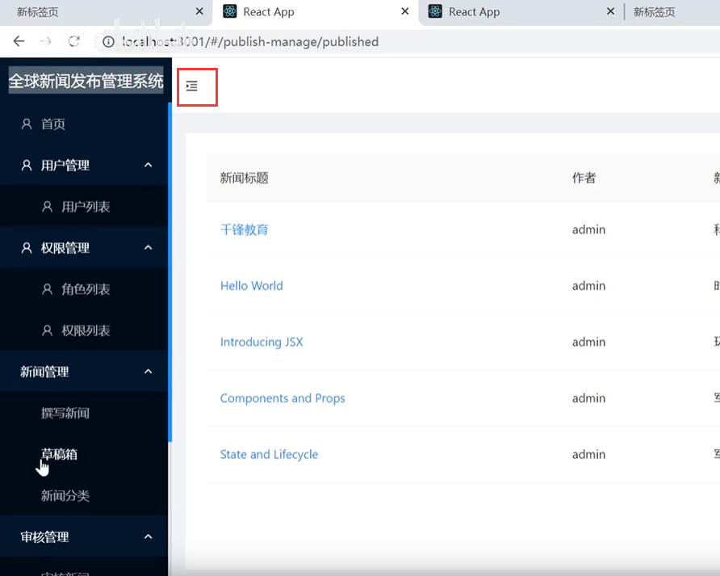
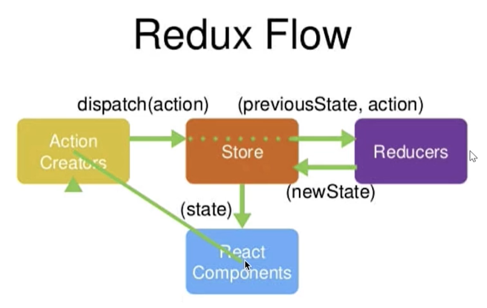
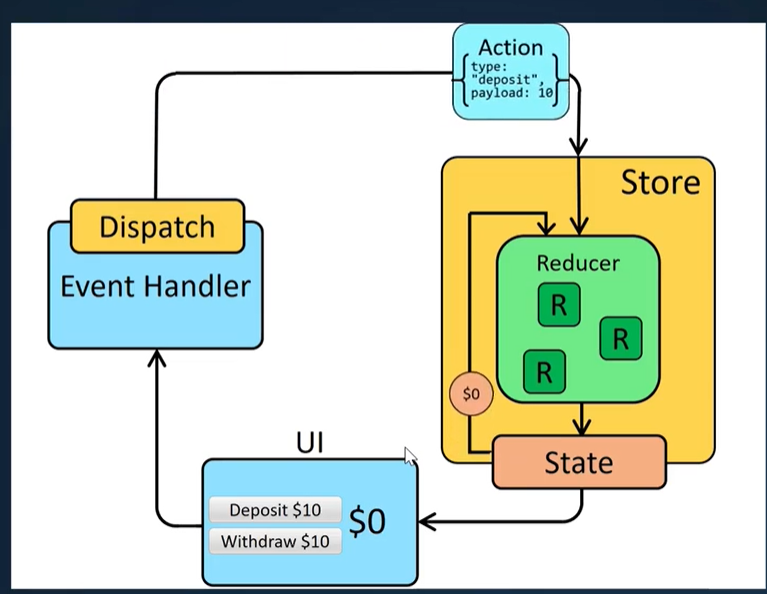
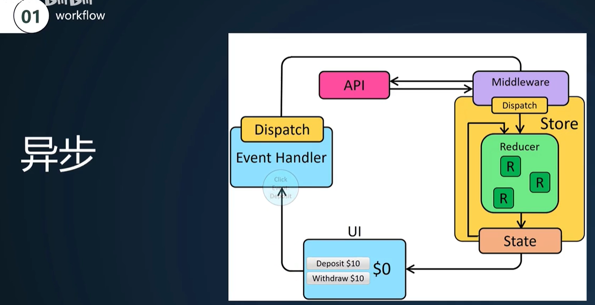
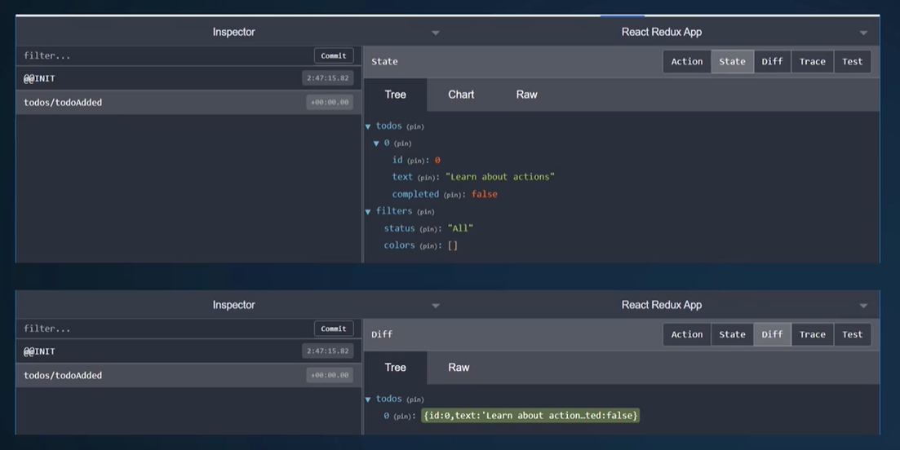

# 5.状态管理-redux基础

​	目前有个问题---就是我们在点击折叠侧边栏的时候是无效的

​		因为他们俩个组件隔的是比较远的，而且也不是亲父子组件关系--这样的话俩个组件的通信就比较麻烦了

而我们在组件通信的时候，并且是非父子组件通信的时候，如果我们多处需要通信且状态的共享，我们就会使用到Redux

Redux的工作流 --我们需要明白他的工作流，我们的这些数据在通信的时候就很方便了

​	**我们要保证我们的数据的点完之后--是从dispatch action 到---》Store 因为store是处理不了的就要交给---》Reducers他只有一个原则 纯函数设计 接收一个老状态action，然后深复制后返回一个新状态newState（并没有对老状态产生影响）---》返回到Store这个时候Store就会通过曾经订阅的方法去通知 订阅的方法 ---》Action 组件你应该更新了，这个时候组件就会在回调中得到我们的更新------这就是redux的工作流**

这个图的意思是--UI触发事件进入 Handler--然后产生Action----Store ---设置state--》到UI

异步的更新流程比同步的多了 中间件的一层：

Redux：其实是和React是不相干的，他可以在vue中使用，也可以在angular中使用也可以在React中使用

​				他的原理--是基于一套订阅发布模式 + Redunce 纯函数的设计---去实现的

#### 2、使用Redux的三大原则

我们可以使用 dev tools 这个工具进行对redux调试

