# 6.状态管理-创建store


​	我们的目的--就是点击按钮控制侧边栏隐藏和显示

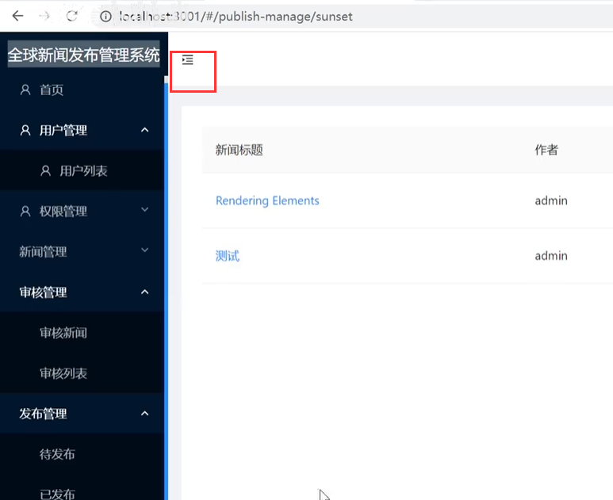


### 1、我们先下载一下redux

​		先把这俩个小模块安装上去

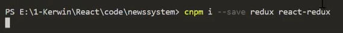


​	

安装好了之后--我们想一下使用redux思路：

```
	首先你得对你的组件进行一个包装，也就是他里面得有一个connect的函数，包装成高阶组件--》然后让你的父组件来负责帮你订阅和dispatch发送，然后对应的还得把你的store创建出来，而且还得把你的reduesce纯函数给构建起来---现在我们开始实现一下
```


### 2、使用redux


创建redux文件夹--新建store.js文件（这个文件将来放的就是store的创建）

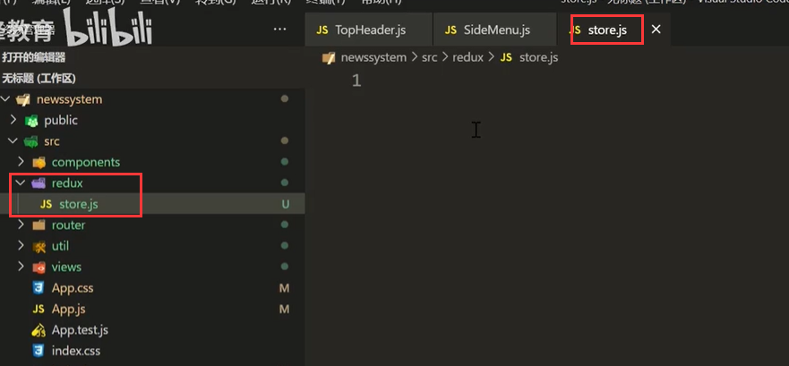


引入createStore来创建我们的store对象

​	创建的这个store需要接收一个reducer函数

​	最后导出store

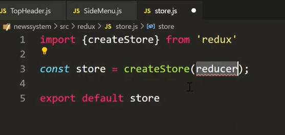


然后我们新建一个reducer文件夹--里面专门放reducer

​	先创建一个CollapsedReducer.js折叠的reducer-->其实他就是一个函数--要保证他是纯函数设计

​	还要接收一个prevState旧的状态---还会得到一个action

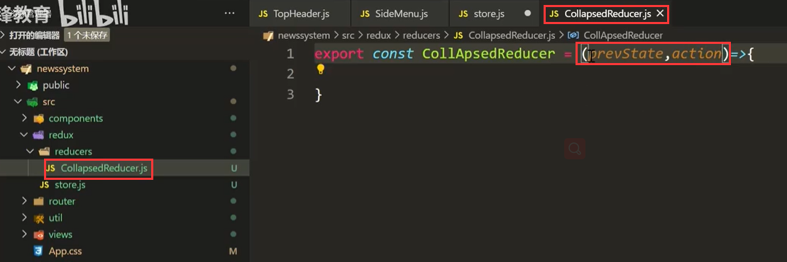


​	然后先return 一下，先保证结构是正确的

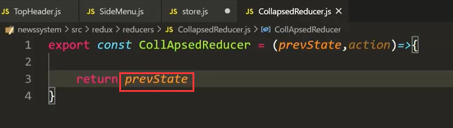


​	因为我们可能后续要给store传入很多reducer，但是默认是只能接收一个reducer，这样我们就可以使用combineReducer进行合并多个reducer

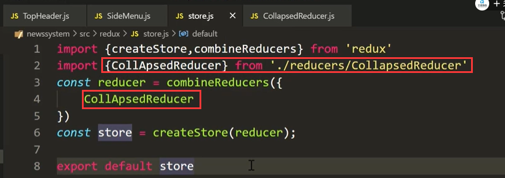


​	后续的思路--就是我们会有 store.dispatch() 到reducer 拿到旧值-处理-返回新值到store

​	还应该有订阅 store.subribe() ,在组件中之前订阅的回调函数就被触发了


那么如果我们自己去监听订阅和发布就属于手动操作--这个时候我们引入react-redux就不需要自己去订阅和发布了

​	我们可以让我们的父组件做发布和订阅的工作


​	使用Provider包装一下整个根组件

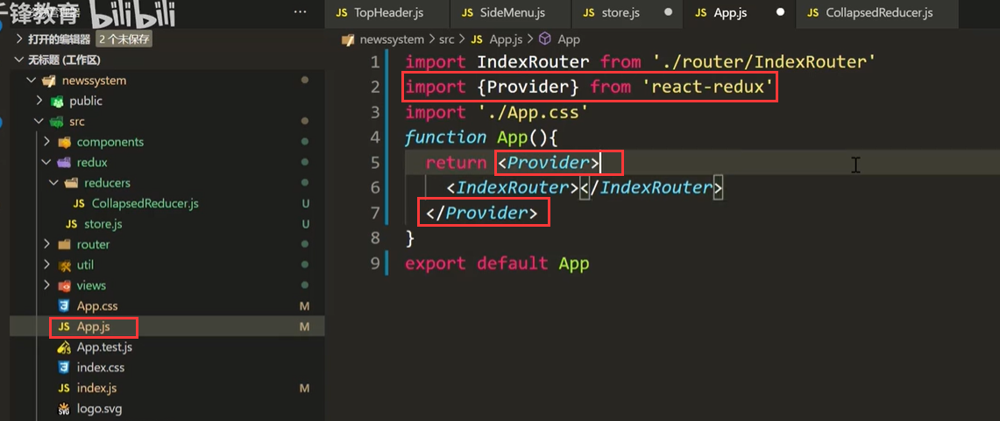


​	让他最开始就提供一个store对象--这样我们所有的组件就都可以获取到store了

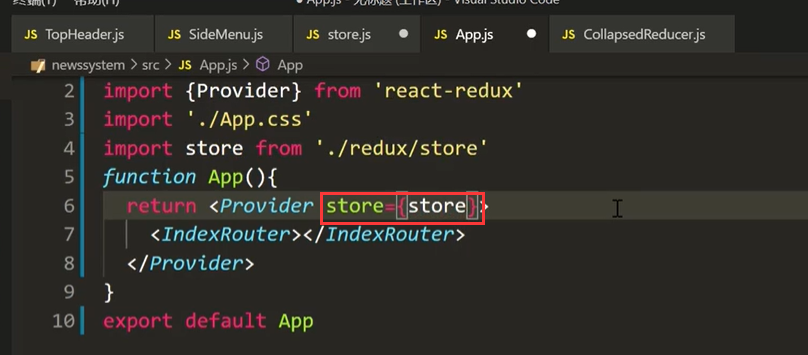


​	**那么谁需要这个store呢--我们的SideMenu和TopHeader他們俩都需要，因为他们需要共享一个数据**

​	**TopHeader是发布者---SideMenu是订阅者，因为隐藏的按钮事件触发是在TopHeader中**


​	

​	TopHeader中引入 react-redux的connect

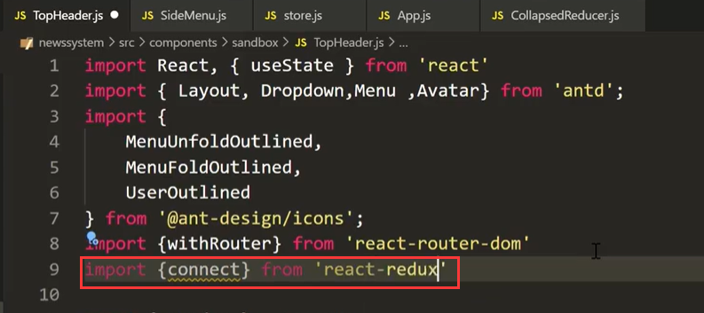


然后使用connect在导出的时候包裹整个组件，包裹的顺序个高阶组件的包裹不冲突

​	connect()(包裹的组件)

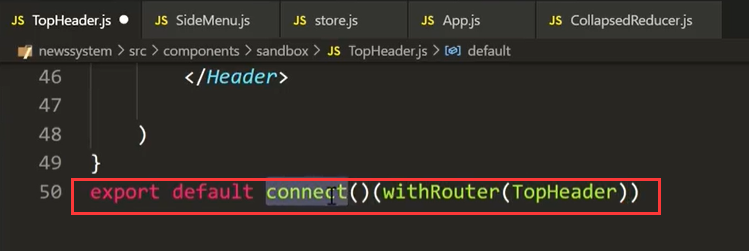


​		现在我们往TopHeader组件中放入一个对象 里面有个 a:1,他会帮助我们映射到props中

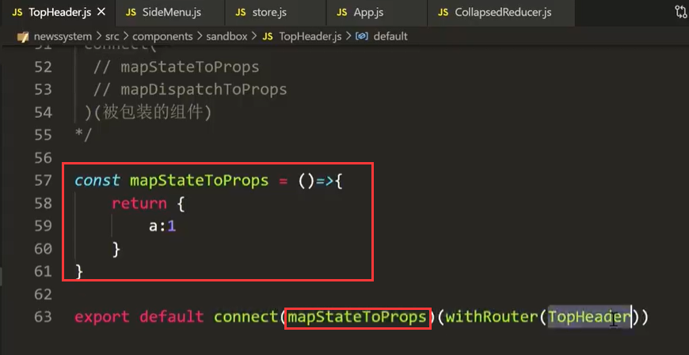


​	打印一下props，看看里面的内容是否存在

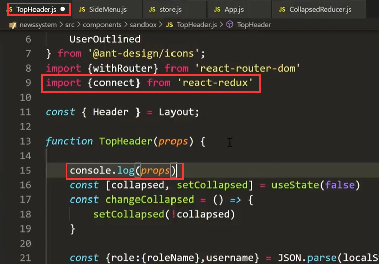


​	页面打开有报错--原因是我们之前的CollapsedReducer.js没有初始化值

​	设置一下初始化的值--旧值

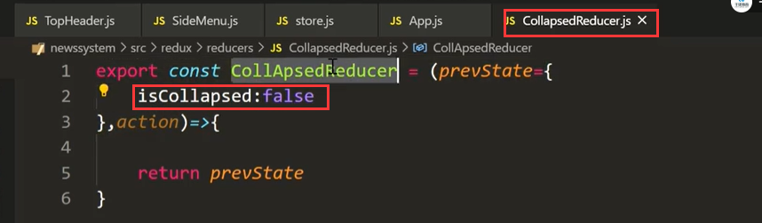


​	我们可以看到是可以在props中获取到这个connect传入的对象的内容的

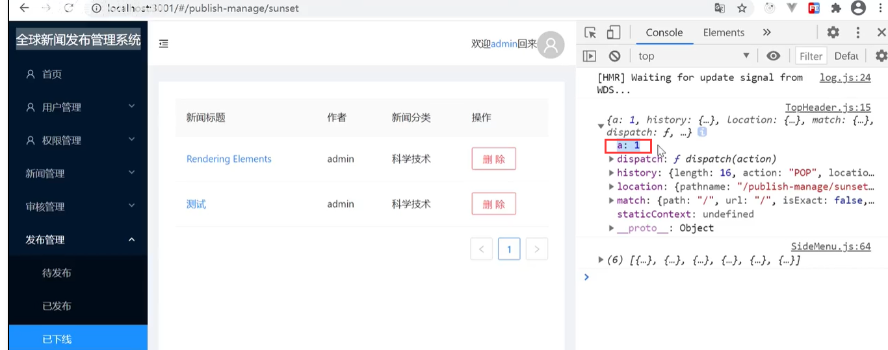


​		结构出state的内容，我们需要的就是 CollapseReducer 下的isCollapsde属性的值

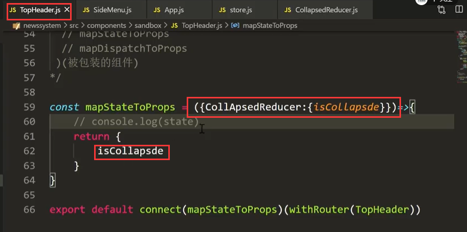


​	在TopHeader在父组件中传过来的值

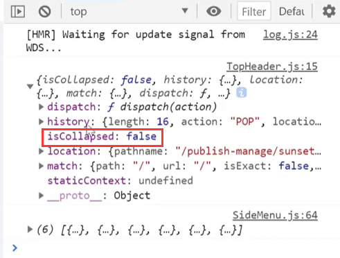


​	有了这个功能---那么我们做展开和折叠的功能就简单多了


