# 7.状态管理-折叠菜单栏

​		之前我们能够把我们state中的状态，映射成我们的属性传给 我们的TopHeader组件了

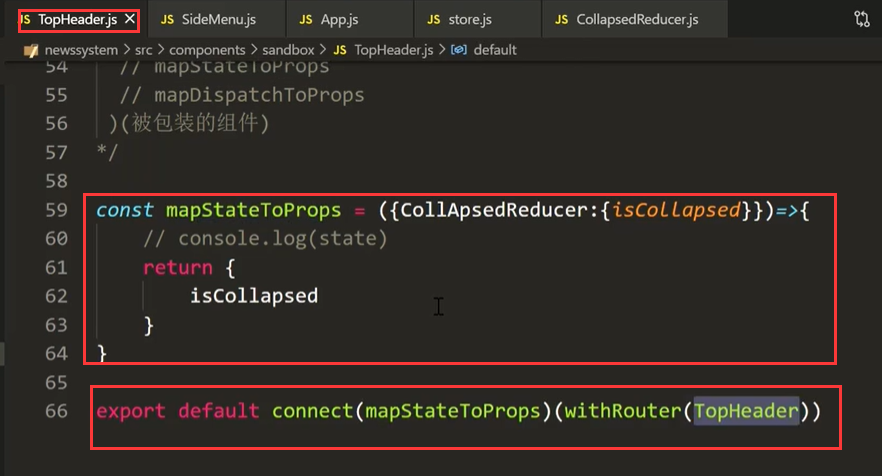

​	疑问：我们给TopHeader组件传状态干嘛？我们不是要给SideMenu传状态嘛

​				我们正好使用这个状态来设置一下TopHeader的小图标显示

​		使用共享的侧边栏状态

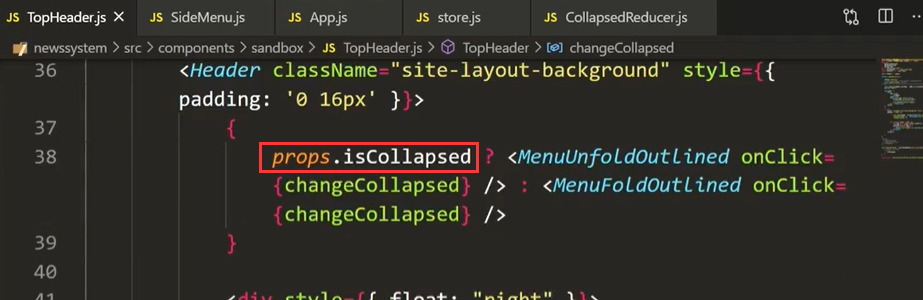

​	那么现在这个图标的显示都是显示一个图标--我们需要在点击图标的时候给他一个取反的值，同样这个值改完之后也可以去控制侧边栏的显示与隐藏

​	正常的情况是我们在事件处理changeCollapsed中设置state的值，因为我们现在使用的是共享store数据

​	所以我们使用dispatch的方式来修改这个值--我们就使用connect给我们提供的mapdisPatchToProps这个函数更方便一些

​	

​	使用mapdisPatchToProps 可以帮助我们将action传入

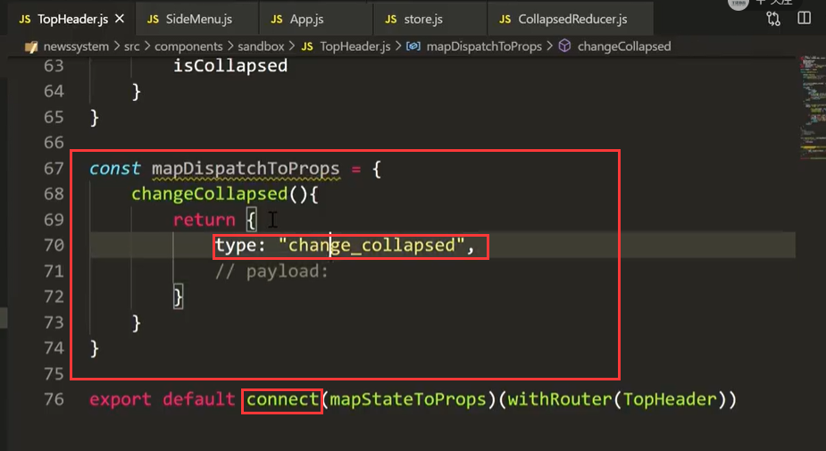

​	我们在触犯按钮的事件函数中-打印一下props看一下

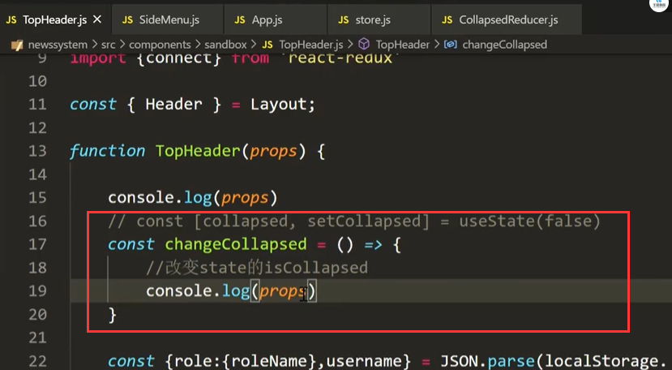

​	点击按钮：  我们除了可以获取到属性值，还获取到一个函数changeCollapsed

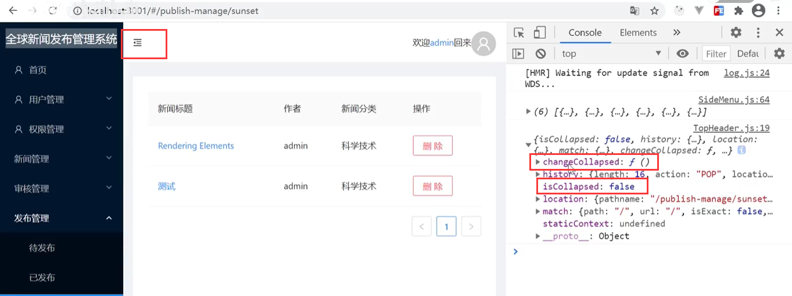

然后让父组件来指向dispatch 

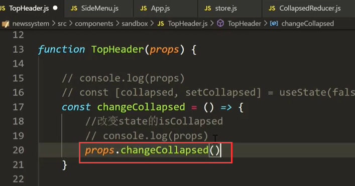

​	然后到store中---而store是交给reducer来处理了

​		他会遍历所有的reducer只有匹配的reducer才会去处理

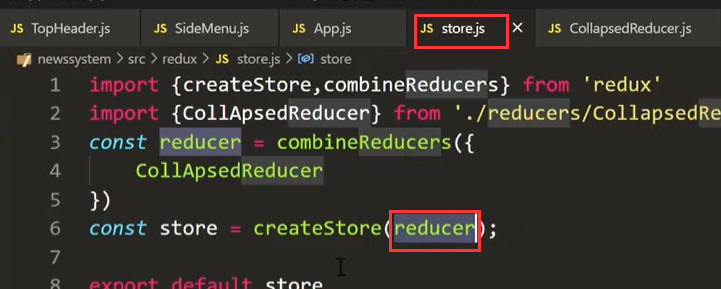

我们打印一下action看看是否能过来

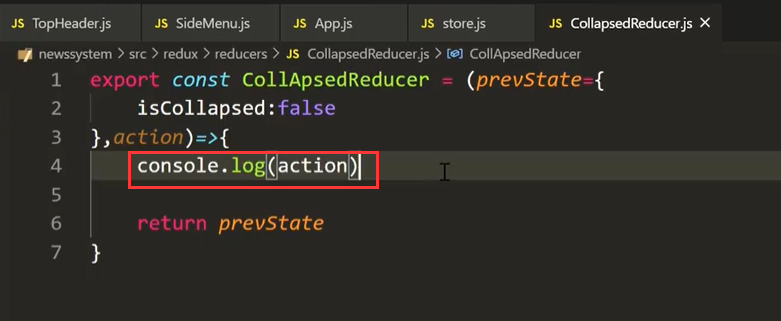

​	没有问题可以获取的到

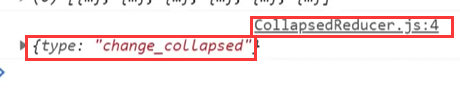

​	进入到这个reducer就不要走了，他是专门处理你这个请求的

​	

​	我们先从action中结构出type属性--然后根据type的action进行分支匹配处理

​	处理前还需要对之前的状态深复制一下

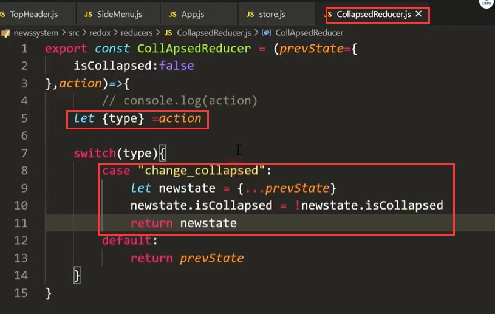

​	这样就ok了，在Reducer值发生了改变会由connect自动检测到

​	目前这个小图标-点击显示取反正常使用了

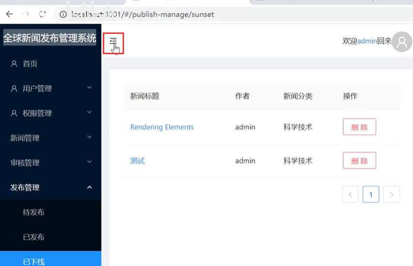

### 2、处理SideMenu组件

​			TopHeader组件实现完成了，那么同理操作SideMenu组件也就好处理了

​	首先--使用connect包装组件

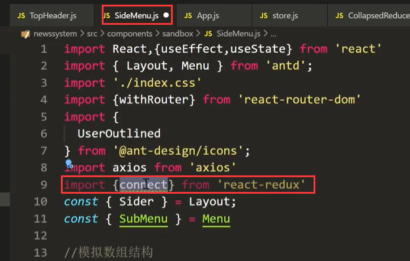

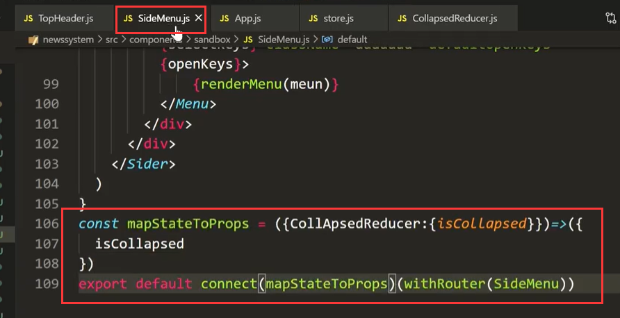

​	然后我们也可以从props中获取到值了--将侧边栏折叠属性值设置为从redux获取回来的数据

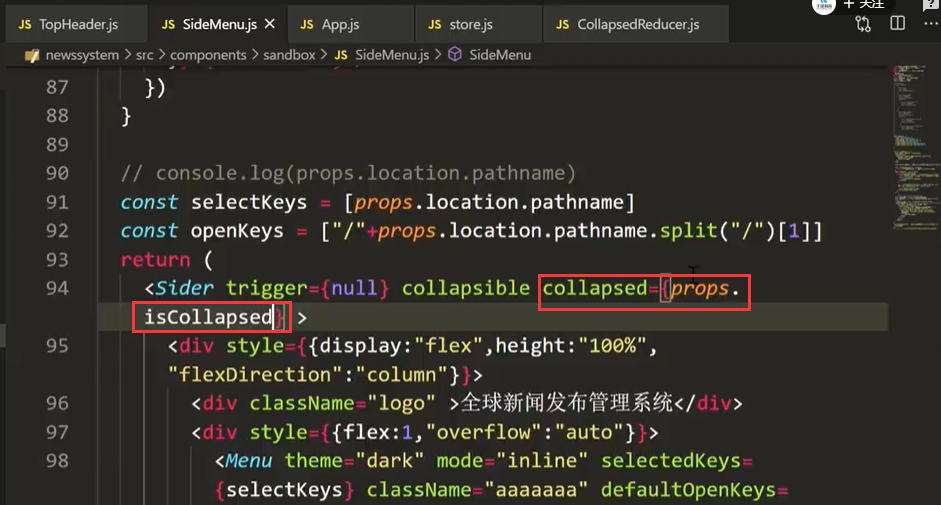

没问题--折叠好使的---我们实现了组件之间的数据共享

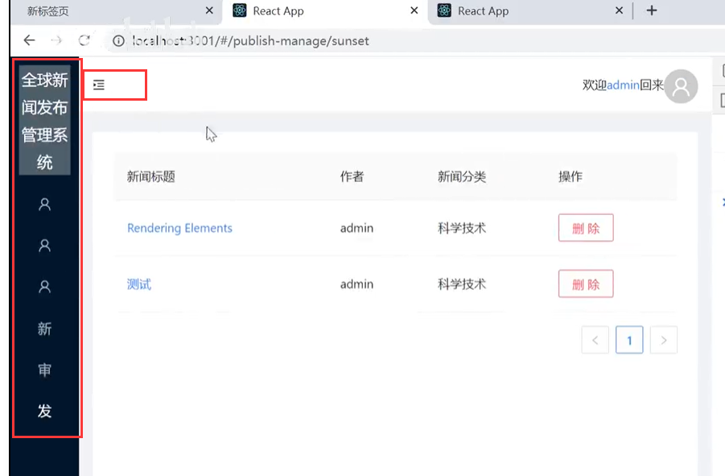

https://www.bilibili.com/video/BV13v411H74b?p=57&spm_id_from=pageDriver

