# 8.状态管理-loading加载

​		我们给用户体验加深一下，在用户异步加载数据的时候，出现一个loading框

​		

​		思路是在我们的组件外面--包一个loading框的组件，请求开始我们使用loading框，请求结束关闭loading框，那么我怎么知道什么时候请求结束，什么时候请求开始呢（使用axios的过滤功能）。

​	到ui组件库中查看一下--找到加载中

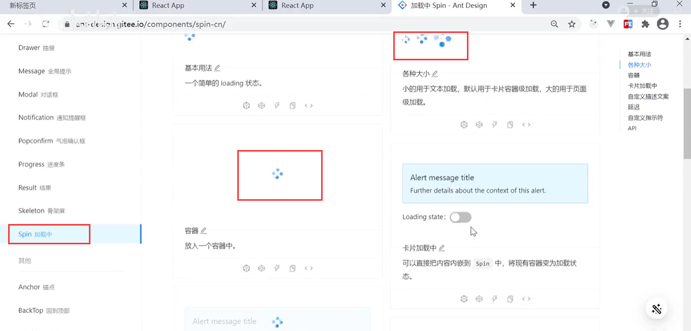

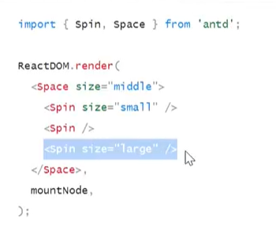

​	我们将<spin》组件包裹到NewSRouter上，因为每次切换页面都是由他在控制

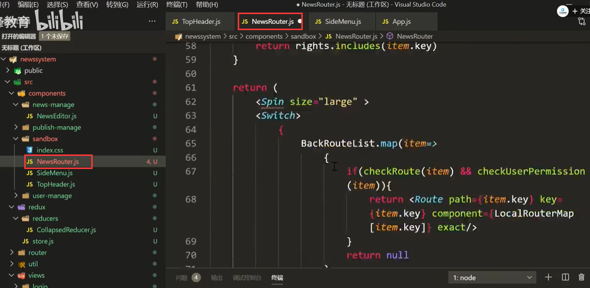

页面查看效果：

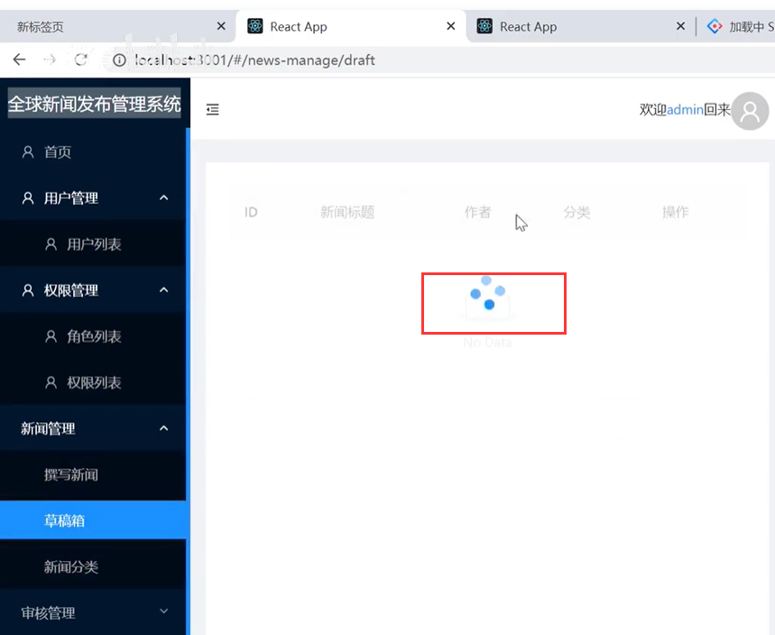

咱们不能让他一直显示的---应该是数据请求之前显示，数据请求之后消失

我们使用--redux来对状态--请求前和请求后进行对状态的控制

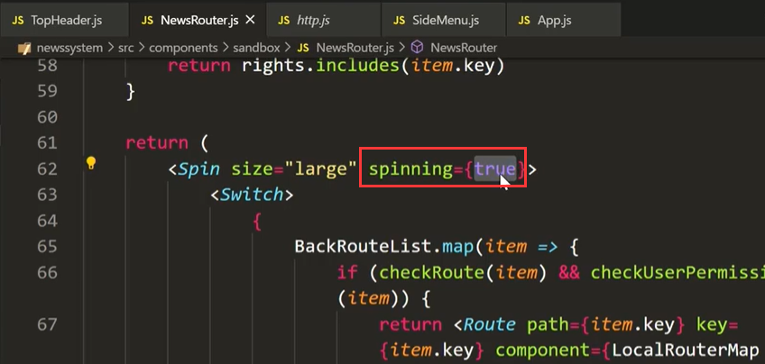

### 2、我们在axios中加入拦截器

​	主要就是以下这些代码：

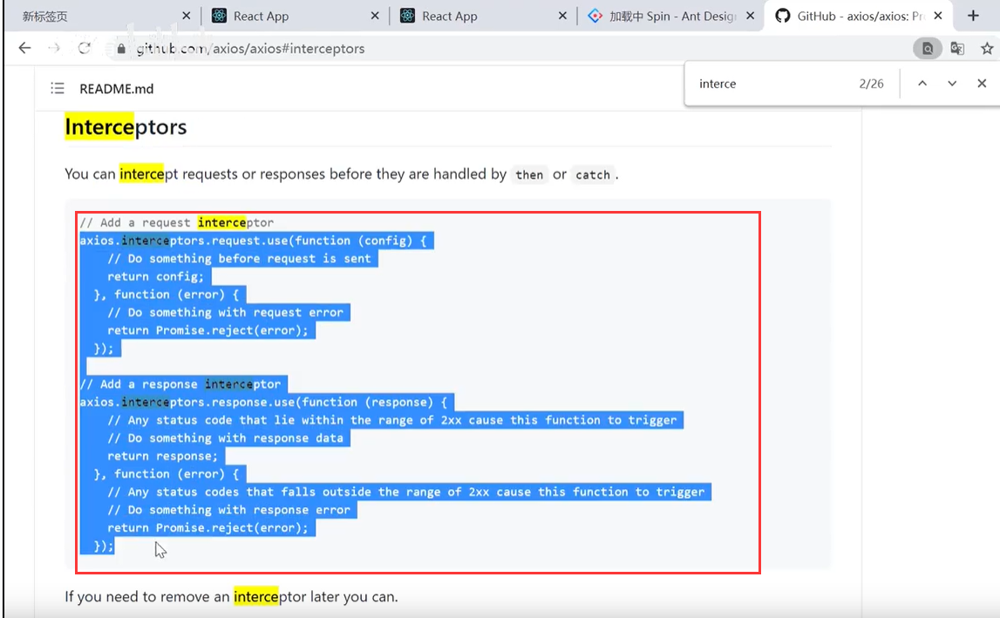

​	

​	在请求之前进行的拦截

​	11行就是你需要的请求前加的属性

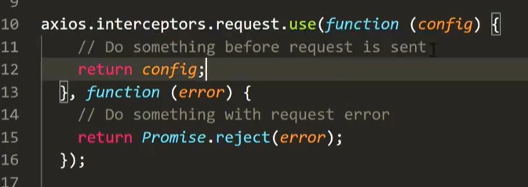

我们在响应请求的时候隐藏loading

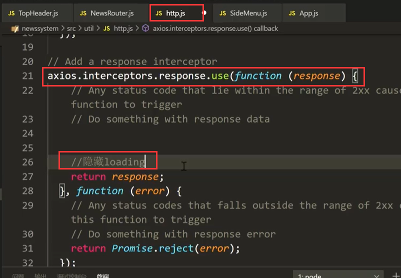

### 3、将loading状态交给redux管理

​	创建loadingReducer

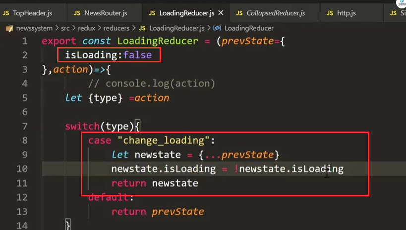

store中引入loadingReducer

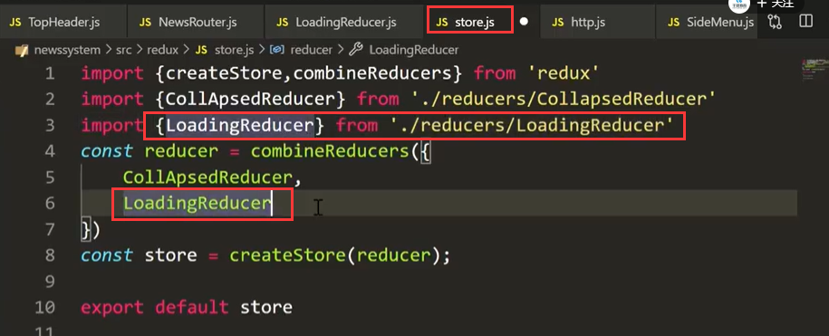

在NewsRouter中使用connect包裹组件并传入状态

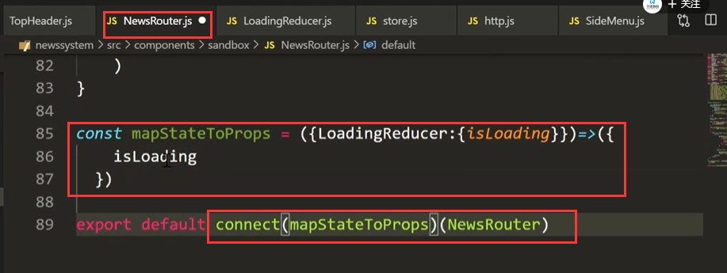

状态值的使用--用redux管理的值

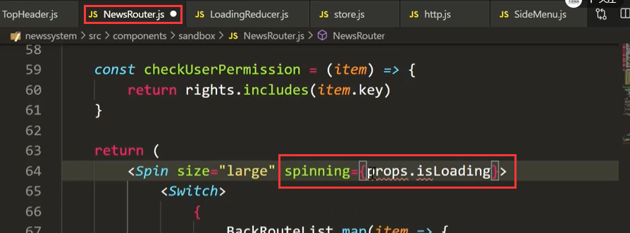

### 4、修改状态的值

​	请求前：

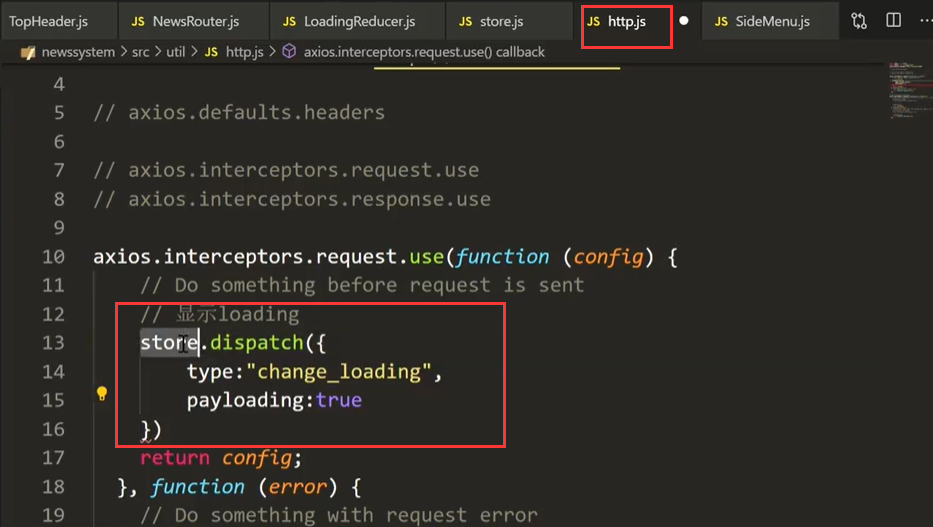

请求后：

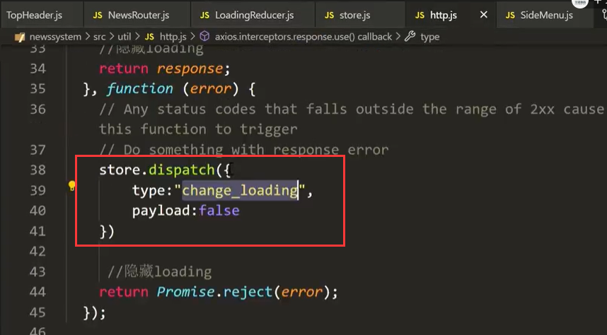

reducer赋值状态的值

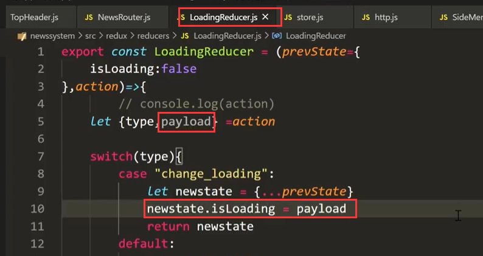

我们将网速调的慢一些---然后再测试效果

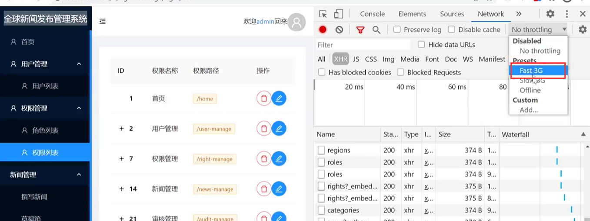

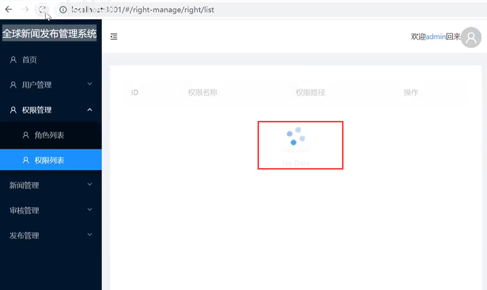

